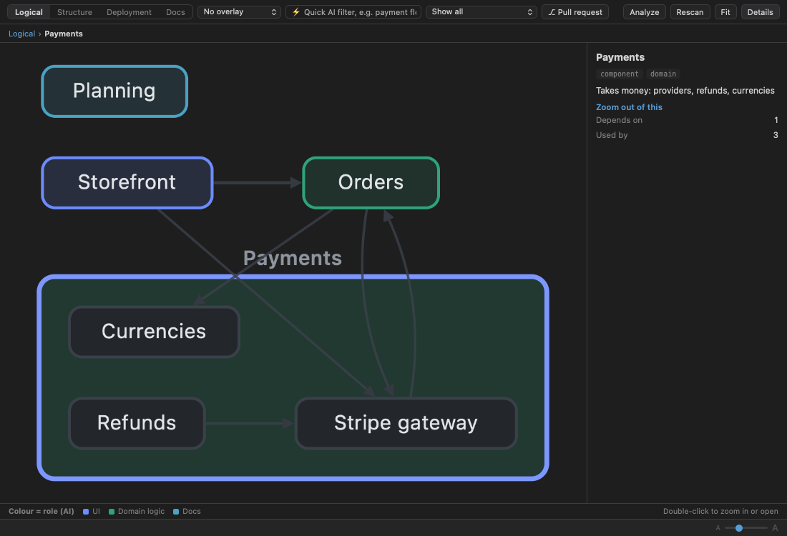
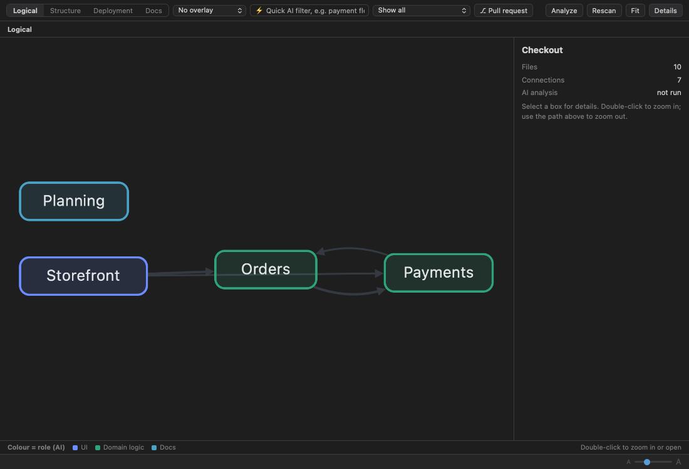
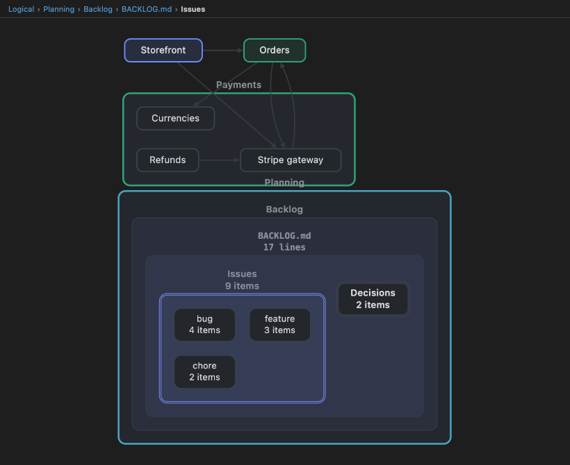

<div align="center">

# MarkView

### See how any project fits together, then work through it with AI.

A native macOS workspace for code and documentation. MarkView turns a folder into a
navigable **X-Ray** of subsystems, components, files and the things inside them. Next to
it you get a markdown editor, viewers for code, data and images, and embedded
**Claude Code / Codex terminals** that work on the project with you.

[](https://github.com/t-boris/MarkView/releases)




</div>

---

## Why MarkView

- **Understand a codebase or a knowledge base in minutes.** The X-Ray groups files into
  subsystems and components based on how they are actually connected. It then keeps
  going inside each file, down to the individual issue, requirement or function.
- **Work with AI where you read.** Claude Code and Codex run in real terminals inside
  the app. One click sends a ready-made prompt, such as "Review PR", "Docs ↔ code" or
  "Find bugs".
- **One app for everything in the folder.** You get WYSIWYG markdown with Mermaid and
  math, a code viewer for 45 languages, viewers for JSON/YAML/XML, JSON Canvas and
  images, full-text search and Git.
- **Native, fast and local.** It is built with SwiftUI and AppKit. The index lives in
  your folder (`.dde/`), and AI runs through the CLI you already use, so the app needs
  no API key of its own.

---

## X-Ray: from system to single item

Press **⌘4**, or right-click any folder and choose **X-Ray**.

| | |
|---|---|
|  |  |
| **Logical view**: subsystems and their dependencies, coloured by role. | **Double-click to zoom in**: component, then file, then *Issues*, then *bug / feature / chore*. |

**Always both levels:**
- **Files are grouped.** Clustering on imports, note links and co-changes in git
  history finds the components. The AI names them and groups them into subsystems.
- **File contents are broken down.** Each file's own contents appear under its box:
  - **Documents** are split into collections of like things (issues, requirements,
    decisions, endpoints…). Each collection is typed the way the document types it,
    down to every single item.
  - **Long code files** are split by responsibility into logical parts, then roles,
    then every type and function.
  - **Short code** is outlined locally from its declarations.
- **Every leaf opens the file scrolled to that exact line.**

**More in the X-Ray:**
- **Views:** Logical, Structure (folders on disk), Deployment (AI-mapped from build and
  deploy files) and Docs (documents and their sections).
- **Overlays:** documentation coverage, tests, bug history, freshness, complexity,
  size and pull request.
- **AI filters:** built-in *Importance*, your own saved filters ("payment flow",
  "security"), or a ⚡ quick filter that is not saved. Keyword search runs first, then
  the AI confirms the strongest candidates.
- **PR X-Ray:** pick a pull request (via `gh`) to see where the change lands in the
  architecture. You can read each file's diff, run *Analyze PR* and *Review with AI*,
  or ask questions.
- **Explain:** right-click a file and choose X-Ray. Code and markdown get
  section-by-section margin notes with Explanation, Freshness and Importance lenses.
- **Speed:** results are cached by input, so a re-analysis only redoes what changed.

---

## AI terminals

The AI panel (**⌘3**) is a set of real terminals: xterm.js on a pseudo-terminal that
Swift owns.

- **Several at once:** **+** opens *Claude Code*, *Codex* or a plain *Shell*. Each one
  runs in your login shell, in the project folder.
- **Prompt buttons:** *Review PR…* (pick from open PRs), *Review changes*,
  *Docs ↔ code*, *Explain file*, *Find bugs*, *Write tests*, *Run tests*,
  *Security review*, *Update docs*, *Commit message*.
  - Click sends the prompt.
  - ⌥-click types it without sending, so you can edit it first.
- **Dictation:** the 🎤 button transcribes speech with Whisper and types the text at the
  prompt without sending it. The same 🎤 is in the text of **New Feature**, **New Bug** and
  **I Need to Understand**: click to record, click again and the text goes to the cursor
  (Esc cancels). The 🎤 appears only when an OpenAI key is set. Dictated audio is sent to
  OpenAI and billed to that key. It is not stored, and a recording stops at 10 minutes.
- **Switching:** the toolbar picks the assistant and model. Switching the assistant
  moves to (or starts) a terminal running it.
- **Terminal in any folder:** right-click a folder and choose **Open Terminal Here** to
  open a terminal in an editor tab.
- **Live reload:** open files reload by themselves when an assistant changes them on
  disk.
- **AI Tools menu** (✨ in the toolbar):
  - *Diagrams:* System Architecture, Data Flow, Pipeline, Deployment, Sequence,
    Entity-Relationship.
  - *Analysis:* Constructive Critic, Deep Research, Full Codebase Audit, Code Structure
    Map, Generate Full Documentation.
  - The analysis items send their prompt to the terminal.

---

## Reading and writing

**Markdown**
- WYSIWYG editing, or Source (**⌘⇧P**).
- Mermaid diagrams with a full-screen viewer, and interactive `%%INTERACTIVE` diagrams
  that you can drag, filter and edit with AI.
- KaTeX math, footnotes, task lists and YAML frontmatter.
- Obsidian-style `[[wikilinks]]`, and `file.ts#L40-L60` links that jump to lines.
- Select text and press **RU / EN / ?** to translate or explain it. With nothing
  selected, RU and EN translate the whole document into a new tab.

**Recursive Insight** turns a folder of notes into a browsable summary site. You can
dive deeper into any topic or explore all of them at depth 1–3, and export it as a ZIP.

**Viewers**

| Content | What you get |
|---|---|
| Code | CodeMirror 6 in 45 languages, folding, zoom, ✦ Explain notes |
| JSON / YAML / XML / plist | Collapsible tree, or source |
| JSON Canvas (`.canvas`) | Pan, zoom, properties, open linked files |
| Images | PNG, JPEG, GIF, HEIC, WebP, TIFF, SVG, RAW… with zoom around the cursor, pan, fit / 1:1, and drag in or out |
| PDF export | **⌘E** |

**Workspace**
- **File tree:** new file or folder; drag to move (⌥ copies); Git status letters, stage,
  discard, pull and push.
- **Contents / Search / Git** panel: SQLite FTS5 search over the whole folder, diffs,
  commit, and *Commit & Push*.
- **Windows:** each window is its own workspace, and the last folder reopens at launch.

---

## Install

1. Download **`MarkView-<version>.dmg`** from [Releases](https://github.com/t-boris/MarkView/releases).
2. Open it and drag **MarkView** onto **Applications**.
3. The app is signed with a Developer ID but not yet notarized. On first launch macOS
   asks for confirmation: go to **System Settings → Privacy & Security** and click
   **Open Anyway**.

### Requirements

- macOS 13 Ventura or later.
- **For AI:** [Claude Code](https://docs.anthropic.com/en/docs/claude-code)
  (`npm i -g @anthropic-ai/claude-code`) and/or
  [Codex](https://github.com/openai/codex) (`npm i -g @openai/codex`), signed in.
  MarkView uses their sign-in and needs no provider key.
- **Optional:**
  - `git`, and [`gh`](https://cli.github.com) for PR X-Ray and the *Review PR* list.
  - An **OpenAI API key** (Settings → DDE) for Whisper dictation only. Without it the
    🎤 in the New Feature / New Bug text is hidden.
  - Internet access for interactive `%%INTERACTIVE` diagrams, which load D3 and Dagre
    from a CDN.

Settings (**⌘⇧,**) let you choose the assistant and model, a separate model for X-Ray,
the language AI output is written in, CLI paths, and the Whisper model.

---

## Build from source

```bash
git clone https://github.com/t-boris/MarkView.git
cd MarkView
./install.sh                 # Release build → /Applications (for development)
./release.sh --install       # signed build + DMG installer in build/, installed from the DMG
```

- `release.sh` signs with the first *Developer ID Application* identity in your keychain
  and enables the hardened runtime.
- Set `NOTARY_PROFILE` to a `notarytool store-credentials` profile to notarize and staple
  the DMG as well.
- The bundled web libraries (CodeMirror, Cytoscape + ELK, xterm.js) are rebuilt with
  `cd tools/web-vendor && npm ci && ./build.sh`.

<details>
<summary><b>Project layout</b></summary>

```
MarkView/
├── App/            MarkViewApp.swift: windows, menus, Finder "Open With"
├── Models/
│   ├── WorkspaceManager.swift    central state: tabs, files, AI routing, terminals
│   ├── ArchitectureStore.swift   X-Ray: scan, clustering, AI naming, overlays, PR X-Ray
│   ├── XRayDigest / XRayCluster / XRayContent.swift
│   │                             folder digest, Louvain clusters, contents of files
│   ├── CodeExplainer.swift       Explain notes for code and markdown
│   ├── FilterSearch.swift        AI filters (keywords first, AI confirms)
│   ├── TerminalSession.swift     PTY (forkpty) + xterm.js web view
│   ├── AIAssistants.swift        Claude Code / Codex discovery, models
│   ├── CLICompletion.swift       one-shot CLI runs with JSON schemas
│   ├── SemanticDatabase.swift    SQLite + FTS5 index (.dde/state.db)
│   └── GitClient, WhisperClient, InsightSession, …
├── Views/          SwiftUI: ContentView, EditorView (WKWebView), FileTreeView,
│                   TerminalView, ImageViewerView, TOCView, GitView, DDESettingsView…
├── Bridge/         WebViewBridge (Swift ↔ JS), PDFExporter
└── Resources/Editor/
    ├── index.html, terminal.html
    └── vendor/js/  markview-*.js (editor, X-Ray, code viewer, canvas…),
                    CodeMirror, Cytoscape + ELK, xterm.js, Mermaid, KaTeX, markdown-it
```

</details>

## Tech stack

| | |
|---|---|
| App | Swift 5.9, SwiftUI + AppKit, WKWebView |
| Editor | markdown-it, Turndown, Mermaid, KaTeX, Prism |
| Code viewer | CodeMirror 6 |
| X-Ray | Cytoscape.js + ELK, Louvain clustering, git history |
| Terminals | xterm.js on a Swift-owned PTY |
| Storage | SQLite (C API) + FTS5 |
| AI | Claude Code CLI, Codex CLI, OpenAI Whisper |

## License

MIT, see [LICENSE](LICENSE).
