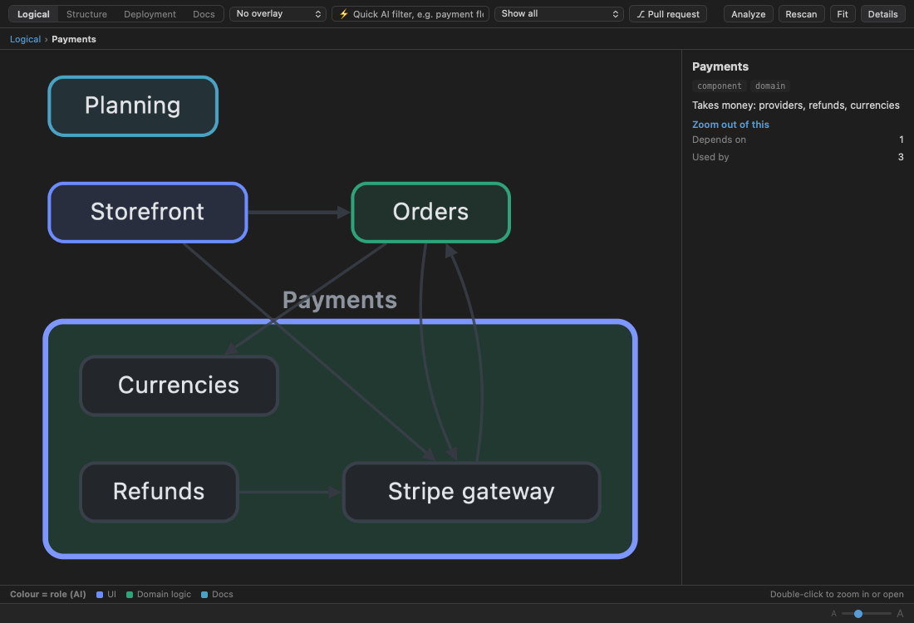
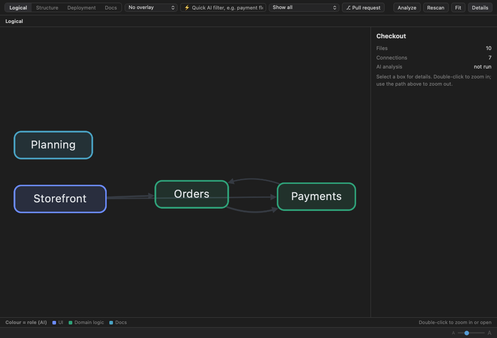
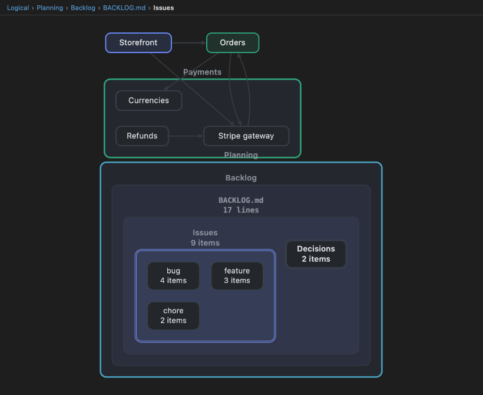

<div align="center">

# MarkView

### Understand any project, then build it with AI — from idea to merged code.

MarkView is a native macOS workspace for code and documentation. It shows you how a
project fits together (**X-Ray**), turns ideas into specifications through guided AI
interviews and reviews, and hands the result to **Claude Code, Codex, Cline or Copilot**
running in real terminals right next to your files.

[](https://github.com/t-boris/MarkView/releases/latest/download/MarkView.dmg)


**[⬇ Download the latest MarkView.dmg](https://github.com/t-boris/MarkView/releases/latest/download/MarkView.dmg)** · [All releases](https://github.com/t-boris/MarkView/releases)



</div>

---

## Why MarkView

- **See the whole system in minutes.** X-Ray groups files into components and subsystems
  by how they are really connected, and keeps going inside every file — down to a single
  requirement, endpoint or function.
- **Specify before you build.** A feature starts as a sentence. MarkView asks the few
  questions that matter, writes requirements and decisions as plain Markdown files, reviews
  them from a dozen perspectives, and keeps the specification consistent as you decide.
- **Your agents, in your workspace.** Claude Code, Codex, Cline and GitHub Copilot run in
  real terminals inside the window. Pages and files they open land in MarkView tabs, not
  in another app.
- **Everything is a file in your repo.** Features, bugs, research and decisions live in
  `docs/` as Markdown with YAML front matter — readable, diffable, reviewable in pull
  requests. No server, no account, no lock-in.
- **Native and fast.** SwiftUI and AppKit, a local SQLite index, no Swift package
  dependencies. AI runs through the CLIs you already use and are signed in to.

---

## X-Ray: from system to single item

Press **⌘4**, or right-click any folder and choose **X-Ray**.

| | |
|---|---|
|  |  |
| **Logical view**: subsystems and their dependencies, coloured by role. | **Double-click to zoom in**: component → file → its sections → a single item. |

- **Four views:** *Logical* (AI-named components and subsystems), *Structure* (folders and
  imports), *Deployment* (mapped from build and deploy files) and *Book* (documents only).
- **Built from facts, named by AI.** The scan reads imports, note links, git co-changes,
  size and complexity, then clusters files (Louvain). AI only names and describes what the
  structure already shows. Results are cached by input, so re-analysis redoes only what
  changed.
- **Inside every file.** Documents split into collections of like things (issues,
  requirements, decisions, endpoints), long code files into responsibilities and every type
  and function. Every leaf opens the file at that exact line.
- **Overlays:** documentation coverage, tests, bug history, freshness, complexity, size,
  pull request, and AI *Importance* — plus your own saved AI filters ("payment flow",
  "security") or a ⚡ one-off filter.
- **Book X-Ray** turns a folder of documents (md, txt, rst, adoc, org) into parts, chapters
  and sections with AI summaries, related-chapter links, *Describe this chapter* and
  *Ask the book*.
- **PR X-Ray** shows where a pull request lands in the architecture, with the diff, an AI
  review of its findings and impact, chat, approve or merge.
- **Explain** puts section-by-section margin notes on code and Markdown, with
  Explanation, Freshness and Importance lenses; the code viewer adds AI go-to-definition and
  find usages.
- **Recursive Insight** turns a folder or a long document into a browsable site of
  interactive pages you can dive into (depth 1–3) and export as a ZIP.

---

## From idea to merged code

The **Issues** sidebar holds the project's features and bugs. **+ → New Feature** (or
*New from This Document*, or a GitHub issue) starts one; voice notes, screenshots, files and
URLs are welcome as input. Each feature is a folder under `docs/features/<slug>/`:
`requirements/`, `decisions/`, `questions/`, `findings/`, research notes, a discussion log
and an implementation plan — all plain Markdown.

**Explore** — guided discovery.
- Rounds of at most three questions, each with concrete options and a recommended answer.
  The AI reads your code and documents first, so it never asks what the project already
  answers.
- Answer, write your own, or **Decide for me**; *Decide the rest and finish* when you have
  seen enough. Readiness and an understanding model show how far along you are.

**Review** — a specification that converges.
- *Run review* looks at the whole specification from Product, UX, Architecture, Security,
  QA, Operations and other perspectives and reports findings with severity and quotes.
- Resolve each finding by choosing an option, typing your own, or **Decide all for me**.
  Every resolution is **written back into the requirements** — statement and acceptance
  criteria — so the next review reads one consistent specification and never raises a
  settled point again. Details an implementer would decide are left to the implementer.
- **Before Build** collects what is left: blocking questions, AI decisions to confirm,
  open assumptions and research gaps.
- *Consolidate requirements*, *Find outdated* and *Clean up* keep large specifications
  small. Delete requirements or decisions you no longer want — links are cleaned up and
  **Re-explore** asks about what they used to settle. **Start over** rebuilds a feature
  from its overview.

**Build** — hand off and track.
- *Propose plan* splits the work into issues; one click creates them and an epic on GitHub.
- **Implement with AI** sends a binding handoff to the agent in the terminal (Claude Code
  gets a one-line `/goal`); answered questions and accepted decisions are treated as
  requirements, not reopened.
- **Lifecycle analytics** record status changes, commits, pull requests, CI and merges;
  *Project Cycle Time…* shows where time goes. **Sync** closes GitHub issues once their
  feature or bug is done.

**Bugs** get the same care: *New Bug* writes a structured report (and optionally a GitHub
issue), *Investigate* asks focused questions, and the **bug basket** fixes several bugs with
AI — one branch, one commit per bug.

**Understand and research.** *I Need to Understand* answers a question about the project
with **What, Why, How and Origin** and clickable evidence from code, documents, commits and
pull requests. *New Research* runs in the background and writes a cited report to
`docs/research/`, with every finding labelled and every web query recorded.

---

## AI agents and terminals

- **Real terminals** (**⌘3**): xterm.js on a pseudo-terminal owned by the app. Open
  Claude Code, Codex, Cline, Copilot or a plain shell — several at once — in the project
  folder; Claude Code and Codex sessions resume when you reopen the project.
- **One-click prompts:** *Review PR…*, *Review changes*, *Docs ↔ code*, *Explain file*,
  *Find bugs*, *Write tests*, *Run tests*, *Security review*, *Update docs*,
  *Commit message*. ⌥-click types a prompt without sending it.
- **Per-project assistant and model**, plus a separate fast model for X-Ray, filters and
  explanations. AI output can follow the document's language or use one of eight others.
- **Pages and files open in MarkView.** When an agent runs `open https://…`, `open notes.md`
  or uses `$BROWSER`, web pages appear in the window's browser tab, local HTML renders there
  too, and documents, code and images open as tabs. Folders, apps and other files still go
  to macOS. Clicked links and `path:line` references in the terminal work the same way.
- **Agents work in your browser tabs.** Claude Code, Codex, Copilot and Cline get a
  *markview-browser* MCP server: they navigate, read the page, click and type (as real mouse
  clicks and keystrokes), run JavaScript, read the console and take screenshots in the window's
  browser tabs — where you watch — instead of driving your Chrome. Sign in to a platform once in a
  tab, name the tab ("Jira", "Stripe") and say *"in tab Jira, follow these steps"*; the agent uses
  your session and never needs your password. **Stop** on a tab takes it back.
- **Usage at a glance:** quota chips for Claude Code and Codex in the terminal header.
- **Live reload:** files an agent changes on disk refresh in their tabs.
- **AI Tools** (✨): architecture, data-flow, pipeline, deployment, sequence and ER
  diagrams; Constructive Critic, Deep Research, Codebase Audit, Code Structure Map.

---

## Reading and writing

- **Markdown, WYSIWYG or source** (**⌘⇧P**) with Mermaid (full-screen viewer), interactive
  graph diagrams you edit by instruction, KaTeX math, footnotes, task lists, front matter,
  `[[wikilinks]]` and `file.ts#L40-L60` links.
- **Selection actions:** translate (RU / EN), explain, ask, challenge, expand, find edge
  cases, find contradictions, research — or turn the text into a requirement, decision or
  question of the current feature.
- **Viewers:** CodeMirror 6 for 45 languages, collapsible XML / plist trees, JSON Canvas,
  and an image viewer (PNG, JPEG, HEIC, WebP, SVG, RAW…) with zoom around the cursor.
- **JSON and YAML you can edit** in the tree — double-click a value or a key, **+** and **×**
  on any line — or in a source editor with syntax checking. YAML keeps its comments; JSON keeps
  its indentation.
- **Data files as tables, with SQL.** CSV, TSV, PSV, JSON Lines / NDJSON, **Parquet** (snappy,
  zstd, gzip, brotli, lz4), **SQLite** databases, **Excel** workbooks (every sheet) and **HAR**
  network logs open in a fast grid: sort by any column, filter each column (`>10`, `=x`, `null`),
  search everything, see column statistics, and query with real SQL (SQLite in WebAssembly) —
  `SELECT plant, AVG(height) FROM data GROUP BY plant`. Export or copy the result.
- **Log viewer** for `.log`, `.out` and `.txt`: levels (error, warn, info, debug…) with counts
  and filters, JSON log lines and stack traces understood, search with regex and *only
  matches*, **Next error**, wrap, and **Follow** to watch a growing log.
- **Search the whole project** (**⌘⇧K**) with an SQLite FTS5 index; find in file (**⌘F**)
  with case and regex.
- **Dictation** (🎤) in the terminal, intake forms and discussions — speech to text with
  OpenAI Whisper.
- **PDF export** (**⌘E**).

**Browser and app preview** (🌐)
- **Preview Web App (⌘6)** finds the project's web app (Vite, Next, Angular, Astro,
  Django, Rails, a static `index.html`…), starts its dev server when needed and shows
  `localhost` in a tab. Electron apps are previewed as a web page without starting Electron.
- **Browser (⌘5)** opens any address in a tab. **Save as Markdown** turns a page or a
  selection into a clean document in `docs/research` with its source and date.

---

## Workspace

- **File tree** with breadcrumbs, filter, sort and git status. Select several items
  (click, ⌘-click, ⇧-click) to **move, trash, stage, discard or copy paths** at once;
  **Rename…** any file or folder — open tabs follow.
- **Linked folders** bring outside folders into a project for browsing, search and AI
  context while git, features and bugs stay with the project.
- **Windows remember everything:** each window is its own project, and every window — its
  tabs, panels and size — comes back after a restart.
- **Project colours** tell windows apart at a glance, even in Mission Control.
- **Git** built in: branches, stage, commit, push, pull, diffs. **GitHub** (opt-in, via
  `gh`): pull requests with review and merge, issues, Actions runs and logs with *Explain
  Failure*, notifications.
- **New Project…** starts a project from an idea: the AI clarifies it, writes the first
  specification and README, initialises git and can publish it to GitHub.
- **Project operations:** *Discover operations* in the X-Ray Deployment view finds the
  project's deploy, install and restart commands. The **Deploy** button runs them after you
  confirm the exact command, with live output, Cancel and a notification when done. The list
  is shared in `.markview/operations.json`.
- Light, dark and system themes; interface text from 80% to 200%.

---

## Install

1. **[Download MarkView.dmg](https://github.com/t-boris/MarkView/releases/latest/download/MarkView.dmg)**
   (the latest release; earlier versions are on the [Releases](https://github.com/t-boris/MarkView/releases) page).
2. Open it and drag **MarkView** onto **Applications**.

The app is signed with a Developer ID and notarized by Apple, so it opens without warnings.

### Requirements

- macOS 13 Ventura or later.
- **For AI**, one or more of these command-line agents, installed and signed in:
  [Claude Code](https://docs.anthropic.com/en/docs/claude-code),
  [Codex](https://github.com/openai/codex),
  [Cline](https://cline.bot) or
  [GitHub Copilot CLI](https://github.com/github/copilot-cli).
  MarkView uses their sign-in and needs no provider key of its own.
- **Optional:** `git`; [`gh`](https://cli.github.com) for GitHub; an OpenAI API key
  (Settings) for dictation only.

Settings (**⌘⇧,**) choose the assistant and model, the X-Ray model, the language of AI
output, CLI paths and the Whisper model.

### Privacy and how AI runs

- Your files stay on your Mac. The search index lives in the project's `.dde/` folder;
  features, bugs and research are ordinary files in your repository.
- AI requests go through the agent CLIs you installed, under their accounts and terms.
  MarkView's own background calls (X-Ray, reviews, explanations) run them read-only. The
  agent terminals run with the agents' full-access flags — they act on your project, as
  they would in any terminal.
- Dictation sends audio to OpenAI with your key. GitHub is contacted only when you turn the
  integration on. Interactive graph diagrams load d3 and dagre from a CDN.

---

## Build from source

### Set up Xcode

Install the full [Xcode app](https://developer.apple.com/xcode/) and open it once. The
standalone Command Line Tools do not include `xcodebuild`, which the build scripts need.

```bash
sudo xcode-select --switch /Applications/Xcode.app/Contents/Developer
xcodebuild -version      # should print an Xcode version and build number
```

If `DEVELOPER_DIR` is set in your shell, update or unset it — it overrides `xcode-select`.
See Apple's [command-line tools guide](https://developer.apple.com/documentation/xcode/configuring-command-line-tools-settings).

### Build and install

```bash
git clone https://github.com/t-boris/MarkView.git
cd MarkView
./install.sh                 # Release build → /Applications (for development)
./release.sh --install       # signed build + DMG installer in build/, installed from the DMG
```

- `release.sh` signs with the first *Developer ID Application* identity in your keychain and
  enables the hardened runtime. With a `notarytool` profile (`NOTARY_PROFILE`, default
  `markview-notary`) it notarizes and staples the DMG; `--publish` creates the GitHub
  release.
- The bundled web libraries (CodeMirror, Cytoscape + ELK, xterm.js) are rebuilt with
  `cd tools/web-vendor && npm ci && ./build.sh` — never loaded from a CDN.
- There is no XCTest target; focused checks live in `tools/tests/*.sh`.

<details>
<summary><b>Project layout</b></summary>

```
MarkView/
├── App/            MarkViewApp.swift: windows, menus, Finder "Open With"
├── Models/
│   ├── WorkspaceManager.swift    central state: tabs, files, AI routing, terminals
│   ├── ArchitectureStore.swift   X-Ray: scan, clustering, AI naming, overlays, PR X-Ray
│   ├── FeatureStore / FeatureAI  features, bugs, questions, reviews (docs/features, docs/bugs)
│   ├── LifecycleAnalytics        cycle-time events and summaries
│   ├── TerminalSession.swift     PTY (forkpty) + xterm.js web view
│   ├── TerminalBrowserBridge     pages and files opened by agents → MarkView tabs
│   ├── AIAssistants / CLICompletion / ACPAssistant
│   │                             Claude Code, Codex, Cline, Copilot discovery and runs
│   ├── SemanticDatabase.swift    SQLite + FTS5 index (.dde/state.db)
│   └── GitClient, GitHubStore, WhisperClient, InsightSession, …
├── Views/          SwiftUI: ContentView, EditorView (WKWebView), FileTreeView,
│                   FeaturePanelView, TerminalView, BrowserTabView, GitView…
├── Bridge/         WebViewBridge (Swift ↔ JS), PDFExporter
└── Resources/Editor/
    ├── index.html, terminal.html
    └── vendor/js/  markview-*.js (editor, X-Ray, code viewer, canvas…),
                    CodeMirror, Cytoscape + ELK, xterm.js, Mermaid, KaTeX, markdown-it
```

Architecture notes: [`docs/architecture/`](docs/architecture/).

</details>

## Tech stack

| | |
|---|---|
| App | Swift 5.9, SwiftUI + AppKit, WKWebView |
| Editor | markdown-it, Turndown, Mermaid, KaTeX, Prism |
| Code viewer | CodeMirror 6 |
| X-Ray | Cytoscape.js + ELK, Louvain clustering, git history |
| Terminals | xterm.js on a Swift-owned PTY |
| Storage | SQLite (C API) + FTS5; features and bugs as Markdown + YAML |
| AI | Claude Code, Codex, Cline and Copilot CLIs (ACP); OpenAI Whisper |

## License

MIT, see [LICENSE](LICENSE).
