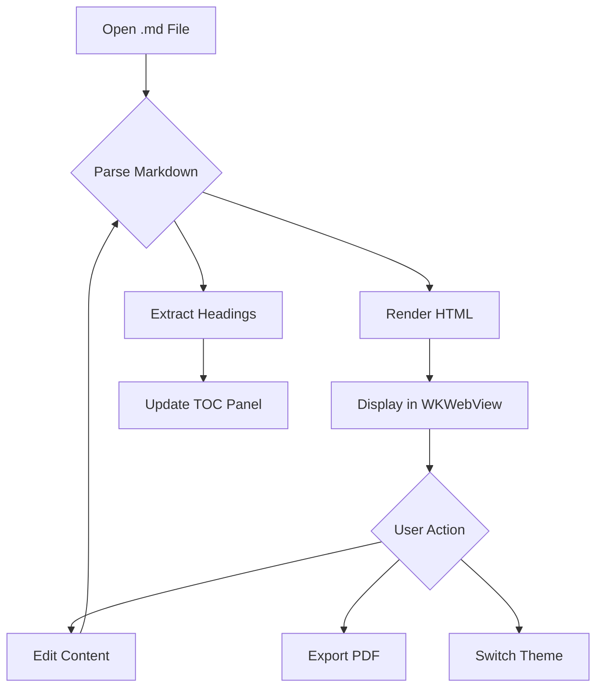
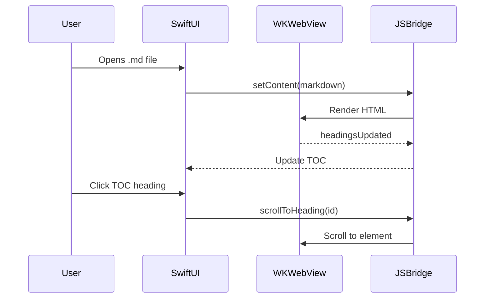
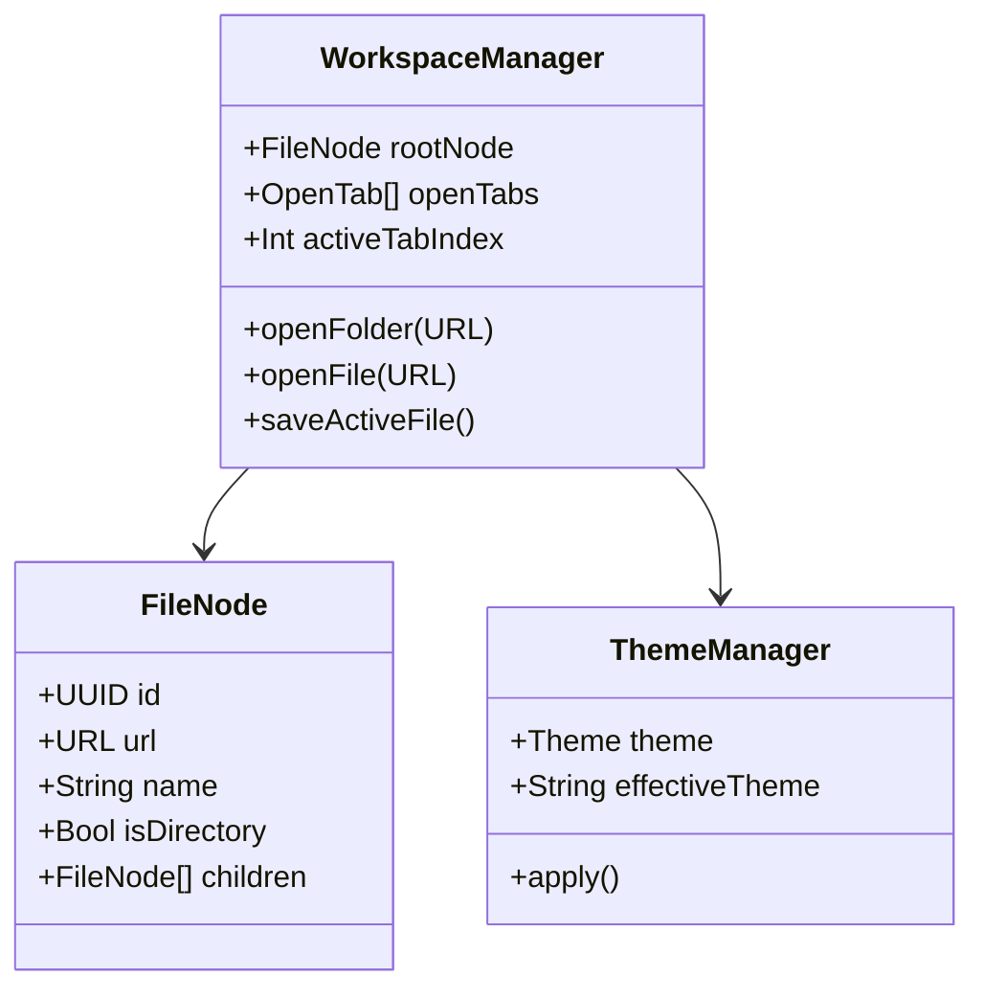

# MarkView Demo Document

Welcome to **MarkView** — a native macOS Markdown viewer and editor.

## Features Overview

This document demonstrates all supported Markdown extensions. Open it in MarkView to see everything rendered beautifully.

### Basic Formatting

You can use **bold**, *italic*, ~~strikethrough~~, and `inline code`. Links work too: [Anthropic](https://anthropic.com).

> This is a blockquote. It can contain **formatted text** and even
> multiple paragraphs.

---

## Code Blocks

### Swift

```swift
import SwiftUI

struct ContentView: View {
    @State private var count = 0

    var body: some View {
        VStack {
            Text("Count: \(count)")
                .font(.largeTitle)
            Button("Increment") {
                count += 1
            }
        }
        .padding()
    }
}
```

### Python

```python
import asyncio
from dataclasses import dataclass

@dataclass
class Document:
    title: str
    content: str
    tags: list[str]

async def process_documents(docs: list[Document]) -> dict:
    results = {}
    for doc in docs:
        results[doc.title] = len(doc.content.split())
    return results
```

### JSON

```json
{
  "name": "MarkView",
  "version": "1.0.0",
  "features": ["markdown", "mermaid", "katex", "themes"],
  "platform": "macOS"
}
```

---

## Mermaid Diagrams

### Flowchart



### Sequence Diagram



### Class Diagram



---

## Math Formulas (KaTeX)

### Inline Math

The quadratic formula is $x = \frac{-b \pm \sqrt{b^2 - 4ac}}{2a}$, which gives us the roots of $ax^2 + bx + c = 0$.

Einstein's famous equation $E = mc^2$ relates energy and mass.

### Block Math

The Fourier Transform:

$$F(\omega) = \int_{-\infty}^{\infty} f(t) \cdot e^{-i\omega t} \, dt$$

Maxwell's Equations:

$$\nabla \cdot \mathbf{E} = \frac{\rho}{\varepsilon_0}$$

$$\nabla \cdot \mathbf{B} = 0$$

$$\nabla \times \mathbf{E} = -\frac{\partial \mathbf{B}}{\partial t}$$

$$\nabla \times \mathbf{B} = \mu_0 \mathbf{J} + \mu_0 \varepsilon_0 \frac{\partial \mathbf{E}}{\partial t}$$

Matrix multiplication:

$$\begin{pmatrix} a & b \\ c & d \end{pmatrix} \begin{pmatrix} e \\ f \end{pmatrix} = \begin{pmatrix} ae + bf \\ ce + df \end{pmatrix}$$

---

## Admonitions / Callouts

:::info Information
This is an informational callout. Use it for additional context or helpful tips that aren't critical.
:::

:::warning Warning
Be careful with this operation! Make sure you have a backup before proceeding.
:::

:::tip Tip
You can toggle between dark and light themes using `Cmd+Shift+T` or the toolbar button.
:::

:::danger Danger
This action is irreversible. Data will be permanently deleted.
:::

---

## Task Lists

### Project Milestones

- [x] Create architecture document
- [x] Implement Swift layer (Models, Views, Bridge)
- [x] Implement web editor (HTML/JS)
- [x] Add Mermaid diagram support
- [x] Add KaTeX math rendering
- [ ] Add PlantUML support (Wasm)
- [ ] Add Graphviz support (Wasm)
- [ ] App Store submission

### Daily Tasks

- [x] Review pull requests
- [x] Update documentation
- [ ] Write unit tests
- [ ] Performance profiling

---

## Tables

| Feature | Status | Priority |
|---------|--------|----------|
| Markdown rendering | ✅ Done | P0 |
| Mermaid diagrams | ✅ Done | P0 |
| KaTeX math | ✅ Done | P1 |
| Dark/Light theme | ✅ Done | P0 |
| PDF export | ✅ Done | P0 |
| Table of Contents | ✅ Done | P1 |
| File tree navigation | ✅ Done | P1 |
| PlantUML | 🔄 In Progress | P2 |
| Graphviz | 📋 Planned | P2 |
| WYSIWYG editing | 🔄 In Progress | P1 |

---

## Images

Images are rendered with proper sizing and won't break across pages in PDF export:


---

## Footnotes

Here is a sentence with a footnote[^1]. And here's another one[^2].

[^1]: This is the first footnote. It appears at the bottom of the document.
[^2]: Footnotes are great for references and additional context without cluttering the main text.

---

## Nested Lists

1. First level
   - Second level item A
   - Second level item B
     - Third level item
     - Another third level
   - Second level item C
2. Another first level
   1. Numbered second level
   2. Another numbered
3. Final first level

---

## Horizontal Rules and Line Breaks

Content above the rule.

---

Content below the rule.

---

*This document was created to test all MarkView features. Open it, switch themes, navigate with the TOC, and try exporting to PDF!*
