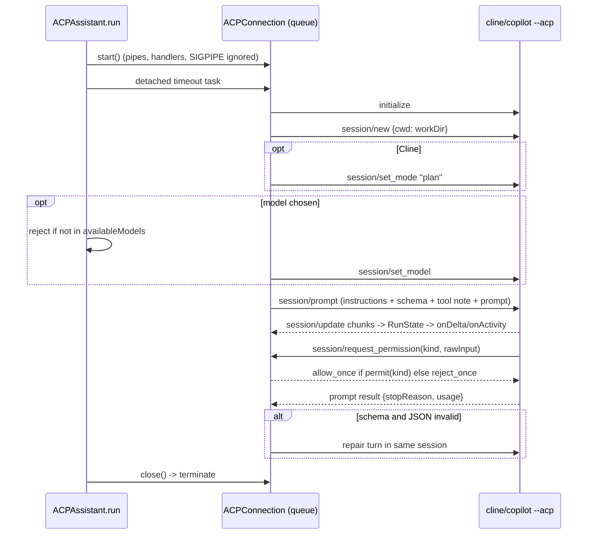
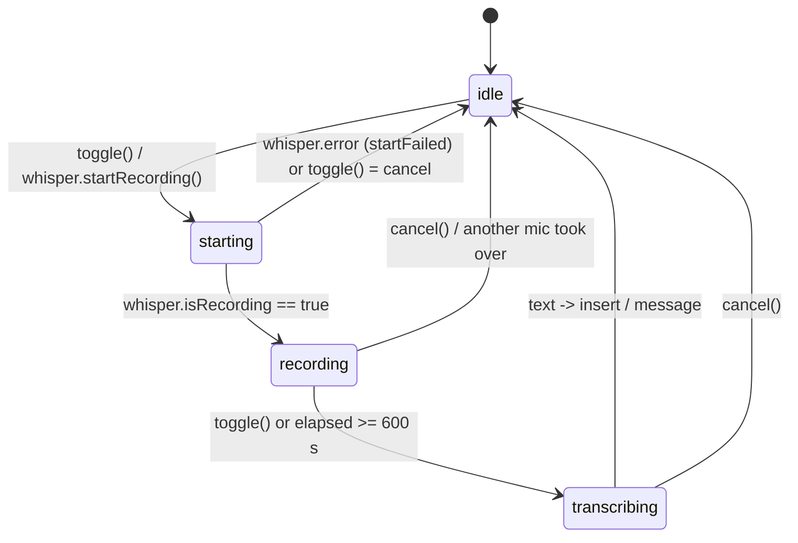

# AI Assistants, Code Explanation/Navigation, Embeddings and Dictation

Module documentation for the layer that turns "ask the AI" into a local CLI process
(Claude Code, Codex, Cline, GitHub Copilot) or an OpenAI HTTP call (Whisper, embeddings),
plus the code viewer's Explain / Go-to-definition / Ask-about-selection features and
voice dictation.

Sibling modules: [app-shell-and-workspace](app-shell-and-workspace.md) ·
[editor-and-bridge](editor-and-bridge.md) · [feature-workflow](feature-workflow.md) ·
[architecture-and-xray](architecture-and-xray.md) ·
[semantic-index-and-insight](semantic-index-and-insight.md) ·
[git-github-terminal-lifecycle-usage](git-github-terminal-lifecycle-usage.md) ·
[build-release-testing](build-release-testing.md)

---

## 1. Purpose and responsibilities

**Owns**

- Discovery, probing and login of the four assistant CLIs (`CLITool`, `CLIToolLocator`) —
  `MarkView/Models/AIAssistants.swift:13-518`.
- The user's assistant/model choice, including a separate X-Ray model
  (`AIAssistantPreferences`) — `AIAssistants.swift:87-213`.
- One-shot, read-only completions for every in-app AI feature (`CLICompletion`), with
  streaming, structured (JSON Schema) output, token/cost accounting, timeout and
  cancellation — `MarkView/Models/CLICompletion.swift`.
- The Agent Client Protocol (JSON-RPC over stdio) client for Cline and Copilot, including
  the read-only permission policy — `MarkView/Models/ACPAssistant.swift`.
- The AI output language setting and the SHA-256 content hash helper —
  `MarkView/Models/OutputLanguage.swift`.
- Canned prompts for the AI terminal (`AIPrompts`, `TerminalPrompt`) —
  `MarkView/Models/AIPrompts.swift`.
- Code viewer margin notes (`CodeExplainStore`) — `MarkView/Models/CodeExplainer.swift`.
- LSP-less navigation and "Ask AI about the selection" (`CodeNavigator`,
  `CodeNavigationStore`) — `MarkView/Models/CodeNavigation.swift`.
- OpenAI clients: embeddings (`EmbeddingClient`) and Whisper transcription
  (`WhisperClient`) — `MarkView/Models/EmbeddingClient.swift`, `MarkView/Models/WhisperClient.swift`.
- Dictation state machine and its SwiftUI controls — `MarkView/Models/DictationController.swift`,
  `MarkView/Views/DictationViews.swift`.
- The assistant/model picker used in DDE Settings — `MarkView/Views/AIAssistantPickerView.swift`.

**Does not own**

- The interactive AI terminals (PTY, `TerminalSession`, `startupCommand`) — see
  [git-github-terminal-lifecycle-usage](git-github-terminal-lifecycle-usage.md). This module
  only supplies `CLITool`, the resolved path and `modelArgs`.
- The prompts/schemas of X-Ray, filters, Insight, GraphRAG, feature facilitation, PR
  review; those callers build `CLICompletion.Request`s themselves (see §4).
- Usage accounting storage (`SemanticDatabase.addUsage`) — only called via
  `CLICompletion.Result.record(in:)` (`CLICompletion.swift:40-44`).
- The JS side of the code viewer (`markview-code.js`) and the bridge transport — see
  [editor-and-bridge](editor-and-bridge.md).
- The toolbar assistant menu `AssistantToolbarMenu` lives in
  `MarkView/Views/ContentView.swift:387-452` but edits the same keys documented here.

---

## 2. Files

| Path | Role |
|---|---|
| `MarkView/Models/AIAssistants.swift` | `CLITool` enum, `AIModelOption`, `AIAssistantPreferences` (UserDefaults-backed choice + model catalogs), `CLIToolLocator` (path resolution, probing, generic process runner, Terminal login) |
| `MarkView/Models/CLICompletion.swift` | `CLICompletion` (request/result/failure/activity types, argv building for Claude/Codex, strict-schema transform) and private `Invocation` (one CLI process: stdin feed, NDJSON stream parsing, timeout) |
| `MarkView/Models/ACPAssistant.swift` | `ACPAssistant` (Cline/Copilot run, prompt composition, JSON repair, model refresh/cache) and private `ACPConnection` (JSON-RPC 2.0 over stdio, permission answers) |
| `MarkView/Models/AIPrompts.swift` | `AIPrompts.codebaseAuditPrompt`; `TerminalPrompt` catalog for the AI terminal prompt bar |
| `MarkView/Models/OutputLanguage.swift` | `ActionOutputLanguage` (AI output language setting and prompt lines); `ContentHash` (SHA-256 hex) |
| `MarkView/Models/CodeExplainer.swift` | `String.editorLines`, `CodeSection`, `CodeExplanation`, `@MainActor CodeExplainStore` (explain, rate, freshness, cache) |
| `MarkView/Models/CodeNavigation.swift` | `CodeNavigator` (git grep / walk + regex definition detection), `@MainActor CodeNavigationStore` (history, go-to-definition, usages, AI Q&A), `AnswerBuffer`, `Notification.Name.codeNavEvent` |
| `MarkView/Models/EmbeddingClient.swift` | OpenAI embeddings client (`text-embedding-3-small`, 1536 dims), vector file I/O, cosine similarity, OpenAI key storage |
| `MarkView/Models/WhisperClient.swift` | `@MainActor WhisperClient`: microphone permission, WAV recording, multipart upload to `/v1/audio/transcriptions`, self-test |
| `MarkView/Models/DictationController.swift` | `@MainActor DictationController`: phase machine (idle/starting/recording/transcribing), elapsed timer, cap warning, cancel |
| `MarkView/Views/AIAssistantPickerView.swift` | Settings picker: assistant segmented control, model list, custom model entry |
| `MarkView/Views/DictationViews.swift` | `DictationButton`, `DictationStatusView`, `DictationInsertion` (cursor-aware insertion into an `NSTextView`) |

---

## 3. Key types

### `CLITool` (`AIAssistants.swift:13-70`)
`enum` of `claude`, `codex`, `cline`, `copilot`. `usesACP` is true for Cline/Copilot
(`:31`). Per-tool knowledge: binary name (= raw value, `:34`), override key (`:37`), auth
status args (`claude auth status`, `codex login status`, none for ACP tools; `:43-50`),
login command (`:53-60`), model flag (`--model` for Claude/Copilot, `-m` for Codex/Cline;
`:63-69`).

### `AIAssistantPreferences` (`AIAssistants.swift:87-213`)
Stateless namespace over `UserDefaults.standard`.
- `backend` (`:92-94`) — defaults to `.claude`.
- `model(for:)` (`:97-101`) — nil when empty (CLI default).
- `xrayModel(for:)` (`:116-120`) — X-Ray/Explain/rater model; defaults `sonnet` (Claude),
  `gpt-5.6-luna` (Codex), "" for ACP tools (`:108-114`); "" falls back to `model(for:)`.
- `modelOptions(for:)` (`:130-157`) — Claude: fixed aliases `""`, `fable`, `opus`, `sonnet`,
  `haiku`; Codex: reads `~/.codex/models_cache.json` (entries with `visibility == "list"`,
  sorted by `priority`) and labels "Default" with `model =` from `~/.codex/config.toml`;
  Cline/Copilot: cached ACP model list. Must be called off-main for Codex (~350 KB JSON, `:128-129`).
- `configuredModel(for:)` (`:161-172`) — reads `~/.claude/settings.json` `"model"` or Codex config.

### `CLIToolLocator` (`AIAssistants.swift:215-518`)
- `resolve(_:)` (`:260-271`) — override (must be executable) else first hit in
  `searchDirectories()` (`:250-256`): extra PATH entries, `~/.local/bin`, `/opt/homebrew/bin`,
  `/usr/local/bin`, `~/.claude/local`, `~/bin`, `/usr/bin`, then every
  `~/.nvm/versions/node/*/bin` newest first (`:240-247`). Pure filesystem; main-safe.
- `resolveViaLoginShell` (`:275-280`) — `/bin/zsh -lc "command -v <binary>"`, 10 s timeout.
- `resolveThorough` (`:283-287`) — scan, then login shell unless an override is set.
- `subprocessPath(toolPath:)` (`:298-309`) — the `PATH` given to every spawned CLI
  (tool dir, extra entries, Homebrew, system dirs, `~/.local/bin`, nvm bins; de-duplicated).
  Also reused by `GitHubClient` (`GitHubClient.swift:276`, `:300`).
- `probe(_:)` (`:322-368`) / `probeACP` (`:373-402`) — version + auth status without spending
  tokens; for ACP tools, enforces min versions (Cline ≥ 3, Copilot ≥ 1) and opens an ACP
  session to list models.
- `run(_:_:timeout:)` (`:415-482`) — generic async process runner (see §7). Also used by
  `AgentUsageTracker` to call `/usr/bin/security` (`AgentUsageTracker.swift:485`).
- `openLoginInTerminal` (`:491-517`) — writes `~/Library/Application Support/MarkView/login-<tool>.command`
  (mode 0755) and opens it with `NSWorkspace` (no Apple Events).

### `CLICompletion` (`CLICompletion.swift:11-196`)
- `Request` (`:13-29`): `prompt`, `systemPrompt`, `jsonSchema`, `readableFolder` (nil = no file
  access), `timeout` (default 180 s), `tool` (default `backend`), `model`, `effort`, `allowWeb`.
- `Result` (`:31-45`): `text`, `structured`, token counts, `costUSD` (Claude only);
  `@MainActor record(in:)` adds to `SemanticDatabase` usage.
- `Failure` (`:47-66`): `toolNotFound`, `failed`, `timedOut`, `invalidOutput`.
- `Activity` (`:69-82`): `read`, `search`, `run`, `thinking`, `writing(Int)`, `answerDelta`.
- `run(_:onDelta:onActivity:)` (`:88-162`) — entry point for every in-app AI feature.
- `strictSchema` (`:182-195`) — OpenAI strict-mode transform for Codex.
- Private `Invocation` (`:202-456`) — `@unchecked Sendable`, all state on serial
  `DispatchQueue "markview.cli-completion"` (`:225`).

### `ACPAssistant` / `ACPConnection` (`ACPAssistant.swift`)
- `ACPAssistant.run` (`:43-136`), `refreshModels` (`:220-244`), `cachedModels` (`:210-217`),
  `parseJSON` (`:187-203`).
- `ACPConnection` (`:314-496`) — `@unchecked Sendable`; state on `DispatchQueue "markview.acp"`
  (`:323`); pending requests are `CheckedContinuation`s keyed by JSON-RPC id (`:326`).
- `RunState` (`:249-308`) — lock-protected answer accumulator and token totals.

### `CodeExplainStore` — `@MainActor`, `ObservableObject` (`CodeExplainer.swift:40-340`)
Published `explanations`, `working`, `errors`, `revision`. Methods: `load`, `explain`,
`rate`, `freshness`, `isStale`, `payloadJSON`, `reset`. Limits: 4000 lines (`:99`),
400 chars/line (`:56`).

### `CodeNavigator` (enum) and `CodeNavigationStore` — `@MainActor` (`CodeNavigation.swift`)
`CodeNavigator.find` (`:47-87`) is synchronous and must run off-main. `CodeNavigationStore`
(`:236-399`) holds back/forward stacks (max 100, `:284`) and per-question answer `Task`s.

### `EmbeddingClient` (`EmbeddingClient.swift:4-128`)
Plain class (not actor-isolated). `embed`, `embedBatch`, `cosineSimilarity`,
`saveEmbedding`/`loadEmbedding` (raw little-endian `Float` bytes), `loadKey`/`saveKey`.

### `WhisperClient` — `@MainActor`, `ObservableObject` (`WhisperClient.swift:6-281`)
Published `isRecording`, `transcribedText`, `error`. `static weak var active` enforces one
microphone app-wide (`:20`, `:84`). `generation` counter invalidates in-flight work on
`cancel()` (`:16`, `:153-162`).

### `DictationController` — `@MainActor`, `ObservableObject` (`DictationController.swift:10-148`)
Owns a private `WhisperClient`; `Phase` = `idle | starting | recording(since:) | transcribing`.

---

## 4. Internal interfaces

### Who calls in

| Caller | Entry used | Notes |
|---|---|---|
| `WorkspaceManager.handleSelectionAction` (`WorkspaceManager.swift:1657-1681`) | `CLICompletion.run` | Translate/explain selection, 120 s |
| `WorkspaceManager.translateDocument` + chunk translation (`:1732-1739`, `:1863-1874`) | `AIAssistantPreferences.backend/model`, `CLIToolLocator.resolve`, `CLICompletion.run` | Engine fixed per document, 240 s |
| Recursive Insight start (`WorkspaceManager.swift:2114`) | `CLIToolLocator.resolve` | Pre-flight check |
| `WorkspaceManager.handleCodeAction` / `handleNavigation` (`:915-1000`) | `CodeExplainStore.explain/rate/freshness`, `CodeNavigationStore.*` | From bridge `codeAction` messages (`EditorView.swift:737-746`) |
| `WorkspaceManager.startupCommand` (`:3094-3102`) | `CLIToolLocator.resolve`, `CLITool.modelArgs`, `AIAssistantPreferences.model` | Interactive terminals |
| `WorkspaceManager.aiPrompt` (`:3519-3524`) | `AIPrompts.codebaseAuditPrompt` | AI Tools menu → terminal |
| `TerminalPromptBar` (`TerminalView.swift:221-292`) | `TerminalPrompt.all`, `.text(file:pullRequest:)` | → `sendToAssistant` |
| `ArchitectureStore` (12 requests, e.g. `ArchitectureStore.swift:554`, `:1559`, `:2840`) | `CLICompletion.Request/run`, `xrayModel` | X-Ray; see [architecture-and-xray](architecture-and-xray.md) |
| `XRaySearch` (`XRaySearch.swift:29-33`, `:98-133`) | `CodeNavigator.find/rank/sortUsages`, `CLICompletion.Request` | Symbol hints for ⚡ search, 900 s |
| `ImportanceRater.request` (`ImportanceRater.swift:186-194`) | `CLICompletion.Request`, `xrayModel` | 240 s, low effort |
| `FilterSearch` (`FilterSearch.swift:26-40`) | `CLICompletion.run` | 90 s, low effort |
| `InsightSession` (`InsightSession.swift:431-433`, `:1266-1267`), `GraphRAG` (`GraphRAG.swift:426-457`) | `CLICompletion.run` | up to 1800 s; see [semantic-index-and-insight](semantic-index-and-insight.md) |
| `FeatureAssistant.run` (`FeatureAI.swift:124-145`) | `CLICompletion.run` with `readableFolder` + `allowWeb` | See [feature-workflow](feature-workflow.md) |
| `GitHubStore` (`GitHubStore.swift:505-517`) | `CLICompletion.run` | 300 s |
| `FeatureAssistant.voice` (`FeatureAI.swift:76`), `SourcesSection` (`FeaturePanelView.swift:745`) | `WhisperClient` | Voice notes |
| `FeatureIngest` (`FeatureIngest.swift:147`) | `WhisperClient().transcribe(fileURL:)` | Audio attachments |
| `TerminalSession.dictation` (`TerminalSession.swift:78`), `SessionDictationButton` (`TerminalView.swift:45-77`) | `WhisperClient` | Pasted at the prompt, not submitted |
| Intake sheet (`FeatureNavigatorView.swift:421-450`, `:510-524`) | `DictationController`, `DictationButton`, `DictationInsertion`, `DictationStatusView` | Mic shown only when key set |
| `DDESettingsView` (`DDESettingsView.swift:36-50`, `:66`, `:196-201`, `:286-301`) | key save, `AIAssistantPickerView`, probes, login, Whisper self-test | |
| `AssistantToolbarMenu` (`ContentView.swift:387-452`) | same `@AppStorage` keys, `modelOptions`, `ACPAssistant.refreshModels` | |
| `AgentUsageTracker` (`AgentUsageTracker.swift:142`, `:485`) | `CLIToolLocator.resolve/run` | |

### What it calls

- `Process` (CLIs, `git`, `zsh`), `URLSession.shared` (OpenAI), `AVAudioRecorder` /
  `AVCaptureDevice` (mic), `NSWorkspace.open` (login script, System Settings URL).
- `SemanticDatabase.addUsage` via `Result.record` (`CLICompletion.swift:41-44`).
- `ArchitectureScanner.runTool` / `listFiles` for `git grep`, `git blame`, file walks
  (`CodeNavigation.swift:200`, `:210`, `:216`; `CodeExplainer.swift:70`).
- `ImportanceRater`, `FilterSearch`, `XRayDigest` from the X-Ray module for ratings and
  incremental JSON parsing (`CodeExplainer.swift:225`, `:264`, `:285`).
- `NotificationCenter` `.codeNavEvent` → `EditorView` (`EditorView.swift:148-157`) →
  `WebViewBridge.sendCodeNavEvent` → `window.onCodeNavEvent` (`WebViewBridge.swift:418-420`,
  `markview-code.js:1238`).

---

## 5. Provider / CLI integration table

| Integration | Binary / endpoint | Model ids | Auth & where stored | Request / response format | Timeouts | Process & pipes | Cancellation |
|---|---|---|---|---|---|---|---|
| **Claude Code** (one-shot) | `claude` resolved by `CLIToolLocator.resolve` (`AIAssistants.swift:260`) | `--model` alias `fable`/`opus`/`sonnet`/`haiku` or custom; X-Ray default `sonnet` (`:110`, `:135-141`) | CLI's own login (`claude auth login`); MarkView stores nothing. Status via `claude auth status` JSON `loggedIn` (`:346-354`) | argv: `-p --safe-mode --no-session-persistence --output-format stream-json --verbose --include-partial-messages --tools <Read,Grep,Glob?,WebSearch,WebFetch?>` + `--effort`, `--system-prompt`, `--json-schema` (`CLICompletion.swift:110-122`). Prompt on stdin. NDJSON events `stream_event` (text/input_json deltas), `assistant` (tool_use), `result` (`result`, `structured_output`, `total_cost_usd`, `usage`) (`:336-387`) | `Request.timeout` default 180 s (`:20`), callers 90–1800 s; `queue.asyncAfter` → `terminate()` (`:314-318`) | `Invocation`: stdout/stderr `readabilityHandler` → serial queue; stdin written on a global queue then closed (`:308-312`); stdout drained to EOF in `terminationHandler` (`:290`); stderr tail 4000 chars (`:283`) | `withTaskCancellationHandler` → `Invocation.cancel()` → `terminate()` (`:145-149`, `:258-263`) |
| **Codex** (one-shot) | `codex` | `-m <slug>` from `~/.codex/models_cache.json`; X-Ray default `gpt-5.6-luna` (`AIAssistants.swift:111`) | CLI's own login (`codex login`); status text match (`:357-365`) | argv: `[--search] exec --sandbox read-only --skip-git-repo-check --ephemeral --json --color never -C <dir>` + `-m`, `-c model_reasoning_effort=`, `--output-schema <tmp file>`, `-` (stdin) (`CLICompletion.swift:123-139`). System prompt prefixed as `<instructions>`. Events `item.started`, `item.completed` (`agent_message`), `turn.completed` usage, `turn.failed`, `error` (`:389-419`) | same as Claude | same `Invocation`; schema file `$TMPDIR/markview-cli/schema-<uuid>.json` deleted in `defer` (`:129-140`) | same |
| **Cline** (ACP) | `cline --acp [--thinking <effort>]` (`ACPAssistant.swift:36-38`) | Account models from ACP `session/new` → `models.availableModels[].modelId`, cached (`:220-244`) | `cline auth` in Terminal; MarkView stores nothing. No status command; sign-in inferred from error text (`AIAssistants.swift:396-401`) | JSON-RPC 2.0 NDJSON over stdio: `initialize` (protocolVersion 1, fs/terminal capabilities false), `session/new {cwd, mcpServers: []}`, `session/set_mode plan`, `session/set_model`, `session/prompt`; notifications `session/update` (`agent_message_chunk`, `agent_thought_chunk`, `tool_call`) (`ACPAssistant.swift:81-111`, `:274-307`) | Detached `Task.sleep(request.timeout)` → `connection.fail(.timedOut)` (`:75-79`). `refreshModels` has **no** timeout | `ACPConnection`: `readabilityHandler` on stdout/stderr → serial queue; line-buffered parse (`:436-444`); stderr tail 3000 chars (`:355`); writes are synchronous `FileHandle.write` on the queue (`:430-434`) | `onCancel` → `session/cancel` notification, fail pending, `terminate()` after 1 s (`:393-401`) |
| **GitHub Copilot CLI** (ACP) | `copilot --acp --no-auto-update --no-ask-user --disable-builtin-mcps --no-custom-instructions [--reasoning-effort e] --available-tools view grep glob` (`ACPAssistant.swift:30-34`) | Account models from ACP; `_meta.copilotUsage` shown as premium-request cost (`:235-237`) | `copilot login`; model list non-empty ⇒ signed in (`AIAssistants.swift:394-395`) | As Cline, no `set_mode`; `result.usage.inputTokens/outputTokens` summed (`ACPAssistant.swift:146-149`); chunks starting `Info: Disabled tools:` dropped (`:34`, `:278`) | as Cline | as Cline | as Cline |
| **OpenAI Whisper** | `POST https://api.openai.com/v1/audio/transcriptions` (`WhisperClient.swift:201`) | `whisper-1` (default), `gpt-4o-transcribe`, `gpt-4o-mini-transcribe` (`:30-31`) | `Authorization: Bearer <key>`; key in **UserDefaults** `com.markview.dde.openai.apikey` (plaintext, `:26`, `:44-46`) | multipart/form-data: `model`, `prompt` (fixed domain hint), `file` named `audio.wav`, `Content-Type: audio/wav` (`:178-199`); response JSON `text` (`:219-220`) | `30 + bytes/200_000` s (`:207`) | `URLSession.shared.data(for:)` | `Task.cancel()` via `cancel()`; `URLError.cancelled` swallowed (`:230`) |
| **OpenAI Embeddings** | `POST https://api.openai.com/v1/embeddings` (`EmbeddingClient.swift:6`) | `text-embedding-3-small`, `dimensions: 1536` (`:7`, `:9`) | Bearer; same UserDefaults key (`:125-127`) | JSON `{model, input, dimensions}`; response `data[].embedding` (batch sorted by `index`, `:86`) | 30 s single, 60 s batch (`:37`, `:72`) | `URLSession.shared` | none (caller task) |
| **OpenAI key check** | `GET https://api.openai.com/v1/models` (`DDESettingsView.swift:358`) | — | Bearer, key from the text field | status 200 = valid; body `invalid_api_key` / `insufficient_quota` mapped (`:365-376`) | 10 s (`:360`) | `URLSession.shared` | none |
| **Login shell lookup** | `/bin/zsh -lc "command -v <binary>"` (`AIAssistants.swift:276`) | — | — | stdout path | 10 s | `CLIToolLocator.run` | timeout only |
| **git** (navigation, blame) | `/usr/bin/env git grep -n -I -w -F -z --untracked --max-count 400 …` (`CodeNavigation.swift:207-208`); `git blame --line-porcelain` (`CodeExplainer.swift:70-71`) | — | — | NUL-separated `path\0line\0text` | **none** | `ArchitectureScanner.runTool`: reads stdout to EOF then `waitUntilExit`, stderr → `/dev/null` (`ArchitectureScanner.swift:207-219`) | none |

---

## 6. Runtime flows

### 6.1 Pick an assistant and model

1. User picks in DDE Settings (`AIAssistantPickerView`) or the toolbar (`AssistantToolbarMenu`,
   `ContentView.swift:387`). Both write `@AppStorage` keys `settings.ai.backend` and
   `settings.cli.<tool>Model` (`AIAssistantPickerView.swift:8-12`).
2. On appear, the picker loads catalogs in `Task.detached` (`AIAssistantPickerView.swift:114-118`).
   For ACP tools with only the "Default" row, it resolves the binary and calls
   `ACPAssistant.refreshModels`, which starts the CLI, runs `initialize` + `session/new` in
   `$TMPDIR`, caches the list in `settings.cli.<tool>Models` and closes (`ACPAssistant.swift:220-244`).
3. `AITerminalPanel` observes the same keys and calls `aiBackendChanged` / `aiModelChanged`,
   which restart the shown terminal (`TerminalView.swift:112-116`, `WorkspaceManager.swift:3156-3181`).
4. In-app features read `AIAssistantPreferences` at send time (`CLICompletion.swift:21`, `:97`).

### 6.2 One-shot completion via Claude/Codex

```mermaid
sequenceDiagram
    participant F as Feature (MainActor)
    participant C as CLICompletion.run
    participant I as Invocation (queue)
    participant P as claude / codex
    F->>C: Request(prompt, system, schema, folder, timeout)
    C->>C: resolve tool path (throws toolNotFound)
    C->>C: build argv; Codex: write schema tmp file
    C->>I: start() within withTaskCancellationHandler
    I->>P: run(); stdin <- prompt (global queue), close
    I->>I: schedule terminate() after timeout
    P-->>I: NDJSON on stdout (readabilityHandler)
    I-->>F: onDelta / onActivity callbacks (background threads)
    P-->>I: exit -> terminationHandler drains stdout
    I->>C: finish(): cancelled / timedOut / error / exit!=0 / empty / Output
    C->>C: Codex: parse text as JSON if schema
    C-->>F: Result (text, structured, tokens, cost)
    F->>F: result.record(in: db)
```

Working directory: `readableFolder` or the empty `$TMPDIR/markview-cli` (`CLICompletion.swift:98`,
`:167-171`). Claude gets `Read,Grep,Glob` only with a folder, `WebSearch,WebFetch` only with
`allowWeb` (`:113-114`). Codex always runs `--sandbox read-only` (`:124`).

### 6.3 ACP session (Cline / Copilot)



Permission policy (`ACPAssistant.swift:50-68`): no `readableFolder` ⇒ deny all; `search` ⇒
allow; `read` ⇒ allow only when every path in `files[].path`, `path`, `paths` resolves
inside the root; anything else (`execute`, `edit`, `fetch`, …) ⇒ deny. Unknown
agent→client requests get JSON-RPC error `-32601` (`:473-475`).

### 6.4 Embedding request

`EmbeddingClient.embed(text:)` / `embedBatch(texts:)` POST to OpenAI and return `[Float]`
(`EmbeddingClient.swift:22-90`). **No caller exists in the app**: the only uses are
`WorkspaceManager.embeddingClient` construction (`WorkspaceManager.swift:328`) and
`updateAPIKey` from Settings (`DDESettingsView.swift:42`). `SemanticDatabase` has a
`chunks.embedding_file` column (`SemanticDatabase.swift:534`) and `.dde/cache/embeddings`
is created (`WorkspaceManager.swift:500`), but nothing writes vectors.

### 6.5 Dictation: record → transcribe → insert (intake sheet)



1. `DictationButton` captures `NSApp.keyWindow` and calls `toggle` (`DictationViews.swift:31-34`).
2. `WhisperClient.startRecording` checks `AVCaptureDevice` authorization, prompting if
   undetermined; a `generation` check drops a late grant after cancel (`WhisperClient.swift:55-78`).
3. `beginRecording` cancels any other active client, records 16 kHz mono 16-bit PCM WAV to
   `$TMPDIR/markview_whisper_<uuid>.wav` with `record(forDuration: 600)` (`:80-118`).
4. Ticker (0.5 s `Timer`) updates `elapsed`; at 600 s the controller stops itself
   (`DictationController.swift:130-147`); `nearLimit` warns in the last 30 s (`:27`, `:32`).
5. `stop()` → `whisper.stopRecording()` validates file size > 100 bytes, runs
   `transcribe` in a child `Task`, deletes the file in `defer` (`WhisperClient.swift:120-150`).
6. If `session` is unchanged, a trimmed non-empty transcript goes to
   `DictationInsertion.insert`: into the focused `NSTextView` of the original window at the
   selection via `insertText(_:replacementRange:)` (one undo step), else appended to the
   binding, adding spaces as needed (`DictationViews.swift:111-125`). Empty ⇒ "No speech recognized."

Terminal variant: `SessionDictationButton` (`TerminalView.swift:45-77`) owns no controller;
it calls `stopRecording` and `session.paste(text)` without Enter.

### 6.6 Explain a code file

`codeAction "explain"` → `CodeExplainStore.explain` (`CodeExplainer.swift:141-214`):
numbered lines (≤4000, ≤400 chars each) → `CLICompletion.Request` with the explain schema,
`xrayModel`, `effort = "low"`, `timeout = 600`, **no** readable folder. `answerDelta`
activity feeds `receive`, which every 700 ms re-parses completed `sections` objects with
`XRayDigest.completedObjects` for a live preview (`:217-240`). The final result is clamped,
sorted and saved to `.dde/cache/explain/<sha256(path)[0..24]>.json` (`:324-339`).
`rate` (`:243-300`) first applies provisional keyword levels from `FilterSearch`, then asks
`ImportanceRater`. `freshness` (`:64-89`) runs `git blame` detached, no AI.

### 6.7 Go to definition / usages / ask about selection

`CodeNavigationStore.goToDefinition` (`CodeNavigation.swift:248-270`) runs
`CodeNavigator.find` in `Task.detached`, ranks definitions (kind, same file, non-test,
same language family, shared folder depth; `:91-106`), jumps directly if exactly one
(non-test) declaration, else sends a list; on a declaration or with none it lists usages.
`ask` (`:320-379`) sends the snippet (≤40 000 chars), the last 6 Q/A turns and the question
with `readableFolder: root`, `timeout = 600`, streaming via `AnswerBuffer` (≤ every 150 ms,
`:402-417`). All results reach JS as `.codeNavEvent` JSON (`:393-398`).

---

## 7. State and persistence

### UserDefaults / `@AppStorage` keys

| Key | Type | Written by | Read by |
|---|---|---|---|
| `settings.ai.backend` | String (`CLITool.rawValue`) | picker, toolbar menu | `AIAssistantPreferences.backend` (`AIAssistants.swift:88-94`) |
| `settings.cli.<tool>Model` (`claudeModel`, `codexModel`, `clineModel`, `copilotModel`) | String, "" = CLI default | picker, toolbar | `model(for:)` (`:90`, `:97-101`) |
| `settings.xray.<tool>Model` | String, "" = general model | toolbar menu (`ContentView.swift:393-396`) | `xrayModel(for:)` (`AIAssistants.swift:107-120`) |
| `settings.cli.<tool>Path` | String, "" = auto-detect | Settings (`setOverride`, `:232-235`) | `override(for:)` (`:226-230`) |
| `settings.cli.extraPATH` | String, `:` or newline separated | Settings (`DDESettingsView.swift:94`) | `extraPathEntries` (`AIAssistants.swift:218-223`) |
| `settings.cli.clineModels`, `settings.cli.copilotModels` | Data (JSON `[{id,name,detail}]`) | `refreshModels` (`ACPAssistant.swift:239-242`) | `cachedModels` (`:210-217`) |
| `actions.outputLanguage` | String (`"document"` or language name) | Settings (`DDESettingsView.swift:9`) | `ActionOutputLanguage.current` (`OutputLanguage.swift:7`, `:29`) |
| `com.markview.dde.openai.apikey` | String (**plaintext OpenAI key**) | `EmbeddingClient.saveKey` (`EmbeddingClient.swift:127`) | `EmbeddingClient.loadKey`, `WhisperClient.apiKey/hasAPIKey` (`WhisperClient.swift:26`, `:39-46`), intake sheet `@AppStorage` (`FeatureNavigatorView.swift:422`) |
| `settings.whisper.model` | String | Settings picker (`DDESettingsView.swift:21`) | `WhisperClient.selectedModel` (`WhisperClient.swift:34-37`) |

### Files

| Path | Content | Lifetime |
|---|---|---|
| `<workspace>/.dde/cache/explain/<sha256(path) prefix 24>.json` | `CodeExplanation` (ISO-8601 dates; temporary filter ratings stripped, `CodeExplainer.swift:334`) | Until "Remove Metadata" |
| `~/Library/Application Support/MarkView/login-<tool>.command` | Login shell script, 0755 (`AIAssistants.swift:496-511`) | Overwritten per login; never deleted |
| `$TMPDIR/markview-cli/` | Empty cwd for folderless runs (`CLICompletion.swift:167-171`) | Persistent directory |
| `$TMPDIR/markview-cli/schema-<uuid>.json` | Codex strict schema (`CLICompletion.swift:129-132`) | Deleted after the run (`:140`) |
| `$TMPDIR/markview_whisper_<uuid>.wav` | Recording | Deleted after stop or cancel (`WhisperClient.swift:127`, `:160`) |
| Read-only: `~/.claude/settings.json`, `~/.codex/config.toml`, `~/.codex/models_cache.json` | Model defaults / catalog | Owned by the CLIs |

In-memory only: `CodeNavigationStore.back/forward` (≤100), answer tasks; `CodeExplainStore`
`activity`, `liveAnswers`, `errors`.

---

## 8. Concurrency and threading

- **Main-actor types**: `CodeExplainStore`, `CodeNavigationStore`, `WhisperClient`,
  `DictationController`. `CLICompletion`, `ACPAssistant`, `CLIToolLocator`, `CodeNavigator`,
  `EmbeddingClient` are non-isolated.
- **`CLIToolLocator.run`** (`AIAssistants.swift:415-482`): the whole run is on
  `DispatchQueue.global(.userInitiated)`; each pipe is drained by `readDataToEndOfFile` on
  its own `.utility` queue (`:443-452`); the waiter polls `isRunning` every 50 ms up to the
  deadline (`:457-466`), then `terminate()`, then `waitUntilExit()` (`:467`) and waits up to
  5 s for the drains (`:468`). `waitUntilExit` is never on the main thread here.
- **`Invocation`** (`CLICompletion.swift`): no `waitUntilExit` at all; completion is driven
  by `terminationHandler`. Pipes are drained continuously via `readabilityHandler`; stdin
  is written off the queue so a big prompt cannot deadlock against stdout (`:306-312`).
  SIGPIPE is ignored process-wide once (`:212`, `:252`).
- **`ACPConnection`**: same handler pattern; `signal(SIGPIPE, SIG_IGN)` on every `start()`
  (`ACPAssistant.swift:342`). Continuations resumed only on the serial queue; `failAll`
  resumes every pending one (`:423-428`).
- **Callbacks**: `onDelta`/`onActivity` fire on the private queues; main-actor callers
  hop with `Task { @MainActor in … }` (`CodeExplainer.swift:189`, `CodeNavigation.swift:350`, `:363`).
- **`ArchitectureScanner.runTool`** (used for `git grep`, `git rev-parse`, `git blame`) reads
  stdout to EOF before `waitUntilExit` — synchronous, so callers must be off-main:
  `CodeNavigator.find` is called from `Task.detached` (`CodeNavigation.swift:250`, `:275`)
  and `freshness` uses `Task.detached` (`CodeExplainer.swift:69`). `XRaySearch.symbolHints`
  calls `find` synchronously (`XRaySearch.swift:29`) — its caller must be off-main (see
  [architecture-and-xray](architecture-and-xray.md)).
- **`WhisperClient.transcribe`** is main-actor isolated: `Data(contentsOf:)` of up to
  ~19 MB and the multipart body build happen on the main thread (`WhisperClient.swift:172-199`).
  The network await itself suspends.
- **Timers**: `DictationController` ticker is a main run-loop `Timer` (`DictationController.swift:132`).

---

## 9. Error handling and edge cases

- **Missing CLI**: `CLICompletion.run` throws `toolNotFound` with the searched directories or
  the bad override (`CLICompletion.swift:92-96`). Translation and Insight pre-check with
  `resolve` and show an alert/message (`WorkspaceManager.swift:1735-1739`, `:2114-2120`).
- **Exit/termination**: `finish()` ordering — cancelled → timed out → reported error → non-zero
  exit (with last 600 chars of stderr) → empty answer (Codex warning if any) → success
  (`CLICompletion.swift:436-455`).
- **Codex errors**: raw JSON errors are unwrapped; model-related messages point to the model
  menu (`:423-434`). `error` events are non-fatal warnings (`:412-416`).
- **Claude `is_error`**: turns the result text into a failure (`:381-383`).
- **Structured output**: Claude supplies `structured_output`; Codex's text is parsed as JSON
  (`:151-159`); ACP answers get one repair turn, then `invalidOutput` (`ACPAssistant.swift:113-126`).
  `parseJSON` accepts raw, fenced or outermost-brace JSON with all `required` keys (`:187-203`).
- **ACP model**: an id not in `availableModels` fails fast (Cline would otherwise answer
  nothing, `:96-102`). `stopReason` `cancelled` → `CancellationError`; `refusal` → failure (`:150-157`).
- **ACP process death**: `terminationHandler` fails all pending requests with the stderr tail;
  a Cline SIGKILL is explained as the npm package's invalid code signature with the
  `codesign` fix (`ACPAssistant.swift:357-370`; also `AIAssistants.swift:379-383`).
- **Auth hints**: JSON-RPC errors mentioning auth append the login command
  (`ACPAssistant.swift:491-493`).
- **Explain**: sections are clamped to the file (`CodeExplainer.swift:196`); unknown
  importance → `normal`; files over 4000 lines explain only the head (`:153`). Stale
  detection = content hash or output language changed (`:134-138`). Cache write failure is
  shown as an error (`:336-338`).
- **Navigation**: non-navigable names (keywords, <2 or >120 chars) return nothing
  (`CodeNavigation.swift:38-43`); >4000 hits ⇒ `truncated` (`:56`); lines >1000 chars are
  skipped (`:69`); non-git folders use a walk that skips dotfiles and files ≥1 MB (`:219-221`).
  `navOpen` only opens files inside the root (`WorkspaceManager.swift:961-967`).
- **Whisper**: denied mic, missing key, empty file (<100 bytes), non-200 status (body prefix
  300) and parse failures set `error` (`WhisperClient.swift:167-233`); cancellation is silent
  (`:142-147`, `:230`). Starting a second microphone cancels the first (`:84`); the
  controller then returns to idle without inserting (`DictationController.swift:113-118`).
- **Dictation insertion** never replaces the whole field and never touches another window's
  text view (`DictationViews.swift:106-125`).

---

## 10. Extension recipes

**Add a new CLI assistant (one-shot, like Claude/Codex)**
1. Add a case to `CLITool` and fill `displayName`, `usesACP`, `authStatusArgs`, `loginCommand`,
   `modelArgs` (`AIAssistants.swift:13-70`).
2. Add catalog/default logic to `AIAssistantPreferences.modelOptions`, `defaultXRayModel`,
   `configuredModel` (`:108-172`) and login parsing in `CLIToolLocator.probe` (`:344-366`).
3. Add argv construction in `CLICompletion.run`'s `switch tool` (`CLICompletion.swift:107-139`)
   and an event parser in `Invocation.consume`/`handle<Tool>` (`:321-419`).
4. Add `@AppStorage` bindings in `AIAssistantPickerView` (`AIAssistantPickerView.swift:9-26`),
   `AssistantToolbarMenu` (`ContentView.swift:388-411`) and `AITerminalPanel` (`TerminalView.swift:101-116`).
5. Add the startup command case in `WorkspaceManager.startupCommand` (`WorkspaceManager.swift:3094-3102`)
   and a `TerminalProfile` (`TerminalSession.swift:7`).

**Add an ACP-based assistant**: set `usesACP` true, add a `Profile` in
`ACPAssistant.profile` (arguments, read-only mode, notice prefix; `ACPAssistant.swift:26-40`),
the minimum version in `probeACP` (`AIAssistants.swift:386`), and steps 4–5 above.

**Add an AI feature**: build a `CLICompletion.Request` (set `readableFolder` only if the
model must read files, `jsonSchema` for structured output — declare every key, since Codex's
strict transform drops open objects, `CLICompletion.swift:178-181`), call `CLICompletion.run`
from a cancellable `Task`, and call `result.record(in: db)`. Append
`ActionOutputLanguage.explanationLine()` or `promptLine(for:)` to the system prompt.

**Add a terminal prompt button**: append a `TerminalPrompt` to `TerminalPrompt.all`
(`AIPrompts.swift:107-148`), using `{file}` / `{pr}` and `input`.

**Add a dictation field**: hold a `@StateObject DictationController`, overlay a
`DictationButton` only when the OpenAI key is non-empty, call `DictationInsertion.insert`
with the field's focus state, place `DictationStatusView` below, and `cancel()` on disappear
(pattern: `FeatureNavigatorView.swift:421-450`, `:510-524`).

**Add an output language**: append to `ActionOutputLanguage.options` (`OutputLanguage.swift:13-22`).

---

## 11. Risks, tech debt, oddities

1. **OpenAI key in plaintext UserDefaults**, not Keychain (`EmbeddingClient.swift:125-127`,
   `WhisperClient.swift:26`). It lands in `~/Library/Preferences/<bundle>.plist`. The key
   constant is duplicated in two files and bound via `@AppStorage` in a view
   (`FeatureNavigatorView.swift:422`).
2. **Transcript logged to the system log**: `NSLog("[Whisper] Transcribed: \(text.prefix(100))")`
   (`WhisperClient.swift:225`) writes user speech to unified logging, contrary to the
   CLAUDE.md rule on document contents.
3. **`EmbeddingClient` is dead code** for requests: `embed`/`embedBatch` have no callers;
   the Settings box is titled "OpenAI (Whisper voice input)" yet saves via
   `EmbeddingClient.saveKey` (`DDESettingsView.swift:36-42`). `chunks.embedding_file` and
   `.dde/cache/embeddings` are unused scaffolding.
4. **ACP permission gaps** (`ACPAssistant.swift:50-68`): `search` is allowed regardless of
   the paths it names; `read` path checks use `standardizedFileURL`, which does not resolve
   symlinks, so a symlink inside the project can expose files outside it. When
   `readableFolder` is nil the model is told not to use tools but `cwd` is the shared
   `$TMPDIR/markview-cli`.
5. **No SIGKILL escalation**: timeouts and cancel call `terminate()` (SIGTERM) only
   (`CLICompletion.swift:261`, `:317`; `ACPAssistant.swift:420`; `AIAssistants.swift:461`). A
   CLI that ignores SIGTERM keeps `Invocation` pending forever and makes
   `CLIToolLocator.run` block a GCD worker in `waitUntilExit()` (`AIAssistants.swift:467`).
6. **`refreshModels` has no timeout** (`ACPAssistant.swift:220-244`) and is triggered
   automatically on picker/menu appear (`AIAssistantPickerView.swift:120-124`,
   `ContentView.swift:444-448`) and on every probe (`AIAssistants.swift:392`). A CLI stuck on
   `initialize` (e.g. waiting for sign-in) leaks a process and never finishes the task.
7. **`CLIToolLocator.run` busy-polls** with `usleep(50_000)` on a global-queue thread for up
   to the timeout (`AIAssistants.swift:459-466`) — blocks a worker per probe (up to 5 probes
   × 2 runs on Settings appear, `DDESettingsView.swift:201`).
8. **System prompt and JSON schema passed as argv for Claude** (`CLICompletion.swift:117-122`):
   visible in `ps`, and bounded by `ARG_MAX`, unlike the prompt (stdin).
9. **Whisper upload metadata hard-coded**: `filename="audio.wav"`, `Content-Type: audio/wav`
   (`WhisperClient.swift:193-194`), but `FeatureIngest` sends arbitrary audio files
   (`FeatureIngest.swift:146-148`) with no 25 MB check; errors there are discarded (fresh
   client, `?? ""`).
10. **Main-thread file I/O in `transcribe`** (`WhisperClient.swift:172-199`) — up to ~19 MB
    read and copied into the multipart body on the main actor.
11. **Explain tasks are not cancellable or folder-scoped**: `explain`/`rate` start unstored
    `Task`s (`CodeExplainer.swift:174`, `:259`); `reset()` (`:91-97`) does not cancel them,
    so a result for the previous folder can be written into the new store and saved to the
    old directory. `freshness` can overwrite a newer explanation captured before its await
    (`:65`, `:84-86`).
12. **`git` calls without timeout**: `ArchitectureScanner.runTool` has none
    (`ArchitectureScanner.swift:207-219`); a huge repo `git grep` / `git blame` has no bound
    beyond `--max-count 400` per file. `runTool` returns nil on non-zero exit, so a real git
    error in `gitGrep` looks like "no matches" (`CodeNavigation.swift:209-210`).
13. **`git grep --untracked`** searches untracked-but-not-ignored files, including dotfiles,
    while the walk fallback deliberately skips dotfiles as possible secrets
    (`CodeNavigation.swift:207` vs `:218-219`). Results are shown and, via `XRaySearch`,
    only paths/lines are sent to the AI.
14. **AI terminal runs Claude with `--dangerously-skip-permissions` after `claude update`**
    (`WorkspaceManager.swift:3100`) — the read-only guarantees of this module apply to
    `CLICompletion` only, not the terminal.
15. **Login script interpolation**: the user-configurable tool path is embedded in a
    double-quoted zsh string (`AIAssistants.swift:501-503`); a path containing `"`/`$()`
    would be executed by the shell. Low impact (user-controlled).
16. **Hard-coded model ids** that may go stale: `gpt-5.6-luna` X-Ray default
    (`AIAssistants.swift:111`), Claude aliases (`:136-140`), Whisper list (`WhisperClient.swift:30`),
    embedding model (`EmbeddingClient.swift:7`).
17. **Toolbar/Settings duplication**: the `@AppStorage` key set and model-loading logic are
    repeated in `AIAssistantPickerView`, `AssistantToolbarMenu` and `AITerminalPanel`; adding
    a tool needs edits in all three.
18. **`EmbeddingClient.loadEmbedding` trusts file length** — binds bytes to `Float` with no
    dimension check (`EmbeddingClient.swift:116-121`).
19. **Terminal mic button** is shown without a key and only reports the missing key in its
    tooltip (`TerminalView.swift:70-71`), unlike the intake sheet, which hides it (DEC-002).

---

## Glossary

- **ACP** — Agent Client Protocol: JSON-RPC 2.0 over the CLI's stdio (`<cli> --acp`), used for
  Cline and Copilot.
- **Assistant / backend** — the selected `CLITool` (`settings.ai.backend`).
- **X-Ray model** — per-tool model override for large structured answers (X-Ray, Explain,
  ratings).
- **Effort** — reasoning effort passed as `--effort` (Claude), `model_reasoning_effort`
  (Codex), `--thinking` (Cline), `--reasoning-effort` (Copilot).
- **Readable folder** — the directory a completion may read with its tools; nil = no file access.
- **Strict schema** — OpenAI structured-output form: every object closed and fully required.
- **Plan mode** — Cline session mode with editing tools disabled.
- **Margin notes / Explain** — per-section AI explanations beside the code viewer.
- **Filter / rating** — an importance or topic criterion applied to explained sections.
- **Freshness** — newest `git blame` author time per section.
- **Output language** — `actions.outputLanguage`; `"document"` means the source's language.
- **Dictation** — Whisper-based voice input into a field or terminal.
