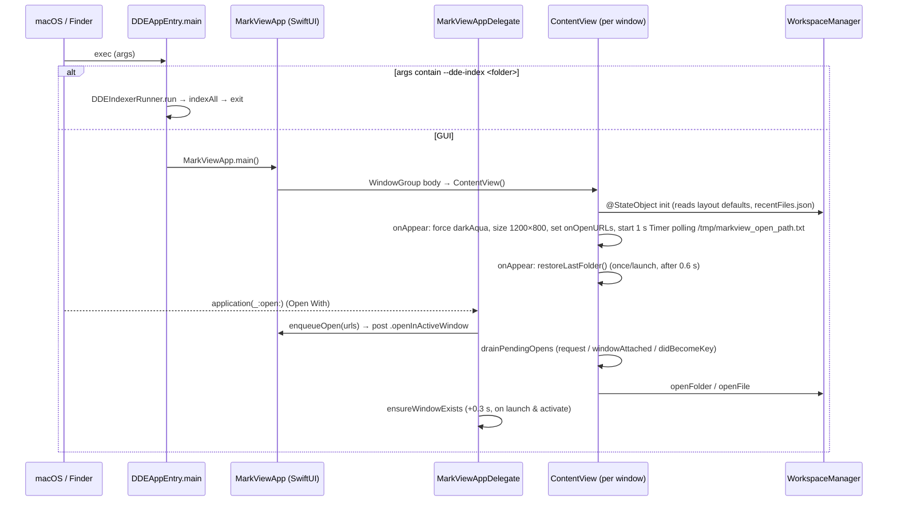

# App Shell & Workspace

Snapshot of `main` at `85b6f8d` (2.17.0). Every claim cites `path:line` relative to the repository root.

## 1. Purpose and responsibilities

This subsystem is the process entry point, the window shell, and the per-window workspace model. It covers:

- **Process entry**: normal GUI launch, or the headless `--dde-index <folder>` child process that runs the structural indexer (`MarkView/App/MarkViewApp.swift:126-167`).
- **Scene and menus**: `WindowGroup`, File/View/Settings commands, and routing of commands to the focused window's `WorkspaceManager` through `FocusedValue` (`MarkView/App/MarkViewApp.swift:169-298`, `MarkView/Views/ContentView.swift:4-23`).
- **External open requests**: Finder "Open With", `application(_:open:)`, the `/tmp/markview_open_path.txt` Quick Action handoff, drag-and-drop onto the window, and last-folder restore (`MarkView/App/MarkViewApp.swift:111-117,341-386`, `MarkView/Views/ContentView.swift:173-241,342-360`).
- **Workspace lifecycle**: open folder, single-file workspace, close folder, remove or recreate metadata; creates `.dde/` and the SQLite `SemanticDatabase`; starts the out-of-process structural index (`MarkView/Models/WorkspaceManager.swift:451-545,771-824,1394-1531,2987-3045`).
- **Tabs**: open, switch, reorder, close, save, reload from disk, and the tab kinds (file, image, X-Ray, terminal, GitHub, Insight) (`MarkView/Models/WorkspaceManager.swift:212-291`, `MarkView/Models/DocumentState.swift:137-232`).
- **File tree**: a one-folder-at-a-time browser with breadcrumbs, filtering, sort, create file/folder, drag-and-drop move/copy, git badges, and "Reveal in File Tree" (`MarkView/Views/FileTreeView.swift`).
- **Right panel shell** (`TOCView`): Contents, Search (FTS), Git, Terminal, Feature tabs (`MarkView/Views/TOCView.swift:4-33`).
- **Supporting views and models**: image viewer, status bar, theme, color palette, YAML front matter, file transfer, AI filter term search, DDE Settings window.
- **Dispatcher for bridge actions**: `WorkspaceManager` is the Swift-side target of most editor/X-Ray/code-viewer/Insight bridge messages. It forwards them to other subsystems' stores (`MarkView/Models/WorkspaceManager.swift:915-1000,1127-1275,2216-2366`).

What it does **not** own. It calls into these, but the logic lives in sibling modules:

| Concern | Owner | Doc |
|---|---|---|
| WKWebView, JS bridge, rendering, PDF export | `EditorView`, `WebViewBridge` | [editor-and-bridge](./editor-and-bridge.md) |
| CLI completions, ACP, Whisper, embeddings | `CLICompletion`, `ACPAssistant`, `WhisperClient`, `EmbeddingClient` | [ai-assistants-and-dictation](./ai-assistants-and-dictation.md) |
| Features, intake, bug reports | `FeatureStore`, `IntakeSheet`, `FeatureAssistant` | [feature-workflow](./feature-workflow.md) |
| X-Ray, PR X-Ray, Explain, code navigation | `ArchitectureStore`, `CodeExplainStore`, `CodeNavigationStore`, `ImportanceRater` | [architecture-and-xray](./architecture-and-xray.md) |
| SQLite, structural indexer, GraphRAG, Recursive Insight | `SemanticDatabase`, `StructuralIndexer`, `IncrementalCompiler`, `GraphRAG`, `InsightSession` | [semantic-index-and-insight](./semantic-index-and-insight.md) |
| Git, GitHub, terminals, lifecycle, usage | `GitClient`, `GitHubStore`, `GitHubClient`, `TerminalSession`, `AgentUsageTracker` | [git-github-terminal-lifecycle-usage](./git-github-terminal-lifecycle-usage.md) |
| Build, versioning, release | scripts, `project.yml` | [build-release-testing](./build-release-testing.md) |

## 2. Files

| Path | Role |
|---|---|
| `MarkView/App/MarkViewApp.swift` | `@main` entry (`DDEAppEntry`), headless indexer runner, `MarkViewApp` scene and menus, app delegate, external-open queue, notification names, unused `MarkdownDocument` and `MarkViewApplication` |
| `MarkView/Views/ContentView.swift` | Window root: three-pane `HSplitView`, toolbar, welcome screen, drop target, open-request draining, last-folder restore, `AssistantToolbarMenu`, `AIToolsMenu` |
| `MarkView/Models/WorkspaceManager.swift` (3766 lines) | `WorkspaceFileTreeStore`, `WorkspaceTabsStore`, `WorkspaceAITool`, `WorkspaceManager` (workspace state, tab operations, bridge-action dispatch, translation, Insight export, terminals, GitHub glue, AI prompts) |
| `MarkView/Models/FileNode.swift` | `FileNode` tree node, `FileTreeSortField` / `FileTreeSortOrder` |
| `MarkView/Models/DocumentState.swift` | `FileType` (extension to viewer/language map), `HeadingItem`, `TabKind`, `GitHubItem`, `OpenTab` |
| `MarkView/Views/FileTreeView.swift` | File browser pane (left panel "Files" mode) |
| `MarkView/Views/TabBarView.swift` | Tab strip, tab menu, drag reorder, horizontal wheel scrolling |
| `MarkView/Views/TOCView.swift` | Right panel tabs; `WorkspaceSearchView` (FTS search) |
| `MarkView/Views/DiagnosticsBarView.swift` | Status bar: active block and structural-index progress |
| `MarkView/Views/ImageViewerView.swift` | Image tab: `ImageCanvasController`, `ImageCanvasView` (pan/zoom/drop) |
| `MarkView/Views/DDESettingsView.swift` | DDE Settings window: OpenAI key, assistant/model, CLI paths, extra PATH, usage chips, Whisper test, GitHub section, metadata maintenance |
| `MarkView/Views/MatrixTheme.swift` | `VSDark` adaptive palette (alias `Matrix`), `Color(hex:)`, `VSDarkHeader`, `VSDarkTabButton`, `VSDarkRow` |
| `MarkView/Models/ThemeManager.swift` | `Theme`, `ThemeManager` (light/dark/system; posts `.themeDidChange`) |
| `MarkView/Models/FrontMatter.swift` | `YAMLValue`, `FrontMatter` (order-preserving YAML subset parser/writer with a `isLossless` flag) |
| `MarkView/Models/FileTransfer.swift` | Non-overwriting move/copy with "name 2" naming |
| `MarkView/Models/FilterSearch.swift` | AI filter: criterion to search terms (one cached CLI call) plus local scoring |
| `MarkView/Info.plist` | Document types (md, json, xml/plist/svg, yaml, canvas, folder), imported UTIs, usage strings, ATS |
| `MarkView/MarkView.entitlements` / `MarkViewDebug.entitlements` | Sandbox off; audio input; Apple Events (release); network client (debug) |

## 3. Key types

### 3.1 App layer (`MarkView/App/MarkViewApp.swift`)

| Type | Isolation | Responsibility |
|---|---|---|
| `DDEAppEntry` (`@main` enum) | none | If `--dde-index <path>` is in `CommandLine.arguments`, runs `DDEIndexerRunner.run` (never returns). Otherwise calls `MarkViewApp.main()` (`:126-135`). |
| `DDEIndexerRunner` | spawns a `Task { @MainActor }` | Opens `SemanticDatabase`, calls `ensureProject`, runs `StructuralIndexer.indexAll()`, writes `[mvindexer] …` lines to stderr, then `exit(0/1)`. `dispatchMain()` keeps the main queue running for `MainActor` hops (`:141-167`). |
| `MarkViewApp: App` | SwiftUI (main) | `@StateObject ThemeManager`, `@FocusedValue(\.workspaceManager)`, `@FocusedValue(\.workspaceHasFolder)`. Builds the `WindowGroup` and all menu commands (`:169-298`). Statics: `version`, `pendingFolderURL`, `lastFolderRestored`, `pendingOpenURLs`, `enqueueOpen(_:)` (`:178,371-386`). |
| `MarkViewAppDelegate` | main | `application(_:open:)` enqueues URLs (`:111-117`). `ensureWindowExists()` creates a window 0.3 s after launch or activation when none is visible (`:96-109`). Secure restorable state is on (`:71-73`). |
| `MarkViewApplication: NSApplication` | main | Registers a `kAEOpenDocuments` handler into `launchURLs`. **Dead code**: `Info.plist:27-28` sets `NSPrincipalClass` to `NSApplication`, and nothing reads `launchURLs`. |
| `MarkdownDocument: FileDocument` | none | Not used by any scene (`:447-464`). |
| `Notification.Name` extension | none | `exportPDFRequested`, `themeDidChange`, `openInActiveWindow`, `showFolderPicker`, `performPDFExport`, `scrollToHeading`, `scrollToText`, `revealCodeLine` (userInfo `url`/`line`/`endLine`) (`:434-444`). |

Menu commands (`:215-297`):

| Menu item | Shortcut | Action |
|---|---|---|
| Open File... | ⌘O | `NSOpenPanel` (md, plain text), then `activeWorkspace?.openFile` |
| Open Folder... | ⇧⌘O | posts `.showFolderPicker`; each `ContentView` shows `.fileImporter` |
| Close Folder | — | `closeFolder()` |
| Recreate / Remove Metadata… | — | `removeMetadata(recreate:)` |
| Save | ⌘S | `saveActiveFile()` |
| Export PDF... | ⌘E | posts `.exportPDFRequested` |
| Toggle Theme | ⇧⌘T | `themeManager.toggleTheme()` |
| Toggle File Tree / TOC | ⌘1 / ⌘2 | `showFileTree` / `showTOC` |
| Terminal | ⌘3 | `showAIConsole()` |
| X-Ray | ⌘4 | `openArchitecture()` |
| DDE Settings... | ⇧⌘, | `openDDESettings()` (one cached `NSWindow`) |

### 3.2 `ContentView` (`MarkView/Views/ContentView.swift`)

- Owns `@StateObject WorkspaceManager` (one per window) (`:27`). It publishes the manager to menus through `.focusedSceneValue` (`:152-153`).
- Layout: `LeftPanelView` (defined in `FeatureNavigatorView.swift`, switching between Files and Issues) | `TabBarView` + `EditorView` with overlays for terminal, image and GitHub tabs, then `DiagnosticsBarView`, or `welcomeView` | `TOCView` (`:35-87`).
- `EditorView` stays mounted under terminal, image and GitHub overlays (`:54-69`).
- Toolbar: panel toggles, X-Ray, intake menu (`IntakeKind`), `AssistantToolbarMenu`, `AIToolsMenu`, theme toggle (`:88-140`).
- `drainPendingOpens(trigger:)` takes the whole `MarkViewApp.pendingOpenURLs` queue only when the host window is key, or is the frontmost visible window while none is key (`:219-236`).
- `restoreLastFolder()` runs once per launch. It waits 0.6 s and skips if anything was opened meanwhile (`:201-214`).
- `AssistantToolbarMenu` (`:387-457`): `@AppStorage` for the backend, per-tool model and per-tool X-Ray model. It loads model options off the main thread with `Task.detached` and fetches ACP models on first use.
- `AIToolsMenu` (`:460-489`): diagram tools open the Graph Creator. Analysis tools go to `runAITool` or `startRecursiveInsight`.

### 3.3 Workspace model (`MarkView/Models/WorkspaceManager.swift`)

| Type | Isolation | Responsibility |
|---|---|---|
| `WorkspaceFileTreeStore` | `@MainActor ObservableObject` (`:7-210`) | `rootNode`, `excludedFolders`, `sortOrder` (persisted). Root-directory watcher: `DispatchSourceFileSystemObject` with a `.write` mask, a 1 s debounce, and a 10 s mtime poll (`:118-164`). `reloadFileTree()` rebuilds in `Task.detached` and publishes on `MainActor` (`:166-190`). |
| `WorkspaceTabsStore` | `@MainActor ObservableObject` (`:213-291`) | `openTabs`, `activeTabIndex` (−1 = none). `selectTab(matching:)`, `appendTab`, `updateTab`, `removeTab`, `moveTab(id:to:)`, `keepOnlyTab`, `keepTabs(through:)`, `normalizeActiveTabIndex`. |
| `WorkspaceAITool` | enum (`:293-313`) | Raw names for the AI Tools menu. `opensGraphCreator` is true for diagram tools. |
| `WorkspaceManager` | `@MainActor class ObservableObject` (`:316-3766`) | Per-window facade. Its `objectWillChange` re-emits both stores' changes (`:421-430`). |

Important `WorkspaceManager` state:

| Property | Meaning |
|---|---|
| `rootNode`, `openTabs`, `activeTabIndex`, `activeTab` | Proxies to the two stores (`:381-399`) |
| `showFileTree`, `showTOC` | Persisted layout flags (`:319-324`) |
| `semanticDatabase`, `incrementalCompiler`, `graphRAG` | Engines bound to the workspace (`:326-327,353`) |
| `embeddingClient`, `gitClient` | `@Published` sub-objects (`:328-329`) |
| `gitHub`, `features`, `architecture`, `codeExplain`, `codeNav` | `let` stores owned per window (`:331-350`) |
| `aiWorkspaceRoot`, `aiTerminals`, `activeAITerminalID`, `terminalTabs` | AI panel terminals and editor-tab terminals (`:335-341`) |
| `indexingProgress` | Drives the file-tree spinner **and** gates auto-refresh (`:354`, `:418-420`) |
| `structuralIndexProgress` | Footer-only progress of the child indexer (`:359`) |
| `themeVersion`, `semanticRefreshVersion` | Counters that force re-render (`:364-365`) |
| `pendingGraphCreatorType`, `graphCreatorFolder`, `intake`, `fileTreeRevealRequest` | Sheet and reveal requests (`:366,2825,3224,1635`) |
| `folderXRays` | `[scope: ArchitectureStore]` for folder X-Rays (`:1006`) |
| `releaseInsightBlobsHook` | Closure set by `EditorView.Coordinator` (`:379`, `MarkView/Views/EditorView.swift:465`) |
| `runningIndexers` (static), `structuralIndexer` (weak) | Keep the child `Process` alive until `terminationHandler` runs (`:2978-2981`) |

Public operations, grouped:

- **Workspace**: `openFolder(_:)` `:451`, `closeFolder()` `:1394`, `removeMetadata(recreate:)` `:771`, `metadataItems()` `:755`, `docId(for:)` `:695`, `workspaceRelativePath(_:)` `:829`, `cacheDirectory(for:)` `:1880`, `scanMarkdownFiles(in:)` `:565`, `hasMarkdownFiles` `:605`, `excludeFolder` / `includeFolder` / `isExcluded` `:633-665`, `refreshFileTree()` `:2814`, `fileTreeSortOrder` `:2819`, `revealInFileTree(url:)` `:1638`.
- **Open**: `openFile(_:)` `:701`, `openFile(_:line:endLine:)` `:1278`, `openFile(_:lineFragment:)` `:1286`, `openOrRefreshFile` `:672`, `openImageAsText` `:726`, `openWikiLink(note:heading:)` `:1300`, `openCanvasFileReference` `:1344`, `navigateToText` `:3051`.
- **Tabs**: `closeTab(at:)` `:1540`, `closeOtherTabs` / `closeTabsToRight` / `closeAllTabs` `:1619-1631`, `moveTab` `:1062`, `saveActiveFile()` `:1648`, `updateActiveTabContent` / `updateActiveTabHeadings` / `updateActiveTabScrollPosition` / `updateActiveHeading` / `handleCursorBlockChange` `:2763-2790,3073`, `reloadActiveTabFromDisk()` `:2797`, `handleBlocksDelta` `:2931`, `transfer(_:into:copy:)` `:1069`.
- **Dispatch from bridge**: `handleCodeAction` `:915`, `handleArchitectureAction` `:1127` (about 35 actions), `handleSelectionAction` `:1657`, `translateDocument` `:1726`, `didReceiveInsight…` / `didRequestInsight…` `:2216-2355`, `exportInsightArchive` `:2391`.
- **X-Ray**: `openArchitecture()` `:1036`, `openXRay(for:)` `:1102`, `openPRXRay(source:)` `:1085`, `xrayStore(for:)` `:1009`, `explainSymbol` `:897`, `understandInXRay` `:3241`, filter management `:849-869`.
- **AI terminal**: `openAITerminal` `:3120`, `ensureAITerminal` `:3134`, `closeAITerminal` `:3139`, `restartAITerminal` `:3148`, `aiBackendChanged` / `aiModelChanged` `:3156-3180`, `sendToAssistant(_:submit:)` `:3188`, `openTerminal(in:)` `:3453`, `runAITool(named:)` `:2836`, `runGraphEdit` `:2848`.
- **GitHub and features glue**: `openGitHubIssue` `:3209`, `openGitHubTab` `:3364`, `reviewPullRequest` `:3375`, `checkoutPullRequest` `:3382`, `fixInPullRequest` `:3404`, `startIssueWithAI` `:3417`, `fixRunWithAI` `:3440`, `startIntake(…)` `:3227-3259`, `implementWithAI` `:3264`, `fixBugWithAI` `:3277`, `intakeFinished` `:3287`, `runFeatureAction` `:3307`.

### 3.4 Document and tab model (`MarkView/Models/DocumentState.swift`)

- `FileType` maps extensions and file names to a viewer or a CodeMirror language id. Helpers: `isSupported`, `isImage` (`UTType` conforms to `.image`), `isOpenable`, `from(url:)`, `codeLanguage(for:)` (`:6-124`). An unknown extension becomes `.markdown` (`:51`).
- `TabKind`: `.file`, `.insight(InsightSession)`, `.architecture(scope:)`, `.terminal(UUID)`, `.image`, `.github(GitHubItem)`. `pullRequestScope = "#pr"` (`:141-156`).
- `OpenTab` (value type; `id` is a fresh `UUID` per instance) (`:186-232`). Fields: `url`, `content`, `originalContent`, `isModified`, `kind`, `headings`, `activeHeadingId`, `scrollPosition`, `notesView`, `blocks`, `activeBlockId`, `blockCompilationState`. `isFileBacked` is true only for `.file`. **Image tabs are therefore not file-backed**, so saving, reloading and the open-files watcher skip them.
- Placeholder URLs for tabs not backed by a file: `.markview-architecture[-<hash12>]`, `.markview-pr-xray` (`WorkspaceManager.swift:1049-1051`), `.insight-<uuid>` (`:2170`), `.markview-terminal-<uuid>` (`:3456`), `.markview-github-<repo>-run-<id>|issue-<n>` (`DocumentState.swift:176-182`). These paths are never read or written.

### 3.5 Other types

| Type | Isolation | Notes |
|---|---|---|
| `FileNode` (`FileNode.swift:17`) | none (not `@MainActor`, not `Sendable`) | `ObservableObject` with `@Published children/isExpanded`. `buildTree` loads only the root's direct children and skips dot entries and files that `FileType.isOpenable` rejects (`:44-97`). Also has `expandedDirectoryPaths` / `restoreExpansionState`. |
| `ThemeManager` (`ThemeManager.swift:22`) | `@MainActor ObservableObject` | `@AppStorage("theme")`, `effectiveTheme`, KVO on `NSApp.effectiveAppearance`. `applyTheme()` sets `NSApp.appearance` and posts `.themeDidChange`. |
| `VSDark` (`MatrixTheme.swift:4`) | none | Every call reads `NSApp.effectiveAppearance`. Views re-render through `themeVersion`. |
| `FrontMatter`, `YAMLValue` (`FrontMatter.swift`) | `Sendable` structs | `split(_:)` returns `(FrontMatter, body)`. `join(body:)`. `isLossless` is false when comments or unmodeled lines were dropped, and callers must then refuse to write back (`:52-54,94`). |
| `FileTransfer` (`FileTransfer.swift`) | none | `perform(_:into:copy:)` returns `Result{moved, errors}`. It refuses to move or copy a folder into itself and never overwrites (`:13-47`). |
| `FilterSearch` (`FilterSearch.swift`) | none | `terms(for:cache:)` runs one `CLICompletion` with a JSON schema, cached at `terms-<sha24>.json`. `scoreFiles` reads up to 256 KB per file with `DispatchQueue.concurrentPerform`. `levels` splits hits into strong (top 10%), moderate (next 25%) and weak. |
| `ImageCanvasController` (`ImageViewerView.swift:88`) | `@MainActor ObservableObject` | Reads the image off main with `Task.detached`. Zoom state. |
| `ImageCanvasView` (`ImageViewerView.swift:145`) | AppKit `NSView` | Wheel zooms, ⇧+wheel pans, drag pans, double-click toggles fit/1:1, keys `+ - 0 1`, accepts dropped openable files. |
| `WheelScrollsHorizontally` (`TabBarView.swift:182`) | AppKit local event monitor | Turns vertical wheel events into horizontal tab-strip scrolling. The monitor is removed in `dismantleNSView`. |
| `DDESettingsView` (`DDESettingsView.swift:6`) | SwiftUI | Hosted in an `NSHostingView` inside the `NSWindow` created by `MarkViewApp.openDDESettings` (`MarkViewApp.swift:300-324`). |

## 4. Internal interfaces

### Inbound: who calls this subsystem

| Caller | Calls |
|---|---|
| `EditorView.Coordinator` / JS bridge (`MarkView/Views/EditorView.swift:265-962`) | `updateActiveTabContent`, `updateActiveTabHeadings`, `updateActiveHeading`, `updateActiveTabScrollPosition`, `setNotesView`, `handleCodeAction`, `handleArchitectureAction`, `openFile`, `openWikiLink`, `handleBlocksDelta`, `handleCursorBlockChange`, `translateDocument`, `runFeatureAction`, `openCanvasFileReference`, `codeNotesJSON`, all `didRequestInsight*`, and sets `releaseInsightBlobsHook` |
| `LeftPanelView`, `FeaturePanelView`, `ModuleExplorerView`, `GitView`, `GitHubViews`, `TerminalView`, `GraphCreatorSheet`, `IntakeSheet` | `WorkspaceManager` as an `@EnvironmentObject` or passed in (list from grep of `workspaceManager.` under `MarkView/Views`) |
| `TerminalSession.openFile` closure | `openFile(_:line:)` (`WorkspaceManager.swift:3125,3455`) |
| `GitClient.onBranch`, `GitHubStore.onRepoChange` / `onPoll` | wired in `setUpGitHub` (`:3337-3339`) |
| Menus (`MarkViewApp`) | through `FocusedValue` (`MarkViewApp.swift:172-173`) |

### Outbound: what this subsystem calls

| Callee (subsystem) | Where |
|---|---|
| `SemanticDatabase` (`init`, `ensureProject`, `documentId`, `clearSymbols`, `indexDocumentFTS`, `upsertModule`, `upsertDocument`, `insertSymbol`, `upsertBlock`, `deleteBlock`, `search`) — semantic-index | `WorkspaceManager.swift:510-513,643-647,1468-1526,2955-2962`; `TOCView.swift:163` |
| `IncrementalCompiler`, `GraphRAG` — semantic-index | `:520-521,1472-1473,2966` |
| `StructuralIndexer` (child process) — semantic-index | `MarkViewApp.swift:155-157` |
| `InsightSession`, `InsightCache`, `InsightArchiveExporter` (`/usr/bin/zip`) — semantic-index/insight | `:2148-2183,2391-2491` |
| `ArchitectureStore`, `ArchitectureScanner`, `CodeExplainStore`, `CodeNavigationStore`, `ImportanceRater`, `XRaySearch`, `ContentHash` — architecture-and-xray | `:486,839-1275` |
| `CLICompletion`, `AIAssistantPreferences`, `CLIToolLocator`, `ACPAssistant`, `EmbeddingClient`, `WhisperClient` — ai-assistants | `:1672-1674,1734-1736,1863-1868`; `ContentView.swift:444-447`; `DDESettingsView.swift:41-42,196,293,330` |
| `GitClient`, `GitHubStore`, `GitHubClient.execute` (spawns `git`), `TerminalSession`, `AgentUsageTracker` — git-github-terminal | `:528-529,3209-3470`; `FileTreeView.swift:93-110,532`; `DDESettingsView.swift:394` |
| `FeatureStore`, `FeatureAssistant`, `IntakeRequest` — feature-workflow | `:3226-3324` |
| `AIPrompts.codebaseAuditPrompt` | `:3524` |

Coupling through `NotificationCenter` (every window observes, not only the active one):

| Name | Poster | Observer |
|---|---|---|
| `.showFolderPicker` | ⇧⌘O menu | **every** `ContentView` (`ContentView.swift:159-161`) |
| `.exportPDFRequested` → `.performPDFExport` | ⌘E menu → **every** `ContentView.exportPDF` | editor (bridge) |
| `.openInActiveWindow` | `enqueueOpen` | every `ContentView`; the active window's filter picks one |
| `.themeDidChange` | `ThemeManager` | every `ContentView` bumps `themeVersion` |
| `.scrollToHeading`, `.scrollToText`, `.revealCodeLine` | `TOCView`, `WorkspaceManager` | editor |
| `UserDefaults.didChangeNotification` | any defaults write | `setUpGitHub` observer (`:3341-3347`) |

## 5. Runtime flows

### 5.1 Launch



References: `MarkViewApp.swift:126-135,185-213,87-117`; `ContentView.swift:178-196,201-241`.

### 5.2 Open folder

1. `openFolder(url)` writes `workspace.lastFolder`. It resets the tree, tabs, X-Ray stores, `folderXRays` and `codeNav`, then sets `indexingProgress` (`WorkspaceManager.swift:451-458`). **Open tabs are discarded without a save prompt** (`tabsStore.reset()` `:454`).
2. In a `Task` on the main actor: sleep 100 ms, then `FileNode.buildTree` in `Task.detached`, then `setRootNode`, `loadExcludedFolders` (`:462-473`).
3. Sleep 100 ms, then `startWatchingCurrentRoot()` and `addRecentFile(url)` (`:475-479`).
4. `initDDEWorkspaceAsync` (`:492-545`):
   - creates `.dde/cache/provider_responses`, `.dde/cache/embeddings`, `.dde/cache/indexes`, `.dde/overlays`;
   - opens `SemanticDatabase` (`.dde/state.db`) and calls `ensureProject(id: folderName)`;
   - creates `IncrementalCompiler` and `GraphRAG`, sets `aiWorkspaceRoot`;
   - calls `gitClient.setup`, `setUpGitHub` (only if `settings.github.enabled`), `setUpFeatures`;
   - clears `indexingProgress`, then `runStructuralIndex`.
   Each step sleeps 100 ms first so the progress text can render.
5. `runStructuralIndex` (`:2987-3045`) spawns `Bundle.main.executablePath --dde-index <path>`. stderr is streamed. Only `[mvindexer] N/M` lines become `structuralIndexProgress`. On exit: remove the process from `runningIndexers`, clear the footer, `loadCachedResults()` (which only bumps `semanticRefreshVersion`), `refreshSemanticViews()`.
6. `ArchitectureScanner.looksLikeCodeProject` runs detached and sets `isCodeProject` if the root is unchanged (`:486-487`).

```mermaid
flowchart TD
    A[openFolder] --> B[reset stores, save lastFolder]
    B --> C[Task.detached buildTree]
    C --> D[setRootNode + excluded folders]
    D --> E[start root watcher, recentFiles]
    E --> F[initDDEWorkspaceAsync: .dde dirs, SemanticDatabase, engines]
    F --> G[git / GitHub (opt-in) / features]
    G --> H[spawn child: MarkView --dde-index]
    H -->|stderr N/M| I[footer progress]
    H -->|exit| J[refreshSemanticViews]
```

### 5.2a Linked folders (Task 59)

- `LinkedFolders` (`Models/LinkedFolders.swift`) keeps, per project, the folders attached as aliases: local
  settings under `project.linkedFolders[<project key>]` (JSON `[LinkedFolder]`: canonical path, unique name,
  date), never a file in the project. A folder can be linked when it exists, is not the project, not inside
  it, does not contain it, and is not nested with another linked folder either way.
- `WorkspaceManager.linkedFolders` is loaded with the folder and cleared on close; `linkFolders` /
  `unlinkFolder` save the list and re-run the structural index; `chooseFoldersToLink()` is "Link Folder…"
  (File menu, the tree's empty-space menu). `isFileInCurrentWorkspace` counts a file in a linked folder as
  the project's (it does not become a single-file workspace); `containerRoot(for:)` gives the root a path
  belongs to.
- Document ids of files in a linked folder are `@linked/<name>/<path>` (`LinkedFolders.documentId`,
  `WorkspaceManager.docId`, `fileURL(forDocumentId:)`); the `--dde-index` child reads the same settings and
  walks the linked folders after the project; Search Project (`ProjectSearchRoot`) shows and resolves the same
  prefix. Claude completions and the AI terminal get `--add-dir` for each linked folder.
- The file tree lists linked folders after the project's own folders at the root (link mark, location),
  browses into them (breadcrumbs start at the project root; ".." at a linked root returns to the project),
  and offers Unlink Folder; git, X-Ray, exclusions and research stay project-only.

### 5.3 Open file

`openFile(url)` (`:701-723`):

1. If the file is `.md` and outside the current workspace (`isFileInCurrentWorkspace`: requires a DB and the path under root, or a PR-cache copy) → `initSingleFileWorkspace` (`:1458-1490`). That releases the engines and stops all terminals. It opens `.dde/file_<name>.db` in the file's folder, builds the tree for the parent folder synchronously if no root is set, and runs `indexSingleFile` (headings regex, FTS, FNV-1a hash) on the main actor.
2. If a tab with an equal URL exists → select it.
3. Image → append a tab of `.image` kind with empty content.
4. Otherwise `openTextFile` reads UTF-8 synchronously, extracts headings for `.md`, appends the tab and adds a recent file. A read failure is only `NSLog`ged (`:746-748`).

`openFile(_:line:endLine:)` then posts `.revealCodeLine` (`:1278-1283`). `openWikiLink` searches detached, skipping `.git`, `.dde` and `node_modules`. It prefers the current folder, then the shortest path, beeps when nothing is found, and scrolls to the heading after 0.6 s (`:1300-1338`).

### 5.4 Tab switch, reorder, close

- Switch: `activeTabIndex = index` from `TabBarView` (`TabBarView.swift:48,119`). The active tab is scrolled into view (`:28-31`).
- Reorder: drag payload `"markview-tab:<uuid>"` as plain text → `moveTab(id:to:)` keeps the active tab (`TabBarView.swift:120-127,158-167`; `WorkspaceManager.swift:259-266`).
- Close (`closeTab(at:)` `:1540-1616`):
  - terminal → `closeTerminal` then remove;
  - insight → ordered async close: release blobs hook, `await session.cancel()`, keep the `.markview-insight` cache, re-resolve the index by session id, remove;
  - modified file → Save / Don't Save / Cancel alert;
  - otherwise remove.
- `closeOtherTabs`, `closeTabsToRight`, `closeAllTabs` only mutate the store (`:1619-1631`). See risks.

### 5.5 Edit and save

- The editor pushes content → `updateActiveTabContent` sets `isModified = content != originalContent` for file-backed tabs only (`:2763-2769`).
- ⌘S → `saveActiveFile` → `saveFile(at:)`: `String.write(atomically:)`, then reset `isModified` and `originalContent`. Errors are only `NSLog`ged (`:2742-2756`).
- Block deltas: `handleBlocksDelta` merges into `tab.blocks`, upserts or deletes in SQLite, then `incrementalCompiler.compileDelta` (`:2931-2967`).

### 5.6 File watching

| Watcher | Scope | Mechanism | Effect |
|---|---|---|---|
| Root dir source (`WorkspaceManager.swift:118-151`) | writes to the **root directory entry only** (`O_EVTONLY`, `.write`) | `DispatchSource` on the main queue, 1 s debounce | `reloadFileTree()` if `indexingProgress == nil` |
| Root mtime poll (`:148-164`) | the root's `contentModificationDate` | `Timer` every 10 s | same |
| Open-files poll (`:3483-3506`) | all file-backed, unmodified tabs | `Timer` every 2 s, started on the first terminal | reload content changed on disk, then `refreshFileTree()` |
| Finder handoff (`MarkViewApp.swift:208-212,341-355`) | `/tmp/markview_open_path.txt` | `Timer` every 1 s **per window `onAppear`** | `enqueueOpen` |

`FileTreeView` does not render `FileNode.children`. `directoryContents` calls `contentsOfDirectory` on every body evaluation (`FileTreeView.swift:23-59`). Replacing `rootNode` just triggers a redraw. As a result, subfolder changes appear whenever any published property changes, not through the watcher.

### 5.7 Close folder / remove metadata

- `closeFolder()` (`:1394-1455`): Save / Don't Save / Cancel for modified tabs. It aborts if any save failed. Then it removes `workspace.lastFolder`, cancels insight sessions, stops terminals and the indexer, resets every store, and releases the engines.
- `removeMetadata(recreate:)` (`:771-824`): shows a confirmation alert listing `.dde`, `.markview-insight` and a generated `.claude/CLAUDE.md` (only one that starts with `# Project Context — Auto-generated by MarkView DDE`). It stops writers, closes tabs that are not file-backed, deletes the items, and removes `.claude/` if it is empty. With `recreate` it runs `initDDEWorkspaceAsync` again.

### 5.8 Document translation

`translateDocument` (`:1726-1831`) fixes one assistant for the whole document and fails early if its CLI is missing.

1. Creates an unsaved tab `<name>_<lang>.md` next to the source.
2. Splits the document with `tokenizeMarkdown` / `splitForTranslation`. Front matter and fences are never sent. Chunks are at most 4000 chars and never split a table, list or quote.
3. Translates each chunk through `CLICompletion` (timeout 240 s). `skeleton(of:)` compares heading levels, table rows, list items, fences and quote lines. On a mismatch it retries once in strict mode, then falls back to the source text.
4. Writes progress into the tab (a banner) and prepends an "incomplete" warning if any chunk fell back.

## 6. State and persistence

### UserDefaults keys written or read here

| Key | Type | Owner / where |
|---|---|---|
| `workspace.lastFolder` | String (standardized path) | `WorkspaceManager.lastFolderKey` `:449`; set `:452`, removed `:1424`, read `ContentView.swift:204` |
| `layout.showFileTree`, `layout.showTOC` | Bool | `WorkspaceManager.swift:319-324,410-415` |
| `fileTree.sortField` (`"Name"`/`"Date Modified"`), `fileTree.sortAscending` | String, Bool | `WorkspaceManager.swift:13-14,28-34` |
| `excludedFolders.<rootFolderName>` | [String] relative paths | `WorkspaceManager.swift:50,104` |
| `project.linkedFolders` | [project key: Data (JSON `[LinkedFolder]`)] | `LinkedFolders.load/save` (`Models/LinkedFolders.swift`) |
| `layout.navigatorTab` | `TOCView.Tab` raw (`Contents`…`Feature`) | `PanelLayout.navigatorTab`; set by `TOCView`, `showAIConsole`, `intakeFinished`, `runFeatureAction` |
| `layout.leftPanel` (`files`/`issues`), `layout.issuesFeature` | String | `PanelLayout.leftPanel` / `.issuesFeature`; `FeatureNavigatorView.swift`, `intakeFinished` |
| `feature.stage` (`FeatureStage.storageKey`) | String | `PanelLayout.featureStage`; `FeaturePanelView`, `intakeFinished` |

These four are per-window state: `WorkspaceManager.layout` (`Models/PanelLayout.swift`) reads them once when the
window opens and writes each change back only to seed the next window and relaunch. Views observe the window's
`PanelLayout`, never the keys. `@AppStorage` would switch every window at once (BUG-004).
| `theme` | `light`/`dark`/`system` | `ThemeManager.swift:23` |
| `settings.ai.backend` | `CLITool` raw | `AIAssistants.swift:88`; `ContentView.swift:388` |
| `settings.cli.<tool>Model`, `settings.xray.<tool>Model` | String | `AIAssistants.swift:90,107`; `ContentView.swift:389-396` |
| `settings.cli.<tool>Path` | String override | `AIAssistants.swift:37`; via `CLIToolLocator.setOverride` `DDESettingsView.swift:229,286` |
| `settings.cli.extraPATH` | colon list | `DDESettingsView.swift:94,303`; read `AIAssistants.swift:219` |
| `com.markview.dde.openai.apikey` | **plaintext String** | `EmbeddingClient.swift:125-127`; written `DDESettingsView.swift:41` |
| `settings.whisper.model` | String | `WhisperClient.swift:27`; `DDESettingsView.swift:21` |
| `actions.outputLanguage` | String | `OutputLanguage.swift:7`; `DDESettingsView.swift:9` |
| `settings.usage.<agent>.hidden` | Bool | `AgentUsage.swift:38`; `DDESettingsView.swift:393` |
| `settings.github.enabled` (plus the interval, notify and autoReview keys in `GitHubSettingsSection`) | Bool/Int | `GitHubStore.swift:8-18`; observed `WorkspaceManager.swift:3331-3361` |

### Files on disk

| Path | Format | Written by |
|---|---|---|
| `~/Library/Application Support/MarkView/recentFiles.json` | JSON `[String]` paths, max 20, most recent first | `WorkspaceManager.swift:403-406,2886-2900` (no UI reads `recentFiles`) |
| `<folder>/.dde/state.db` | SQLite (see semantic-index doc); falls back to `~/Library/Application Support/MarkView/<folderName>/` if `.dde` cannot be created | `SemanticDatabase.swift:12-31` |
| `<parent>/.dde/file_<name>.db` | SQLite for a single-file workspace | `WorkspaceManager.swift:1461,1468` |
| `<folder>/.dde/cache/{provider_responses,embeddings,indexes}/`, `.dde/overlays/` | directories (created empty here) | `:500-503` |
| `<folder>/.dde/cache/explain/` | Explain notes (owned by `CodeExplainStore`) | path chosen `:837-843` |
| `<folder>/.dde/xray-folders/<sha24(scope)>.json`, `.dde/cache/xray/` | folder X-Ray persistence | path chosen `:1015-1018` |
| `<cache>/terms-<sha24>.json` | JSON `[String]` filter terms | `FilterSearch.swift:20-23,52-55` |
| `<folder>/.markview-insight/` | Insight cache (kept after tab close) | referenced `:758,1579-1584` |
| `$TMPDIR/insight-export-<uuid>/` | staging copy for the ZIP export, removed in `defer` | `:2528-2545,2468` |
| `~/markview_debug.log` | appended plain-text log, never rotated | `MarkViewApp.swift:16-26,75-85,329-339`; `WorkspaceManager.swift:192-202,436-446,3020-3023` |
| `/tmp/markview_open_path.txt` | one path; read and deleted | `MarkViewApp.swift:341-355` |
| `<repo>/.gitignore` | appended anchored entries | `FileTreeView.swift:529-550` |
| user files | UTF-8 text, atomic write | `saveFile` `:2748`; new file `# <name>` template `FileTreeView.swift:570-572` |

Caches in memory: `OpenTab.content`, `headings` and `blocks` per tab; `openFileDates` (`:344`); `folderXRays`; `terminalTabs`; `AssistantToolbarMenu.options`.

## 7. Concurrency and threading

- `WorkspaceManager`, both stores, `ThemeManager` and `ImageCanvasController` are `@MainActor`. `FileNode` is not isolated. It is built and mutated (`restoreExpansionState`) inside `Task.detached`, then published to the main actor (`WorkspaceManager.swift:179-189`). That works only because the new tree is not shared until it is published. `FileNode` is not `Sendable`.
- Work moved **off main**: `buildTree` (`:468,180`), `looksLikeCodeProject` (`:486`), the wikilink search (`:1306`), the `navOpen` suffix search (`:971`), image file read (`ImageViewerView.swift:99`), model option load (`ContentView.swift:444`), the structural index (a separate **process**).
- **Synchronous work on main** (possible beachball on large trees or slow disks):
  - `hasMarkdownFiles` is a full recursive enumeration when the folder has no `.md`. It is evaluated during `AIToolsMenu` rendering (`WorkspaceManager.swift:605-628`, `ContentView.swift:481`).
  - `scanMarkdownFiles` in `startRecursiveInsight` (`:2131`).
  - The `excludeFolder` enumeration plus per-file SQLite calls (`:639-649`).
  - The `resolveWorkspaceFileURL` fallback enumeration (`:3754-3762`) and `WorkspaceSearchView.findFile` (`TOCView.swift:184-185`).
  - `FileTreeView.directoryContents` runs `contentsOfDirectory` plus a `resourceValues` call per item on every body evaluation (`FileTreeView.swift:23-59`).
  - `openTextFile` and `reloadChangedOpenFiles` read files (`:736,3497`). `initSingleFileWorkspace` opens SQLite, builds the tree and indexes (`:1458-1531`). `initDDEWorkspaceAsync` opens SQLite (`:510`). `db.search` runs on commit (`TOCView.swift:163`).
  - `FileTransfer.perform` copies and moves, including large folders (`:1070`).
- Modal UI on main: `NSAlert.runModal` / `NSOpenPanel.runModal` for the welcome screen, file tree, closeTab, closeFolder, removeMetadata and Insight export.
- Timers: the 1 s Finder poll (a new one per window appear, never invalidated), the 10 s root poll, the 2 s open-files poll. The last one uses `MainActor.assumeIsolated` (`:3486`).
- Child process: `runStructuralIndex` drains stderr through `readabilityHandler`, which runs on a background queue and hops to `MainActor`. stdout goes to `/dev/null`. It is **not** `waitUntilExit`. Retention goes through the static `runningIndexers` (`:2978,3038`). `terminationHandler` writes to the debug log directly because `debugLog` is main-isolated (`:3016-3033`).
- `DDEIndexerRunner` runs the whole indexing job on the child's main actor and services it with `dispatchMain()` (`MarkViewApp.swift:146-166`).
- Races:
  - `openFolder` starts an unstructured `Task` that is never cancelled. Two quick `openFolder` calls let the slower task overwrite `rootNode` and engines from the other folder. Only `isCodeProject` is guarded (`:462-488`).
  - `translateDocument` re-resolves the tab by id on each write (`:1773-1779`).
  - `closeTab` for insight re-resolves the index after the await (`:1589-1594`).
  - `handleBlocksDelta` captures `activeTabIndex` synchronously.
- `FilterSearch.scoreFiles` blocks the caller while `concurrentPerform` runs. Callers (X-Ray) must call it off main.

## 8. Error handling and edge cases

- File read and save failures are only `NSLog`ged (`:746-748,2753-2755`). `closeFolder` detects failed saves after the fact (`:1407-1415`). `closeTab` does not (see risks).
- DB open failure in `initDDEWorkspaceAsync` logs and clears progress. The folder stays browsable without engines (`:541-544`). AI features that need `graphRAG` show "Workspace not ready" (`:2122-2128`).
- Paths from untrusted sources:
  - `openCanvasFileReference` rejects absolute paths and paths containing `..` (`:1346`);
  - `openWikiLink` rejects `..` (`:1301`);
  - X-Ray `openFile` requires the standardized path under root (`:1136-1138`);
  - `navOpen` requires a root prefix before the direct open (`:962-964`);
  - `openURL` allows only `https://github.com` (`:1239-1241`);
  - `prAction` checks `op` and `method` against allowlists (`:1212-1213`);
  - Insight bridge ids are checked (UUID parse, manifest membership, topic bounds) and sanitized for logs (`:2203-2285`);
  - `scanMarkdownFiles` checks symlink containment with a separator-aware prefix (`:565-600`).
- File tree: new file and folder names reject `/`, `:`, `.`, `..` and existing names (`FileTreeView.swift:564-568,625-627`). A drop copies when any source is outside the root or ⌥ is held (`:600-616`). `FileTransfer` refuses self-nesting and never overwrites.
- Remove Metadata lists exactly what it will delete and deletes the generated `.claude/CLAUDE.md` only when the header matches (`:760-764`).
- `FrontMatter.isLossless` prevents writing back front matter the parser could not model (`FrontMatter.swift:52-54,94`).
- Insight export forces a `.zip` extension, sanitizes the default name to ASCII, and removes staging in `defer` (`:2401-2423,2468,2719-2737`).

## 9. Extension points and how to change them safely

- **Add a tab kind**:
  1. Add a `TabKind` case and give it a placeholder marker URL (`DocumentState.swift:141-156`). `isFileBacked` stays false automatically.
  2. Add a `displayName` branch (`DocumentState.swift:206-214`) and a `TabBarView.icon(for:)` case (`TabBarView.swift:67-78`). The switch is exhaustive, so the compiler flags it.
  3. Add an overlay in `ContentView` (`ContentView.swift:58-68`), and inject `.environmentObject(workspaceManager)` if the view needs it.
  4. Add close handling in `closeTab` if the kind owns resources (`WorkspaceManager.swift:1559-1597`).
  5. Include it in the `removeMetadata` cleanup (`:794-798`) and `closeFolder` (`:1427-1434`).
- **Add a menu command**: add a `Button` in `MarkViewApp.commands` that uses `activeWorkspace?`. If it depends on the folder state, disable it with `activeWorkspaceHasFolder`, because the reference key does not change (`ContentView.swift:8-13`).
- **Add a bridge action handled by the workspace**: add a `case` in `handleArchitectureAction` or `handleCodeAction` and validate every payload field there. Then update the JS sender and `EditorView`'s message routing together (CLAUDE.md rule). Keep paths inside root with the `hasPrefix(root + "/")` pattern.
- **Add a persisted layout or setting key**: per-window state (which tab or section a panel shows) goes into `PanelLayout` or follows the `didSet` + `init` restore pattern (`WorkspaceManager.swift:319-324,409-415`). Use `@AppStorage` only for app-wide preferences that every window should share (BUG-004). Add the key to the table in section 6. A rename of an existing key is a **major** bump (CLAUDE.md "Versioning").
- **Add something under `.dde/`**: create it lazily in the owning store. If it is user-visible metadata, make sure `metadataItems()` still covers it; anything under `.dde` is covered. A layout change is a major bump.
- **Add an AI Tools entry**: add a `WorkspaceAITool` case and prompt text in `aiPrompt(for:)` (`:3519-3726`), plus a button in `AIToolsMenu` (`ContentView.swift:460-489`).
- **Add a file type**: update `FileType.supportedExtensions` / `codeExtensions` (`DocumentState.swift:18-23,77-123`), `Info.plist` `CFBundleDocumentTypes`, and, if needed, `FileTreeView.fileIcon`. `FileNode.loadChildren` and `FileTreeView` both filter with `FileType.isOpenable`.

## 10. Risks, tech debt and oddities

| # | Observation | Evidence |
|---|---|---|
| 1 | **Probable crash**: `ImageViewerView` declares `@EnvironmentObject WorkspaceManager`, but `ContentView` does not inject it for that view. No ancestor provides it (only `themeManager` is injected at the scene). Dropping files on an image or pressing "Source" on an SVG reads the missing object. | `ImageViewerView.swift:10,20,53`; `ContentView.swift:62-63` vs `:56,66`; `MarkViewApp.swift:187` |
| 2 | **Data loss on close**: `closeTab` → "Save" calls `saveFile`, which swallows write errors, then removes the tab anyway. | `WorkspaceManager.swift:1608-1615,2753-2755` |
| 3 | `closeOtherTabs`, `closeTabsToRight` and `closeAllTabs` skip unsaved-change prompts, never terminate terminal sessions (`terminalTabs` leak running shells), and never cancel Insight sessions. | `:1619-1631` vs `:1561-1597` |
| 4 | `openFolder` resets tabs with no save prompt, which discards unsaved edits when another folder is opened in the same window. The same applies to `openFile` of an outside `.md`, which releases engines and stops **all terminals** (`initSingleFileWorkspace` → `releaseWorkspaceEngines`). | `:454`; `:704-706,1465,1382-1388` |
| 5 | `openFolder`'s task is never cancelled, so a fast re-open can mix state from two folders. | `:462-488` |
| 6 | `MarkViewApplication` Apple-Event capture is dead: `NSPrincipalClass` is `NSApplication`, and `launchURLs` is never read. The comment says otherwise. | `MarkViewApp.swift:9-14`; `Info.plist:27-28` |
| 7 | Dead code: `MarkViewApp.openFolder()` / `newWindow()` are never called. Because of that, `pendingFolderURL` is never set, and the `ContentView.onAppear` consumer is dead too. `MarkdownDocument` is unused. `recentFiles` is persisted but has no UI. | `MarkViewApp.swift:370-426,447-464`; `ContentView.swift:190-194`; `WorkspaceManager.swift:318` |
| 8 | Every window's `onAppear` schedules a new, never-invalidated 1 s `Timer` that polls a **world-writable** `/tmp` path. Any local process can make the app open an arbitrary path. | `MarkViewApp.swift:208-212,342` |
| 9 | ⇧⌘O (`.showFolderPicker`) and ⌘E (`.exportPDFRequested`) are observed by **every** window, so several windows show a picker or export at once. `FileTreeView.chooseFolder` avoids this for its own button. | `ContentView.swift:144-146,159-161`; `FileTreeView.swift:348-359` |
| 10 | `onAppear` forces `NSApp.appearance = .darkAqua` for all windows on each window appear, which overrides the persisted `theme`. `ThemeManager.theme` is `@AppStorage` inside an `ObservableObject`, which does not publish. | `MarkViewApp.swift:192-199`; `ThemeManager.swift:23` |
| 11 | `DDESettings` window is created once with the focused workspace (or a throwaway `new WorkspaceManager()`) and then reused. Its Maintenance section and embedding client stay bound to that first window's manager. | `MarkViewApp.swift:300-324` |
| 12 | OpenAI API key is stored as plaintext in UserDefaults, not the Keychain. Presence and length are logged, not the value. | `EmbeddingClient.swift:125-127`; `DDESettingsView.swift:198` |
| 13 | "Open in Terminal.app" builds AppleScript `do script "cd <path>"` escaping only `"`. The shell sees an unquoted path, so spaces break it, and `;`, `$()` or backticks in folder names run as commands. | `FileTreeView.swift:520-526` |
| 14 | Exclusion list keyed by folder **name** (`excludedFolders.<lastPathComponent>`), so two projects named `docs` share it. `isExcluded` uses `hasPrefix` without a separator, so `docs` also excludes `docs2`. `includeFolder` path is derived by string replace. | `WorkspaceManager.swift:50,77,104`; `FileTreeView.swift:416` |
| 15 | `indexSingleFile` uses `lastPathComponent` as docId, contradicting "must be used by EVERY docId producer" in `docId(for:)`. | `:1500` vs `:691-698` |
| 16 | Root watcher covers only the root directory entry. `FileNode` children are built but never rendered, because `FileTreeView` re-lists disk on every render. The tree model is effectively a root holder plus a redraw trigger. | `WorkspaceManager.swift:118-151`; `FileTreeView.swift:23-59`; `FileNode.swift:44-129` |
| 17 | Main-thread file system and SQLite work (full list in section 7), notably `hasMarkdownFiles` during menu rendering. | `WorkspaceManager.swift:605-628`; `ContentView.swift:481` |
| 18 | `~/markview_debug.log` is appended forever from several copies of the same logger. The file paths it records count as sensitive under CLAUDE.md. The comment at `:435` says `/tmp`. | `MarkViewApp.swift:16-26,75-85,329-339`; `WorkspaceManager.swift:192-202,435-446` |
| 19 | Claude AI terminals start with `claude update && claude … --dangerously-skip-permissions`. | `WorkspaceManager.swift:3100` |
| 20 | Unknown extensions map to `.markdown`. `FileType.from` falls back silently, although `isOpenable` gates the tree. | `DocumentState.swift:51` |
| 21 | `WorkspaceManager` is a 3.7k-line god object: tab state plus about 35 X-Ray bridge actions, translation, Insight HTML rewriting, GitHub flows, and long inline prompts (`aiPrompt`, `runGraphEdit`). | `WorkspaceManager.swift:1127-1275,1726-2092,2391-2737,3519-3726` |
| 22 | Selection-action titles are hard-coded Russian (`"Перевод на русский"`) inside Swift. CLAUDE.md requires English in files. | `WorkspaceManager.swift:1661` |
| 23 | `DiagnosticsBarView` has two trailing `Spacer()`s and no right-side content. | `DiagnosticsBarView.swift:38-40` |
| 24 | ATS allows arbitrary loads app-wide, not only in web content. | `Info.plist` `NSAppTransportSecurity` |
| 25 | Comment drift: the `startRecursiveInsight` comments mention `.insight-cache/<uuid>` and `cache.cleanup()` on close. `closeTab` explicitly does not clean up, and `metadataItems` points at `.markview-insight`. | `:2142-2147` vs `:1579-1584,758` |
