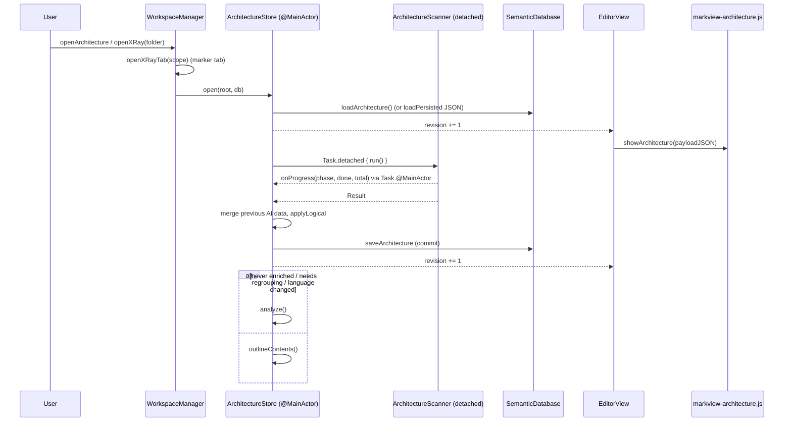
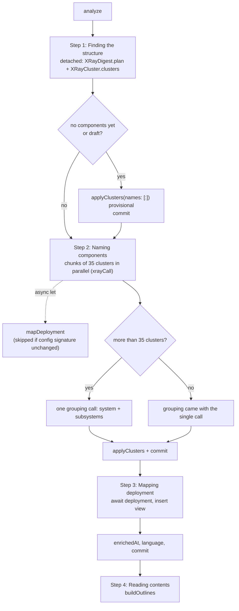

# Architecture map and X-Ray

The X-Ray tab (called "Architecture" in older code and "explanations" when people mean its
details panel) draws a project as a map you can zoom into. There are five views. Logical
shows AI-named components and subsystems. Structure (view id `modules`) shows folders, files
and their imports. Deployment is AI-mapped from build and deploy config files. Docs shows
markdown files, their sections and the links between them. The PR X-Ray shows one change
inside that structure. On top of the views sit overlays: metrics, documentation coverage,
the AI Importance rating, user AI filters, the ⚡ search and a pull-request review.

Screenshots: `docs/images/xray-overview.png` (Logical view with the details panel),
`docs/images/xray-component.png` and `docs/images/xray-contents.png`.

Related docs: [app-shell-and-workspace](app-shell-and-workspace.md),
[editor-and-bridge](editor-and-bridge.md),
[ai-assistants-and-dictation](ai-assistants-and-dictation.md),
[feature-workflow](feature-workflow.md),
[semantic-index-and-insight](semantic-index-and-insight.md),
[git-github-terminal-lifecycle-usage](git-github-terminal-lifecycle-usage.md),
[build-release-testing](build-release-testing.md).

---

## 1. Purpose and responsibilities

The subsystem owns:

- **Scanning without AI** (`ArchitectureScanner`). It lists the project's files, resolves
  imports and type references into file-level edges, reads declared external packages from
  manifests, builds the Docs view (links, H1/H2 sections), computes per-file metrics
  (LOC, McCabe complexity per function, commits and bug-fix commits from git, tests, lcov or
  Cobertura line coverage) and documentation coverage, and lists deployment config files.
  See `MarkView/Models/ArchitectureScanner.swift:44-112`.
- **Local groundwork for the AI** (`XRayDigest`). It picks "unit" folders, collects facts
  about each (manifest, README line, declarations, file names, dependencies, language of its
  prose) and writes a project overview. See `MarkView/Models/XRayDigest.swift:90-171`.
- **Clustering without AI** (`XRayCluster`). It runs a deterministic Louvain pass over
  imports, note links, git co-change and a weak folder-tree tie
  (`MarkView/Models/XRayCluster.swift:46-102`).
- **AI enrichment and state** (`ArchitectureStore`, `@MainActor`). This covers naming the
  clusters and grouping them into subsystems, the Deployment view, file contents outlines,
  on-demand descriptions, importance ratings, topic filters, the ⚡ search, explanations of
  edges, the pull-request overlay (diff, AI review, architectural analysis, chat, GitHub
  actions), persistence and the JSON payload for the web view.
- **File contents** (`XRayContent`). It records what a file is made of (collections, then
  types, then items with line numbers). Short code is outlined locally from its
  declarations. Documents and long code go to the assistant.
- **The ⚡ search prompt and parser** (`XRaySearch`).
- **The web renderer** (`markview-architecture.js`). It uses Cytoscape.js and ELK, draws
  the views, expands and collapses nodes, lifts edges, colours overlays and renders the
  details panel.
- **Two smaller web viewers that share the pan/zoom scheme**. `markview-canvas.js` is a
  read-only JSON Canvas viewer. `markview-diagram-viewer.js` opens a Mermaid diagram full
  screen. Neither uses Cytoscape.
- **Legacy or peripheral pieces in the same file set**:
  - `IncrementalCompiler` and `DependencyGraphScheduler`: editor block deltas and a
    block-dependency graph (see §10).
  - `GraphCreatorSheet`: a prompt builder for Mermaid diagrams, sent to the AI terminal.
  - `ModuleExplorerView`: now only the right panel's Terminal tab header
    (`MarkView/Views/ModuleExplorerView.swift:3-6`).

It does **not** own:

- **Running AI CLIs.** `CLICompletion`, `AIAssistantPreferences` and `ActionOutputLanguage`
  do that; see [ai-assistants-and-dictation](ai-assistants-and-dictation.md).
- **The SQLite database and its connection.** That is `SemanticDatabase`; see
  [semantic-index-and-insight](semantic-index-and-insight.md). This module only uses its
  `arch_*` tables.
- **Filter definitions and the keyword pass.** `ImportanceRater` and `FilterSearch` own
  these, and they are shared with the code viewer's Explain notes.
- **GitHub REST and `gh` wrappers** (`GitHubClient`), the Git tab and the choice of
  `GitHubRepo`. See [git-github-terminal-lifecycle-usage](git-github-terminal-lifecycle-usage.md).
- **Tabs, the bridge transport and the file viewer that opens the targets.** These are
  `WorkspaceManager`, `WebViewBridge` and `EditorView`; see
  [app-shell-and-workspace](app-shell-and-workspace.md) and
  [editor-and-bridge](editor-and-bridge.md).
- **The code viewer's "Pull request" and "⚡" lenses.** They are rendered by `CodeExplainer`
  and the code viewer. This module only supplies `PRFileNotes` and `SearchNotes`.

---

## 2. Files

| Path | Role |
|---|---|
| `MarkView/Models/ArchitectureModel.swift` | Codable data model: `ArchNode`, `ArchEdge`, `ArchView`, `CoverageEntry`, `FileMetrics`, `LogicalAssignment`, `LogicalComponent`, `ArchitectureSnapshot` |
| `MarkView/Models/ArchitectureScanner.swift` | Deterministic scan: file listing, git history, import resolution (`ImportResolver`), Modules and Docs views, coverage, metrics, diff dependency changes |
| `MarkView/Models/ArchitectureStore.swift` | `@MainActor` state and orchestration: scan, the 4-step AI analysis, Logical view derivation, contents, ratings, filters, ⚡ search, edge notes, PR overlay, persistence, web payload |
| `MarkView/Models/XRayDigest.swift` | Unit folder plan and project overview for prompts; `completedObjects` and related parsers for streamed JSON |
| `MarkView/Models/XRayCluster.swift` | Louvain clustering of unit folders into clusters (components) and groups (provisional subsystems) |
| `MarkView/Models/XRayContent.swift` | Per-file contents outline (local declarations or AI), its cache, diagram nodes |
| `MarkView/Models/XRaySearch.swift` | ⚡ search request (prompt and schema), symbol hints, validation of the places |
| `MarkView/Models/IncrementalCompiler.swift` | Writes editor block deltas to the semantic DB and marks blocks dirty |
| `MarkView/Models/DependencyGraphScheduler.swift` | In-memory block, entity and claim dependency graph with dirty tracking |
| `MarkView/Views/ModuleExplorerView.swift` | Right-panel Terminal tab (historical name) with usage and cost header |
| `MarkView/Views/GraphCreatorSheet.swift` | "New Graph Diagram" sheet: builds a Mermaid-generation prompt for the AI terminal |
| `MarkView/Resources/Editor/vendor/js/markview-architecture.js` | X-Ray web UI: Cytoscape + ELK rendering, overlays, details panel, PR panel |
| `MarkView/Resources/Editor/vendor/js/markview-canvas.js` | JSON Canvas (`.canvas`) viewer with pan/zoom, properties panel and TOC headings |
| `MarkView/Resources/Editor/vendor/js/markview-diagram-viewer.js` | Full-screen pan/zoom overlay for rendered Mermaid SVGs |
| `MarkView/Resources/Editor/vendor/js/cytoscape.min.js`, `elk.bundled.js`, `cytoscape-elk.js` | Bundled libraries, loaded lazily (`markview-architecture.js:82-90`); built by `tools/web-vendor/` |

Integration points outside these files are listed in §4.

---

## 3. Key types

### 3.1 Data model (`ArchitectureModel.swift`)

- **`ArchNode`** (`:6-34`) has `id`, `parent`, `kind`, `name`, `path`, `language`, `loc`,
  `files`, AI `summary`/`role`/`tech`, `signature` and `summarySignature` (a stale
  description is detected by comparing them), `component`, `tags`, plus `line` and
  `anchor` for content items (these two are never stored in the DB).
  - Kinds used: `root dir package file externalGroup external doc section component
    service app job datastore queue client infra moduleRef collection group entity`. The
    doc comment at `:9-10` lists a subset.
- **`ArchEdge`** (`:38-45`) has `source`, `target`, `kind`, `weight` and `label`.
  - Kinds in the scanner: `imports`, `references`, `uses` (to an external package) and
    `links` (between documents).
  - The Deployment view uses `calls`. The web side adds `added` and `removed` for PR
    dependencies (`markview-architecture.js:120-125`).
- **`ArchView`** holds `id` plus nodes and edges. The ids are `logical`, `modules`,
  `deployment` and `docs`. `pr` is built only in JS.
- **`ArchitectureSnapshot`** (`:107-140`) is everything that gets persisted: views,
  `coverage`, `metrics`, AI `components`, `assignments`, user `overrides`, `ratings`
  (by filter id, then by key), deployment hints and signature, `language`, `logicalDraft`,
  timestamps and `gitHead`.

Node id prefixes, which the JS relies on:

| Prefix | Meaning | Source |
|---|---|---|
| `m:` / `m:<path>` | Structure root / folder or file | `ArchitectureScanner.swift:296,311,322` |
| `x:` / `x:<pkg>` | External group / package | `ArchitectureScanner.swift:400-402` |
| `d:` / `d:<dir>/` / `d:<doc>` / `d:<doc>#L<n>` | Docs root / folder / document / section | `ArchitectureScanner.swift:492-545` |
| `l:` / `l:c:<comp>` / `l:f:<path>` / `l:d:<comp>\|<folder>` / `l:c:_other` | Logical root / component / file / folder group / Unassigned | `ArchitectureStore.swift:946-977` |
| `l:e:<path>#<c>.<g>.<i>` | Content collection / group / item | `XRayContent.swift:287-315` |
| `p:` / `p:<id>` / `p:<id>\|<moduleId>` | Deployment root / node / module running in it | `ArchitectureStore.swift:579-592` |
| Component ids `s-<id>` / `c-<clusterId>` | Subsystem / named cluster | `ArchitectureStore.swift:815,844` |

Rating keys: `p:<path>`, `c:<componentId>`, `dep:<deploymentId>` or a Docs section id
(`ImportanceRater.swift:95-96`, `ArchitectureStore.swift:1188,1199,1412`).

### 3.2 `ArchitectureScanner` (struct, not isolated, runs off main)

- `run()` (`:44-112`) produces `Result` (modules, docs, coverage, metrics, deployment hints
  and signature, git HEAD).
- `listFiles(root:)` (`:121-146`) runs `git ls-files -co --exclude-standard -z`, falling
  back to a filtered directory walk. It drops `skippedDirectories` (`:34-38`).
- `gitHistory()` (`:168-192`) makes one `git log -n 20000 --name-only` pass. A commit is a
  bug fix when its subject matches the regex at `:163-164`.
- `buildModulesView` (`:272-406`):
  - Folds chains of single-child folders into one node. A folder with a manifest becomes
    `package`.
  - Resolves imports through `ImportResolver`.
  - Adds type-reference edges for Swift, Java, Kotlin, Scala, C#, Dart and ObjC: a type
    declared in exactly one file gets an edge from every file that names it (`:380-397`).
  - Draws an external package only if a manifest declares it (`:361-365`, `:429-478`).
- `buildDocsView` (`:490-588`) reads documents in parallel with
  `DispatchQueue.concurrentPerform`. It extracts markdown links and path-like tokens that
  mention source files or folders.
- `computeCoverage` (`:620-665`) gives each file `none`, `fresh` or `stale`. A folder
  mention counts only when the folder holds 25 or fewer source files.
- `functionComplexity` (`:698-746`) matches functions with per-language regexes, finds
  bodies by brace matching (or indentation for Python and Ruby), and credits each decision
  point to the innermost body.
- `dependencyChanges(lines:projectFiles:)` (`:929-956`) finds the import edges a diff adds
  or removes. The PR overlay uses it.
- `runTool` (`:207-219`) runs a process, reads stdout to EOF and then waits, so a full pipe
  cannot deadlock it. It blocks the calling thread.

### 3.3 `ArchitectureStore` (`@MainActor final class`, `ObservableObject`)

Published state (`:28-37`): `snapshot`, `status`, `error`, `prSources`, `prOverlay`,
`revision` (every bump re-sends the payload) and `progress` (sent separately, throttled).

Main methods:

| Method | Lines | What it does |
|---|---|---|
| `open(root:db:)` | `:260-269` | Shows the stored snapshot (DB, or JSON for a folder X-Ray), then `scan` and `refreshPRSources` |
| `scan(root:db:)` | `:273-341` | Detached scanner run. Keeps summaries, roles, AI-renamed folders, the Deployment view, components, assignments, overrides and still-valid ratings. Then either chains `analyze` or runs `outlineContents` |
| `analyze(root:db:)` | `:403-450` | The 4-step AI analysis (§5.2). Cancellable through `cancelAnalysis()` |
| `xrayCall` | `:623-646` | Every X-Ray AI call: the X-Ray model, `effort = "low"`, answer cache by SHA-256 of tool, model, system prompt, prompt and schema |
| `nameClusters` | `:697-786` | Chunks of 35 clusters, named in parallel with `withThrowingTaskGroup`, then one subsystem-grouping call |
| `applyClusters` (nonisolated static) | `:791-869` | Clusters plus names, merges and grouping become components, assignments and importance ratings |
| `applyLogical` (nonisolated static) | `:909-1004` | Derives the Logical view and each Modules node's `component` and `tags`. Deterministic |
| `setComponent` | `:1008-1013` | User override of the component for a path |
| `outlineContents` / `buildOutlines` / `outlineFile` | `:1049-1143` | File contents outlines |
| `rateImportance` | `:1161-1248` | AI rating of one container's children |
| `searchFilter` / `aiSearch` | `:1253-1433` | Topic filter (keywords, then AI confirmation) / ⚡ search |
| `saveSearchAnswer` | `:1462-1494` | Writes `docs/research/RES-nnn-<slug>.md` |
| `explainEdge` | `:1540-1604` | Streams why an arrow exists, with the code lines behind it as evidence |
| `describe` | `:1712-1752` | Two or three sentences for a folder or file, stored on the Modules node |
| PR overlay | `:1759-3100` | Sources, diff, `loadPR`, `reviewPR`, `analyzePR`, `explainPRFile`, `askPR`, `prFileNotes`, GitHub actions, findings |
| `payloadJSON(mode:)` / `progressJSON()` | `:3105-3135`, `:500-505` | Web payload |

### 3.4 `XRayDigest`, `XRayCluster`, `XRayContent`, `XRaySearch` (namespaces, pure, thread-agnostic)

- **`XRayDigest.plan`** (`XRayDigest.swift:90-171`) caps units at `maxUnits = 360` by
  dropping the deepest levels first. Every sort breaks ties by path so the prompts come out
  byte-identical and the answer cache hits (`:98-99`).
- **`XRayDigest.completedObjects(in:key:)`** (`:316-335`) extracts the complete objects
  from a JSON array that is still streaming. The ⚡ search and live ratings use it.
- **`XRayCluster.clusters`** (`XRayCluster.swift:46-102`) builds a graph from these edge
  weights:
  - Imports and links: `1 + log2(weight)` per unit pair.
  - Co-change: `2 × 1/(n-1)` per commit, over the last 3000 commits, skipping commits that
    touch more than 25 files.
  - Parent tie: 0.5.

  It then runs Louvain. The fine level is the first level with 70 or fewer communities
  (`maxClusters`). The coarse level is the last level with at least 3 communities.
- **`XRayContent`** (`XRayContent.swift`) has these limits: 60 assistant files per analysis,
  a long-code threshold of 250 lines, at most 20,000 drawn content nodes, 4 parallel calls
  and prompts of at most 2500 lines (`:45-53`). A local outline needs at least two
  declarations (`:149-150`).
- **`XRaySearch.places`** (`XRaySearch.swift:139-167`) accepts only paths inside `root`,
  clamps line ranges to the file and removes duplicates.

### 3.5 `IncrementalCompiler` / `DependencyGraphScheduler` (`@MainActor`)

`compileDelta` (`IncrementalCompiler.swift:21-56`) upserts a document row, marks the
changed blocks dirty, and deletes removed blocks, claims, relations and diagnostics.
`DependencyGraphScheduler` keeps forward and reverse adjacency and a BFS
`transitiveAffected` (depth 3). No AI is involved (`IncrementalCompiler.swift:3-4`).

### 3.6 Web (`markview-architecture.js`)

The code is one IIFE. Its state lives in `ui` (`:42-58`) and `cy` (the Cytoscape
instance). Entry points exposed to Swift:

- `window.showArchitecture(payload)` (`:1910-1955`)
- `window.setArchitectureProgress(progress)` (`:2041-2048`)
- `window.architectureFocus(id, viewId)` (`:1876-1889`)
- `window.leaveArchitectureView()` (`:1891-1896`)

It wraps `setContent`, `setStructuredContent`, `setCodeContent` and `setTheme` so that
other content leaves the X-Ray (`:2087-2099`).

---

## 4. Internal interfaces

### 4.1 Who calls in

| Caller | Call | Location |
|---|---|---|
| `WorkspaceManager` | Owns the project store `architecture` and folder stores `folderXRays` (`xrayStore(for:)`) | `WorkspaceManager.swift:346`, `:1006-1021` |
| `WorkspaceManager.openXRayTab` | Opens a tab with a marker URL (`.markview-architecture`, `.markview-pr-xray`, `.markview-architecture-<hash>`), then `store.open` | `WorkspaceManager.swift:1040-1056` |
| `WorkspaceManager.openXRay(for:)` | File-tree X-Ray. A folder opens its own X-Ray; a file opens Explain | `:1102-1112` |
| `WorkspaceManager.openPRXRay` | PR X-Ray tab (`TabKind.pullRequestScope`) | `:1085-1098` |
| `WorkspaceManager.explainSymbol` | "Explain with AI — everything related": sets `searchSymbols`, a temporary filter, `activate(filterId:)` | `:897-904` |
| `WorkspaceManager.handleArchitectureAction` | Every `arch` bridge message (table below) | `:1127-1265` |
| `WorkspaceManager.codeNotesJSON` | `prFileNotes`, `searchNotes`, `prRelativePath` for the code viewer's lenses | `:874-891` |
| `WorkspaceManager.createFilter` / `setTemporaryFilter` / `deleteFilter` | `filtersChanged`, `forgetRatings` | `:849-869` |
| Workspace switch | `architecture.reset()`, `folderXRays = [:]` | `WorkspaceManager.swift:455-456`, `:800-801`, `:1439-1440` |
| `EditorView.routeArchitecture` | Subscribes to `$revision` (full payload) and `$progress` (250 ms throttle) | `EditorView.swift:389-416` |
| `TerminalView` | `ArchitectureStore.openPullRequests(root:)` | `TerminalView.swift:344` |
| `WorkspaceManager` (block deltas) | `incrementalCompiler?.compileDelta` | `WorkspaceManager.swift:2966` |
| `ContentView` | Presents `GraphCreatorSheet` | `ContentView.swift:162-168` |
| `TOCView` | Terminal tab shows `ModuleExplorerView` | `TOCView.swift:30` |

### 4.2 Bridge messages

JS sends everything as `webkit.messageHandlers.bridge.postMessage({type: 'arch', payload:
{action, …}})` (`markview-architecture.js:62-70`). `WebViewBridge` routes it
(`WebViewBridge.swift:287-290`), then `EditorView.bridge(_:didReceiveArchitectureAction:)`
(`EditorView.swift:749-753`), then `WorkspaceManager.handleArchitectureAction`. The action
always applies to the X-Ray of the **active tab** (`WorkspaceManager.swift:1128-1131`).

| Action | Fields | Swift target |
|---|---|---|
| `openFile` | `path`, `line?`, `endLine?`, `find?`, `fromPR?`, `fromSearch?` | Path must stay under root (`:1138`). With `fromPR`, the file opens from `prFileURL` |
| `rescan` / `analyze` / `cancelAnalysis` | none | `scan` / `analyze` / `cancelAnalysis` |
| `describe` | `view`, `id` | `describe` |
| `setComponent` | `path`, `component` | `setComponent` |
| `rateImportance` | `view`, `parent`, `filter` | `rateImportance` |
| `filterSearch` | `filter` | `searchFilter` |
| `tempFilter` | `criterion` | `WorkspaceManager.setTemporaryFilter` |
| `createFilter` / `deleteFilter` | `name`, `criterion` / `id` | `ImportanceRater.addFilter` / `removeFilter` |
| `outlineFile` | `path` | `outlineFile` |
| `explainEdge` | `view`, `source`, `target`, `kind`, `label?`, `again?` | `explainEdge` |
| `saveSearchAnswer` | `filter` | `saveSearchAnswer`, then opens the file |
| `showPR` / `openPRXRay` / `openPRNumber` / `refreshPRSources` | `source` / `text` | PR loading |
| `reviewPR` / `analyzePR` | `again?` | `reviewPR`/`reviewAgain` / `analyzePR(fresh:)` |
| `prFileDiff` / `explainPRFile` / `askPR` | `path`, `question` | Per-file PR work |
| `prAction` | `op` (approve, requestChanges, comment, merge, close), `method`, `body` | Allowlisted at `WorkspaceManager.swift:1208-1214`, then `GitHubClient` |
| `prFindingFix` / `prFixAll` / `prFindingExplain` / `prFindingComment` / `prFindingIssue` / `prFindingDismiss` | `path`, `index` | Findings |
| `prTasksToTerminal` / `copyPRTasks` | none | `prTasksText()` to the AI terminal (not submitted) or the clipboard |
| `openURL` | `url` | Only `https://github.com/…` (`:1237-1241`) |

Swift sends two calls back:

- `bridge.showArchitecture(json)` evaluates
  `window.showArchitecture && window.showArchitecture(<payload>)`.
- `bridge.setArchitectureProgress(json)` works the same way (`WebViewBridge.swift:392-401`).

The canvas viewer sends `canvasOpenFile {path}`, `linkClicked {href}` (`http(s)` only) and
`headingsUpdated` (`markview-canvas.js:184,195,526`).

### 4.3 What it calls

- **AI:** `CLICompletion.run(request, onActivity:/onDelta:)`, then `result.record(in: db)`
  for usage and cost.
  - Most X-Ray calls use no tools and send all their input in the prompt.
  - `explainEdge`, `describe` and the ⚡ search set `readableFolder: root`, which gives the
    CLI `Read`, `Grep` and `Glob` in that folder (`CLICompletion.swift:98,113`).
  - Model: `AIAssistantPreferences.xrayModel(for:)` (`AIAssistants.swift:107-120`).
  - Output language: `ActionOutputLanguage`.
- **Semantic DB:** `loadArchitecture`, `saveArchitecture`, `loadArchitectureReview` and
  `saveArchitectureReview` (`SemanticDatabase.swift:687-852`).
- **Filters:** `ImportanceRater` (`request`, `parse`, `sectionText`, filters in
  UserDefaults) and `FilterSearch` (`terms` is an AI call cached as `terms-<hash>.json`;
  `scoreFiles`, `levels`, `excerpt`).
- **Code navigation:** `CodeNavigator.find/rank/sortUsages` for symbol hints
  (`XRaySearch.swift:28-41`).
- **Git:** `/usr/bin/env git …` through `ArchitectureScanner.runTool`.
- **GitHub:** the `gh` binary through `runGH`, found on `CLIToolLocator.subprocessPath`
  (`ArchitectureStore.swift:1827-1851`), plus `GitHubClient` for PR info, review, merge,
  comments and issues.
- **Features:** `FeatureAssistant.nextNumbered`, `FrontMatter`, `FeatureStore.today` and
  `featureSlug` for saved search answers (`ArchitectureStore.swift:1465-1484`).

---

## 5. Runtime flows

### 5.1 Open the tab, show the stored map, rescan



The scan keeps previous AI data for nodes that still exist (`ArchitectureStore.swift:297-309`).
It does not carry the Deployment view's freshness forward: the view is kept as it was, and
`pendingDeploymentSignature` decides later whether to remap it (`:326`, `:512-515`).

`analyze` is chained only once per `open`, and only when one of these holds
(`ArchitectureStore.swift:333`):

- `enrichedAt == nil`
- `needsRegrouping`: more than 50 files, or more than 10 % of files, land in
  `l:c:_other` (`:346-351`)
- the stored `language` differs from `graphLanguage`

### 5.2 AI analysis: build and name the graph (4 steps)



1. **Structure** (`ArchitectureStore.swift:412-422`). The plan and the clusters are
   computed off main. On first run, or while the grouping is still a draft, the clusters
   appear at once under provisional names. A component takes its folder name; a subsystem
   takes the main top folder of its group (`:826-835`).
2. **Naming** (`:424-428`, `:697-786`).
   - Each chunk prompt has `plan.overview` plus one line per cluster (`clusterLine`,
     `:666-677`): folders, packages, declared names, the README line and the "name in"
     language. That language is a local Cyrillic/Latin majority vote (`:655-663`,
     `XRayDigest.swift:186-188`).
   - Each answer is applied as it lands and shown live (`snapshot = latest`, not yet saved:
     `:751-761`).
   - `mergeInto` chains are followed without cycles (`:796-800`).
   - Importance for components and subsystems comes with the names, so no separate calls
     are needed (`:855-866`).
3. **Deployment** (`:509-600`).
   - Input: the config files from `deploymentHints`, inlined at up to 4000 characters each
     and 40,000 in total (`XRayDigest.swift:298-307`), plus the 60 largest units.
   - Output: `p:` nodes, `moduleRef` children for the modules each node `runs`, and
     `calls` edges.
   - It is skipped when the deployment config signature has not changed and a Deployment
     view exists (`:512-515`).
4. **Contents** (§5.4).

Cancelling (`cancelAnalysis`, where the JS Stop button posts `cancelAnalysis`) cancels
`analysisTask`. The structure found so far is committed if it differs (`:442-444`).

**Answer cache.** `xrayCall` hashes the complete request. Unchanged input (for example the
same clusters) is answered from `.dde/cache/xray/<hash>.json` without calling the AI
(`:628-637`).

### 5.3 Logical view derivation (deterministic)

`applyLogical` (`ArchitectureStore.swift:909-1004`):

1. For each Modules folder or file, it finds the nearest assignment walking up the path.
   User `overrides` win (`:918-932`).
2. It sets `component` and `tags`. Tags come from `pathTags` (folder names, test and
   generated patterns) plus the AI's tags (`:885-904`, `:935-943`).
3. It builds `l:` → `l:c:<component>` (nested by `parent`) → `l:f:<path>`.
   - A component with more than 30 files across more than one folder gets `l:d:` folder
     groups (`:963-973`).
   - Files without a component go to "Unassigned" (`l:c:_other`).
4. It copies the Modules edges with `m:` rewritten to `l:f:` (`:996-1001`) and inserts the
   view first.

### 5.4 File contents (collections, types, items)

`buildOutlines` (`ArchitectureStore.swift:1056-1105`):

1. It loads stored outlines whose `signature` (size plus mtime in ms) still matches
   (`XRayContent.swift:66-93`). AI outlines written for another output language are
   dropped (`:1061`).
2. It picks the files still missing:
   - Code under 250 lines is outlined locally from declaration regexes, detached, up to
     5000 files (`:1071-1084`).
   - Documents and code of 250 lines or more go to the assistant: longest first, the first
     60, 4 in flight (`:1086-1104`).
3. The assistant prompt numbers the file's lines (`XRayContent.numbered`) and asks for
   collections, groups and items, each with a 1-based line. Lines are clamped, and markdown
   anchors are computed so a click can find the item in the rendered document
   (`XRayContent.swift:246-281`).
4. `withContents` appends up to 20,000 `collection`, `group` and `entity` nodes under the
   Logical file boxes **in the payload only**. A part needs at least four items and another
   part to earn a collection level; a type group needs at least four items and another group
   in that part. Smaller or redundant levels are skipped even for cached outlines, and
   their items attach to the next useful parent. The nodes are never persisted in the DB
   (`ArchitectureStore.swift:1018-1037`, `XRayContent.swift`).

### 5.5 Render in the web view

```mermaid
sequenceDiagram
    participant S as ArchitectureStore
    participant EV as EditorView (Combine)
    participant JS as showArchitecture
    participant CY as Cytoscape + ELK
    S->>EV: $revision changed
    EV->>JS: evaluateJavaScript(showArchitecture(payload))
    JS->>JS: enter(), resetForRoot if root changed, renderToolbar
    JS->>JS: loadLibraries() (once: cytoscape, elk, cytoscape-elk)
    JS->>JS: key = view|scannedAt|enrichedAt|components shape|PR shape
    alt key changed
        JS->>CY: render(): remove all, add buildElements(), layout()
    else
        JS->>CY: restyle() (labels, fills; relayout only if a box resized)
    end
    S->>EV: $progress (throttled 250 ms)
    EV->>JS: setArchitectureProgress(progress)
```

- **Drawing** (`markview-architecture.js:189-221`, `:592-641`).
  - Roots of kind `root` are transparent.
  - A node's children are drawn only while it is in `ui.expanded[view]` (double-click, or
    `activate`).
  - Every edge is lifted to the nearest drawn ancestor of each end (`representative`), and
    parallel edges are summed into one weight.
  - Box size comes from the label length; the Size overlay scales it up to 3.2×.
- **Layout** (`:709-753`). ELK runs with `hierarchyHandling: SEPARATE_CHILDREN`:
  - `rectpacking` for sparse groups (fewer links than a quarter of the nodes) and for any box with more than 20
    children (`flowLimit`, BUG-012: a layered flow of dozens of files that reference one another spread
    MarkView/Models over 6338×3310 px, 2% filled),
  - otherwise `layered`, direction RIGHT, `LAYER_SWEEP`, model order kept.

  Positions carry over between renders. New nodes start at their parent and fade in
  (`:776-803`).
- **Interaction** (`:826-900`).
  - Tap a node: select it and highlight its neighbourhood.
  - Tap an edge: post `explainEdge`.
  - Double-tap: expand or collapse, or open a file, document, section or item.
  - The wheel zooms, using Cytoscape's default at `wheelSensitivity: 0.25` (`:828-829`).
  - Breadcrumbs zoom out (`:929-962`).
- **Automatic view choice.**
  - While the analysis runs, `autoExpand` opens top subsystems so the structure can be seen
    growing, until the user navigates (`:869-880`).
  - With no Logical view yet, the Structure view is shown unless the user chose a view
    (`:1934-1938`).
- **Details panel ("explanations")** (`renderDetails`, `:1065-1281`). It shows:
  - the AI summary; a node without one posts `describe` once (`:1133-1143`),
  - the rating and its reason,
  - a component picker (`setComponent`) and tags,
  - an open/reveal link, and "Break down contents" (`outlineFile`),
  - connection counts,
  - Health metrics, documentation coverage and PR changes.

  Other panels: `renderEdgeDetails` (`:1328-1363`), `renderSearchAnswer` (`:1366-1395`) and
  the PR panel, file panel and chat (`:1397-1740`). Everything is built with
  `textContent` and DOM nodes. `innerHTML` appears only with static strings (`:988`,
  `:1019`).

### 5.6 Overlays, ratings and search

- **Metric overlays** (Complexity, Bugs, Tests, Documentation, Freshness, Size) are
  computed in JS from `snapshot.metrics` and `snapshot.coverage` (`:383-521`). A folder
  shows its worst or newest file.
- **Importance** (`ImportanceRater.importance`).
  - Components and subsystems are rated during naming.
  - Folders, files, documents and sections are rated lazily. `requestRatings` posts
    `rateImportance` for each drawn parent with unrated children (`:345-366`).
  - `rateImportance` sends one call per container (`ArchitectureStore.swift:1161-1248`).
    Folder and file ratings carry the node `signature` and are dropped on rescan when the
    content changes (`:1148-1156`).
- **User topic filters** (`searchFilter`, `:1253-1332`). Steps:
  1. `FilterSearch.terms`: an AI call, cached.
  2. A local keyword score over all Modules files and Docs sections.
  3. Provisional levels are committed and drawn dashed.
  4. The top 40 files go to the AI with excerpts. Ratings stream in through
     `receiveRatings` (debounced 700 ms, `:1683-1697`), then the final ratings are
     committed.
- **⚡ search** (`aiSearch`, `:1352-1433`), for temporary filters with ids `tmp-…`. Steps:
  1. Candidates: keyword hits, or definitions and usages from `CodeNavigator` when started
     from a symbol (`WorkspaceManager.swift:897-904`).
  2. `XRaySearch.request`: a read-only agent with Read, Grep and Glob, 900 s timeout
     (`XRaySearch.swift:45-135`).
  3. Places stream in through `receiveSearch`, debounced 700 ms (`:1625-1654`).
  4. The final `searchTable` marks files and sections `strong` (red). It also marks
     components (`c:`) and deployment nodes (`dep:`) the AI named. The `answer` and `steps`
     become `searchAnswers`, which appear in the details panel and can be saved to
     `docs/research`.

### 5.7 Explain an edge

`explainEdge` (`ArchitectureStore.swift:1540-1604`) works like this:

1. `memberFiles` resolves both ends to files (`:1519-1535`).
2. `linkEvidence` greps up to 200 source files, off main, for lines naming the target
   files' stems. It keeps at most 20 lines, each under 240 characters (`:1607-1621`).
3. The AI (read-only, with `readableFolder`) streams Markdown into `edgeNotes`. The
   revision bump is coalesced to about 300 ms.

Notes last for the session only. They are keyed `view|source|target`.

### 5.8 Pull-request overlay and PR X-Ray

Sources come from `listPRSources` (`:1774-1804`):

- `local`: all changes against the base branch, uncommitted work included.
- `gh:<n>`: up to 50 open and 30 closed pull requests through `gh pr list`.

`loadPR` (`:2072-2124`) then:

1. For `gh:<n>`, fetches the PR head with `git fetch <remote> pull/<n>/head` and the base
   branch, with `GIT_TERMINAL_PROMPT=0` (`:1883-1903`). It then diffs merge-base..head. If
   the fetch fails it falls back to `gh pr diff`.
2. For `local`, diffs `git diff <merge-base>`, plus untracked text files (at most 200 files
   of up to 512 KB each) turned into synthetic additions (`:1958-1971`).
3. Parses the per-file ranges (`parseDiff`) and the dependency changes from added and
   removed import lines.

The AI passes, all using the X-Ray model at low effort:

- `reviewPR`: per-file verdicts and findings. The diff is clipped at 200 KB and the result
  is cached in `arch_reviews` by the diff's SHA-256 (`:2786-2884`).
- `analyzePR`: summary, verdict, per-component impact, risks and checks. It goes through
  `xrayCall`, so it is cached (`:2670-2783`).
- `explainPRFile`: the logical changes in one file (`:2504-2582`).
- `askPR`: streamed chat (`:2608-2662`).
- `explainFinding`: streamed (`:3000-3046`).

`prFileNotes` (`:2323-2393`) maps diff lines onto the file as it is now through an LCS
(`lineMap`, `:2269-2317`). For local changes it reloads the diff at most every 10 s when
they drift. `prFileURL` writes the change's version of a file into
`~/Library/Caches/MarkView/pull-requests/<hash>/…` so the viewer shows the code under review
(`:1908-1947`).

In JS, `buildPRView` (`:131-170`) keeps only the changed files and their ancestors. New
files go into the component of their folder. It draws `added` and `removed` dependency
edges (green, and red dashed).

### 5.9 Incremental update

There is no file watcher in this subsystem. Updates happen like this:

- On every `open`, and on **Rescan**, a full scan runs. Previous AI data survives by node
  id. Ratings with an old signature are dropped.
- The Logical view is re-derived. `analyze` re-runs automatically only on the conditions in
  §5.1. **Analyze** is the manual trigger. The answer cache means only changed input costs
  an AI call.
- Outlines are refreshed per file by signature (§5.4).
- The Deployment view is remapped only when its config files change.
- `IncrementalCompiler.compileDelta` handles editor block deltas for the semantic DB. It
  does not touch the X-Ray.

### 5.10 Canvas, Mermaid full screen and Graph Creator

- **`.canvas` files** (`markview-canvas.js`).
  - `renderCanvasView` parses `state.markdown` as JSON Canvas 1.0 and builds a DOM world
    with SVG bezier edges (`:30-50`, `:79-138`, `:223-291`).
  - Wheel zooms, shift+wheel pans, and dragging the background pans (`:353-412`).
  - Node titles go to the TOC as `headingsUpdated` with ids `cv-<id>`. `scrollToHeading`
    focuses the node (`:67-75`, `:519-526`).
- **Mermaid full screen** (`markview-diagram-viewer.js`). `decorateMermaidDiagrams` adds an
  expand button after `mermaid.run()` (`markview-render.js:153,163`). A double-click also
  opens it. The SVG is cloned at viewBox size, with the same pan and zoom scheme.
- **Graph Creator** (`GraphCreatorSheet.swift:167-211`).
  - It concatenates up to 3000 characters of each chosen `.md` file, capped at 15,000
    characters in total.
  - It builds a prompt asking for `graph-<type>.md` with a `%%INTERACTIVE` Mermaid block.
  - It sends the prompt to the AI terminal with `workspaceManager.sendToAssistant`. The
    assistant writes the file; the sheet does not.

---

## 6. Data model and persistence

### 6.1 Project X-Ray: SQLite `.dde/state.db`

The DB is created by `SemanticDatabase(workspacePath:)` at `.dde/state.db`. If that folder
cannot be written, it falls back to `~/Library/Application Support/MarkView/<folder>/`
(`SemanticDatabase.swift:12-31`). Schema at `:592-653`:

| Table | Columns | Content |
|---|---|---|
| `arch_nodes` | `view, id` (PK), `parent_id, kind, name, path, language, loc, files, summary, role, tech, signature, summary_signature, component, tags_json` | Nodes of every stored view (`logical`, `modules`, `deployment`, `docs`) |
| `arch_edges` | `view, source, target, kind` (PK), `weight, label` | Edges |
| `arch_coverage` | `node_id` PK, `status`, `docs_json` | `CoverageEntry` by `m:<path>` |
| `arch_metrics` | `node_id` PK, `json` | `FileMetrics` JSON |
| `arch_meta` | `key` PK, `value` | `systemName, systemPurpose, components, assignments, overrides, logicalSignature, language, logicalDraft ("1"), ratings (without tmp-*), coverageReport, deploymentSignature, scannedAt, enrichedAt (unix seconds as text), gitHead, deploymentHints` |
| `arch_reviews` | `diff_hash` PK, `json`, `created_at` | Encoded `PROverlay` after `reviewPR`, including the user's marks (dismissed, commented, issueURL). GitHub `info`, work in progress and `fileDiff` are stripped (`ArchitectureStore.swift:2891-2903`) |

`saveArchitecture` deletes the five snapshot tables and reinserts everything in one
`BEGIN IMMEDIATE` transaction (`SemanticDatabase.swift:687-731`). `loadArchitecture`
returns nil until `scannedAt` exists (`:769-782`). Views are loaded in the order modules,
deployment, docs, then any others, so `logical` comes last (`:830-832`).

`FileMetrics` JSON shape:

```json
{"loc": 120, "complexity": 14, "commits": 9, "bugfixes": 2, "isTest": false,
 "tested": true, "testFiles": ["Tests/FooTests.swift"], "lineCoverage": 0.62,
 "lastChanged": 1726000000, "functions": 8, "maxFunctionComplexity": 7,
 "maxFunctionName": "parse", "complexFunctions": 0}
```

`ratings` JSON shape (in `arch_meta.ratings`):

```json
{"importance": {"c:c-c3": {"level": "critical", "reason": "…"},
                "p:src/pay.ts": {"level": "high", "reason": "…", "signature": "ab12…"}},
 "f-payment-flow": {"p:src/pay.ts": {"level": "strong", "reason": "Mentions stripe", "provisional": true}}}
```

### 6.2 Folder X-Ray: JSON

A folder X-Ray has no DB (`WorkspaceManager.swift:1028-1032`). Its snapshot is written to
`<project>/.dde/xray-folders/<first 24 of ContentHash(scope)>.json`
(`WorkspaceManager.swift:1013-1018`). The file is the `ArchitectureSnapshot` encoded with
ISO-8601 dates, without temporary ratings. It is written detached and atomically
(`ArchitectureStore.swift:369-377`).

### 6.3 Caches

| Path | Format | Key | Writer |
|---|---|---|---|
| `<project>/.dde/cache/xray/<32 hex>.json` | The AI's structured answer (`[String: Any]` JSON) | SHA-256 of tool, model, system prompt, prompt and schema | `xrayCall` (`ArchitectureStore.swift:623-646`) |
| `<project>/.dde/cache/xray/terms-<24 hex>.json` | `[String]` | SHA-256 of `"terms\u{1}" + criterion` | `FilterSearch.terms` (`FilterSearch.swift:19-24`) |
| `<X-Ray root>/.dde/cache/xray-content/<24 hex>.json` | `XRayContent.Outline` `{signature, collections:[{name, summary?, groups:[{name, items:[{name, line, summary?, anchor?}]}]}], source: "ai" or "structure", language?}` | SHA-256 of the file's absolute path | `XRayContent.save` (`XRayContent.swift:72-100`) |
| `~/Library/Caches/MarkView/pull-requests/<12 of hash(root)>/PR-<n>-<head10>/<path>` and `…/base-<sha10>/<path>` | Raw file text from `git show` | Commit and path | `prFileURL` (`ArchitectureStore.swift:1908-1947`) |
| `<project>/docs/research/RES-nnn-<slug>.md` | Markdown with front matter (`type: research, id, title, question, created, author, provenance`) | Next number | `saveSearchAnswer` (`ArchitectureStore.swift:1462-1494`); as `type: research` files they also get New Research's Continue / deepen and comments (feature-workflow §5.9) |

### 6.4 Settings and client storage

| Key | Store | Meaning |
|---|---|---|
| `ai.customFilters` | UserDefaults (JSON `[Filter]`) | User AI filters, shared across projects (`ImportanceRater.swift:21-32`) |
| `settings.xray.<tool>Model` | UserDefaults | X-Ray model. Defaults: `sonnet` for claude, `gpt-5.6-luna` for codex; empty means the general model (`AIAssistants.swift:107-120`) |
| `settings.ai.backend` | UserDefaults | Active CLI tool (`AIAssistants.swift:88-94`) |
| `actions.outputLanguage` | UserDefaults | AI output language. It feeds `graphLanguage` and `reasonLanguage` (`OutputLanguage.swift:7,29`, `ArchitectureStore.swift:14-26`) |
| `markview-xray-details-hidden` | WKWebView `localStorage` | Whether the details panel is hidden (`markview-architecture.js:2058-2063`) |
| `markview-xray-details-width` | `localStorage` via `MVPanels.resizable` | Width of the details panel (`:2053`) |

The temporary ⚡ filter (`ImportanceRater.temporaryFilter`), `searchSymbols`,
`searchAnswers`, `edgeNotes`, `prExplanations` and live streams are memory-only.

---

## 7. Concurrency and threading

- **`ArchitectureStore`** is `@MainActor`, and so are all its mutations. Work runs in
  unstructured `Task { }` blocks that inherit the main actor. Heavy work goes to
  `Task.detached`:
  - `scanner.run()` (`:294`)
  - digest and clustering (`:413-416`)
  - `configExcerpts` (`:519`)
  - outline loading and local outlining (`:1060`, `:1071`)
  - keyword scoring (`:1273`, `:1374`)
  - `symbolHints` (`:1370`)
  - `linkEvidence` (`:1556`)
  - PR source listing, diff and fetch (`:1762`, `:2077`, `:2093`, `:2681`, `:2795`)
  - `XRaySearch.places` (`:1402`, `:1638`)
- **Scanner parallelism.** `DispatchQueue.concurrentPerform` over documents
  (`ArchitectureScanner.swift:525-532`) and over complexity (`:849-855`) writes into
  `withUnsafeMutableBufferPointer` slots, one index per iteration. Progress uses the locked
  `ProgressCounter` (`:1116-1124`). `onProgress` hops to main with `Task { @MainActor }`
  (`ArchitectureStore.swift:283-291`).
- **Parallel AI calls.**
  - Naming: a `withThrowingTaskGroup` whose child tasks are `@MainActor`. Each awaits
    `CLICompletion.run`, so the CLIs run in parallel.
  - Outlines: a hand-rolled window of `parallelCalls = 4` (`:1089-1104`).
  - CLI activity callbacks arrive on the reader queue and are re-dispatched with
    `Task { @MainActor }` (`:470-497`).
- **Coalescing.** Streamed text bumps `revision` at most every 300 ms (edges, chat,
  findings). Streamed JSON is re-parsed at most every 700 ms (search, ratings). `progress`
  is throttled to 250 ms in `EditorView` (`EditorView.swift:406-411`). **`revision` is not
  throttled.** Every bump re-encodes the whole payload.
- **Guards.**
  - `busy` serializes `scan`, `analyze` and `reviewPR`/`reviewAgain`. A call made while
    busy returns silently (`:274`, `:404`, `:2130`, `:2787`).
  - Per-item sets block duplicate requests: `describing`, `outlining`, `rating`,
    `prExplaining`.
- **`IncrementalCompiler` and `DependencyGraphScheduler`** are `@MainActor`. They run
  synchronously in the block-delta path.

**Main-thread hazards.** These are verified in code, and they conflict with the rules in
`CLAUDE.md`:

1. `prFileURL` runs `git show` through `runTool`, which calls `waitUntilExit()`,
   synchronously on the main actor from the `openFile` handler
   (`ArchitectureStore.swift:1923`, `WorkspaceManager.swift:1145`).
2. `rateImportance` reads whole document files with `String(contentsOf:)` on main while it
   builds the items (`ArchitectureStore.swift:1176-1181`, `:1203`, `:1209`).
3. `prFileNotes` runs `lineMap`, an LCS table of up to 8,000,000 cells, on main each time
   `codeNotesJSON` is built for a changed file (`ArchitectureStore.swift:2291-2303`,
   `WorkspaceManager.swift:889`).
4. `commit` calls `saveArchitecture` synchronously on main. That is a full delete and
   reinsert of every node, edge and metric, on every commit: rating, override, search,
   and each analysis step (`ArchitectureStore.swift:353-360`).
5. `payloadJSON` encodes the whole snapshot, plus up to 20,000 content nodes and
   `withChangeNotes`, on main for every `revision` bump. The resulting string goes through
   `evaluateJavaScript` (`EditorView.swift:396-402`).
6. `GraphCreatorSheet.availableFiles()` walks the whole workspace on main. It is called in
   `body` and up to three times in `onAppear` (`GraphCreatorSheet.swift:49`, `:113-127`,
   `:132-144`). `generate()` reads the chosen files on main (`:176-181`).
7. `ModuleExplorerView.body` queries `db.getUsageStats()` on every render
   (`ModuleExplorerView.swift:18-19`).

---

## 8. Error handling and edge cases

- **Errors reach the user through `error`**, which the web toolbar shows in red
  (`markview-architecture.js:1855-1857`). The strings include "Could not save the
  architecture", "Analysis failed", "<filter> rating failed", "Search failed", "Review
  failed" and "Could not load the pull request. Check that GitHub CLI (gh) is installed and
  signed in." `CancellationError` is swallowed everywhere.
- **Library load failure.** "Architecture view failed to load" is shown, and `libs` is
  reset so the next call retries (`:88`, `:1951-1953`).
- **No git.** `listFiles` falls back to walking the directory. Hidden folders are skipped
  except `.github` (`ArchitectureScanner.swift:128-145`). History, co-change and PR
  sources are then empty (`listPRSources` returns `[]` outside a work tree, `:1775-1777`).
- **Large or generated files.**
  - Only the first 512 KB of a file is read (`maxParseBytes`).
  - Files larger than that, and names containing `.min.`, `.bundle.` or `.bundled.`, are
    left out of the graph (`:247-252`).
  - Makefiles and Procfiles are excluded from the graph (`:64`).
- **Commit weighting.** `git log` is capped at 20,000 commits for metrics and 3000 for
  co-change. Commits touching more than 25 files add no co-change (`XRayCluster.swift:114`).
- **Prompt determinism.** Units are capped at 360 and every sort breaks ties by path, so
  the same project yields the same prompt and a cache hit (`XRayDigest.swift:94-102`).
- **Validating AI output.**
  - Deployment parents and edges must reference returned ids. `runs` must reference known
    modules (`ArchitectureStore.swift:577-598`).
  - Cluster `mergeInto` must be a listed id. Subsystem members must be known and appear
    only once (`:796-800`, `:818-820`).
  - Importance levels must belong to the enum (`:858`, `:862`).
  - Search places must lie inside root, and their lines are clamped
    (`XRaySearch.swift:148-160`).
  - Outline lines are clamped (`XRayContent.swift:256`).
  - PR change lines are clamped to at least 1. Part names must be known
    (`ArchitectureStore.swift:2567-2574`).
- **The LCS gives up** when the table would exceed 8 million cells. The file is then
  treated as unmapped (`:2291`).
- **Stuck regrouping** is detected by the share of unassigned files (`needsRegrouping`).
- **A PR that cannot be fetched** (offline, no access) falls back to `gh pr diff`. The
  viewer then shows local files (`:1869-1870`). Line comments need a fetched head commit,
  otherwise: "Only a pull request fetched from GitHub can get line comments."
  (`:3050-3056`).
- **Paths from the web view.**
  - `openFile` rejects paths outside the X-Ray root (`WorkspaceManager.swift:1137-1138`).
  - `prFileURL` rejects `..` (`ArchitectureStore.swift:1909`).
  - `openURL` accepts only `https://github.com` (`WorkspaceManager.swift:1237-1241`).
  - `prAction` checks `op` and `method` against an allowlist (`:1208-1214`).
- **Saved answers** use `.withoutOverwriting`, so an existing file is never replaced
  (`ArchitectureStore.swift:1487`).
- **Canvas parse errors** show the raw JSON with an error banner (`markview-canvas.js:33-41`).

---

## 9. Extension points and recipes

### Support a new language in the scanner

1. Make sure `FileType.codeLanguage(for:)` returns an id for the extension, and that the id
   is not in `nonGraphLanguages` (`ArchitectureScanner.swift:31`).
2. **Imports.** Add a `case` to `ImportResolver.resolve` (`:980-1055`) that returns
   `.file`, `.directory` or `.package`. For languages without file imports that link
   through type names, add the id to `typeReferenceLanguages` (`:33`) and check the
   declaration regex at `:384`.
3. **Declared dependencies.** Add the manifest name to `manifestNames` (`:39-42`) and a
   parser branch to `declaredDependencies` (`:429-478`). Without this, package imports
   produce no `x:` nodes.
4. **Complexity.** Add a function regex to `functionPatterns` (`:673-692`), with group 1 as
   the name. Indentation-based languages must be added to `indentBased` (`:710`).
5. **Tests.** Extend `isTestPath` and `testedStem` (`:804-825`) for new naming conventions.
6. **X-Ray prompts and contents.** Add a declaration regex to
   `XRayDigest.declarationPatterns` (`XRayDigest.swift:263-282`) and to
   `XRayContent.codePatterns`, mapping keywords in `group(ofKeyword:)`
   (`XRayContent.swift:105-131`).

### Add a metric overlay

1. Compute the per-file value in `computeMetrics` and add a field to `FileMetrics`. It is
   stored as JSON, so no schema change is needed.
2. In JS, add a branch to `overlayInfo`, `overlayValue`, `overlayFlag` and `scales`, plus a
   report scorer in `renderReport` (`markview-architecture.js:276-289`, `:383-521`,
   `:1290-1298`).
3. Add an `<option>` to `#arch-overlay` in `index.html`.

### Add an X-Ray AI pass

Use `xrayCall`: you get the cached answer, the X-Ray model, low effort and progress
tracking. Keep the prompt deterministic (sorted input), or the cache will never hit. Send
results through the snapshot or a published dictionary included in `payloadJSON`, and bump
`revision`. For streamed output, coalesce the bumps the way `explainEdge` does
(`ArchitectureStore.swift:1584-1594`).

### Add a bridge action

1. Post it from JS with `post('<action>', {...})`.
2. Add a `case` to `WorkspaceManager.handleArchitectureAction` and validate the payload
   there.
3. Implement the method on `ArchitectureStore`.

The `arch` routing in `WebViewBridge` needs no change.

### Add a view

1. Produce an `ArchView` with a unique id prefix and insert it into `snapshot.views`.
   `saveArchitecture` stores views generically.
2. Add the order to `loadArchitecture` if it matters.
3. Add a `[data-arch-view]` button in `index.html` and labels in `renderCrumbs` and
   `renderEmpty`.
4. Decide whether it belongs in `codeViews` (`markview-architecture.js:227`).

---

## 10. Risks, tech debt, oddities

1. **Main-thread blocking.** See the list in §7, especially `git show` with
   `waitUntilExit` (`ArchitectureStore.swift:1923`) and the full DB rewrite on every
   commit (`:355`).
2. **`reset()` leaves the scan, the analysis and `busy` alone**
   (`ArchitectureStore.swift:241-253`). If you switch workspaces mid-scan:
   - The old scan's `Task` still commits its result into the reused `architecture` store,
     and saves it with the captured old `db`.
   - `busy` stays true, so the new project's `scan` is refused silently (`:274`).

   `analysisTask` is not cancelled on reset either.
3. **Folder X-Rays write into the folder.** `persistenceFile` and `cacheDirectory` point at
   the project `.dde` (`WorkspaceManager.swift:1013-1018`). But `XRayContent.save` uses the
   X-Ray root, which for a folder X-Ray is the folder itself (`XRayContent.swift:72-74`,
   `ArchitectureStore.swift:1078`, `:1137`). The result is `<folder>/.dde/cache/xray-content/`.
   This contradicts the comment at `ArchitectureStore.swift:39-41`.
4. **The outline cache key is the absolute path** (`XRayContent.swift:76-80`), so moving
   or renaming the project throws away every outline.
5. **Root-level files get no `signature`** (`ArchitectureScanner.swift:342-348` compared
   with `:325`). Effects:
   - `nodes[0].signature` ignores them, so `logicalSignature` does not change when only
     root files change.
   - Their descriptions never count as stale.
6. **Stuck edge explanation.** `explainEdge` for PR-only nodes (new files the JS adds in
   `buildPRView`) finds no node and returns without writing a note
   (`ArchitectureStore.swift:1544-1545`). The panel then shows "The AI is reading the code
   behind this link…" forever (`markview-architecture.js:1343`).
7. **Role colours.** Logical components get `role = layer` (`ArchitectureStore.swift:951`),
   but `roleColor` in JS has no key for `presentation`, `application`, `infrastructure` or
   `platform` (`markview-architecture.js:106-108`, compare `ArchitectureStore.swift:607-608`).
   Components in those layers stay uncoloured.
8. **Dead code.** `roles` (`ArchitectureStore.swift:609-610`) and `tagVocabulary` (`:604`)
   are unused. Nothing sets the Modules-node `role` any more; it only survives from older
   snapshots (`:303`).
9. **`IncrementalCompiler` and `DependencyGraphScheduler` are mostly vestigial.**
   - `registerBlockDependencies`, `dirtyBlockIds` and `markClean` are never called
     (DependencyGraphScheduler.swift:29,87,92). The graph stays empty and `dirtyNodes`
     only grows.
   - `compileDelta` upserts a document with `id = fileURL.lastPathComponent`
     (`IncrementalCompiler.swift:22-33`). Meanwhile `WorkspaceManager` stores blocks under
     `docId(for:)` (`WorkspaceManager.swift:2956-2958`, `:695-698`). The result is extra
     document rows, and files with the same name in different folders collide.
10. **`ModuleExplorerView` is misnamed.** It is the Terminal tab
    (`ModuleExplorerView.swift:3-6`).
11. **`GraphCreatorSheet`** is only a prompt builder. It recomputes `availableFiles()` many
    times per render, uses only `.md` files (`:138`), and silently truncates the source to
    15,000 characters (`:204`).
12. **Canvas HTML injection.**
    - Text nodes render through the shared `md` instance with `html: true`
      (`markview-canvas.js:163-164`, `markview-state.js:52-53`). No sanitizer is bundled.
    - `n.color` and `e.color` go unescaped into a `style` attribute through string
      concatenation (`markview-canvas.js:463`, and the edge equivalent in `renderCanvasProps`).

    A crafted `.canvas` file can inject markup into the web view that owns the Swift bridge.
13. **The code prompt contains long runs of spaces.** `XRayContent.codeSystemPrompt` has
    lines joined without `\` continuations (`XRayContent.swift:209`). That is harmless, but
    it changes the cache keys if the string is ever fixed.
14. **Unbounded session dictionaries.** `searchSymbols`, `searchAnswers`,
    `searchSummaries`, `edgeNotes` and `prExplanations` are never pruned
    (`ArchitectureStore.swift:1337`, `:1436`, `:1446`, `:1515`, `:222`).
15. **`deleteFilter` misses folder X-Rays.** It forgets ratings only in the project X-Ray
    and never calls `filtersChanged()` on folder stores (`WorkspaceManager.swift:865-869`).
    Compare `setTemporaryFilter` at `:856-863`.
16. **Content sent to external AI CLIs.** This includes:
    - deployment config files, up to 40,000 characters (Dockerfiles, workflows,
      `.xcconfig`, `.tf`, `Info.plist`),
    - untracked files in local PR diffs (up to 200 files of 512 KB),
    - whole documents, up to 2500 lines, for outlines.

    These can hold secrets that `.gitignore` does not exclude. There is no redaction.
17. **One huge file.** `ArchitectureStore.swift` is 3136 lines and mixes the X-Ray with the
    whole PR review product (about 1350 lines, `:1754-3100`). It is a natural split point
    (for example a `PullRequestReviewStore`).
18. **Performance of `withContents`** (`ArchitectureStore.swift:1018-1037`). Every payload
    rebuilds up to 20,000 content nodes and re-sorts the files.

---

## Glossary

- **X-Ray.** The Architecture tab. The **details panel** (users say "explanations") is the
  right-hand panel rendered by `renderDetails`.
- **Structure view.** The `modules` view: folders, files and import edges.
- **Logical view.** Subsystems (`s-*`) contain components (`c-*`), which contain files.
  It is derived by `applyLogical`.
- **Unit.** A folder chosen by `XRayDigest.plan` as the atom for clustering and prompts.
- **Cluster.** A Louvain community of units. It becomes a component. A **group** is the
  coarser community and becomes a provisional subsystem.
- **Draft (`logicalDraft`).** The grouping shown before the AI has named anything.
- **Override.** A user's choice of component for a path. It beats the AI's assignment.
- **Signature.** A hash of file sizes and mtimes. It marks descriptions and ratings as
  stale.
- **Outline or contents.** The collections, groups and items of a file (`XRayContent`).
- **AI filter.** A criterion with levels. Importance is built in; user filters are stored
  in UserDefaults.
- **⚡ search or temporary filter.** A one-off `tmp-*` filter answered by a read-only AI
  agent. Its answer can be saved to `docs/research`.
- **Provisional rating.** A keyword-only rating that the AI has not confirmed yet. It is
  drawn dashed.
- **PR overlay and PR X-Ray.** A change (`local` or `gh:<n>`) drawn over the X-Ray, or as
  its own tab, with review, analysis and chat.
- **Edge lifting.** Drawing each file-level edge between the nearest *drawn* ancestors.
- **Answer cache.** `.dde/cache/xray/<hash>.json`, keyed by the complete AI request.
