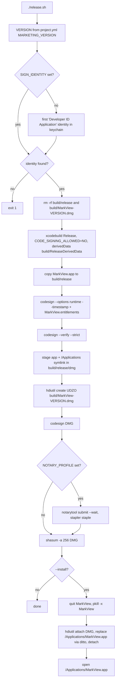

# Build, Release and Testing

How MarkView is configured, built, signed, packaged, installed and tested. Every statement
cites the file it comes from. Day-to-day procedures are in
[operations-runbook.md](../operations-runbook.md).

Related modules: [app-shell-and-workspace](app-shell-and-workspace.md) ·
[editor-and-bridge](editor-and-bridge.md) ·
[ai-assistants-and-dictation](ai-assistants-and-dictation.md) ·
[feature-workflow](feature-workflow.md) · [architecture-and-xray](architecture-and-xray.md) ·
[semantic-index-and-insight](semantic-index-and-insight.md) ·
[git-github-terminal-lifecycle-usage](git-github-terminal-lifecycle-usage.md)

---

## 1. Toolchain

| Tool | Needed for | Source |
|---|---|---|
| Xcode 15+ (project format), Swift 5.9 | every build | `project.yml:6`, `project.yml:12` |
| macOS SDK, deployment target 13.0 | every build | `project.yml:4-5`, `project.yml:13` |
| `xcodebuild` | Debug/Release builds | `CLAUDE.md` Verification, `release.sh:24-25`, `install.sh:11` |
| XcodeGen (`brew install xcodegen`) | regenerating the project only | `setup.sh:11-19` |
| `codesign`, `security`, `hdiutil`, `ditto`, `shasum` | release | `release.sh:14`, `release.sh:29-46` |
| Developer ID Application certificate in the keychain | release signing | `release.sh:14-15` |
| `xcrun notarytool` + keychain profile, `xcrun stapler` | optional notarization | `release.sh:41-45` |
| Node.js + npm (`npx esbuild` 0.28.2) | rebuilding vendored JS only | `tools/web-vendor/build.sh:8-11`, `tools/web-vendor/package.json:38-40` |
| `swiftc`, `python3` | standalone tests | `tools/tests/*.sh`, `tools/importance-check.sh:13`, `tools/tests/terminal-link-tests.sh:9` |
| `claude` and/or `codex` CLI, signed in | `tools/importance-check.sh` (real AI calls) | `tools/importance-check.sh:28`, `:40` |
| `gh` | CI release job; PR X-Ray at runtime | `.github/workflows/build-release.yml:43`, `:54` |

No Swift packages, CocoaPods or Carthage: `project.yml` has no `packages:` section.
`EditorWeb/` has its own `package.json` (`vite build`, `tsc --noEmit`), but its output is not
part of the app (`CLAUDE.md` Project).

## 2. Project structure and XcodeGen workflow

- `project.yml` is the declared source of truth (`CLAUDE.md` Repository Map). It defines one
  target, `MarkView` (application, macOS), `project.yml:23-26`, and one scheme with Run = Debug and
  Archive = Release (`project.yml:53-61`). `defaultConfig: Release` (`project.yml:8`) makes plain
  `xcodebuild` without `-configuration` build Release.
- Sources: the whole `MarkView/` folder, minus `Resources/Editor/node_modules/**`
  (`project.yml:27-30`). Because of that, non-code files under `MarkView/` end up in the
  Resources phase: `BUILD_NOTES.md`, `FILES_CREATED.txt`, `MANIFEST.md`, `README.md`
  (`MarkView.xcodeproj/project.pbxproj:393-396`). They ship inside the app bundle.
- `MarkView.xcodeproj` is checked in and is edited alongside `project.yml`
  (`CLAUDE.md` Working Rules). The two are **not** equivalent today:
  - `project.yml:31-33` declares all of `MarkView/Resources/Editor` as resources, while the
    pbxproj `Editor` group contains only `index.html` (`project.pbxproj:307-313`).
  - `Assets.xcassets` uses hand-written object IDs (`project.pbxproj:47`, `:158`).
  - Running `./setup.sh` (`xcodegen generate`, `setup.sh:19`) therefore rewrites the pbxproj.
    Diff the result and check the bundle (section 5) before committing it.
- `setup.sh` also runs `open MarkView.xcodeproj` (`setup.sh:24`) and tells you to pick a team
  (`setup.sh:31`).

## 3. Build configurations and settings

Shared settings (`project.yml:10-21`): `SWIFT_VERSION 5.9`, `MACOSX_DEPLOYMENT_TARGET 13.0`,
`ARCHS $(ARCHS_STANDARD)`, `CODE_SIGN_STYLE Automatic`, `INFOPLIST_FILE MarkView/Info.plist`,
`GENERATE_INFOPLIST_FILE false`, `MARKETING_VERSION` = `CURRENT_PROJECT_VERSION`.
Bundle identifier: `com.markview.MarkView` (`project.pbxproj:584`, `:670`, from
`bundleIdPrefix`, `project.yml:3`).

| Setting | Debug | Release |
|---|---|---|
| Entitlements | `MarkView/MarkViewDebug.entitlements` (`project.pbxproj:663`) | `MarkView/MarkView.entitlements` (`project.pbxproj:577`, `project.yml:36`) |
| Swift optimization | `-Onone` (`:654`) | `-O`, whole module (`:567-568`) |
| Conditions | `DEBUG` (`:653`) | none |
| Debug info | `dwarf` (`:626`) | `dwarf-with-dsym` (`:547`) |
| Other | `ONLY_ACTIVE_ARCH YES` (`:649`), `ENABLE_TESTABILITY YES` (`:628`) | `ENABLE_NS_ASSERTIONS NO` (`:548`) |

Not set anywhere: `ENABLE_HARDENED_RUNTIME`, `DEVELOPMENT_TEAM`, `SWIFT_STRICT_CONCURRENCY`.
The hardened runtime is applied only by `release.sh` at signing time (`release.sh:29`).

`Info.plist` highlights:
- Versions come from build settings (`MarkView/Info.plist:21-26`).
- Document types: Markdown and JSON Canvas at rank Default, JSON/XML/YAML/folders at Alternate
  (`Info.plist:33-137`); imported UTIs `net.daringfireball.markdown`, `com.markview.jsoncanvas`
  (`:140-183`).
- Privacy strings: Apple Events and microphone (`:186-189`).
- ATS: `NSAllowsArbitraryLoads`, `...InWebContent`, `NSAllowsLocalNetworking` all true
  (`:192-200`).
- `NSPrincipalClass` is `NSApplication` (`:27-28`), although `MarkView/App/MarkViewApp.swift:10-12`
  says it should be `MarkViewApplication`.

## 4. Pre-build script: "Build Web Editor (optional)"

Defined in `project.yml:38-51` and mirrored in `project.pbxproj:404-422` (`alwaysOutOfDate = 1`).
It does not build anything. It copies the checked-in editor into the bundle:

1. `DEST=$TARGET_BUILD_DIR/$UNLOCALIZED_RESOURCES_FOLDER_PATH/Editor`
2. `ditto` `index.html` and `terminal.html` into `DEST`.
3. If `Resources/Editor/vendor` exists, delete `DEST/vendor` and `ditto` the folder.

Only these three items are copied. A new top-level page in `Resources/Editor` must be added to
the script in both `project.yml` and `project.pbxproj`, otherwise `Bundle.main.url(...)` returns
nil and the web view stays blank (`tasks/lessons.md:268-270`).

## 5. Resource bundling

| Bundle path | Put there by | Loaded by |
|---|---|---|
| `Contents/Resources/Editor/index.html` | pre-build script | `MarkView/Views/EditorView.swift:26` |
| `Contents/Resources/index.html` (flat copy) | Resources phase (`project.pbxproj:397`) | fallback, `EditorView.swift:27` |
| `Contents/Resources/Editor/terminal.html` | pre-build script | `MarkView/Models/TerminalSession.swift:110` |
| `Contents/Resources/Editor/vendor/{js,css}` | pre-build script | `index.html`, `terminal.html` (`terminal.html:19`) |
| `Assets.xcassets` (AppIcon) | Resources phase (`project.pbxproj:392`) | `ASSETCATALOG_COMPILER_APPICON_NAME` |
| `BUILD_NOTES.md`, `FILES_CREATED.txt`, `MANIFEST.md`, `README.md` | Resources phase (`project.pbxproj:393-396`) | nothing (stale docs, see section 12) |

Not fully offline: `index.html:1539-1544` loads D3, Dagre, Turndown and
turndown-plugin-gfm from `cdn.jsdelivr.net`, and the CSP allows that host (`index.html:21`).
README only mentions the D3/Dagre case (`README.md:162-163`). Turndown handles the WYSIWYG
HTML-to-Markdown save (`index.html:1542`), so that path needs network access.
`vendor/MANIFEST.txt` records versions, SHA-256 and CVE checks for the vendored libraries
(`MarkView/Resources/Editor/vendor/MANIFEST.txt:1-9`).

## 6. Versioning policy

- Every committed app change bumps the version with semver
  (`CLAUDE.md` Versioning): patch = fixes, minor = features, major = removed/reworked features
  or incompatible `.dde/` / settings-key changes. Docs, `tasks/` and build-script-only changes
  do not bump. Several changes in one commit get one bump at the highest level.
- `./bump-version.sh patch|minor|major` (`bump-version.sh:4`):
  - reads the current `MARKETING_VERSION` from `project.yml` (`bump-version.sh:9`);
  - rewrites `MARKETING_VERSION` and `CURRENT_PROJECT_VERSION` in `project.yml`
    (`:19-20`) and in every configuration in `project.pbxproj` (`:21-22`);
  - build number equals marketing version.
- Current version: 2.17.0 (`project.yml:18-19`, `project.pbxproj:546`, `:561`, `:625`, `:646`).
- Release tags follow `v<version>` (for example `v2.15.0` in `git tag`). The README badge reads
  `v*` releases (`README.md:12`). No script creates tags or uploads the DMG.

## 7. Signing, entitlements and sandbox

**The App Sandbox is off in both configurations** (`MarkView/MarkView.entitlements:7-8`,
`MarkView/MarkViewDebug.entitlements:6-7`). Stated reason: sandboxing blocks `Process()` from
running the `claude` / `codex` CLIs (`MarkView.entitlements:5-6`). The app also reads other
tools' files, for example `~/.claude/.credentials.json`, `~/.codex/auth.json` and the Claude Code
keychain item via `/usr/bin/security` (`MarkView/Models/AgentUsageTracker.swift:483-493`).

| Entitlement | Release | Debug | What it enables |
|---|---|---|---|
| `com.apple.security.app-sandbox` = false | yes (`:7-8`) | yes (`:6-7`) | Unsandboxed: child processes, full file system, network |
| `com.apple.security.device.audio-input` | yes (`:11-12`) | yes (`:14-15`) | Microphone under the hardened runtime, for Whisper dictation (`MarkView/Models/WhisperClient.swift:60-101`) |
| `com.apple.security.automation.apple-events` | yes (`:13-14`) | **no** | Apple Events under the hardened runtime, for "Open in Terminal.app" via `NSAppleScript` (`MarkView/Views/FileTreeView.swift:522`) |
| `com.apple.security.network.client` | no | yes (`:10-11`) | Only matters inside a sandbox, so it has no effect here |

Signing paths:
- Local Debug verification builds use `CODE_SIGNING_ALLOWED=NO` (`CLAUDE.md` Verification), so
  entitlements are not applied.
- `release.sh` builds unsigned (`release.sh:24-25`), then signs the app with
  `--options runtime --timestamp --entitlements MarkView/MarkView.entitlements`
  (`release.sh:29-31`) and signs the DMG (`release.sh:39`).
- CI signs ad hoc (`CODE_SIGN_IDENTITY="-"`, `.github/workflows/build-release.yml:24-25`).
- `install.sh` archives with the project's Automatic signing and no team
  (`install.sh:11`, `project.yml:16`).

## 8. Release pipeline (`release.sh`)

Step references: `release.sh:13` (version), `:14-15` (identity), `:17-21` (clean),
`:23-26` (build), `:28-31` (sign), `:33-39` (DMG), `:41-45` (notarize), `:46` (checksum),
`:49-61` (install).

Without notarization, first launch needs "Open Anyway" in System Settings → Privacy & Security
(`release.sh:7-9`, `README.md:147-149`). Publishing the DMG to GitHub Releases is manual.

**CI** (`.github/workflows/build-release.yml`): on every push to `main`, on `macos-15` with
`Xcode_16.app` (`:3-5`, `:12`, `:17`). It builds Release with ad-hoc signing (`:19-26`), zips the
app from DerivedData (`:28-34`), deletes the previous `latest` release and tag (`:42-50`) and
publishes a new `latest` release with `MarkView.zip` (`:52-68`). It runs no tests, and it does not
bump or check the version.

## 9. Install

| Command | What it does | Source |
|---|---|---|
| `./install.sh` | quits and `pkill -9 MarkView`, runs `xcodebuild ... archive` to `build/MarkView.xcarchive`, replaces `/Applications/MarkView.app`, copies the OpenAI key from the old sandbox container's preferences into the global domain, opens the app | `install.sh:5-27` |
| `./release.sh --install` | installs from the signed DMG (section 8) | `release.sh:49-61` |
| manual | open the DMG and drag the app to Applications | `README.md:145-149` |

Both scripts quit the running app. When the command runs inside a MarkView terminal, quitting
the app kills the script itself (see the runbook, "Install").

## 10. Rebuilding the vendored web libraries

`cd tools/web-vendor && npm ci && ./build.sh` (`tools/web-vendor/build.sh:3`, `README.md:183-184`):

- `esbuild` bundles `codemirror-entry.js` → `vendor/js/codemirror.bundle.js` and `xterm-entry.js`
  → `vendor/js/xterm.bundle.js`, as IIFE, minified, `--target=safari15` (`build.sh:8-12`).
- Copies `xterm.css` (`:13`), `cytoscape.min.js`, `elk.bundled.js`, `cytoscape-elk.js` (`:15-17`).
- Versions are pinned exactly in `package.json:8-40` with `package-lock.json`. `node_modules/` is
  git-ignored (`.gitignore:50-51`).
- Other vendor files (markdown-it, KaTeX, Mermaid, Prism, Chart.js, js-yaml) are not produced by
  this script. They are checked-in copies tracked in `vendor/MANIFEST.txt`.
- The bundles are shipping code: rebuild them, commit them, then build the app. Loading from a
  CDN is not allowed (`CLAUDE.md` Repository Map).

## 11. Test strategy

There is no XCTest target (`CLAUDE.md` Repository Map). Tests are standalone `swiftc` programs
that compile selected app source files together with a test `main`, then run the result:

| Script | Compiles | Covers | Needs |
|---|---|---|---|
| `tools/tests/lifecycle-tests.sh` | `Models/LifecycleAnalytics.swift`, `Models/LifecycleCapture.swift` + `LifecycleAnalyticsTests.swift` (`:10-11`) | 9 stages and 8 steps, durations (missing, inconsistent, zero), median/mean, formatting, Codable, GitHub/Git capture parsing, CI-passed detection, Claude/Codex model probe (`LifecycleAnalyticsTests.swift:25-187`) | CLI only |
| `tools/tests/agent-usage-tests.sh` | `Models/AgentUsage.swift`, `Models/AgentUsageLogs.swift` + `AgentUsageTests.swift` (`:10-11`) | usage levels 80/95%, headline window, pace, fallback windows (month clamping), official Claude/Codex usage parsing, token formatting (`AgentUsageTests.swift:29-149`) | CLI only |
| `tools/tests/dictation-insertion-tests.sh` | `enum DictationInsertion` cut out of `Views/DictationViews.swift` with awk (`:10`) | inserting at the cursor, replacing a selection, spacing, undo, append when the field is unfocused, never writing into another window (`DictationInsertionTests.swift:23-64`) | logged-in GUI session, briefly opens a window (`:3-4`) |
| `tools/tests/terminal-link-tests.sh` | `Models/TerminalLink.swift`, `Models/TerminalSession.swift`, the `FileType` part of `DocumentState.swift` (`:9-21`); then `EditorLineLinkTests.swift` (`:24-26`) | terminal link resolution, OSC 8, Cmd-click under mouse-tracking TUIs, live shell cwd, the shipping `terminal.html` in a real WKWebView; editor go-to-line in the shipping `index.html` | GUI session. `--open-browser` also opens the real default browser (`TerminalLinkTests.swift:147-152`) |
| `tools/importance-check.sh [claude\|codex] [model]` | FileType + CLI helpers extracted by python, `CLICompletion`, `ArchitectureModel`, `ArchitectureScanner`, `ImportanceRater` (`:13-22`, `:91-93`) | AI importance ratings on `Tests/Fixtures/importance/*.md` against `expected.json`, plus a custom filter (`:26-86`) | signed-in `claude`/`codex`; costs tokens. **Currently broken**, see section 12 |

Every script builds into a `mktemp -d` folder that is removed on exit. Each prints its failures
and exits non-zero on failure.

Fixtures:
- `Tests/Fixtures/importance/` is used by `tools/importance-check.sh`.
- `Tests/Fixtures/marker-cases/`, `sse-anthropic-sample.txt` and `insight-skeleton-sample.json`
  are referenced only from the specs under `work/recursive-insight*/`. No script runs them.
- `TestFiles/` holds files for manual checks: `demo.md` (`setup.sh:35`), `demo.canvas`,
  `structured/test.{json,xml,yaml}`, `translation-fixture.md`, plus ad-hoc files
  (`new_test.md`, `should_appear.md` and others).

## 12. Verification checklist

1. Debug build:
   `xcodebuild -project MarkView.xcodeproj -scheme MarkView -configuration Debug -derivedDataPath /tmp/MarkViewDerivedData CODE_SIGNING_ALLOWED=NO build`
   (`CLAUDE.md` Verification).
2. Bundle check: `ls /tmp/MarkViewDerivedData/Build/Products/Debug/MarkView.app/Contents/Resources/Editor/`
   must list `index.html`, `terminal.html` and `vendor/` (`tasks/lessons.md:268-270`).
3. Run the standalone tests that cover the changed modules (section 11).
4. Toolbar or menu changes: launch the built app. The build does not catch a missing
   `EnvironmentObject` in toolbar content (`tasks/lessons.md:45-53`).
5. Editor UI: check in real WebKit, not Chrome (`tasks/lessons.md:255-257`).
6. Bump the version before committing an app change (section 6). Keep `project.yml` and the
   pbxproj in step.
7. Release: `./release.sh` without `--install`, and let the user install (runbook).

## 13. Stale or contradictory docs

| Location | Claim | Reality |
|---|---|---|
| `tools/importance-check.sh:19` | reads `MarkView/Models/AIConsoleEngine.swift` | That file was removed in `0bad0d6` (1.25.0). The `// MARK: - CLI Tool Discovery` marker is now in `MarkView/Models/AIAssistants.swift`, so the script fails before compiling |
| `MarkView/BUILD_NOTES.md:6`, `:38` | 12 Swift files | 75 files: App 1, Bridge 2, Models 52, Views 20 |
| `MarkView/BUILD_NOTES.md:36-40` | create the Xcode project by hand, enable strict concurrency | XcodeGen `project.yml`; strict concurrency is not set |
| `MarkView/BUILD_NOTES.md:51`, `:122-157` | `window.editorBridge`, `webkit.messageHandlers.markviewBridge` | Editor JS posts to `messageHandlers.bridge`; `editorBridge` exists nowhere |
| `MarkView/BUILD_NOTES.md:99-114` | `NSDocumentTypes` / `MarkdownDocument` | not in `Info.plist` |
| `MarkView/BUILD_NOTES.md:283-299` | bare `xcodebuild`, generic signing notes | `CLAUDE.md` build command; `release.sh` |
| `MarkView/MANIFEST.md:240` | "Uses macOS sandbox" | sandbox off (`MarkView.entitlements:7-8`) |
| `MarkView/MANIFEST.md`, `MarkView/FILES_CREATED.txt:29`, `MarkView/README.md:7-10` | 12-file inventory, `/sessions/gracious-loving-goodall/...` path | March 2026 scaffold. These four files are also bundled into the app (`project.pbxproj:393-396`) |
| `QUICKSTART.md:9-11` | `index.html` is 1087 lines, "no build" | 1595 lines; vendored bundles built by `tools/web-vendor` |
| `QUICKSTART.md:23`, `:89`, `:288-294` | EditorWeb is "for production"; integrate `dist/` | `CLAUDE.md`: EditorWeb is not wired into the app |
| `EDITOR_IMPLEMENTATION.md:9`, `:20` | libraries from CDN (jsDelivr) | mostly vendored; only D3, Dagre and Turndown remain on the CDN (`index.html:1539-1544`) |
| `EDITOR_IMPLEMENTATION.md:15`, `:174` | absolute `/sessions/...` paths | nonexistent |
| `EDITOR_IMPLEMENTATION.md:467-480` | add to Copy Bundle Resources; integrate EditorWeb `dist/` | pre-build script copies the editor (section 4) |
| `README.md:162-163` | only `%%INTERACTIVE` diagrams need the CDN | Turndown (WYSIWYG save) also loads from the CDN (`index.html:1543-1544`) |
| `README.md:145-149` vs `.github/workflows/build-release.yml:52-66` | install from a Developer ID DMG | CI also publishes an ad-hoc-signed `latest` zip on every push to main |
| `README.md:175` | `./install.sh` for development | quits the running app; copies a key from the sandbox container, which is no longer used (`install.sh:17-24`) |
| `.gitignore:47-48` | Debug entitlements are the sandbox-off file that must not ship | Release entitlements are also sandbox-off; the ignore line is commented out |
| `MarkView/Models/WorkspaceManager.swift:435` | log at `/tmp/markview_debug.log` | `~/markview_debug.log` (`:438`) |
| `MarkView/App/MarkViewApp.swift:10-11` | `MarkViewApplication` is the `NSPrincipalClass` | `Info.plist:27-28` says `NSApplication` |
| `CLAUDE.md` Repository Map | web-vendor builds CodeMirror, Cytoscape, ELK | it also builds xterm.js (`build.sh:11-13`) |
| `tasks/lessons.md:173-175` | avoid `NSAppleScript` so Apple Events are not needed | `FileTreeView.swift:522` uses `NSAppleScript`; the entitlement and usage string were added for it |
