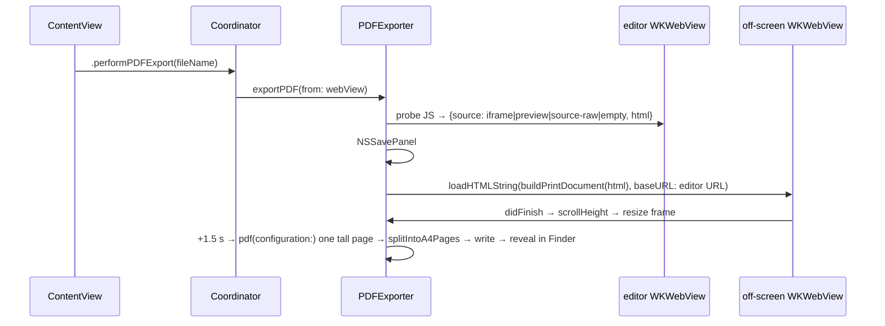

# Editor Web Layer and Swift↔JS Bridge

Scope: the bundled HTML/JS editor that ships in the app (`MarkView/Resources/Editor/`), the
Swift side that hosts it (`EditorView.swift`, `WebViewBridge.swift`), PDF export
(`PDFExporter.swift`), the embedded terminal page (`terminal.html`, JS side only), the
vendor build tooling (`tools/web-vendor/`), and the dormant `EditorWeb/` project.

Sibling docs: [app-shell-and-workspace](app-shell-and-workspace.md) ·
[ai-assistants-and-dictation](ai-assistants-and-dictation.md) ·
[feature-workflow](feature-workflow.md) ·
[architecture-and-xray](architecture-and-xray.md) ·
[semantic-index-and-insight](semantic-index-and-insight.md) ·
[git-github-terminal-lifecycle-usage](git-github-terminal-lifecycle-usage.md) ·
[build-release-testing](build-release-testing.md)

---

## 1. Purpose and responsibilities

The subsystem owns:

- One long-lived `WKWebView` (per `EditorView` instance) that renders every "document-like" tab:
  Markdown (WYSIWYG + source), structured data (JSON/XML/YAML tree; JSON and YAML editable in
  the tree and in the source view), JSON Canvas, read-only source code
  (CodeMirror 6), data files (tables, Parquet, SQLite, Excel, HAR, logs — `markview-data.js`),
  the X-Ray / Architecture graph host, and the Recursive Insight sandboxed iframe. The mode is switched in-page; the web view is never recreated per tab
  (`EditorView.swift:10-38`, `EditorView.swift:288-375`).
- The single script message handler `bridge` and its JSON-ish message protocol
  (`EditorView.swift:16`, `WebViewBridge.swift:76-347`).
- All Swift→JS calls into the editor (`WebViewBridge.swift:366-670`, plus a few inline in
  `EditorView.swift` and `PDFExporter.swift`).
- Markdown rendering (markdown-it + plugins, KaTeX, Mermaid, Prism), heading/TOC extraction,
  semantic block extraction and diffing, find-in-page, WYSIWYG formatting and Turndown
  HTML→Markdown conversion.
- PDF export via an off-screen `WKWebView` (`PDFExporter.swift`).
- The terminal page's JS (`terminal.html`) and its `terminal` message protocol (Swift owner is
  `TerminalSession.swift`, documented in
  [git-github-terminal-lifecycle-usage](git-github-terminal-lifecycle-usage.md)).
- Building/vendoring third-party browser bundles (`tools/web-vendor/`).

It does **not** own:

- Tab state, file I/O, saving, dirty tracking — `WorkspaceManager` / tabs store
  ([app-shell-and-workspace](app-shell-and-workspace.md)). The bridge only forwards.
- AI calls behind `selectionAction`, `translateRequested`, `featureAction`, `generateGraph`,
  code-viewer `askAI`/`explain` ([ai-assistants-and-dictation](ai-assistants-and-dictation.md),
  [feature-workflow](feature-workflow.md)).
- X-Ray data model and `arch` action semantics
  ([architecture-and-xray](architecture-and-xray.md)); only the transport is here.
- Insight session generation and `blocksChanged` indexing
  ([semantic-index-and-insight](semantic-index-and-insight.md)).
- The PTY / process side of the terminal, and the GitHub HTML view
  (`GitHubViews.swift:1264-1298`, JavaScript disabled there).

---

## 2. Files

| Path | Role |
|---|---|
| `MarkView/Views/EditorView.swift` | `NSViewRepresentable` hosting the editor `WKWebView`; `Coordinator` = navigation delegate + `WebViewBridgeDelegate`; routes tabs by kind; image inlining; notification observers |
| `MarkView/Bridge/WebViewBridge.swift` | `WKScriptMessageHandler` for `bridge`; payload parsing/validation; all typed Swift→JS commands; `/tmp` diag logger; `WebViewBridgeDelegate` protocol |
| `MarkView/Bridge/PDFExporter.swift` | Probe active content, off-screen A4-width render, tall-page PDF capture, Core Graphics split into A4 pages |
| `MarkView/Resources/Editor/index.html` | Editor page: CSP, ~1270 lines of inline CSS (`index.html:33-1307`), DOM skeleton, ordered `<script>` tags |
| `MarkView/Resources/Editor/terminal.html` | xterm.js page for embedded terminals; `terminal` message handler protocol |
| `vendor/js/markview-early.js` | First script: global `error`/`unhandledrejection` capture → `jsError` |
| `vendor/js/markview-state.js` | Global `state`, `DOM` cache, markdown-it instance `md`, Mermaid init |
| `vendor/js/markview-mdext.js` | markdown-it rules: wikilinks, `$`/`$$` math (KaTeX), wikilink click → `linkClicked`; `window.scrollToHeadingText` |
| `vendor/js/markview-render.js` | `renderMarkdown`, frontmatter panel, Mermaid/Prism passes, headings, semantic blocks + diff, heading IntersectionObserver |
| `vendor/js/markview-edit.js` | Stats, font slider, Turndown, source/WYSIWYG mode switch, format commands, floating format bar, save/translate/refresh senders |
| `vendor/js/markview-find.js` | Selection actions (translate/explain), feature-action menu, action popup, `window.showSelectionResult`, find bar |
| `vendor/js/markview-bridge.js` | Theme, `sendToSwift`, second error capture, base `window.setContent` |
| `vendor/js/markview-structured.js` | JSON/XML/YAML tree view, format/minify, struct headings; `window.setStructuredContent` |
| `vendor/js/markview-insight-srcdoc.js` | Insight: escapes, lib map, blob materialisation, iframe `srcdoc` builder incl. the iframe script |
| `vendor/js/markview-insight-helpers.js` | Insight chrome: enter/leave view, breadcrumbs, status bar, 10 s ready timer |
| `vendor/js/markview-insight-handlers.js` | Insight: `stripCDNTags`, the five Swift→JS setters, parent `message` listener with allowlist |
| `vendor/js/markview-globals.js` | `setDocumentBase`, `setTheme`, `scrollToHeading`, `scrollToText`, `documentGotoLine`, `getHTML`, print-layout helpers |
| `vendor/js/markview-canvas.js` | JSON Canvas viewer (pan/zoom), wraps `setContent`/`scrollToHeading`; `canvasOpenFile` |
| `vendor/js/markview-panels.js` | `window.MVPanels.resizable` (drag-resizable side panels, width in localStorage) |
| `vendor/js/markview-code.js` | Code viewer (lazy-loads `codemirror.bundle.js`), margin notes, nav, AI ask; wraps `setContent`/`setStructuredContent`/`setTheme`; `code` messages |
| `vendor/js/markview-architecture.js` | X-Ray host (lazy-loads Cytoscape + ELK); wraps `setContent`/`setStructuredContent`/`setCodeContent`/`setTheme`; `arch` messages |
| `vendor/js/markview-diagram-viewer.js` | Full-window pan/zoom viewer for rendered Mermaid SVGs |
| `vendor/js/markview-d3-mermaid.js` | `%%INTERACTIVE` Mermaid → D3+dagre canvas; `generateGraph`; end-checkpoint sentinel; schedules `init` |
| `vendor/js/markview-init.js` | Textarea input, link interception, global shortcuts, `init()` (sends `ready`) |
| `vendor/css/markview-canvas.css` | Canvas viewer styles |
| `vendor/MANIFEST.txt` | Supply-chain manifest (version, SHA-256, source URL, CVE check) for the CDN-sourced vendored libs |
| `tools/web-vendor/build.sh`, `package.json`, `package-lock.json`, `codemirror-entry.js`, `xterm-entry.js` | esbuild bundling of CodeMirror (`MVCode`) and xterm (`MVTerm`); copies Cytoscape/ELK/xterm.css |
| `project.yml:31-51` | Bundles `Resources/Editor` and a pre-build `ditto` of `index.html`, `terminal.html`, `vendor/` into `Editor/` |
| `EditorWeb/` | Dormant Vite/TypeScript editor, not wired into the app (section 11) |

### Third-party vendored assets

| File | Library / version | Source of version |
|---|---|---|
| `markdown-it.min.js` | markdown-it 13.0.1 | `MANIFEST.txt`, file header |
| `markdown-it-footnote.min.js` | 3.0.3 | `MANIFEST.txt` |
| `markdown-it-task-lists.min.js` | 2.1.1 (header says 2.1.0) | `MANIFEST.txt` |
| `markdown-it-container.min.js` | 4.0.0 | `MANIFEST.txt` |
| `mermaid.min.js` | mermaid 10.6.1 | `MANIFEST.txt` (hash matches on disk) |
| `katex.min.js`, `auto-render.min.js`, `vendor/css/katex.min.css`, `vendor/css/fonts/*` | KaTeX 0.16.9 | `MANIFEST.txt`, `version:"0.16.9"` in file |
| `prism*.min.js`, `prism-*.css` | Prism 1.29.0 (15 languages + line-numbers) | `MANIFEST.txt` |
| `js-yaml.min.js` | 4.1.0 | `MANIFEST.txt` |
| `chart-4.4.9.min.js` | Chart.js 4.4.9 (Insight iframe only) | `MANIFEST.txt`, file banner |
| `codemirror.bundle.js` | CodeMirror 6 (`@codemirror/view` 6.43.13, `state` 6.7.6, …) | `tools/web-vendor/package.json` |
| `xterm.bundle.js`, `vendor/css/xterm.css` | `@xterm/xterm` 6.0.0, addon-fit 0.11.0, addon-web-links 0.12.0 | `tools/web-vendor/package.json` |
| `cytoscape.min.js` | cytoscape 3.34.3 | `tools/web-vendor/package.json` |
| `elk.bundled.js` | elkjs 0.12.0 | `tools/web-vendor/package.json` |
| `cytoscape-elk.js` | cytoscape-elk 2.3.0 | `tools/web-vendor/package.json` |
| **CDN (not vendored)** d3 7.9.0, @dagrejs/dagre 1.1.4, turndown 7.1.3, turndown-plugin-gfm 1.0.2 | loaded from `cdn.jsdelivr.net` | `index.html:1539-1544` |

`MANIFEST.txt` does not cover the `tools/web-vendor` bundles, and nothing covers the CDN scripts.

---

## 3. Key types, modules and global JS state

### Swift

- **`EditorView`** (`EditorView.swift:6`) — `makeNSView` builds `WKWebViewConfiguration`, registers
  `bridge` as the `"bridge"` handler (`:16`), enables `developerExtrasEnabled` via private KVC
  (`:19`), reads `index.html` from the bundle, rewrites `data-theme="dark"` to the current theme
  (`:30`), and loads it with `loadHTMLString(html, baseURL: <bundle>/Editor/)` (`:182-187`).
  `updateNSView` pushes the active tab and theme on every SwiftUI update (`:40-53`).
- **`EditorView.Coordinator`** (`:61`) — state: `isEditorReady`, `pendingContent/URL/Tab`,
  `lastLoadedContent` (dedupe key), `lastLoadedDocumentURL`, `currentDocumentBaseURL`,
  `currentCodeURL`, `pendingCodeReveal`, `currentLineRevealURL`, `lastTheme`, insight
  subscription state (`insightCancellables`, `currentInsightSessionId`,
  `lastForwardedSectionLength`), `architectureCancellable`/`architectureScope`,
  `codeNotesCancellable`.
  - `loadContentIfNeeded(_:documentURL:tab:)` (`:288`) — central router by `TabKind`
    (`.insight`, `.architecture`, `.terminal/.image/.github` = no-op, `.file`) and then by
    `FileType` (code / notes-view / structured / markdown).
  - `routeInsight` (`:437`), `routeArchitecture` (`:392`), `routeCodeNotes` (`:378`) —
    Combine subscriptions that push state into JS.
  - `resolveImagePaths(in:relativeTo:)` (`:632`) — regex `` → base64 data URI.
  - `webView(_:decidePolicyFor:)` (`:238`) — navigation policy.
  - NotificationCenter observers (`:118-167`): `.performPDFExport`, `.scrollToHeading`,
    `.revealCodeLine`, `.codeNavEvent`, `.scrollToText`.
- **`WebViewBridge`** (`WebViewBridge.swift:71`) — `NSObject, WKScriptMessageHandler`; holds a
  `weak var delegate: WebViewBridgeDelegate?`. `userContentController(_:didReceive:)` (`:76`)
  handles `headingsUpdated`, `blocksChanged`, the nine insight messages and `jsError` inline, then
  falls through to `handleMessage(type:data:)` (`:247`). Encoding helper `encodeStringForJS`
  (`:357`) uses the array-wrap `JSONSerialization` idiom. `logInsightDiag` (`:460`) appends to
  `/tmp/markview-insight-diag.log`, stderr and NSLog.
- **`BridgeMessage` / `AnyCodable`** (`WebViewBridge.swift:6-68`) — declared but unused: messages
  are parsed from `message.body as? [String: Any]`.
- **`WebViewBridgeDelegate`** (`:691-725`) — 26 callbacks; the only implementation is
  `EditorView.Coordinator` (`EditorView.swift:718-965`), which hops each to `@MainActor` and calls
  `WorkspaceManager`.
- **`PDFExporter`** (`PDFExporter.swift:9`) — static `exportPDF(from:fileName:bridge:)` (`:19`),
  `generatePDF` (`:87`), `splitIntoA4Pages` (`:142`), `buildPrintDocument` (`:196`); retains the
  off-screen view/delegate in static vars (`:15-16`).

### JavaScript globals (all classic scripts sharing one global scope)

| Global | Defined | Purpose |
|---|---|---|
| `state` | `markview-state.js:4` | `mode` (`source`/`preview`/`structured`/`structured-source`/`insight`/`code`; `arch-mode` is a body class), `theme`, `markdown`, `headings`, `activeHeadingId`, `isRendering`, `documentBaseURL`, `fileType` (`markdown`/`json`/`xml`/`yaml`/`canvas`/`code`), insight fields (`insightIframe`, `insightSessionId`, `insightCurrentNodeId`, `insightSkeleton`, `insightSectionLibsNeeded`, `insightBlobURLs`, `insightLibBytes`, `insightLoadTimer`, `insightIframeReady`, `insightPendingChunks`) |
| `DOM` | `markview-state.js:27` | Cached element refs (`editor` textarea, `rendered` contentEditable, panes, status, insight chrome) |
| `md` | `markview-state.js:50` | markdown-it instance (`html: true, breaks, linkify, typographer`) + footnote, task-lists, admonition containers (`info/warning/tip/danger`), image renderer override |
| `previousBlocks` | `markview-render.js:282` | Last extracted semantic blocks for diffing |
| `wysiwygDirty`, `turndownService` | `markview-edit.js:124`, `:42` | Whether WYSIWYG DOM was edited; Turndown instance |
| `formatBarSelectedText`, `featureText` | `markview-edit.js:252`, `markview-find.js:45` | Captured selection for RU/EN/?/✦ buttons |
| `findState` | `markview-find.js:158` | Find bar state and `<mark>` highlights |
| `cv` | `markview-canvas.js:14` | JSON Canvas viewer state |
| `dv` | `markview-diagram-viewer.js:8` | Diagram viewer state |
| `window.MVPanels`, `window.MVCode`, `window.MVTerm` | `markview-panels.js:7`, `codemirror-entry.js` (last line), `xterm-entry.js` | Panel resizer; CodeMirror factory; xterm exports |
| `window.pendingCodeLine` | `markview-code.js:257` | Line reveal queued until the code viewer exists |

**Function wrapping chain.** Several `window.*` entry points are monkey-patched by later scripts,
so load order is semantic (`index.html:1583-1590` comments):

- `window.setContent`: base `markview-bridge.js:70` → canvas cleanup `markview-canvas.js:60` →
  leave code view `markview-code.js:1263` → leave X-Ray `markview-architecture.js:2087`.
- `window.setStructuredContent`: `markview-structured.js:4` → `markview-code.js:1268` →
  `markview-architecture.js:2087`.
- `window.setTheme`: `markview-globals.js:7` → `markview-code.js:1273` →
  `markview-architecture.js:2096`.
- `window.scrollToHeading`: `markview-globals.js:15` → `markview-canvas.js:69` (`cv-` ids pan the canvas).
- `window.setCodeContent`: `markview-code.js:204` → `markview-architecture.js:2087`.

### Script load order (`index.html:1524-1593`)

1. markdown-it + footnote, task-lists, container (vendored)
2. mermaid, katex, auto-render (vendored)
3. **d3, dagre, turndown, turndown-plugin-gfm from `cdn.jsdelivr.net`**
4. Prism + 15 language components, js-yaml (vendored)
5. `markview-early` → `state` → `mdext` → `render` → `edit` → `find` → `bridge` → `structured`
   → `insight-srcdoc` → `insight-helpers` → `insight-handlers` → `globals` → `canvas` → `panels`
   → `code` → `architecture` → `diagram-viewer` → `d3-mermaid` → `init`

Lazy loads: `codemirror.bundle.js` on first code view (`markview-code.js:164-176`); `cytoscape.min.js`
→ `elk.bundled.js` → `cytoscape-elk.js` on first X-Ray render (`markview-architecture.js:72-87`);
Insight iframe `<script src>` for prism/mermaid/chart/katex (`markview-insight-srcdoc.js:191-205`).

---

## 4. Internal interfaces

**Into this subsystem**

- SwiftUI: `ContentView.swift:55` instantiates `EditorView()`; environment objects
  `WorkspaceManager`, `ThemeManager`.
- Notifications posted elsewhere and observed in `EditorView.Coordinator.init`:
  `.performPDFExport` (posted `ContentView.swift:339`), `.scrollToHeading` (`TOCView.swift:50`),
  `.scrollToText` (`TOCView.swift:173`, `WorkspaceManager.swift:1156`, `:1334`, `:3061`),
  `.revealCodeLine` (`WorkspaceManager.swift:1281`), `.codeNavEvent` (`CodeNavigation.swift:396`).
- `WorkspaceManager.releaseInsightBlobsHook` (`WorkspaceManager.swift:379`) is set by
  `routeInsight` (`EditorView.swift:465`) and invoked from `closeTab` (`WorkspaceManager.swift:1567`).
- Published stores observed: `InsightSession.$skeleton/$currentNodeSections/$lastError/$statusMessage`,
  `ArchitectureStore.$revision/$progress`, `codeExplain.$revision`, `architecture.$revision`.

**Out of this subsystem** (all through `EditorView.Coordinator` → `WorkspaceManager`, main actor):
`updateActiveTabContent` (`WorkspaceManager.swift:2763`), `updateActiveTabHeadings` (`:2772`),
`updateActiveHeading` (`:2786`), `updateActiveTabScrollPosition` (`:2779`, never reached, see §10),
`handleBlocksDelta` (`:2931`), `handleCursorBlockChange` (`:3073`), `saveActiveFile` (`:1648`),
`reloadActiveTabFromDisk` (`:2797`), `translateDocument` (`:1726`), `handleSelectionAction`
(`:1657`), `runFeatureAction` (`:3307`), `runGraphEdit` (`:2848`), `presentGraphCreator` (`:2827`),
`openCanvasFileReference` (`:1344`), `handleCodeAction` (`:915`), `setNotesView` (`:907`),
`handleArchitectureAction` (`:1127`), `openFile(_:lineFragment:)` (`:1286`), `openWikiLink`
(`:1300`), `prepareCodeNotes`/`codeNotesJSON` (`:879`, `:885`), `xrayStore(for:)` (`:1009`),
`didReceiveInsightIframeReady` … `didRequestInsightRetrySection` (`:2216-2349`).
Also `NSWorkspace.shared.open` for external URLs and non-openable local files.

---

## 5. Bridge message catalog

Transport: JS calls `window.webkit.messageHandlers.bridge.postMessage({type, payload})`
(helper `sendToSwift`, `markview-bridge.js:26`; direct posts in `markview-early.js:10`,
`markview-architecture.js:68`, `markview-code.js:263`, `markview-d3-mermaid.js:380`). Swift requires
`body` to be a dictionary with a string `type` (`WebViewBridge.swift:78-82`).

### 5.1 JS → Swift (`bridge` handler)

| type | payload | Sender(s) | Handler (bridge → delegate impl) | Validation at boundary |
|---|---|---|---|---|
| `ready` | `{}` | `markview-init.js:76` | `WebViewBridge.swift:268` → `EditorView.swift:795` | none. **Never delivered in practice** (§10.1) |
| `contentChanged` | `{markdown: string, html?: string}` | `markview-render.js:205` (every render, with full `html`), `markview-edit.js:294` (save), `markview-init.js:10` (non-markdown input), `markview-structured.js:214,221,233` (format/minify) | `WebViewBridge.swift:251` → `EditorView.swift:719` → `updateActiveTabContent` | `markdown` must be `String`; `html` ignored |
| `headingsUpdated` | `[{id: string, level: int, text: string}]` (bare array) | `markview-render.js:265`, `markview-structured.js:276`, `markview-canvas.js:526` | `WebViewBridge.swift:90` → `EditorView.swift:726` | array of dicts; each item via `HeadingItem(from:)` (`:675-687`), invalid items dropped |
| `blocksChanged` | `{added: Block[], removed: string[], changed: Block[], unchanged: string[]}`; Block = `{id, documentId, type, level, content, plainText, contentHash, headingPath, parentBlockId, lineStart, lineEnd, position, language, anchor}` | `markview-render.js:190` | `WebViewBridge.swift:99` (deferred with `DispatchQueue.main.async`) → `EditorView.swift:783` → `handleBlocksDelta` | dict required; `SemanticBlock(from:)` drops invalid |
| `scrollPosition` | `{activeHeadingId: string\|null}` | `markview-render.js:495` (IntersectionObserver), `markview-init.js:34` (anchor click) | `WebViewBridge.swift:263` → `EditorView.swift:732` → `updateActiveHeading` | `String` required (null ignored) |
| `linkClicked` | `{href: string}` (absolute `file://`, `http(s)`, `mailto`, or `markview-wikilink:<note>[#<heading>]`) | `markview-init.js:41`, `markview-mdext.js:137`, `markview-canvas.js:195` | `WebViewBridge.swift:271` → `EditorView.swift:755` | `URL(string:)`; scheme switch `file`/`http`/`https`/`mailto`/`markview-wikilink`; others dropped |
| `canvasOpenFile` | `{path: string}` (relative) | `markview-canvas.js:184` | `WebViewBridge.swift:292` → `EditorView.swift:878` → `openCanvasFileReference` | non-empty; WorkspaceManager rejects `/`-prefixed and `..` (`WorkspaceManager.swift:1346`) |
| `saveRequested` | `{}` | `markview-edit.js:295` | `WebViewBridge.swift:304` → `EditorView.swift:809` | skipped for non-file-backed tabs |
| `refreshRequested` | `{}` | `markview-edit.js:310` | `WebViewBridge.swift:325` → `EditorView.swift:884` | skipped for non-file-backed tabs |
| `translateRequested` | `{markdown: string, targetLang: "Russian"\|"English"}` | `markview-edit.js:306` | `WebViewBridge.swift:307` → `EditorView.swift:824` | both `String`; error reply via `showSelectionResult` |
| `selectionAction` | `{action: "translate_ru"\|"translate_en"\|"explain", text: string}` | `markview-find.js:40` | `WebViewBridge.swift:313` → `EditorView.swift:850` | both `String`; action checked in WorkspaceManager |
| `featureAction` | `{action: string, text: string, question: string}` (actions listed `index.html:1479-1492`) | `markview-find.js:80` | `WebViewBridge.swift:319` → `EditorView.swift:844` → `runFeatureAction` | non-empty `text`; action name checked in Swift |
| `generateGraph` | `{type: "edit", editInstruction: string, currentMermaid: string}` | `markview-d3-mermaid.js:285` | `WebViewBridge.swift:328` → `EditorView.swift:867` | defaults when missing; non-`edit` types have no JS sender |
| `code` | `{action, …fields}` — actions: `explain`, `rate{filter}`, `freshness`, `explainPR`, `tempFilter{criterion}`, `createFilter{name,criterion}`, `notesView{show}`, `navDefinition{name,line}`, `navUsages{name,line}`, `navBack{line}`, `navForward{line}`, `navOpen{path,target,line}`, `explainSymbol{name,line}`, `askAI{id,question,text,start,…}`, `askStop{id}` | `markview-code.js:263` via `postCode` (call sites `:581-1210`) | `WebViewBridge.swift:282` → `EditorView.swift:738` → `setNotesView` or `handleCodeAction(url: currentCodeURL)` | `action` must be `String`; fields unvalidated here |
| `arch` | `{action, …fields}` — actions: `openFile{path,find?,line?,endLine?,fromPR?,fromSearch?}`, `filterSearch`, `rateImportance`, `explainEdge`, `deleteFilter`, `describe`, `setComponent`, `outlineFile`, `saveSearchAnswer`, `askPR`, `explainPRFile`, `prFileDiff`, `analyzePR`, `prTasksToTerminal`, `copyPRTasks`, `prFixAll`, `prAction{op,body?,method}`, `openURL{url}`, `prFinding*{path,index}`, `createFilter`, `refreshPRSources`, `openPRXRay`, `showPR`, `openPRNumber`, `cancelAnalysis`, `tempFilter`, `reviewPR`, `analyze`, `rescan` | `markview-architecture.js:62-69` via `post` (call sites `:352-2083`) | `WebViewBridge.swift:287` → `EditorView.swift:749` → `handleArchitectureAction` | `action` must be `String`; e.g. `openFile` confined to root in `WorkspaceManager.swift:1134-1138` |
| `textChanged` | `{cursorBlock: string}` | **no JS sender** | `WebViewBridge.swift:299` → `EditorView.swift:789` | dead path |
| `jsError` | `{where, message, source, lineno, colno, stack}` | `markview-early.js:10`, `markview-bridge.js:45,58`, `markview-d3-mermaid.js:380` (end-checkpoint), many insight diagnostics in `markview-insight-handlers.js` (`:66`, `:135`, `:153`, `:174`, `:179`, `:327`, `:350`, `:385`, `:496`) | `WebViewBridge.swift:164` → `logInsightDiag` | fields coerced with defaults; stack truncated to 800 |
| `insightIframeReady` | `{sessionId, nodeId}` | `markview-insight-handlers.js:420` (relay of iframe ready) | `WebViewBridge.swift:120` → `:207` → `EditorView.swift:912` | main frame only; non-empty strings |
| `insightDeepDiveClicked` | `{sessionId, sectionId, topicIndex: int}` | `markview-insight-handlers.js:445` | `WebViewBridge.swift:124` → `:220` → `EditorView.swift:918` | main frame; non-empty; `topicIndex >= 0`. JS also checks section/topic bounds (`markview-insight-handlers.js:429-444`) |
| `insightBreadcrumbClicked` | `{sessionId, nodeId: UUID}` | `markview-insight-handlers.js:458`, `markview-insight-helpers.js:123` | `WebViewBridge.swift:128` → `:234` → `EditorView.swift:924` | main frame; `UUID(uuidString:)` |
| `insightRequestSave` | `{sessionId}` | `markview-insight-handlers.js:465` | `WebViewBridge.swift:132` → `EditorView.swift:930` | main frame; payload ignored |
| `insightRequestUp` | `{sessionId}` | `markview-insight-handlers.js:469`, `markview-insight-helpers.js:94` | `WebViewBridge.swift:136` → `EditorView.swift:936` | main frame |
| `insightRequestRegenerate` | `{sessionId}` | `markview-insight-handlers.js:473`, `markview-insight-helpers.js:111` | `WebViewBridge.swift:140` → `EditorView.swift:942` | main frame |
| `insightRequestCustomDeepDive` | `{sessionId, topic}` | `markview-insight-handlers.js:479` | `WebViewBridge.swift:144` → `EditorView.swift:948` | main frame; non-empty `topic` |
| `insightRequestExploreAll` | `{sessionId, depth: 1..3}` | `markview-insight-handlers.js:485` | `WebViewBridge.swift:150` → `EditorView.swift:954` | main frame; clamps to 1 unless `1...3` |
| `insightRequestRetrySection` | `{sessionId, sectionId}` | `markview-insight-handlers.js:491` | `WebViewBridge.swift:158` → `EditorView.swift:960` | main frame; non-empty |
| anything else | — | — | `WebViewBridge.swift:344` NSLog "Unknown bridge message type" | — |

### 5.2 Insight iframe → parent (`window.postMessage`, not the WebKit bridge)

Sent by the iframe script via `postParent` (`markview-insight-srcdoc.js:243`, target `'*'`).
Accepted only when `ev.source === state.insightIframe.contentWindow` and `type` is in
`INSIGHT_ALLOWED_TYPES` (`markview-insight-handlers.js:306-360`); origin is **not** checked
(`:336-347`). Types: `insightIframeReady` (`srcdoc.js:614-616`), `insightDeepDiveClicked
{sectionId, topicIndex}` (`:416`), `insightRequestSave` (`:418`), `insightRequestUp` (`:420`),
`insightRequestCustomDeepDive {topic, lang}` (`:427`, `:601`), `insightRequestExploreAll {depth, lang}`
(`:435`), `insightRequestRetrySection {sectionId}` (`:438`), `insightDebug {where, msg}`
(`:248-611`, relayed to Swift as `jsError`). `lang` is dropped by the relay.

Parent → iframe (`contentWindow.postMessage(..., '*')`): `updateInsightSection {sessionId, sectionId,
htmlChunk}` (`markview-insight-handlers.js:182`, `:401`), `initSectionLib {sectionId}` (`:209`,
`:413`), `updateInsightProgress {message, phase}` (`:281`, `:378`). Iframe listener:
`markview-insight-srcdoc.js:372-400`.

### 5.3 Swift → JS (`evaluateJavaScript`)

| JS function | Args | Swift call site | JS definition |
|---|---|---|---|
| `window.setContent(md)` | JSON string literal (array-wrap) | `WebViewBridge.swift:380` (`loadContent`), called from `EditorView.swift:373`, `:898` | `markview-bridge.js:70` (+ wrappers, §3) |
| `window.setStructuredContent(content, '<fileType>')` | JSON literal + single-quoted `FileType.rawValue` | `WebViewBridge.swift:439`, from `EditorView.swift:363` | `markview-structured.js:4` |
| `window.setCodeContent.apply(null, [text, language, fileName])` | JSON array | `WebViewBridge.swift:407`, from `EditorView.swift:355` | `markview-code.js:204` |
| `window.setCodeNotes(json)` | object literal from `codeNotesJSON` | `WebViewBridge.swift:414`, from `EditorView.swift:387` | `markview-code.js:777` |
| `window.onCodeNavEvent(json)` | `{type: state\|definitions\|usages\|answer, …}` | `WebViewBridge.swift:419`, from `EditorView.swift:156` | `markview-code.js:1238` |
| `window.codeGotoLine(line, endLine)` | ints | `WebViewBridge.swift:424`, from `EditorView.swift:424` | `markview-code.js:255` |
| `window.documentGotoLine(line)` | int | `WebViewBridge.swift:428`, from `EditorView.swift:426` | `markview-globals.js:46` |
| `window.showArchitecture(json)` | payload object literal | `WebViewBridge.swift:393`, from `EditorView.swift:402`, `:414` | `markview-architecture.js:1910` |
| `window.setArchitectureProgress(json\|null)` | object literal | `WebViewBridge.swift:400`, from `EditorView.swift:410` | `markview-architecture.js:2041` |
| `window.leaveCodeView(); window.leaveArchitectureView()` | — | `EditorView.swift:308` | `markview-code.js:195`, `markview-architecture.js:1891` |
| `void window.loadInsightSkeleton(skeleton, sid, nid, crumbs)` | `JSONEncoder` skeleton, encoded strings, `[{nodeId,title}]` | `WebViewBridge.swift:512`, from `EditorView.swift:491` | `markview-insight-handlers.js:39` (async) |
| `window.updateInsightSection(sid, secId, html)` | encoded strings | `WebViewBridge.swift:535`, from `EditorView.swift:540`, `:558` | `markview-insight-handlers.js:149` |
| `window.setInsightError(sid, msg, true\|false)` | encoded strings + bool literal | `WebViewBridge.swift:559`, from `EditorView.swift:578` | `markview-insight-handlers.js:224` |
| `window.setInsightStatus(sid, msg, phase)` | encoded strings | `WebViewBridge.swift:582`, from `EditorView.swift:603` | `markview-insight-handlers.js:247` |
| `window.releaseInsightBlobs()` | — | `WebViewBridge.swift:599`, via hook `EditorView.swift:465-468` | `markview-insight-handlers.js:292` |
| `window.setDocumentBase('<url>')` | **single-quoted interpolation** | `WebViewBridge.swift:614`, from `EditorView.swift:333` | `markview-globals.js:3` |
| `window.setTheme('dark'\|'light')` | constant | `WebViewBridge.swift:626`, from `EditorView.swift:683` | `markview-globals.js:7` (+ wrappers) |
| `window.scrollToHeading('<id>')` | **single-quoted interpolation** | `WebViewBridge.swift:637`, from `EditorView.swift:688` | `markview-globals.js:15`, `markview-canvas.js:69` |
| `window.scrollToText` / `window.scrollToHeadingText` `.apply(null, [text])` | JSON array | `EditorView.swift:698` | `markview-globals.js:22`, `markview-mdext.js:114` |
| `window.showSelectionResult(title, markdown)` | JSON literals | `EditorView.swift:830-831` (translate error), `:861` (selection result) | `markview-find.js:131` |
| Load probe IIFE (returns JSON) | — | `EditorView.swift:195-225` | inline |
| PDF content probe IIFE | — | `PDFExporter.swift:32-60` | inline, reads `window.state`, `#insight-iframe`, `.editor-rendered`, `window.DOM.editor` |
| `document.body.scrollHeight` | — (off-screen view) | `PDFExporter.swift:100` | — |
| `window.getHTML()` | — | `WebViewBridge.swift:648` (`requestHTML`) — **no caller** | `markview-globals.js:66` |
| `window.preparePrintLayout()` / `window.restoreEditLayout()` | — | `WebViewBridge.swift:662`, `:668` — **no caller** | `markview-globals.js:74`, `:121` |

JS functions exposed but never called from Swift: `toggleSourceMode`, `getMarkdown`
(`markview-globals.js:11`, `:70`), `setCodeBaseSize` (called from JS `markview-edit.js:34`),
`architectureFocus` (called from JS `markview-architecture.js:1319`), `struct*` (inline handlers).

### 5.4 Terminal page (`terminal` handler, `TerminalSession.swift:114`)

| Direction | Message / function | JS site | Swift site |
|---|---|---|---|
| JS→Swift | `{type:"ready", cols, rows}` | `terminal.html:192` | `TerminalSession.swift:126` |
| JS→Swift | `{type:"input", data}` | `terminal.html:136`, `:141`, `:155` | `:131` |
| JS→Swift | `{type:"resize", cols, rows}` | `terminal.html:132` | `:133` |
| JS→Swift | `{type:"pasteFiles"}` | `terminal.html:153` | `:135` |
| JS→Swift | `{type:"link", url}` | `terminal.html:38` | `:137` |
| JS→Swift | `{type:"resolveLinks", request:int, paths:[string]}` | `terminal.html:124` | `:139` (≤512 paths, request ≥0) |
| Swift→JS | `mvWrite('<base64>')` | `terminal.html:158` | `TerminalSession.swift:436` |
| Swift→JS | `mvResolvedLinks(request, [paths])` | `terminal.html:76` | `:163` |
| Swift→JS | `mvSetTheme(bool)`, `mvFocus()`, `mvReset()`, `mvExited(code)` | `terminal.html:164-189` | `:188`, `:193`, `:300`, `:278` |
| (diagnostics) | `mvMouseMode()`, `mvText()`, `mvSize()` | `terminal.html:179-186` | tests only |

The terminal page is loaded with `loadFileURL(page, allowingReadAccessTo: Editor/)`
(`TerminalSession.swift:117`), unlike the editor's `loadHTMLString`.

---

## 6. Runtime flows

### 6.1 Editor load

```mermaid
sequenceDiagram
  participant SUI as SwiftUI
  participant C as EditorView.Coordinator
  participant WV as WKWebView
  participant JS as index.html scripts
  SUI->>C: makeNSView
  C->>WV: add(bridge,"bridge"); loadHTMLString(index.html, baseURL: Editor/)
  SUI->>C: updateNSView → loadContentIfNeeded(tab)
  C-->>C: isEditorReady == false → pendingContent/pendingTab
  WV->>JS: parse; run scripts in order (early … d3-mermaid, init)
  JS->>C: jsError(init-checkpoint), jsError(end-checkpoint)
  Note over JS: d3-mermaid.js:393 references init before markview-init.js defines it → ReferenceError; init() never runs, "ready" never sent
  WV->>C: didFinish → isEditorReady = true; probe JS; loadContentIfNeeded(pending)
  C->>JS: setDocumentBase, setContent / setStructuredContent / setCodeContent
```

Steps: `EditorView.swift:10-38` → `:182-187` → `:291-296` (pending) → `:191-236` (didFinish).
Theme: HTML string rewrite at `:30`; later `setTheme` only when `isEditorReady` and changed (`:680-684`).

### 6.2 Render markdown (file tab)

1. `loadContentIfNeeded` (`EditorView.swift:288`): `.file` branch clears insight subs (`:317-327`),
   sends `setDocumentBase` when the directory changes (`:329-335`), dedupes on
   `loadKey`/URL (`:337-347`).
2. Routes: `FileType.code` or notes view → `setCodeContent` (`:351-361`); non-markdown →
   `setStructuredContent` (`:362-366`); markdown → `resolveImagePaths` (sync file reads) →
   `setContent` (`:370-374`).
3. JS `setContent` chain resets canvas/code/X-Ray views, sets `DOM.editor.value`,
   `wysiwygDirty=false`, `initTurndown()`, `switchToPreview()` (`markview-bridge.js:70-76`).
4. `switchToPreview` → `renderMarkdown()` (`markview-edit.js:94-106`):
   frontmatter extraction (`markview-render.js:39-43`), markdown-it parse with `data-line`
   attributes (`:47-54`), `innerHTML` (`:98`), `resolveLocalURLs` (`:4-26`), Mermaid block
   conversion (`:104-131`), async Prism (`:134-140`), async `mermaid.run` + expand buttons
   (`:143-166`), `extractHeadings` → `headingsUpdated` (`:222-266`), `extractBlocks`/`diffBlocks`
   → `blocksChanged` (`:175-199`), `contentChanged {markdown, html}` (`:205`).
5. `setupHeadingObserver` posts `scrollPosition` as headings cross the viewport (`:477-505`).

### 6.3 Edit → save round trip

```mermaid
sequenceDiagram
  participant U as User
  participant JS as Editor JS
  participant B as WebViewBridge
  participant C as Coordinator
  participant WM as WorkspaceManager
  U->>JS: type in source textarea
  JS->>JS: input → renderMarkdown (markview-init.js:4-12)
  JS->>B: contentChanged{markdown, html}
  B->>C: didUpdateContent
  C->>WM: Task@MainActor: lastLoadedContent = md; updateActiveTabContent (isModified)
  U->>JS: edit in WYSIWYG
  JS->>JS: wysiwygDirty = true (no sync)
  U->>JS: ⌘S
  JS->>JS: syncWysiwygToMarkdown (Turndown) if dirty
  JS->>B: contentChanged{markdown}; saveRequested{}
  B->>C: bridgeSaveRequested
  C->>WM: saveActiveFile → tab.content.write(to: url) (main thread)
```

Code: `markview-edit.js:127-141`, `:289-296`, `:314-333`; `EditorView.swift:719-723`, `:809-822`;
`WorkspaceManager.swift:1648-1652`, `:2742-2756`, `:2763-2769`. ⌘R → `refreshRequested` →
`reloadActiveTabFromDisk` → `loadContent` directly (`EditorView.swift:884-902`; no image inlining
on this path).

### 6.4 Mermaid / diagrams

- Standard fenced ```` ```mermaid ```` → `<div class="mermaid" data-source>` → `mermaid.run`
  (`markview-render.js:124-165`); `decorateMermaidDiagrams` adds expand buttons
  (`markview-diagram-viewer.js:188`); double-click/expand opens `openDiagramViewer`
  (`markview-diagram-viewer.js:156`, `:207`) with wheel zoom, shift+wheel pan, drag pan.
- Source containing `%%INTERACTIVE` → `.mermaid-canvas` → `initMermaidCanvas` after 200 ms
  (`markview-render.js:111-122`), which needs CDN `d3` and `dagre`
  (`markview-d3-mermaid.js:4-8`). AI edit from its popup posts `generateGraph{type:"edit"}`
  (`:278-291`) → `runGraphEdit`.
- Turndown rule writes `data-source` back as a mermaid fence (`markview-edit.js:55-64`).

### 6.5 Find

`⌘F` → `openFind` unless `state.mode === 'code'` (CodeMirror search panel via
`codeViewOpenSearch`) (`markview-find.js:352-362`). Rendered modes walk text nodes of
`DOM.rendered` and wrap matches in `<mark class="find-highlight">` (`:241-273`); source modes use
`setSelectionRange` on the textarea (`:284-314`). Case and regex toggles re-run the search
(`:183-197`). `clearHighlights` unwraps marks (`:199-210`). Entirely in JS; no bridge traffic.

### 6.6 PDF export



Code: `ContentView.swift:339`, `EditorView.swift:118-124`, `:701-704`, `PDFExporter.swift:19-137`,
`:142-192`. The print document has no scripts or vendor CSS (`:196-267`), so it relies on
already-rendered SVG/KaTeX HTML from the live DOM. Width 595 pt, height 842 pt, margin 40 px.

### 6.7 Code viewer

1. `FileType.code` (or a markdown tab with `notesView == true`) → `loadCodeContent`
   (`EditorView.swift:351-360`).
2. `setCodeContent` → `enterCodeView` hides other panes (`markview-code.js:182-193`); markdown
   uses an internal formatted viewer; otherwise `loadBundle()` injects
   `codemirror.bundle.js` once and calls `MVCode.create` / `setDoc` (`:204-252`).
3. `routeCodeNotes` subscribes to `codeExplain.$revision` + `architecture.$revision`, debounced
   120 ms, pushing `setCodeNotes(codeNotesJSON)` (`EditorView.swift:378-389`).
4. Line reveals: `.revealCodeLine` → `pendingCodeReveal` → `codeGotoLine` or `documentGotoLine`
   depending on whether the URL is the code URL (`EditorView.swift:137-146`, `:419-428`); JS queues
   in `window.pendingCodeLine` until the viewer exists (`markview-code.js:255-258`).
5. User actions post `code` messages; results return via `.codeNavEvent` → `onCodeNavEvent`
   only if the event URL equals `currentCodeURL` (`EditorView.swift:149-157`).

### 6.8 Recursive Insight (transport only)

`routeInsight` (`EditorView.swift:437-611`) subscribes to four publishers. `$skeleton` →
`loadInsightSkeleton` (builds srcdoc, sets iframe `sandbox="allow-scripts allow-same-origin"`,
starts a 10 s ready timer; `markview-insight-handlers.js:39-146`). `$currentNodeSections` → per-section
suffix deltas via `lastForwardedSectionLength`, with shrink detection and a one-shot failure
placeholder (`EditorView.swift:515-566`). JS buffers chunks until `insightIframeReady`, strips
scripts/handlers per chunk, then posts into the iframe and debounces `initSectionLib` 100 ms
(`markview-insight-handlers.js:149-213`, `:360-424`). Semantics are in
[semantic-index-and-insight](semantic-index-and-insight.md).

### 6.9 Link navigation

Clicks inside `DOM.rendered` are intercepted: `#anchor` scrolls in-page and posts `scrollPosition`;
other links post `linkClicked` with the resolved `link.href` (`markview-init.js:18-42`). Swift opens
openable `file://` targets as tabs (honouring `#L42` fragments), other `file://` targets with
`NSWorkspace.open`, `http/https/mailto` in the browser, and `markview-wikilink:` via
`openWikiLink` (`EditorView.swift:755-775`). Real navigations are filtered by
`decidePolicyFor` with the same rules; `.other` navigations are allowed, anything else cancelled
(`EditorView.swift:238-284`).

---

## 7. State and persistence

| Item | Where | Format | Owner |
|---|---|---|---|
| `markview-theme` | WKWebView localStorage (default data store, `file://` origin) | `"light"`/`"dark"` | `markview-bridge.js:8`, read `markview-state.js:6` |
| `markview-font-size` | localStorage | number string (10–20) | `markview-edit.js:20-25`, read `markview-code.js:44` |
| `markview-code-notes-width` | localStorage | px int | `markview-code.js:64` via `MVPanels` (`markview-panels.js:25-30`) |
| `markview-xray-details-width` | localStorage | px int | `markview-architecture.js:2053` |
| `markview-xray-details-hidden` | localStorage | `"1"` / `""` | `markview-architecture.js:2058-2062` |
| `/tmp/markview-insight-diag.log` | file, append-only, never rotated | `[ISO8601] [InsightDiag] …` lines | `WebViewBridge.swift:460-477` (also stderr + NSLog) |
| Exported PDF | user-chosen path (`NSSavePanel`) | PDF | `PDFExporter.swift:74-81`, `:120` |
| In-memory | `Coordinator` fields (§3), JS `state` | — | this module |

No `UserDefaults` or `@AppStorage` keys are read or written in this subsystem. Theme comes from
`ThemeManager.effectiveTheme` (`ThemeManager.swift:24`). `WorkspaceManager` persists tab content;
the editor never writes files itself.

---

## 8. Concurrency and threading

- `WKScriptMessageHandler` callbacks arrive on the main thread; `WebViewBridge` is not annotated
  `@MainActor`. Every delegate method wraps its work in `Task { @MainActor in … }`
  (`EditorView.swift:719-965`), so ordering relative to other main-actor tasks is by enqueue
  order. `blocksChanged` adds an extra `DispatchQueue.main.async` hop before the Task
  (`WebViewBridge.swift:101`).
- `EditorView.Coordinator` is not `@MainActor` either; it is driven from `updateNSView`, main-queue
  notification observers (`queue: .main`) and Combine sinks with `.receive(on: DispatchQueue.main)`
  or main-scheduler `debounce`/`throttle` (`EditorView.swift:384`, `:399`, `:407`, `:478`, `:516`,
  `:573`, `:596`).
- **Main-thread I/O:** `resolveImagePaths` does `Data(contentsOf:)` for every referenced image and
  base64-encodes it synchronously on the main thread (`EditorView.swift:632-678`), on every load of
  a markdown or notes-view tab. `saveFile` writes synchronously on the main actor
  (`WorkspaceManager.swift:2748`, owned elsewhere). `logInsightDiag` opens/appends the diag file
  synchronously on whichever thread calls it (main in practice) for every bridge message
  (`WebViewBridge.swift:87`, `:460-477`).
- `PDFExporter` is `@MainActor` for `exportPDF`/`generatePDF`, uses a fixed 1.5 s
  `asyncAfter` before capture (`PDFExporter.swift:111`), then `offscreen.pdf` inside a `Task`.
  Static `pdfWebView`/`pdfDelegate` (`:15-16`) mean a second export started before the first
  finishes replaces the retained view; the first delegate's `[weak offscreen]` then becomes nil and
  silently does nothing. `showError` uses `runModal` (`:270-278`).
- `evaluateJavaScript` completions are main-thread; most calls ignore results. `loadInsightSkeleton`
  is async in JS and wrapped in `void` to avoid the "unsupported type" error (`WebViewBridge.swift:510-512`).
- JS timers: 10 s insight iframe-ready timeout (`markview-insight-helpers.js:180-188`), 100 ms
  per-section lib init debounce (`markview-insight-handlers.js:204-212`), 200 ms interactive canvas
  delay (`markview-render.js:122`), 100 ms heading observer attach (`:500`).
- Terminal: `resolveLinks`/`activateLink` resolve paths in `Task.detached` and call back into JS
  (`TerminalSession.swift:156-181`); PTY output is batched at ~16 ms (`:430-437`).

---

## 9. Error handling, edge cases, payload validation

- **Malformed messages**: non-dictionary body or missing `type` is logged and dropped
  (`WebViewBridge.swift:78-82`). Unknown types are NSLogged (`:344`). Missing/typed-wrong fields
  cause a silent no-op in each case.
- **Insight**: strongest validation — `frameInfo.isMainFrame` guard on all nine types
  (`:119-163`), non-empty strings, `topicIndex >= 0`, UUID shape, depth clamp; log lines sanitised
  against CRLF/NUL (`:196-203`). JS side validates `ev.source`, a type allowlist, section/topic
  bounds and a UUID regex (`markview-insight-handlers.js:324-424`); stale-session chunks are dropped
  (`:151-158`).
- **Other message types have no frame check** and only type-cast validation; semantic validation
  lives in `WorkspaceManager` (e.g. X-Ray `openFile` root confinement
  `WorkspaceManager.swift:1134-1138`, canvas path check `:1346`).
- **Swift→JS encoding**: strings go through the array-wrap `JSONSerialization` idiom
  (`WebViewBridge.swift:357-364`, `:372-379`, `:405`, `EditorView.swift:695`, `:838-842`). Exceptions:
  `setDocumentBase` and `scrollToHeading` interpolate inside single quotes (`:614`, `:637`);
  `setStructuredContent` interpolates an enum raw value (`:439`); JSON payloads from stores are
  injected verbatim as object literals (`:393`, `:400`, `:414`, `:419`).
- **evaluateJavaScript errors** are NSLogged (and for insight also written to the diag log); the
  `jsError` channel exists because WebKit reports JS exceptions only as "<private>"
  (`markview-bridge.js:36-42`).
- **Library absence**: markdown-it failure falls back to an escaped `<pre>` (`markview-render.js:55-60`);
  Mermaid/Prism/Turndown/d3 are feature-tested with `typeof`. If the CDN is unreachable,
  `TurndownService` is undefined, `syncWysiwygToMarkdown` returns early
  (`markview-edit.js:130-131`), and a WYSIWYG edit is **not** written back on ⌘S (the unchanged
  textarea is sent). Interactive canvases stay at "Loading libraries..."
  (`markview-d3-mermaid.js:5-8`). CodeMirror load failure shows an inline message
  (`markview-code.js:248-250`).
- **Structured parse errors** render an error view (`markview-canvas.js:34-42`, structured tree
  analogous); `structFormat`/`structMinify` swallow errors (`markview-structured.js:206-235`).
- **PDF**: empty probe → alert (`PDFExporter.swift:69-72`); write/pdf errors → alert (`:122-124`);
  CG failures fall back to the unsplit tall PDF (`:143-168`).
- **`window.confirm` unusable** (no `WKUIDelegate`), so whole-document translation confirmation is
  built in the popup (`markview-find.js:88-116`). `prompt()` is still used by WYSIWYG insert
  commands (`markview-edit.js:178`, `:188`, `:196`, `:210`, `:221`); without a `WKUIDelegate`
  these return `null` in WKWebView, so link/image/code-block/mermaid/table inserts from the toolbar
  likely do nothing or use defaults (verify manually).

---

## 10. Risks, tech debt, oddities

1. **`init()` never runs; `ready` never reaches Swift.** `markview-d3-mermaid.js:393-397` evaluates
   `init` while `markview-init.js` (which declares it, `:62`) has not yet loaded
   (`index.html:1592-1593`). Evidence: the diag log contains one `Script error.` from
   `window.error` and `early-window.error` per page load and zero `IN type=ready` entries. Effects:
   `bridgeEditorReady` (`EditorView.swift:795-807`) is dead; startup relies on `didFinish`; the
   textarea focus and initial `applyTheme` in `init` (`markview-init.js:62-77`) do not happen.
2. **Loading a document can rewrite it with inlined images.** `resolveImagePaths` replaces image
   paths with base64 data URIs before `setContent` (`EditorView.swift:370-373`); `renderMarkdown`
   immediately posts `contentChanged` with that text (`markview-render.js:205`), which becomes
   `tab.content` and sets `isModified` (`WorkspaceManager.swift:2763-2768`); `saveFile` writes
   `tab.content` (`:2748`). Traced statically; confirm with a document that has a relative image.
3. **CDN scripts in a supposedly offline app.** d3, dagre, turndown, turndown-plugin-gfm load from
   `cdn.jsdelivr.net` (`index.html:1539-1544`) with the CSP allowing it (`:21`), contrary to
   `CLAUDE.md` ("never load them from a CDN") and `tools/web-vendor/build.sh:2`. No SRI hashes.
   Offline it breaks WYSIWYG save (§9) and interactive graphs.
4. **Untrusted Markdown runs in the bridge-privileged frame.** `md` uses `html: true`
   (`markview-state.js:53`) and output goes to `innerHTML` (`markview-render.js:98`); the CSP
   permits `'unsafe-inline'` scripts (`index.html:21`), so inline event handlers in a document
   execute and can call `webkit.messageHandlers.bridge` (e.g. `saveRequested`, `arch` actions such
   as `prTasksToTerminal`/`prAction`, `linkClicked` with `file://` which `NSWorkspace.open`s
   non-openable files, `EditorView.swift:763-764`). Additional unescaped `innerHTML` sinks:
   frontmatter keys/values (`markview-render.js:65-92`), TOC status built from heading text
   (`:273-274`), AI results rendered with the same `md` (`markview-find.js:131-139`),
   `fmtImage` (`markview-edit.js:191`). `MANIFEST.txt:13` claims `html: false`, which is stale.
5. **Insight iframe is not null-origin.** Swift comments and `index.html:13-19` describe
   `sandbox="allow-scripts"`, but JS sets `allow-scripts allow-same-origin` at runtime
   (`markview-insight-handlers.js:132`), so iframe script shares the parent origin and can reach
   `window.parent`. The compensating control is regex stripping per chunk
   (`markview-insight-handlers.js:1-29`, `:166`); chunks are concatenated in the iframe
   (`markview-insight-srcdoc.js:381-382`), so a tag split across chunks is not stripped. The
   iframe CSP allows `'unsafe-inline'` scripts (`markview-insight-srcdoc.js:170`). The
   `isMainFrame` guards exist only on insight types.
6. **Blob materialisation is dead weight.** `loadInsightSkeleton` fetches libs (mermaid is 2.9 MB)
   into `insightLibBytes` and creates blob URLs (`markview-insight-handlers.js:77-94`,
   `markview-insight-srcdoc.js:93-122`), but the srcdoc references direct `vendor/js` paths
   (`markview-insight-srcdoc.js:191-205`).
7. **String interpolation into JS** in `setDocumentBase('\(base)')` (`WebViewBridge.swift:614`) —
   `'` is legal in `URL.absoluteString`, so a folder name with an apostrophe breaks the call — and
   `scrollToHeading('\(headingId)')` (`:637`), where the id can come from raw HTML in the document.
8. **Diagnostic log leaks content and grows unbounded.** Every message type, 300-char prefixes of
   evaluated JS (including insight HTML), and JS error stacks go to world-readable
   `/tmp/markview-insight-diag.log` (`WebViewBridge.swift:87`, `:513`, `:536`, `:460-477`); the
   file was ~6.9 MB at time of writing. Insight JS emits a `jsError` diagnostic for every
   `postMessage` and chunk (`markview-insight-handlers.js:66`, `:174`, `:179`, `:327`). Conflicts
   with the "do not print full user documents to logs" rule.
9. **Payload bloat.** `contentChanged` carries the full rendered `html` on every keystroke
   (`markview-render.js:205-208`), including inlined base64 images, and Swift ignores it
   (`WebViewBridge.swift:251-254`). The whole document is re-rendered per `input` event with no
   debounce (`markview-init.js:4-12`).
10. **Dead code**: `BridgeMessage`/`AnyCodable` (`WebViewBridge.swift:6-68`); `textChanged`
    handler with no sender (`:299-302`); `didChangeScrollPosition` delegate never invoked
    (`:696`, `EditorView.swift:777`); `generateGraph` non-edit branch (`WebViewBridge.swift:334-336`);
    `requestHTML`, `preparePrintLayout`, `restoreEditLayout` (`:647-670`); `PDFExporter`'s unused
    `bridge` parameter (`PDFExporter.swift:22`); the `headingsUpdated` case in `handleMessage`
    (`WebViewBridge.swift:258-260`); duplicate global error listeners (`markview-early.js`,
    `markview-bridge.js:43-67`).
11. **Observer leaks**: three `addObserver(forName:…)` tokens are discarded
    (`EditorView.swift:137`, `:149`, `:160`) and never removed in `deinit` (`:170-177`).
    `WKUserContentController` strongly retains `bridge` and is never cleaned up (`:16`); the
    terminal uses a weak proxy (`TerminalSession.swift:441-446`) but the editor does not.
12. **Web Inspector enabled in all builds** via private `developerExtrasEnabled` KVC
    (`EditorView.swift:19`).
13. **Global-scope coupling.** 20 classic scripts share one global namespace; behaviour depends on
    wrapper order (§3). `toggleModeWrapper` is referenced in an inline handler
    (`index.html:1356`) and defined as a function declaration in `markview-structured.js:286`.
14. **PDF export fragility**: fixed 1.5 s wait (`PDFExporter.swift:111`); no vendor CSS in the
    print document, so KaTeX/Prism styling is lost; `source-raw` exports raw markdown in a `<pre>`
    (`:51-53`); the off-screen view has JavaScript enabled and loads captured HTML with the editor
    base URL (`:90-136`).
15. **Vendored library debt** recorded in `MANIFEST.txt`: mermaid 10.6.1 (DOMPurify advisory),
    KaTeX 0.16.9 (CVE-2024-28243..28246, CVE-2025-23207), Prism 1.29.0 (CVE-2024-53382), all
    "upgrade scheduled separately". The manifest's mitigation text assumes `html: false` and a
    null-origin iframe, neither of which holds (items 4, 5).
16. **Odd defaults**: the WYSIWYG toolbar hard-codes RU/EN translation buttons
    (`index.html:1350-1352`); Mermaid theme is re-initialised on theme change but already rendered
    diagrams are not re-run (`markview-bridge.js:12-14`).

---

## 11. Extension points and recipes

### Add a JS → Swift bridge message

1. JS: call `sendToSwift('<type>', {…})` (`markview-bridge.js:26`). For code viewer / X-Ray actions,
   prefer a new `action` under the existing `code`/`arch` types (`postCode`, `post`).
2. Swift: add a `case "<type>":` in `WebViewBridge.handleMessage` (`WebViewBridge.swift:247`) with
   type-checked field extraction; if the payload is large or must be frame-checked, handle it inline
   in `userContentController` like `blocksChanged` or the insight cases.
3. Add a method to `WebViewBridgeDelegate` (`:691`) and implement it in
   `EditorView.Coordinator` (`EditorView.swift:718+`) as `Task { @MainActor in … }` calling
   `WorkspaceManager`.
4. Validate semantically in `WorkspaceManager` (paths inside the root, known action names).
5. Update the catalog in this document.

### Add a Swift → JS command

1. JS: define `window.<fn>` in the module that owns the state; if it replaces a view, make the other
   views' wrappers leave (pattern at `markview-architecture.js:2087-2094`).
2. Swift: add a method on `WebViewBridge` that encodes every string with `encodeStringForJS` or a
   JSON array + `.apply(null, …)` (`WebViewBridge.swift:404-410`); guard with `window.<fn> &&` when
   the script may not be loaded.
3. Call it from `EditorView.Coordinator`, only after `isEditorReady`.

### Add a new content mode / tab kind

Route in `loadContentIfNeeded` (`EditorView.swift:302-327`), add an `enter…View`/`leave…View` pair in
JS, and wrap `setContent`/`setStructuredContent`/`setCodeContent` so the new view hides when others
load. Reset `lastLoadedContent` when leaving the file pipeline (as `routeArchitecture` does at `:394`).

### Update a vendored library

- CodeMirror, xterm, Cytoscape, ELK, cytoscape-elk: edit versions in
  `tools/web-vendor/package.json`, then `npm ci && ./build.sh` in `tools/web-vendor/`; the script
  writes into `MarkView/Resources/Editor/vendor/{js,css}`. New CodeMirror languages go into
  `codemirror-entry.js` and must match `FileType.codeLanguage` ids on the Swift side.
- markdown-it family, mermaid, KaTeX (+fonts), Prism, js-yaml, Chart.js: replace the file in
  `vendor/js` (or `vendor/css`), then update the version, SHA-256 (`shasum -a 256`), source URL and
  CVE check in `vendor/MANIFEST.txt`. If Chart/mermaid/KaTeX file names change, update
  `INSIGHT_LIB_FILES` and `LIB_PATHS` (`markview-insight-srcdoc.js:54-61`, `:188-194`).
- To vendor the CDN libraries (d3, dagre, turndown, turndown-plugin-gfm), add them to
  `tools/web-vendor/package.json`, copy their dist files in `build.sh`, switch the tags at
  `index.html:1539-1544`, and drop `https://cdn.jsdelivr.net` from the CSP (`index.html:21`).
- `project.yml:38-51` copies the whole `vendor/` directory, so new files need no project change.
  Rebuild the app afterwards (`CLAUDE.md` Verification).

### Add a script module

Add a `<script src="vendor/js/markview-<name>.js">` in `index.html` at the correct position of the
wrap chain (§3). Each module is a classic script; top-level `const`/`let` share the global lexical
scope, so names must be unique across modules.

---

## 12. EditorWeb (not shipped)

`EditorWeb/` is a Vite 5 + TypeScript library build (`EditorWeb/vite.config.ts`) with 8 source
files (~1,700 lines: `editor.ts`, `bridge.ts`, `toc.ts`, `theme.ts`, `pdf-prepare.ts`, and
admonition/graphviz/plantuml plugins). It depends on Milkdown 7, markdown-it, mermaid, KaTeX,
Prism and `@viz-js/viz` (`EditorWeb/package.json`), externalises mermaid/Prism/markdown-it as
globals, and its PlantUML plugin defaults to `https://www.plantuml.com/plantuml/svg`
(`EditorWeb/src/plugins/plantuml.ts:22`). Its Swift interface is `window.editorInterface.*`
(`EditorWeb/src/bridge.ts:121`), not the `window.setContent`-style globals Swift calls, so it is
not drop-in compatible. It has not changed since the initial commit (`334735a`), has no
`node_modules`, and nothing in `project.yml` references it. Treat it as a design sketch; building
it does not change the app.

---

## 13. Glossary

- **Bridge** — the `bridge` `WKScriptMessageHandler` (`WebViewBridge`) plus the Swift→JS command
  methods.
- **`sendToSwift`** — JS helper that posts `{type, payload}` to the bridge.
- **Array-wrap idiom** — `JSONSerialization` of `[string]` with brackets dropped, producing a safe
  JS string literal.
- **WYSIWYG / preview mode** — `#editor-rendered` contentEditable view; **source mode** — the
  `#editor-input` textarea.
- **`wysiwygDirty`** — the WYSIWYG DOM was edited; Turndown runs only on save or switch to source.
- **Semantic block** — paragraph/section/list/table/quote/codeBlock unit with FNV-1a id and hash,
  diffed into `blocksChanged`.
- **Notes view** — a markdown tab shown in the code viewer with AI margin notes (`tab.notesView`).
- **X-Ray** — the Architecture tab (`TabKind.architecture`), rendered by `markview-architecture.js`.
- **Recursive Insight** — LLM-generated multi-section pages in a sandboxed iframe; skeleton =
  section list, chunk = streamed section HTML.
- **`%%INTERACTIVE`** — marker inside a mermaid block that switches to the D3/dagre canvas.
- **JSON Canvas** — `.canvas` files (jsoncanvas.org 1.0) shown by `markview-canvas.js`.
- **Wikilink** — `[[Note#Heading|label]]`, sent to Swift as `markview-wikilink:` URLs.
- **Diag log** — `/tmp/markview-insight-diag.log`.


## Data viewers and JSON/YAML editing (Task 84)

- **Routing.** `FileType` has `table` (csv, tsv, tab, psv, jsonl, ndjson, xlsx, xlsm, ods, har, arrow, feather,
  ipc, arrows, avro), `parquet`
  (parquet, pq), `sqlite` (sqlite, sqlite3, db, db3) and `log` (log, out, txt). `WorkspaceManager.openFile`
  opens them as `TabKind.data` tabs: no text is read and nothing is ever written back (`isFileBacked` false).
  `EditorView` calls `WebViewBridge.loadDataContent` → `window.setDataContent({src, kind, name, reload})`.
- **Bytes.** The page fetches `markview-data:///<path>` (`Bridge/DataFileSchemeHandler.swift`): only files open
  in a data tab of that window are served (else 403); memory-mapped read off the main thread. The page's CSP
  allows `connect-src markview-data:` and `'wasm-unsafe-eval'` (WebAssembly only) for sql.js.
- **Libraries** (`tools/web-vendor/data-entry.js` → `vendor/js/data.bundle.js`, `window.MVData`, loaded on first
  use): sql.js 1.14 (SQLite in WebAssembly, wasm inlined), papaparse 5.7, hyparquet 1.31 +
  hyparquet-compressors 1.1, yaml 2.9 (comment-preserving documents), fflate 0.8 (xlsx/ods unzip, Avro deflate),
  apache-arrow 21 (Arrow IPC file/stream and Feather v2; uncompressed buffers — LZ4/ZSTD-compressed Arrow buffers
  are not decoded in JS).
- **Avro** is decoded by `readAvro` (no library: the npm ones need Node's Buffer): object container header
  (`avro.schema`, `avro.codec`), blocks with null, deflate or snappy (hyparquet's snappy; the CRC is skipped), all
  types incl. named types, unions, maps, fixed and the logical types date, timestamp-millis/micros, time-millis and
  decimal. **OpenDocument** (`readOpenDocument`) expands repeated rows/cells only where they hold a value.
- **Tables** (`markview-data.js` `TableViewer`): rows go into an in-memory SQLite table `data` (Excel: one table
  per sheet; SQLite files are opened directly) with numeric columns typed NUMERIC. Sort, per-column filters
  (`>10`, `<=5`, `=x`, `!=x`, `null`, `!null`, text) and the global search become `WHERE`/`ORDER BY` around the
  current SQL; the grid is virtualised (25 px rows, up to 200 000 rows shown; Parquet reads at most 500 000).
  Side panel: column statistics, a row's record (double-click), schema (Parquet metadata, SQLite DDL). Export CSV,
  copy TSV, ⌘C copies a cell or row. Non-SELECT statements change only the in-memory copy.
- **Logs** (`LogViewer`): level per line from the first 200 characters, from `level`/`severity` in JSON lines,
  continuation lines (stack traces) inherit; timestamp highlight; level toggles (⌥-click: only that level);
  text/regex search with match navigation and *only matches*; Next error; Wrap (renders ≤ 20 000 lines);
  Follow. A data tab's file is polled with the open files (2 s); a change bumps `OpenTab.dataRevision` and the
  page reloads it (a followed log stays at the end).
- **JSON/YAML editing** (`markview-structured.js`): tree nodes carry `data-path`; double-click edits a value
  (JSON literal, else text) or renames a key; + adds (object: asks the key; array: appends null), × deletes.
  JSON is re-serialised with the file's indentation; YAML goes through `yaml`'s `parseDocument`/`setIn`/
  `deleteIn` so comments stay. The source view stays the plain editor (find, go to line and ⌘S keep working;
  an editable CodeMirror there broke both) with a status line that says whether the text parses; every change
  sends `contentChanged`, ⌘S saves as for any file.
- **Tests:** `tools/tests/data-viewers-tests.sh` (real page and bundles in a WKWebView, fixtures in
  `tools/tests/fixtures/data`).
