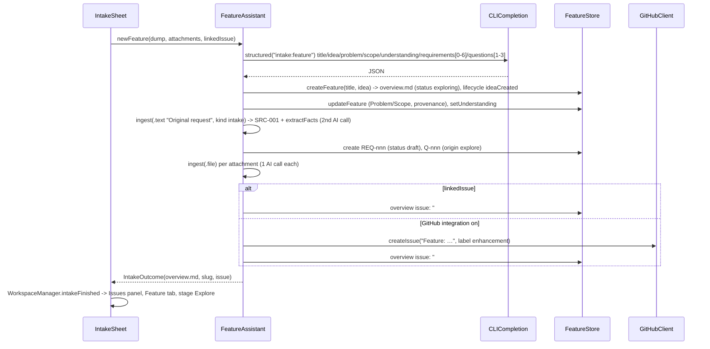
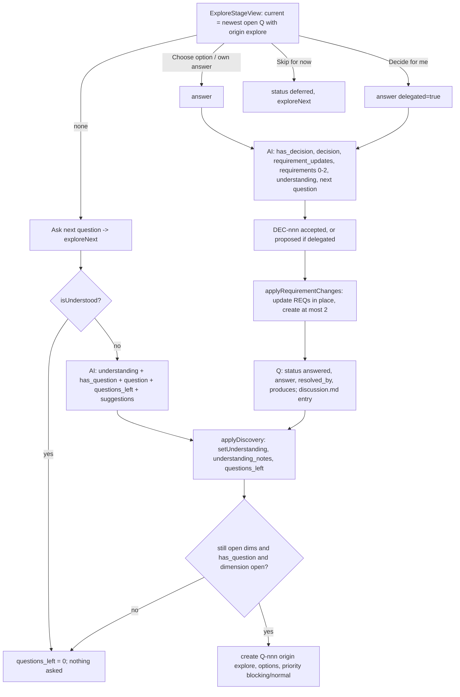
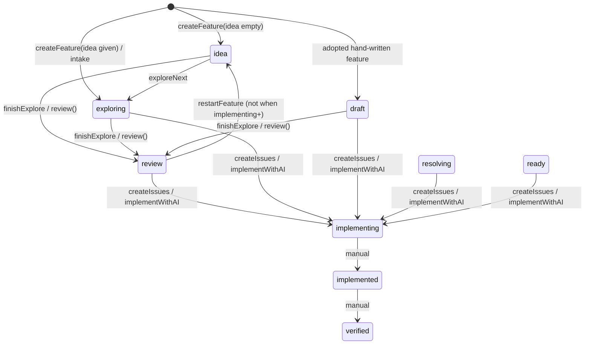

# Feature and Bug Workflow (Intake, Feature Specs on Disk)

This module turns loose descriptions into specifications stored as Markdown in the
repository. A feature is a folder `docs/features/<slug>/` holding an overview plus one file
per requirement, question, decision, finding, research note and source. A bug is one file
`docs/bugs/BUG-nnn-<slug>.md`. AI calls go through the user's Claude Code or Codex CLI, with
JSON-schema answers. The app parses each answer and writes the parts it keeps back to those
files. Everything the UI shows is read back from disk (`MarkView/Models/FeatureModels.swift:3-6`).

Related module docs: [app-shell-and-workspace](app-shell-and-workspace.md),
[editor-and-bridge](editor-and-bridge.md), [ai-assistants-and-dictation](ai-assistants-and-dictation.md),
[architecture-and-xray](architecture-and-xray.md), [semantic-index-and-insight](semantic-index-and-insight.md),
[git-github-terminal-lifecycle-usage](git-github-terminal-lifecycle-usage.md),
[build-release-testing](build-release-testing.md).

---

## 1. Purpose and responsibilities

**Owns**

- The on-disk schema of features, their objects, the implementation plan, the discussion log and bug reports. This covers IDs, statuses, vocabularies and link keys (`FeatureModels.swift`).
- Loading these files, polling them for outside changes, and writing them back safely: lossless YAML only, no overwrite on create, Trash instead of delete (`FeatureStore.swift`).
- Derived metrics:
  - understanding model
  - readiness conditions and score
  - traceability graph (incoming, outgoing, impact)
  - cleanup candidates
  (`FeatureModels.swift:260-436`)
- The AI facilitator (`FeatureAssistant`):
  - guided discovery (Explore)
  - answer → decision → requirements
  - "decide the rest", consolidation, research, review, finding resolution, "find outdated"
  - contextual actions on selected text, free-form discussion
  - planning, and creating GitHub issues
  (`FeatureAI.swift`)
- Adding sources: files, PDFs, audio, URLs, GitHub issues, notes, voice notes. The AI extracts candidate facts from each (`FeatureIngest.swift`).
- The four intake flows: New Feature, New Bug, I Need to Understand, New Research. Also bug investigation with question rounds (`FeatureIntake.swift`). New Research runs as a background job of its own (§5.9).
- Automatic lifecycle event capture for features: status and readiness transitions, git commits and GitHub captures (`FeatureStore.swift:558-728`).
- UI:
  - left panel Issues list and feature navigator
  - intake sheet
  - right panel Feature tab with the Explore, Review, Resolve and Build stages
  - bug investigation panel and cleanup sheet
  (`Views/FeatureNavigatorView.swift`, `Views/FeaturePanelView.swift`)

**Does NOT own**

- Running the CLI, parsing its output and usage accounting: `CLICompletion` ([ai-assistants-and-dictation](ai-assistants-and-dictation.md)).
- The YAML subset parser and writer: `MarkView/Models/FrontMatter.swift`. This module consumes it.
- GitHub API calls (`GitHubClient`, `GitHubStore`), git execution, the lifecycle event log file (`LifecycleLog`), lifecycle analytics and the lifecycle views ([git-github-terminal-lifecycle-usage](git-github-terminal-lifecycle-usage.md)).
- Handing a spec or bug to the Terminal assistant (`WorkspaceManager.implementWithAI` / `fixBugWithAI`, `WorkspaceManager.swift:3264-3284`).
- The "I Need to Understand" answer. It is delegated to the X-Ray temporary filter (`WorkspaceManager.swift:3241-3246`, [architecture-and-xray](architecture-and-xray.md)).
- Whisper transcription and dictation (`WhisperClient`, `DictationController`).
- `ImportanceRater` (`MarkView/Models/ImportanceRater.swift`) and `tools/importance-check.sh`. They are listed here on request, but belong to the X-Ray / Architecture filters: the callers are `ArchitectureStore.swift:1231,1313,1691`, `CodeExplainer.swift:285` and `WorkspaceManager.swift:850,857`. See section 3.6.

---

## 2. Files

| Path | Role |
|---|---|
| `MarkView/Models/FeatureModels.swift` | Value types: `FeatureObjectKind`, `FeatureVocabulary`, `FeatureObject`, `PlannedIssue`, `Feature` (loading, graph, readiness, cleanup), `BugReport`, `BugQuestion`, `featureSlug()`, `FeatureCleanup` |
| `MarkView/Models/FeatureStore.swift` | `@MainActor` store: setup and polling, reload, every write path, Trash, plan and discussion files, lifecycle capture, git history |
| `MarkView/Models/FeatureAI.swift` | `FeatureAssistant` (`@MainActor`): system prompt, context builder, JSON schemas, all AI operations on features, GitHub issue creation; `FeatureResult`, `DecisionCandidate`, `FeatureAction` |
| `MarkView/Models/FeatureIngest.swift` | `FeatureAssistant` extension: `SourceOrigin`, `ingest`, `extractFacts`, `setFact`, `readableText` (PDFKit, Whisper), `fetchText` (HTML to text) |
| `MarkView/Models/FeatureIntake.swift` | `IntakeKind`, `IntakeRequest`; `FeatureAssistant` extension: `newFeature`, `newBug`, `answerBug`, `investigateBug`, bug section helpers, `nextNumbered` |
| `MarkView/Models/ImportanceRater.swift` | X-Ray rating filters (not part of this workflow; see 3.6) |
| `MarkView/Views/FeatureNavigatorView.swift` | `LeftPanelView` (Files/Issues switch), `IssuesListView`, `IssueLinks`, `FeatureNavigatorView`, `FeatureStatusMenu`, `ReadinessBar`, `FeatureStatusDot`, `IntakeSheet` |
| `MarkView/Views/FeaturePanelView.swift` | `FeatureStage`, `FeaturePanelView` and the stage views: `ExploreStageView`, `ReviewStageView`, `ResolveStageView`, `BuildStageView`. Also the question, bug, source, finding and plan cards, `ObjectContextView` (trace, impact, history), `FeatureCleanupSheet`, `FlowLayout` |
| `MarkView/Models/FrontMatter.swift` | (dependency) Ordered YAML subset; `isLossless` guards rewrites (`FrontMatter.swift:52-54,83-96`) |
| `tools/importance-check.sh` | Live-CLI check of `ImportanceRater` against `Tests/Fixtures/importance` (currently broken, see 10) |
| `docs/features/*/`, `docs/bugs/*.md` | Real files produced by this module (examples in section 6) |

---

## 3. Key types

### 3.1 Value model (`FeatureModels.swift`)

- **`FeatureObjectKind`** (`:9-61`) maps each kind to its ID prefix and folder:

  | kind | prefix | folder |
  |---|---|---|
  | requirement | `REQ` | `requirements/` |
  | question | `Q` | `questions/` |
  | decision | `DEC` | `decisions/` |
  | finding | `F` | `findings/` |
  | research | `R` | `research/` |
  | source | `SRC` | `references/` |

  `of(id:)` finds the kind from the prefix before the first `-`.
- **`FeatureVocabulary`** (`:64-95`) holds every enum stored in front matter, in lower case (tables in section 6.3).
- **`FeatureObject`** (`:98-187`) holds `kind`, `id`, `url`, `front`, `body`.
  - `title`: front matter `title`, else the first non-empty body line (`:108-117`).
  - `links`: pairs from the link keys `depends_on, decisions, sources, blocking, resolved_by, produces, requirements, questions, related, supersedes, refs` (`:122-128`).
  - `acceptanceCriteria`: `- [ ]` / `- [x]` lines under any heading that contains "acceptance criteria" (`:131-147`).
  - `section(_:)`: the text of a `## ` section (`:150-162`).
  - `isBlocking` (`:165-167`) and `isClosed` (`:169-177`).
  - `load` takes `id` from front matter, falling back to the file name (`:181-186`).
- **`PlannedIssue`** (`:190-221`) is one entry of `implementation/plan.md`: `I-n`, title, summary, requirements, decisions, and `github` once the issue is filed.
- **`Feature`** (`:224-479`):
  - `isStructured`: `overview.md` exists. Hand-written feature folders without one are still listed, and their `.md` files are shown as `documents` (`:233-237,446-452`).
  - `status` defaults to `idea` when the folder is structured, else `draft` (`:252`).
  - Understanding: `understanding`, `openDimensions`, `isUnderstood`, `discoveryDone` (`:266-331`).
  - `isImplemented`: status is implementing, implemented or verified (`:262`). `isPastExplore`: status is not idea, exploring or draft (`:264`).
  - `nextID(kind)`: the maximum over the IDs in front matter *and* the file names in the folder, plus 1, formatted `%@-%03d` (`:338-346`).
  - Graph: `incoming`, `outgoing` and `impact(of:)`. Impact is a breadth-first search over requirements that link to the ID, plus a decision's `produces` list, plus the plan issues (`:351-390`).
  - Readiness: seven fixed conditions, plus "Implementation coverage" when a plan exists. The score is the mean ratio over the conditions with `total > 0` (`:394-436`).
  - `load(folder:)` reads the overview, up to 12 documents (200k chars each) to find issue references, every object folder and the plan (`:440-478`). `issueReferences` finds front matter `issue`/`issues`, GitHub issue and PR URLs, and "issue/epic/PR #n" (`:491-509`).
- **`BugReport`** / **`BugQuestion`** (`:513-575`) represent a bug file. Its questions live in front matter `questions` (IDs `BQ-n`). The bug statuses are `open, fixing, fixed, closed` (`:527`).
- **`featureSlug`** (`:578-581`) keeps ASCII letters and digits, turns every other character into `-`, and keeps at most 8 segments.
- **`FeatureCleanup`** (`:584-605`) has the categories requirements, questions, findings and decisions. `Feature.cleanupCandidates` defines what each category matches (`:291-313`).

### 3.2 `FeatureStore` — `@MainActor final class`, `ObservableObject` (`FeatureStore.swift:6-747`)

| Member | Notes |
|---|---|
| `features`, `bugs`, `hasFeaturesFolder`, `hasIssues`, `activeSlug`, `lastError` (published) | `features.didSet` runs `observeLifecycle()` (`:11-13`). `activeSlug` is saved per project (`:20-25`) |
| `assistant` | lazy `FeatureAssistant(store: self)` (`:42`) |
| `setup(root:)` / `reset()` | Starts a 3 s poll that checks the fingerprint every tick and runs the git lifecycle sync every 20th tick, about once a minute (`:59-93`) |
| `reload()` | Loads everything in a detached task. The result is dropped if `generation` changed meanwhile (`:96-111`) |
| `reloadSync(_ slug:)` | Synchronous reload after the app's own writes: one feature when a slug is given, else everything. Resets the fingerprint to `""` (`:234-246`) |
| `createFeature(title:idea:)` | Picks a unique slug (`-2`, `-3`…), writes `overview.md` and records the `ideaCreated` lifecycle event (`:201-230`) |
| `create(_:in:title:fields:body:provenance:)` | New object file, written with `.withoutOverwriting`. The ID is incremented while a file with that ID exists. Default status per kind, and `owner` for questions and decisions (`:250-284`) |
| `update` / `updateMany` / `updateFeature` / `updateBug` | Re-read the file from disk, refuse front matter that is not lossless, change it, stamp `updated`, write it, reload (`:288-301,417-427,451-466,471-488`). `updateFeature` creates an "adopted" overview for a hand-written feature (`:495-507`) |
| `cleanUp(_:ids:)` | Remaps links to `superseded_by` targets, following chains, or drops them; rewrites the plan; moves the files to the Trash (`:307-371`) |
| `deleteFeature` / `restartFeature` | Trash the folder, or trash everything the idea produced except sources. Neither is allowed once `isImplemented` (`:375-414`) |
| `approveRequirements`, `finishExplore`, `setStatus`, `setUnderstanding`, `savePlan`, `appendDiscussion`, `discussion` | See the flows in section 5 (`:430-556`) |
| `recordLifecycle`, `observeLifecycle`, `recordImplementationStarted`, `syncLifecycle(with:)`, `syncLifecycleWithGit` | Lifecycle capture (section 5.8) |
| `history(of:)`, `relativePath`, `locate`, `defaultOwner`, `lifecycleActor` | Helpers. The owner and actor come from `git config user.name` (`:166-182`) |

### 3.3 `FeatureAssistant` — `@MainActor final class`, `ObservableObject` (`FeatureAI.swift:66-1324`)

- Published state:
  - `running`: job keys held while the CLI call is in flight.
  - `preparing`: job keys held for the whole operation, including context building.
  - `results`: cards shown in the Feature tab.
  - `error` and `decideProgress`.
  (`:71-92`)
- `isRunning(key)` is true for a key in either set (`:86`). Keys look like `explore:<slug>`, `answer:<Q-id>`, `review:<slug>`, `resolve:<F-id>`, `issues:<slug>`, `bug:<BUG-id>`, `ingest:<SRC-id>`.
- `voice = WhisperClient()` records voice-note sources. The closures `database` and `gitHubClient` are wired by `WorkspaceManager.setUpFeatures` (`:76-80`, `WorkspaceManager.swift:3320-3324`).
- `run(...)` (`:121-148`) is the only path to the CLI. It:
  - rejects a second call with the same key
  - builds a `CLICompletion.Request` with the system prompt, schema, `readableFolder: store.root`, `effort = "low"`, a default timeout of 400 s and optional web access
  - drops the result if the open folder changed meanwhile
  - records token usage in the `SemanticDatabase`
- `system` (`:98-119`) is the facilitator prompt. The conversation (questions, options, notes) uses `ActionOutputLanguage.current`; the specification text is always English.
- `context(feature, focus:query:budget:)` (`:161-214`) builds the prompt context. The default budget is 45k characters:

  | Part | Limit |
  |---|---|
  | Overview | 6k |
  | Documents | 30k in total, 12k each |
  | Understanding | — |
  | Objects in focus, plus one hop of links | 5k each |
  | Digest of the other objects | excludes superseded |
  | Accepted source facts | — |
  | Related project documents from the search index | up to 5, excludes `docs/features/` |

### 3.4 Intake types (`FeatureIntake.swift:6-45`)

- **`IntakeKind`** has the cases `feature`, `bug`, `understand` and `research`, each with a title and a prompt text. Every `IntakeKind.allCases` menu (toolbar ⊞, its "From the open document" section, the file tree's "New from This Document") lists all four.
- **`IntakeRequest`** carries `kind`, `text`, `linkedIssue`, `attachments`, `targets` (New Research; nil = the open document), `loadIssue` and `loadPullRequest`. Setting `WorkspaceManager.intake` opens the sheet (`WorkspaceManager.swift:3223-3259`).
- **`IntakeOutcome`** carries `file`, `feature` and `issue`.

### 3.5 Views

- `LeftPanelView`: switches between Files and Issues, showing Issues only when `hasIssues`. It opens a feature in `FeatureNavigatorView` (`FeatureNavigatorView.swift:5-50`).
- `IssuesListView` (`:53-137`) lists features and bugs. The `+` buttons open the intake.
- `IntakeSheet` (`:403-652`) offers:
  - dictation, shown only when an OpenAI key is set
  - file drop and an "Add Files…" panel
  - "From GitHub Issue…", which loads the issue body and comments and links the issue
  - an option to add the bug analysis as a comment on the linked issue
- `FeaturePanelView` (`FeaturePanelView.swift:12-199`) shows one of two things:
  - a bug investigation panel when the active tab is a bug file (`BugPanelView`, `:572-648`)
  - otherwise the active feature: header with Clean up, Restart, Delete, Cycle Time, the status menu, the stage switcher, readiness and `LifecycleSection`; then `ObjectContextView` for the object open in the editor, the result cards, the stage view and `DiscussionInput`

### 3.6 `ImportanceRater` (X-Ray, for reference)

- A static `enum`. Each `Filter` has an id, name, criterion and levels.
  - The built-in `importance` filter has the levels `critical/high/normal/low` (`ImportanceRater.swift:16-17`).
  - User filters are stored as JSON in UserDefaults `ai.customFilters` (`:21-32`) and use the levels `strong/moderate/weak/none` (`:79`).
  - One process-wide `temporaryFilter` (id prefix `tmp-`) is never persisted (`:42-60`).
- `request(subject:filter:context:items:language:)` builds a request with no file access, the X-Ray model, effort `low` and a 240 s timeout (`:185-195`). `parse` drops unknown keys and levels (`:198-207`).
- `tools/importance-check.sh` compiles a throwaway Swift harness that rates the sections of `Tests/Fixtures/importance/*.md` with each CLI and compares the ratings with `expected.json`. It also runs a "Payment safety" custom-filter case (`tools/importance-check.sh:23-89`).

---

## 4. Internal interfaces

**Callers into this module**

| Caller | Call |
|---|---|
| `WorkspaceManager.openFolder` → `setUpFeatures` | `features.setup(root:)`, wiring of `assistant.database` and `assistant.gitHubClient` (`WorkspaceManager.swift:530,3320-3324`) |
| `WorkspaceManager` folder close | `features.reset()` (`WorkspaceManager.swift:1446`) |
| `GitHubStore.onPoll` | `features.syncLifecycle(with:)` (`WorkspaceManager.swift:3339`) |
| Editor selection menu (JS `featureAction('…')`, `Resources/Editor/index.html:1480+`) → `WebViewBridge` `featureAction` message (`Bridge/WebViewBridge.swift:319-323`) → `EditorView` delegate (`Views/EditorView.swift:844-846`) → `WorkspaceManager.runFeatureAction` (`WorkspaceManager.swift:3307-3317`) | `assistant.perform(action, selection:document:question:feature:)`. The action name is validated with `FeatureAction(rawValue:)` |
| Toolbar "New" menu (`Views/ContentView.swift:113`), issue and PR menus (`WorkspaceManager.startIntake`, `:3227-3259`) | Set `workspaceManager.intake` and present `IntakeSheet` (`ContentView.swift:170`) |
| `IntakeSheet.submit` → `WorkspaceManager.intakeFinished` | Opens the result, switches the left panel to Issues and the right panel to the Feature tab (`WorkspaceManager.swift:3287-3304`) |
| `BuildStageView` "Implement with AI" → `WorkspaceManager.implementWithAI` | Sends `/goal implement <path>` to the Terminal assistant, then `features.markImplementing` (status `ready/resolving/review/draft/exploring` → `implementing`, BUG-008) and `features.recordImplementationStarted` (`WorkspaceManager.swift`) |
| `BugPanelView` "Fix with AI" → `WorkspaceManager.fixBugWithAI` | Sets the bug status to `fixing` with `updateBug` and sends a fix prompt (`WorkspaceManager.swift:3277-3284`) |
| `TOCView` | Shows `FeaturePanelView` when `hasIssues` (`Views/TOCView.swift:26-31`) |
| `LifecycleViews` | Read `store.features` and `lifecycleEvents` (`Views/LifecycleViews.swift:22,106,206`) |
| `ArchitectureStore` | Reuses `FeatureAssistant.nextNumbered("RES", …)` and `FeatureStore.today` for saved X-Ray answers (`ArchitectureStore.swift:1465,1481`) |

**What this module calls**

| Callee | Used for |
|---|---|
| `CLICompletion.run` | Every AI call (`FeatureAI.swift:137`). Streaming `onDelta` is used only for free-text contextual actions (`:1093-1098`) |
| `SemanticDatabase.search`, `addUsage` | Related docs in the context (`FeatureAI.swift:216-225`); token and cost counter |
| `GitHubClient` | `createIssue` (with labels `enhancement` or `bug`, retried without the label), `commentIssue`, `issue(n)`, `gh issue view … closedByPullRequestsReferences`, `gh pr view … files`, `lifecycleCaptures`, `ciPassed` (`FeatureIntake.swift:152-155,223`, `FeatureAI.swift:1275-1321`, `FeatureStore.swift:670,687`) |
| `GitHubClient.execute(..., git: true)` | `git config user.name`, `git log`, `git grep -l -w <id> -- *.md`, `rev-parse`, `symbolic-ref` (`FeatureStore.swift:179,704,716-727,735`; `FeaturePanelView.swift:1536`) |
| `LifecycleLog.shared` | `record`, `events`, `claim`/`release` (one store per project records automatic events) (`FeatureStore.swift:563-574,587,662,698`; `LifecycleLog.swift:105-114`) |
| `AgentModelProbe`, `LifecycleGit`, `LifecycleModels` | Finding the model that answered, parsing commits (`FeatureStore.swift:626-636,704-709`) |
| `WhisperClient` | Transcribing voice notes and audio files (`FeatureIngest.swift:147`; `FeaturePanelView.swift:805-815`) |
| `PDFKit`, `URLSession` | Reading PDF sources and fetching URLs (`FeatureIngest.swift:141-176`) |
| `FileManager.trashItem` | Cleanup, delete and restart |

---

## 5. Runtime flows

### 5.1 New Feature intake



Source: `FeatureIntake.swift:52-149`, `FeatureNavigatorView.swift:626-651`, `WorkspaceManager.swift:3287-3304`.

If the first AI call fails, nothing is written and the sheet shows `assistant.error`. Once `createFeature` has run, later failures such as fact extraction or the GitHub issue leave the feature partly filled, with no rollback.

### 5.2 Guided discovery (Explore)



- `exploreNext` (`FeatureAI.swift:330-365`) moves the feature from `idea` to `exploring`.
- `answer` (`:452-518`) asks for the next question in the same AI call, so each answer costs one call (`:490-495`).
- `applyRequirementChanges` (`:522-547`) ignores IDs that are not live requirements, and creates at most 2 new requirements.
- `makeRequirement` writes `approved` once the feature is past Explore, else `draft` (`:287`).
- A question card also offers "Suggest another approach" (`moreOptions`, `:689-708`), "Show pros/cons" (`prosAndCons`, `:711-739`) and "Research this".
- **Decide the rest and finish** (`decideRest`, `:552-620`):
  - The AI makes up to 8 proposed decisions. Each lists the open questions it `answers`, plus requirement updates and new requirements.
  - Answered questions get `answered_by: ai`. The remaining open questions are set to `deferred`.
  - Every dimension still open is forced to `known`, `questions_left` is set to 0, and `finishExplore` runs.
  - Timeout 900 s.

### 5.3 Review, resolve, clean up

- **Review** (`review`, `FeatureAI.swift:794-841`):
  - A whole-spec review first calls `finishExplore` if discovery is done.
  - The AI returns findings with category, severity, perspectives, quote, target and interpretations.
  - A new finding is skipped when an open finding already has the same title (case-insensitive).
  - Status moves from `exploring/draft/idea` to `review`.
  - `focus` (an object ID) limits the review to one requirement ("Review requirement" in `ObjectContextView`).
- **Acceptance criteria** (`:844-867`) adds only the criteria that are new.
- **Resolve a finding**:
  - `resolutionOptions` (`:872-895`) sets `status: discussing`, `resolution_question` and `options[{label,text,consequence}]`.
  - `resolve` (`:900-928`) calls `closeFinding` (`:1049-1064`). That creates a decision (accepted, or proposed when delegated), sets the finding to `resolved` with `resolved_by`, appends a `## Resolution`, and adds the decision to every referenced requirement's `decisions`.
- **Decide all for me** (`decideAllFindings`, `:932-977`) works in chunks of 8 findings. It skips findings closed meanwhile, updates `decideProgress`, and stops at the first failed chunk.
- **Consolidate** (`:624-681`):
  - Offered in the UI above 30 active requirements (`FeaturePanelView.swift:948`).
  - Target size is `max(8, min(30, n/5))`.
  - Merged requirements become `superseded` with `superseded_by`. Dropped ones become `rejected` with `rejected_reason`.
- **Find outdated** (`markOutdated`, `:983-1046`) sets decisions to `superseded` (with `superseded_by` only when the replacement stays, and `outdated_reason`). It sets findings to `dismissed` with `dismissed_reason`.
- **Clean up** (`FeatureStore.cleanUp`, `:307-371`):
  - The sheet previews the candidates per category (`FeaturePanelView.swift:1576-1703`).
  - Each doomed ID maps to its `superseded_by` replacement, following chains through other doomed objects, or to nil.
  - List and scalar link keys in the surviving objects are rewritten, and a self-link is dropped. The plan is saved again only if an issue referenced a doomed ID. The files are moved to the Trash.
- **Resolve stage** (`FeaturePanelView.swift:1132-1218`) collects: blocking questions, contradictions, blocker/high findings, proposed decisions (Accept/Reject), `open-assumption` research claims ("Ask" creates a question), unknown dimensions ("Research"), and the other open questions.

### 5.4 Research, contextual actions, discussion

- `research` (`FeatureAI.swift:745-789`):
  - Runs with web access and a 900 s timeout.
  - Writes an `R-nnn` note with `topic`, `related` and `claims[{text,kind,source}]`.
  - If it is linked to an object, it appends its own ID to that object's `related`.
- `perform` (`:1070-1106`), for selected text:
  - `requirement`/`decision`/`question` create objects (`createFromSelection`, `:1113-1149`); decisions are `proposed`.
  - `research` delegates to `research`.
  - Every other action streams Markdown into a `FeatureResult`. `diagram` pulls out the ` ```mermaid ` block, which can be saved to `diagrams/<name>.md` (`saveDiagram`, `:1159-1168`). The view passes the fixed title "Diagram" (`FeaturePanelView.swift:288`).
- `chat` (`:1172-1203`):
  1. Appends the user message to `discussion.md`.
  2. Sends the context plus the last 12k characters of the discussion.
  3. Gets `reply`, `has_decision` and `decision` back.
  4. Appends the reply.
  A detected decision offers "Create Decision" (`saveDecision`, accepted, `sources: [discussion]`, `:1206-1212`).

### 5.5 Build: plan and GitHub issues

- `decompose` (`FeatureAI.swift:1222-1246`) works from the approved requirements, or all active ones when none are approved. The AI returns an epic of 2–10 issues. `savePlan` writes `implementation/plan.md` with IDs `I-1…`.
- Requirements can be dragged between issue cards; `IssuePlanCard.move` then calls `savePlan` (`FeaturePanelView.swift:1364-1373`).
- `createIssues` (`FeatureAI.swift:1250-1303`) handles each issue that has `github == nil`:
  1. Create the issue.
  2. Parse the number from the returned URL. On failure, stop so a retry cannot file a duplicate.
  3. Add `#n` to each requirement's `issues`.
  4. Save the plan after every issue.

  Afterwards it creates the epic issue if there is none, and moves the status from `ready/resolving/review/draft/exploring` to `implementing`. The button is disabled while approved requirements are not covered (`FeaturePanelView.swift:1285`).
- "Implement with AI" is covered in section 4 and 5.8.

### 5.6 Sources (ingest)

```mermaid
sequenceDiagram
    participant V as SourcesSection / newFeature
    participant A as FeatureAssistant.ingest
    participant S as FeatureStore
    participant C as CLICompletion
    V->>A: ingest(origin, slug)
    A->>A: read content (file: PDFKit/Whisper/UTF-8, image = ""; url: fetchText; issue: gh; text/voice)
    A->>S: create SRC-nnn (origin, file "", role "", facts [], body Origin [+ Content ≤60k])
    opt origin = file
        A->>A: detached copy -> references/SRC-nnn-<name>
        A->>S: update file:, append File link
    end
    A->>C: structured("ingest:SRC-nnn") role (enum), summary, facts[{text, certainty stated/likely}]
    A->>S: update role, facts (status pending), prepend ## Summary
```

- Source: `FeatureIngest.swift:19-120`.
- For a file source the text is not stored in the body; the AI is pointed at the copied file instead (`:57,90-91`).
- Facts are accepted, rejected or edited with `setFact` (`:123-133`). Only `accepted` facts go into the AI context (`FeatureAI.swift:205-209`).

### 5.7 New Bug and investigation rounds

```mermaid
sequenceDiagram
    participant U as IntakeSheet / BugPanelView
    participant A as FeatureAssistant
    participant F as docs/bugs/BUG-nnn-*.md
    participant G as GitHub
    U->>A: newBug(dump, attachments, linkedIssue, commentOnIssue)
    A->>A: id = nextNumbered("BUG"); copy attachments -> docs/bugs/assets/BUG-nnn-<name>
    A->>A: structured("intake:bug") title, summary, steps, expected, actual, severity, environment, suspected[], causes, missing, questions[≤3]
    A->>F: write front matter + sections (+ Attachments, Original description)
    alt linkedIssue and commentOnIssue
        A->>G: comment "### Analysis" on #n
    else no linked issue, GitHub on
        A->>G: createIssue(title, label bug) ; rewrite file with issue "#n"
    end
    loop per question round
        U->>A: answerBug(url, BQ-n, answer or "" = don't know)
        A->>F: BQ status answered/skipped; append to ## Clarifications
        A->>A: investigateBug: structured("bug:BUG-nnn") + settled[]
        A->>F: rebuild AI sections, keep Attachments/Clarifications/Original description; close settled BQs; add new BQs
    end
```

- Source: `FeatureIntake.swift:163-235,246-330`.
- Question budget: at most 3 open at a time, and no new questions once answered + open reach 8 (`bugQuestionLimit`, `:240,274`).
- For a hand-written report, the existing text becomes "Original description", and missing front matter is filled in (`:299-319`).
- The report is written before any GitHub call, "so a failed write leaves no orphan issue" (`:195`).

### 5.8 Status transitions

Feature status (`overview.md` `status`):



- Sources: `FeatureStore.swift:214,408,439-444,500`, `FeatureAI.swift:359,838-840,1296-1298`.
- `resolving`, `ready`, `implemented`, `verified` and `archived` are never set by code. The user sets them through `FeatureStatusMenu`, which offers every status (`FeatureNavigatorView.swift:343-360`).
- `finishExplore` also approves every draft and review requirement (`FeatureStore.swift:430-444`). It runs from:
  - `decideRest`
  - a whole-spec `review` when discovery is done
  - leaving the Explore tab when discovery is done (`FeaturePanelView.swift:134`)
  - "Go to Review" (`:413`)

Object statuses written by code:

| Kind | Transitions (code) |
|---|---|
| Requirement | `draft` on create, or `approved` if past Explore (`FeatureAI.swift:287`; intake requirements always `draft`, `FeatureIntake.swift:109-113`). `draft/review → approved` (`approveRequirements`). `→ superseded` or `rejected` (consolidation). Otherwise manual |
| Question | `open` on create. `→ answered` (`answer`, `decideRest`). `→ deferred` (`skip`, `decideRest`) |
| Decision | `proposed` (delegated, `decideRest`, selection) or `accepted` (user answer, user resolve, chat). `proposed → accepted/rejected` (Resolve stage). `→ superseded` (`markOutdated`) |
| Finding | `open` on create. `→ discussing` (`resolutionOptions`). `→ resolved` (`closeFinding`). `→ accepted-risk/dismissed` (buttons, `markOutdated`) |
| Source fact | `pending → accepted/rejected` (`setFact`) |
| Bug | `open` on create. `→ fixing` (`fixBugWithAI`). Manual `fixed`, `closed` |
| Bug question | `open → answered/skipped` (`answerBug`, or `settled` in `investigateBug`) |

Automatic lifecycle events (`FeatureStore.swift:576-728`):

| Event | Trigger |
|---|---|
| `ideaCreated` | `createFeature` (`:227`) |
| `questionsResolved` | The count of open questions goes from ≥1 to 0 (`:590`) |
| `specReady` | Status enters `ready`, or readiness reaches 100 (`:591-592`). Also back-filled when the status jumps into implementing without it, or on "Implement with AI" (`:593-605,612`) |
| `implementationFinished` | Status enters `implemented` (`:596-597`) |
| `implementationStarted` | `recordImplementationStarted`, at the click and without waiting for a reply (BUG-008): the model the running terminal has answered with (one read of its session log), else the model it was started with or the configured default |
| `mergedToMain` | A commit on the default branch that mentions the feature folder or its issues after implementation started, checked about once a minute (`:697-713`) |
| GitHub captures, `ciPassed` | From `GitHubClient.lifecycleCaptures` and `ciPassed`, on the GitHub poll, deduplicated by note (`:650-692`) |

The first load only records a baseline (no backfill). A restart suppresses events through `lifecycleQuiet` (`:36-38,398-399`).

### 5.9 New Research (feature `new-research-repository-grounded-analysis`)

- **Files**: `Models/ResearchDocument.swift` (pure: path, template, label check, sections, status, comment
  sections; `tools/tests/research-document-tests.sh`), `Models/ResearchJobs.swift` (per-window jobs, scope,
  settings), `Models/ResearchPrompt.swift`, `Views/ResearchViews.swift` (intake fields, bar, follow-up sheet).
- **Start**: the intake sheet (`.research`) takes the question, target documents (the open document by default),
  attachments (copied to `docs/research/assets/<id>/`), the output path `docs/research/<date>-<slug>.md` and the
  per-folder web opt-out. AI Tools › Deep Research… opens the same sheet; the old `research` terminal prompt is gone.
- **Job**: `ResearchJobs` (owned by `WorkspaceManager.research`) runs `CLICompletion` with the selected backend,
  `readableFolder` = root, web tools when allowed (Claude gets `--allowedTools WebSearch,WebFetch`: headless runs
  cannot ask), timeout `research.timeoutMinutes`. The scope list (git-listed text files ≤ 1 MB, no vendor,
  lock, minified or binary files) goes into the prompt. `CLICompletion.Activity.webSearch/webFetch` and
  `Result.refused` give the real `web_queries` and fetched URLs.
- **Write**: the app renders the document from the AI's Summary / Findings / Recommendations; it adds the
  front matter, title, question and Sources, and relabels a finding as `[AI inference]` when it lacks one label,
  a project fact lacks an existing path or an external fact a URL. Cancel, error, timeout, refused web or a
  backend without web (Cline, Copilot) save what was produced under `> ⚠️ Incomplete: …` and `status: incomplete`.
- **Continue / deepen** (bar under the editor, for any open `type: research` file, including X-Ray's saved
  answers): unsaved edits are saved or the action is cancelled; the job appends `---` + `## Follow-up N: … (date)`
  to the file as it is when the job ends. "Retry incomplete part" is pre-selected when the latest section is
  incomplete; a retry names its section (`*Retry of the incomplete Follow-up 2.*`) and `status` becomes
  `complete` once every incomplete section has a resolved retry.
- **Comments** (DEC-017): the editor's ✦ menu shows "Revise With Comment" for `type: research` documents. The AI
  returns the smallest heading-bounded section around the selection revised; it replaces that section only if it
  is unchanged on disk. The selection comes from the rendered view, so matching ignores Markdown syntax and
  typographic punctuation (`ResearchDocument.plain`).
- **Open tabs**: `researchDocumentChanged` reloads an unmodified tab, or applies the same append/replace to a tab
  with unsaved edits.

---

### 5.10 Start a Project from Scratch (feature `start-a-project-from-scratch`)

Entry points: the welcome screen's **New Project...** (with Resume/Discard for unfinished drafts), File › New
Project… (a window with a folder opens a new window for it, `MarkViewApp.pendingNewProject`).

1. **Draft** (`NewProjectFlow`, `ProjectDraftStore`): the idea is saved at once as `ProjectDraft`; the draft's
   `workspace/` is the root of a separate `FeatureStore` (`recordsLifecycle = false`) and its `FeatureAssistant`
   (`projectDiscovery = true`: an extra system-prompt paragraph, a project-worded intake prompt, and `answer()`
   asks a new question only when no other question is open). `gitHubClient` stays nil, so no issue is filed (DEC-021).
2. **Clarify** (`NewProjectSheet` › `ClarifyStep`): the brief (overview Idea/Problem/Scope, requirements,
   decisions) and the discovery's own `QuestionCard`, blocking questions first. **Confirm Brief** needs a goal and
   no open blocking question (`ProjectConfirmation`, DEC-016); it writes `confirmed: <date>` to the overview.
3. **Create** (`ProjectBootstrap.run`): parent folder + name; the folder is created only if the path does not
   exist (no intermediate directories). The specification folder is copied to `docs/features/<slug>/`, a README
   and `.gitignore` (`.dde/`) are written, `git init -b main`; nothing is committed. Each stage is recorded in
   the draft (`createdPath`, `filesWritten`, `gitInitialized`) so Retry continues only in that folder. The draft is
   removed after success and `WorkspaceManager.openCreatedProject` opens the folder with the spec selected.
4. **GitHub** (`GitHubPublisher`, `GitHubPublishView`), also from the Git tab's cloud button and File › Publish
   to GitHub…: account and owners from `gh`, name, explicit visibility; `check()` refuses another origin, a repo
   without push access, and an existing repo with history unless MarkView created/pushed it or origin already
   points to it. `publish()`: `gh repo create` (only if still missing), commit of the reviewed files, `origin`
   added only when missing, `git push -u` with gh as credential helper for HTTPS, then remote branch == HEAD and
   upstream `origin/<branch>`, then `activateGitHub` (turns `settings.github.enabled` on and waits for the repo in
   `GitHubStore.repos`). Progress lives in `.dde/github-connection.json`.

## 6. Data model and persistence

### 6.1 Layout

```
docs/features/<slug>/
  overview.md                 # feature front matter + Idea / Problem / Scope (or Documents)
  discussion.md               # "### <speaker> · <date>" log
  requirements/REQ-001.md …
  questions/Q-001.md …
  decisions/DEC-001.md …
  findings/F-001.md …
  research/R-001.md …
  references/SRC-001.md …     # + SRC-001-<original file name> copies
  implementation/plan.md
  diagrams/<name>.md          # saved Mermaid diagrams
  <any>.md                    # hand-written documents, listed as "Documents"
docs/bugs/
  BUG-001-<slug≤50>.md
  assets/BUG-001-<file>
```

- IDs are `<PREFIX>-%03d`, and are unique within a feature folder only (`FeatureModels.swift:338-346`). A feature has no ID other than its slug (front matter `id` = slug).
- Bug IDs are `BUG-%03d`, unique within `docs/bugs/` (`FeatureIntake.swift:424-431`).
- Plan issues are `I-n`, renumbered on every `decompose`. Bug questions are `BQ-n`.
- All dates are ISO `yyyy-MM-dd` (`FeatureStore.swift:186-192`).
- Files are written atomically as UTF-8. The front matter is YAML in key order, then a blank line, then the body (`FrontMatter.swift:99-101`).
- In the real examples (`docs/features/lifecycle-event-log-cycle-time-analytics/`, `voice-input-for-text-prompts/`, `ai-agent-usage-quota-tracker-codex-claude-code/`), the question text, options and `understanding_notes` are in Russian (the conversation language). Requirement and decision text is in English, as `system` requires.

### 6.2 Front matter fields

Common to every object file (`FeatureStore.swift:260-272`, `:296`):

| Field | Meaning |
|---|---|
| `type` | `requirement`, `question`, `decision`, `finding`, `research` or `source` (`FeatureObjectKind.rawValue`) |
| `id` | e.g. `REQ-004`. The file name is used when missing |
| `feature` | slug of the feature |
| `title` | display title |
| `status` | per-kind vocabulary. Research and source files have none |
| `owner` | questions and decisions only (git `user.name`) |
| `created` / `updated` | ISO date. `updated` is stamped on every app rewrite |
| `provenance` | free text, e.g. "Generated by AI (guided discovery)", "Chosen by AI (F-001)", "Extracted from the feature intake" |

`overview.md` (type `feature`):

| Field | Written by | Notes |
|---|---|---|
| `type: feature`, `id: <slug>`, `title`, `status`, `owner`, `created`, `provenance` | `createFeature` / `adoptedOverview` | `FeatureStore.swift:210-218,496-504` |
| `understanding` | map: 11 dimensions → `known/partial/unknown/n/a` | `setUnderstanding`, `FeatureStore.swift:509-518` |
| `understanding_notes` | map: dimension → note | `FeatureAI.swift:403-416` |
| `questions_left` | integer as string | AI estimate |
| `issue` | `"#n"` | intake (`FeatureIntake.swift:134,145`) |
| `issues` | read only | parsed by `issueReferences` |
| `restarted` | date | `restartFeature` |

Requirement (`REQ`):

| Field | Values |
|---|---|
| `req_type` | `functional, non-functional, ux, security, performance, reliability, privacy, analytics, operational, compliance` |
| `status` | `draft, review, approved, rejected, superseded` |
| `depends_on`, `decisions`, `sources` | ID lists. `sources` may also hold a document path, `discussion`, a `Q-`, `DEC-` or `SRC-` ID |
| `issues` | `"#n"` list, set by `createIssues` |
| `superseded_by`, `rejected_reason` | consolidation |
| `related` | research links |

The body has `## Statement` and `## Acceptance Criteria` with `- [ ]` items (`FeatureAI.swift:284-285`).

Question (`Q`):

| Field | Values |
|---|---|
| `q_type` | `product, technical, architecture, ux, security, business, research, clarification` |
| `priority` | `blocking` or `normal` |
| `origin` | `explore` (discovery and intake questions) |
| `dimension` | one understanding dimension |
| `blocking` | list of requirement IDs it blocks (always written `[]` by code) |
| `options` | list of `{label, text, pros[], cons[]}` |
| `status` | `open, answered, deferred` |
| `answer`, `answered_by: ai`, `resolved_by: DEC-…`, `produces: [REQ-…]` | set on answer |
| `refs`, `sources` | selection or assumption origin |

The body has `## Question`, `## Why it matters`, optionally `## Options`, and `## Answer`.

Decision (`DEC`):

| Field | Values |
|---|---|
| `status` | `proposed, accepted, rejected, superseded` |
| `sources` | the question, finding or document it came from |
| `produces` | requirement IDs |
| `superseded_by`, `outdated_reason` | `markOutdated` |

The body has `## Context`, `## Alternatives` (numbered), `## Decision`, `## Reason` and `## Consequences` (`FeatureAI.swift:299-319`).

Finding (`F`):

| Field | Values |
|---|---|
| `category` | `completeness, ambiguity, contradiction, edge-case, architecture, security, ux, operations, open-question, related-docs, external-research` |
| `severity` | `blocker, high, medium, low` |
| `perspectives` | from `Product, UX, Architecture, Backend, Frontend, Security, QA, Reliability, Operations, Data, Privacy, Business` |
| `refs` | object ID or document path. Free text from the AI, not validated |
| `quote`, `interpretations` | strings and a list |
| `status` | `open, discussing, resolved, accepted-risk, dismissed` |
| `resolution_question`, `options[{label,text,consequence}]` | `resolutionOptions` |
| `resolved_by`, `answered_by`, `dismissed_reason` | on close |

The body has `## Finding`, a quote block, `## Possible interpretations` and `## Resolution`.

Research (`R`): `topic`, `related`, and `claims[{text, kind, source}]`. `kind` is one of `project-fact, external-fact, ai-inference, user-decision, open-assumption`. The body has `## Topic`, `## Summary`, `## Claims` and `## Open questions` (`FeatureAI.swift:768-782`).

Source (`SRC`):

| Field | Values |
|---|---|
| `origin` | `intake`, `notes`, `file`, `voice`, the URL, or the GitHub issue URL |
| `file` | name of the copy next to it (`SRC-nnn-<name>`) or `""` |
| `role` | `ui-reference, external-research, previous-implementation, related-specification, stakeholder-input, architecture-reference, api-documentation, code, meeting-notes, requirements` |
| `facts` | list of `{text, certainty: stated/likely, status: pending/accepted/rejected}` |

The body has `## Summary`, `## Origin`, `## Content` (up to 60k, not for files) and a `File:` link.

`implementation/plan.md` (type `plan`, `FeatureStore.swift:521-541`):

| Field | Values |
|---|---|
| `feature`, `title` | slug, epic title |
| `epic` | GitHub issue number of the epic |
| `issues` | list of `{id: I-n, title, summary, requirements[], decisions[], github}` |
| `updated` | date |

The body is regenerated on every save (`# Implementation plan — …`, `## I-n: title (#n)`, `Requirements:`, `Decisions:`), so hand edits to the body are lost.

`discussion.md`: `# Discussion — <title>`, then `### <speaker> · <date>` blocks. The speakers are the git user or "User", "AI", "Answer to Q-nnn" and "AI decided the rest" (`FeatureStore.swift:544-550`).

Bug (`docs/bugs/BUG-nnn-*.md`, `FeatureIntake.swift:198-209`):

| Field | Values |
|---|---|
| `type: bug`, `id: BUG-nnn`, `title` | |
| `status` | `open, fixing, fixed, closed` |
| `severity` | `critical, high, medium, low` |
| `issue` | `"#n"` |
| `reporter`, `created`, `provenance` | |
| `questions` | list of `{id: BQ-n, text, why, options[{label,text}], status: open/answered/skipped, answer}` |

The body has `# Title`, then `## Summary`, `## Steps to reproduce`, `## Expected`, `## Actual`, `## Environment`, `## Suspected code`, `## Likely causes` and `## Missing information`. After those come the kept sections `## Attachments`, `## Clarifications` and `## Original description`. `Original description` runs to the end of the file, so its own `## ` headings do not split it (`FeatureIntake.swift:406-417`).

### 6.3 Understanding and readiness

- There are 11 dimensions: Problem, Target Users, Primary Workflow, Permissions, Failure Scenarios, Data Model, Notifications, Security, Analytics, Dependencies, Acceptance Criteria (`FeatureModels.swift:86-88`). A missing dimension reads as `unknown`.
- Readiness conditions (`FeatureModels.swift:403-427`):
  - Feature understood
  - Requirements approved
  - Acceptance criteria defined
  - Blocking questions resolved
  - Blocker/high findings closed
  - Contradictions resolved
  - Decisions accepted
  - Implementation coverage, only when a plan exists
- The requirement conditions use `max(count, 1)` as the total, so an empty spec counts 0/1 and does not score as ready (`:414-416,429-436`).

### 6.4 Outside the repository

| Store | Key / path | Format |
|---|---|---|
| UserDefaults | `features.active.<first 12 chars of ContentHash(root path)>` | active slug per project (`FeatureStore.swift:53-55`) |
| `PanelLayout` (per window) | `layout.leftPanel` | `files` or `issues` (`FeatureNavigatorView.swift`) |
| `PanelLayout` (per window) | `layout.issuesFeature` | slug of the feature open in the Issues list. Per window, not per project |
| `PanelLayout` (per window) | `feature.stage` | `Explore/Review/Resolve/Build` (`FeaturePanelView.swift`) |
| `PanelLayout` (per window) | `layout.navigatorTab` | right panel tab, set by `intakeFinished` and `runFeatureAction` |

The `PanelLayout` keys hold the last choice only to seed a new window and relaunch (BUG-004).
| UserDefaults | `ai.customFilters` | JSON `[Filter]` (ImportanceRater) |
| UserDefaults (read) | `com.markview.dde.openai.apikey` | OpenAI key, which shows the dictation button (`FeatureNavigatorView.swift:422`) |
| App Support | `~/Library/Application Support/MarkView/lifecycle-events.jsonl` | lifecycle events written through `LifecycleLog` (`LifecycleLog.swift:23-24`) |
| SemanticDatabase | usage counter | tokens and cost for every AI call (`FeatureAI.swift:139`) |

Settings read indirectly: `actions.outputLanguage` (conversation language), `AIAssistantPreferences` backend and model, `settings.github.enabled` (through the availability of `gitHubClient()`), `settings.github.idleInterval` (throttles `syncLifecycle`, `FeatureStore.swift:663`), `settings.xray.<tool>Model` (ImportanceRater).

---

## 7. Concurrency and threading

- `FeatureStore`, `FeatureAssistant` (with its extensions in `FeatureIngest.swift` and `FeatureIntake.swift`) and `LifecycleLog` are `@MainActor`. All state changes and **all file writes by the store** run on the main thread.
- Off the main thread:
  - `reload()` and the fingerprint (`Task.detached`, `FeatureStore.swift:100,117`)
  - the file copy in `ingest` (`FeatureIngest.swift:65`)
  - `answeringModel` polling (`Task.detached(priority: .utility)`, `FeatureStore.swift:615`)
  - `readableText` and `fetchText`, which are `nonisolated static`
  - the CLI and git subprocesses (awaited)
- Synchronous file I/O on the main thread:
  - `reloadSync()` without a slug re-reads every feature, including 12 documents × 200k characters each for issue references. It runs after `createFeature`, `deleteFeature`, every `updateBug` and `newBug` (`FeatureStore.swift:228,241,384,486`; `FeatureIntake.swift:233`).
  - `update`, `updateMany` and `create` read, write and list folders synchronously. Consolidation writes hundreds of files in one `updateMany` (`FeatureStore.swift:417-427`).
  - `cleanUp` trashes files synchronously, deferred one runloop turn so the spinner can draw (`FeaturePanelView.swift:1652-1656`).
  - `context()` reads the feature documents from disk (`FeatureAI.swift:166-171`). `discussion()` reads `discussion.md` (`FeatureStore.swift:553-556`).
  - `newBug` copies attachments and writes the report on the main actor (`FeatureIntake.swift:169-172,211-212`).
- `features.didSet → observeLifecycle()` computes `readiness` for every feature on every reload (`FeatureStore.swift:11-13,583-600`).
- Races with outside writers:
  - `generation` drops background reloads that started before an app write (`FeatureStore.swift:31-32,104,118`). `reloadSync` sets `fingerprint = ""`, so the next poll does one more full background reload (`:245`).
  - `update*` re-reads each file from disk just before writing (`:288-290`), which keeps concurrent edits in the editor, git or the AI terminal. It does not merge an edit made *during* a long AI call when the change is computed from the AI answer. Example: `investigateBug` re-reads, but rebuilds every non-kept section from the AI output (`FeatureIntake.swift:296-314`).
  - `create` writes with `.withoutOverwriting` and bumps the ID while a file with that ID exists (`FeatureStore.swift:255-258,277`).
- Multiple windows: `LifecycleLog.claim` lets only the first live store record automatic events for a project (`LifecycleLog.swift:105-114`). `recordCapture` deduplicates by stage and note (`FeatureStore.swift:650-655`).
- Folder switch: `run` drops a result when `store.root` changed (`FeatureAI.swift:130,138`). Multi-call flows such as `newFeature` check only per call. Later writes then find no feature for the slug and do nothing (the `guard let feature = feature(slug)` checks).

---

## 8. Error handling and edge cases

- Errors appear in the Feature tab from `store.lastError` or `assistant.error` (`FeaturePanelView.swift:171-183`). They are never thrown to callers. Operations return `nil` or `false`, or do nothing.
- **Lossless guard**: front matter with comments or structures the YAML subset cannot model is never rewritten. `update` and `updateFeature` set an error (`FeatureStore.swift:291-293,457-459`); `updateMany` skips such files silently (`:421`).
- **Write failures ignored**: `updateMany`, `appendDiscussion` and `saveDiagram` use `try?` (`FeatureStore.swift:424,549`; `FeatureAI.swift:1166-1167`).
- **Duplicate job**: `run` refuses a key that is already running, with an error (`FeatureAI.swift:123-126`). `createIssues` returns silently (`:1256`).
- **Issue number unreadable** after creation: the loop stops with an error, the progress so far is saved, and retrying does not re-create issues that have a number (`FeatureAI.swift:1276-1279,1299-1302`). The epic number, however, is not checked (see 10).
- **Label missing**: `createIssue` retries without the label (`FeatureIntake.swift:152-155`). Every other GitHub failure in `newFeature`/`newBug` is swallowed (`try?`). The feature or report still exists, without an `issue`.
- **AI IDs validated**: `requirement_updates.id`, `answers`, `merges`, `dropped`, `markOutdated` IDs and `decideAllFindings` IDs are intersected with the existing sets (`FeatureAI.swift:526-527,589,661,668,1026,1031,964`). The plan's `requirements`/`decisions` from `decompose` and a finding's `refs` are **not** validated (`:1240-1244,829-833`).
- **Hand-written features** (no `overview.md`) are listed and readable. The first app write creates an adopted overview listing the documents (`FeatureStore.swift:453-455,495-507`). Restart is disabled for them (`:393`).
- **Hand-written bugs**: front matter is added, the text is kept as "Original description" (`FeatureIntake.swift:299-319`). `BugReport.key` falls back to the first 7 characters of the file name (`FeatureModels.swift:534`).
- **URL sources** accept only `http`/`https`, have a 30 s timeout, reject a non-2xx response, and keep the first 3 MB for text conversion (`FeatureIngest.swift:155-163`).
- Image sources yield empty text; the AI is told the path so it reads the image itself. Audio needs an OpenAI key (Whisper), otherwise it yields empty text (`FeatureIngest.swift:145-150`).
- Delete and restart are disabled once implementation started (`FeatureStore.swift:376,393`; `FeaturePanelView.swift:93-99`). Everything goes to the Trash, so it can be restored.
- A non-ASCII title gives an empty slug, so the feature folder is named `feature` (`FeatureModels.swift:578-581`, `FeatureStore.swift:203-204`). The bug file then ends in `BUG-nnn-.md` (`FeatureIntake.swift:196`).

---

## 9. Extension points and recipes

- **Add an object kind**:
  1. Add a case to `FeatureObjectKind` with its prefix, folder, title and icon (`FeatureModels.swift:9-54`).
  2. If it needs a status, add a vocabulary to `FeatureVocabulary`, a default status in `FeatureStore.create` (`:267`), a branch in `isClosed` and one in the `ObjectContextView.statusMenu` switch (`FeaturePanelView.swift:1421-1429`).
  3. Add it to the digest loop in `context()` if the AI should see it (`FeatureAI.swift:191`).

  The loaders and the navigator pick it up automatically (`FeatureModels.swift:466-473`; `FeatureNavigatorView.swift:189`).
- **Add a link relation**: add the key to `FeatureObject.links` (`FeatureModels.swift:123-124`), to the `listKeys`/`scalarKeys` in `cleanUp` (`FeatureStore.swift:334-336`) and to the `relation` labels (`FeaturePanelView.swift:1499-1504`).
- **Add a contextual action**:
  1. Add a `FeatureAction` case with its title and instruction (`FeatureAI.swift:26-61`).
  2. Add the menu item in `Resources/Editor/index.html` (`featureAction('<rawValue>')`, around line 1480).
  3. Keep the raw value identical in Swift and JS: the bridge passes it through unchanged and `runFeatureAction` rejects unknown names (`WorkspaceManager.swift:3308`).
- **Add a readiness condition**: append it in `readinessConditions` (`FeatureModels.swift:412-426`). A condition with `total == 0` does not count toward the score.
- **Add an AI operation**:
  - Write an `async` method on `FeatureAssistant` that inserts a `preparing` key, builds `context(feature, focus:)` plus a task, calls `structured(key, …)` with a schema from the helpers (`object`, `array`, `string`, `strings`, `:263-269`), and writes the result only through `store.create`/`update`/`updateMany`.
  - Gate the UI on `assistant.isRunning(key)`.
  - Validate every ID the AI returns against the feature.
- **Add a source type**: add a `SourceOrigin` case, its reading branch in `ingest` and its `provenance` (`FeatureIngest.swift:9-85`), and a menu entry in `SourcesSection.addMenu` (`FeaturePanelView.swift:798-823`).
- **Add an intake kind**: extend `IntakeKind` (`FeatureIntake.swift:6-25`), the sheet's `icon`, `footnote` and `submit` switches (`FeatureNavigatorView.swift:605-651`) and `WorkspaceManager.startIntake(fromDocument:)` (`:3249-3259`).
- **Bridge rule**: a change to the `featureAction` message must update `WebViewBridge.swift:319-323`, `EditorView.swift:844-846` and `index.html` together (see [editor-and-bridge](editor-and-bridge.md)).

---

## 10. Risks, tech debt and oddities

1. **Main-thread file I/O**, against the project rule in CLAUDE.md that file work stays off the main thread. `reloadSync()` with a full `loadAll`, `update`/`updateMany`/`create`, `cleanUp`, `context()` document reads and `newBug` attachment copies all run on the main actor (`FeatureStore.swift:194-197,234-246,417-427`; `FeatureAI.swift:166-171`; `FeatureIntake.swift:169-172`; `FeaturePanelView.swift:1652-1656`). Large specs, where consolidation touches hundreds of files, can beachball.
2. **Polling cost**: every 3 s the whole of `docs/features` and `docs/bugs` is walked for modification dates (`FeatureStore.swift:66-75,143-152`). Every app write resets the fingerprint, which forces another full reload (`:245`). `observeLifecycle` computes readiness for all features on every `features` assignment (`:11-13,585`).
3. **Duplicate epic risk**: after the epic issue is created, a URL without a parseable number leaves `epic = nil` (`FeatureAI.swift:1293`). The next "create issues" files another epic. The per-issue path guards against this (`:1276-1279`); the epic path does not.
4. **Bug ID race**: `nextNumbered("BUG")` followed by `write(..., atomically: true)` has no `withoutOverwriting` (`FeatureIntake.swift:166,212,230`). Two windows or a concurrent git pull can overwrite a report. Feature objects are protected (`FeatureStore.swift:277`); bugs are not.
5. **Unvalidated AI output**: plan issue `requirements`/`decisions` (`FeatureAI.swift:1240-1244`) and finding `refs` (`:833`) are stored verbatim. `openTarget` guards only against `..` (`FeaturePanelView.swift:1064`).
6. **UI state per window, not per project**: `feature.stage` and `layout.issuesFeature` live in the window's `PanelLayout` (BUG-004), so two windows no longer share them. A window that switches projects keeps them, and a stale `issuesFeature` slug falls back to the list.
7. **Plan body regenerated**: `savePlan` rebuilds the whole body (`FeatureStore.swift:530-536`), so hand edits below the front matter are lost on the next plan change or cleanup.
8. **ASCII-only slugs**: non-Latin titles, such as Russian, which the examples show is the conversation language, collapse to `feature`, `feature-2`… and `BUG-nnn-.md` (`FeatureModels.swift:578-581`).
9. **`PlannedIssue` fallback ID** is random (`UUID().uuidString.prefix(4)`) when `id` is missing (`FeatureModels.swift:214`). It changes on every load, which breaks drag and drop between issue cards for hand-written plans.
10. **Readiness flapping**: `specReady` is recorded every time readiness climbs back to 100, for example after a new finding is resolved (`FeatureStore.swift:591-592`). The feature doc (plan I-3) says this is intended, but the analytics must cope with it.
11. **Swallowed failures**: `updateMany` skips non-lossless files without telling the user (`FeatureStore.swift:421`). `appendDiscussion` and `saveDiagram` ignore write errors. GitHub issue creation in the intake ignores errors (`FeatureIntake.swift:152-155`).
12. **Misplaced doc comment**: "Understanding dimension → known | partial…" sits on `isImplemented` instead of `understanding` (`FeatureModels.swift:260-262`).
13. **Consolidation threshold mismatch**: the UI offers it above 30 requirements (`FeaturePanelView.swift:948`), the method runs above 3 (`FeatureAI.swift:629`).
14. **`tools/importance-check.sh` is broken**:
    - It extracts CLI helpers from `MarkView/Models/AIConsoleEngine.swift`, which no longer exists (`tools/importance-check.sh:19`).
    - It passes a `readableFolder:` argument that `ImportanceRater.request` does not accept (`tools/importance-check.sh:36,68-69` vs `ImportanceRater.swift:185-186`).
    - It does not compile `CodeExplainer.swift`, which defines `editorLines`, used at `ImportanceRater.swift:212`.

    `ImportanceRater` is also an X-Ray concern kept in this module's file list; its `temporaryFilter` is unsynchronized global mutable state (`ImportanceRater.swift:42`).
15. **Sensitive content leaves the machine**:
    - Every call sends feature content, documents and search snippets to the chosen CLI, with read access to the whole project root (`FeatureAI.swift:131-132`). `research` also enables the web (`:765`).
    - `newBug` posts the full report to a GitHub issue, **including the user's "Original description"** and links to attachments (`FeatureIntake.swift:193,219-220`). `newFeature` posts the idea, problem and scope (`:136-141`). On a public repository this publishes whatever the user pasted, such as logs or tokens.
    - Bug attachments are copied into `docs/bugs/assets/` inside the repository (`:170-172`), where they can be committed.
    - Imported GitHub issue bodies and fetched web pages go into prompts unfiltered, which is a prompt-injection surface. The CLI is read-only (`CLICompletion.swift:6-9`).
16. **No automated tests** for feature parsing, `nextID`, `cleanUp` link rewriting or `bugSections`. Only `tools/tests/lifecycle-tests.sh` covers the lifecycle duration rules.

---

## Glossary

| Term | Meaning |
|---|---|
| Feature workspace | `docs/features/<slug>/`: the overview plus object folders |
| Structured / hand-written feature | Has `overview.md` made by the app / only loose `.md` documents (`isStructured`) |
| Object | One REQ, Q, DEC, F, R or SRC file |
| Understanding dimension | One of 11 aspects rated known, partial, unknown or n/a |
| Guided discovery (Explore) | AI loop asking one question at a time about open dimensions |
| Delegated ("Decide for me") | The AI chooses the answer or resolution; the decision is recorded as `proposed` |
| Readiness | Mean of the measurable readiness conditions, 0–100 |
| Finding | Review problem with category and severity; resolved by a decision |
| Consolidation | Merging requirements; the old ones become `superseded` with `superseded_by` |
| Cleanup | Moving outdated objects to the Trash and remapping links to their replacements |
| Source / fact | Imported material (`SRC`) and the candidate statements extracted from it, which the user accepts |
| Plan / epic | `implementation/plan.md`: issues `I-n` that become GitHub issues under an epic |
| Intake | New Feature, New Bug or I Need to Understand sheet |
| Bug question (`BQ-n`) | Investigation question stored in the bug's front matter |
| Provenance | Front matter note on where an object came from |
| Lossless front matter | YAML the app can rewrite without losing comments or structure (`FrontMatter.isLossless`) |
| Lifecycle event | Timestamped stage (idea created … merged to main) in `lifecycle-events.jsonl` |
| Job key | `"<operation>:<id>"` string in `running`/`preparing` that deduplicates and gates UI spinners |
