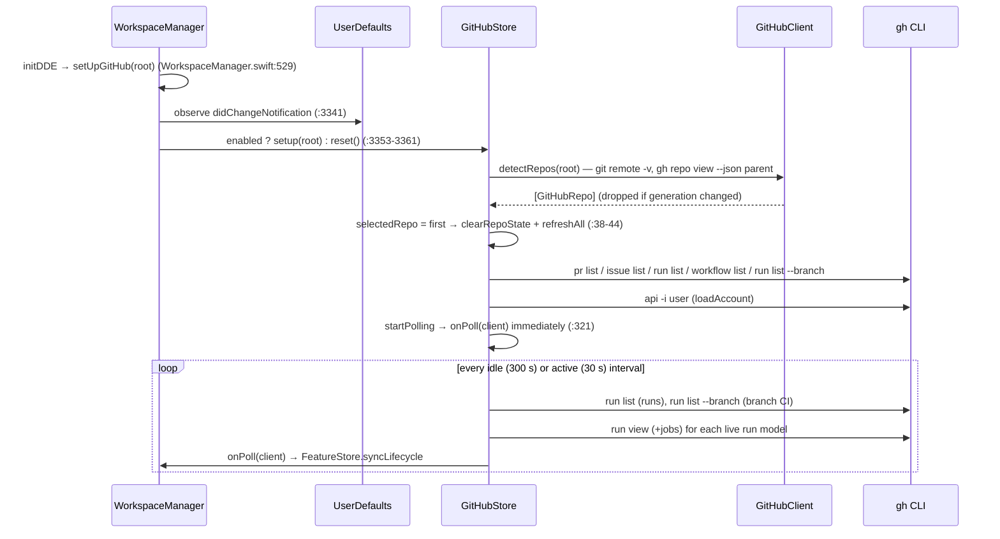
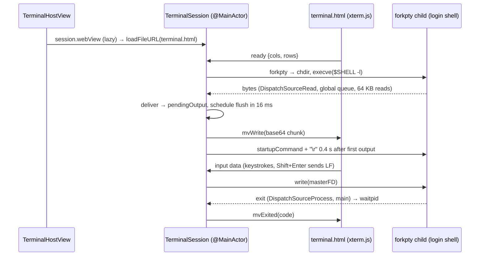
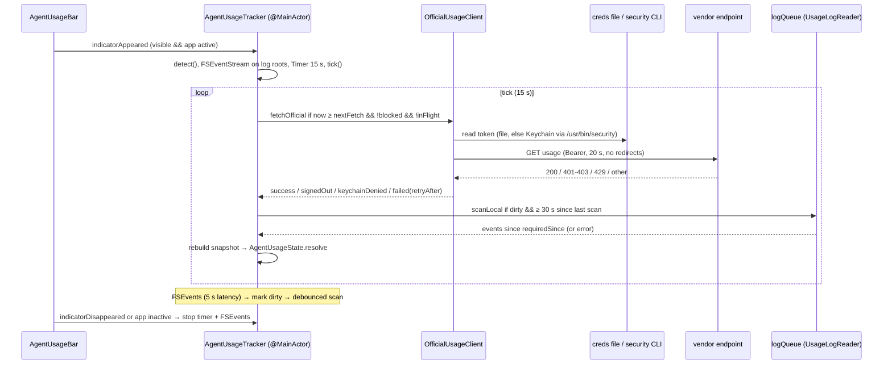

# Git & GitHub, Terminal, Lifecycle Analytics, Agent Usage

Module group documentation for four subsystems that sit next to the editor: local Git and the
opt-in GitHub integration, the embedded PTY terminal, the feature lifecycle event log, and the
AI agent usage/quota tracker. Every statement below is traceable to the cited `path:line`
(paths relative to the repository root; `MarkView/` prefix omitted for app sources, so
`Models/GitClient.swift:5` means `MarkView/Models/GitClient.swift:5`).

Sibling module docs: [app-shell-and-workspace](app-shell-and-workspace.md),
[editor-and-bridge](editor-and-bridge.md),
[ai-assistants-and-dictation](ai-assistants-and-dictation.md),
[feature-workflow](feature-workflow.md), [architecture-and-xray](architecture-and-xray.md),
[semantic-index-and-insight](semantic-index-and-insight.md),
[build-release-testing](build-release-testing.md).

| Section | Main entry point | Owner object | Network | Persistence |
|---|---|---|---|---|
| A. Git & GitHub | `WorkspaceManager.setUpGitHub` (`Models/WorkspaceManager.swift:3335`) | `GitClient`, `GitHubStore` per window | `gh` CLI → GitHub (opt-in) | UserDefaults only |
| B. Terminal | `WorkspaceManager.openAITerminal` / `openTerminal` (`Models/WorkspaceManager.swift:3120`, `:3453`) | `TerminalSession` per terminal | none (child processes may) | pasted images in Caches |
| C. Lifecycle | `FeatureStore` lifecycle methods (`Models/FeatureStore.swift:558-728`) | `LifecycleLog.shared` (app-wide) | GitHub only via the GitHub poll | `lifecycle-events.jsonl` |
| D. Agent usage | `AgentUsageBar` (`Views/AgentUsageViews.swift:17`) | `AgentUsageTracker.shared` (app-wide) | Anthropic / ChatGPT usage endpoints | UserDefaults only |

---

## A. Git & GitHub

### A.1 Purpose & responsibilities

- **Local Git** (`GitClient`): branch, porcelain status, last 20 commits, stage/unstage/stage-all,
  commit, push, pull, per-file diff, discard, `git init` (`Models/GitClient.swift:3-198`). Always
  active when a folder is open; it is not gated by the GitHub setting
  (`Models/WorkspaceManager.swift:528`, `:1475`).
- **GitHub** (`GitHubClient` + `GitHubStore`): pull requests, issues, Actions runs/jobs/logs,
  workflow dispatch, reviews, merges, notifications, and lifecycle captures, all through the
  GitHub CLI `gh` (`Models/GitHubClient.swift:266-637`). Opt-in: with
  `settings.github.enabled` off, `GitHubStore.setup` returns early and MarkView never runs `gh`
  or polls (`Models/GitHubStore.swift:7-8`, `:106-107`; `Models/WorkspaceManager.swift:3333-3361`).
- **Views**: the Git side-panel tab (`Views/GitView.swift`), GitHub sections, sheets, run/issue
  editor tabs, and Settings → GitHub (`Views/GitHubViews.swift`).

### A.2 Files

| File | Role |
|---|---|
| `Models/GitClient.swift` | `@MainActor ObservableObject` wrapping `git` via `/usr/bin/env git` |
| `Models/GitHubClient.swift` | `gh` models (`GH*` Codable structs), `GitHubClient` (Sendable struct running `gh`/`git`), YAML dispatch-input reader, job-log splitter |
| `Models/GitHubStore.swift` | `GitHubSettings` keys, `GitHubStore` (per-window state + polling + notifications), `GitHubRunModel`, `GitHubIssueModel` |
| `Views/GitView.swift` | Git tab: branch header, changes, diff, commit bar, history; hosts GitHub sections when available |
| `Views/GitHubViews.swift` | PR/Issues/Actions lists, New PR/Issue/Dispatch sheets, run and issue editor tabs, sandboxed issue HTML view, Settings section, `gh auth login` launcher |
| `Models/DocumentState.swift:151-185` | `OpenTab.Kind.github(GitHubItem)` and `GitHubItem` (tab marker names) |
| `Models/WorkspaceManager.swift:3320-3450` | Wiring, checkout, "Start with AI", "Fix with AI" |

### A.3 Key types

| Type | Isolation | Notes |
|---|---|---|
| `GitClient` | `@MainActor` class (`Models/GitClient.swift:4-5`) | `run`/`runWithError` are `nonisolated` and use `Task.detached` (`:205-246`) |
| `GitHubRepo` | Sendable struct (`Models/GitHubClient.swift:4-13`) | `slug` "owner/name", `remote`, `isUpstream` |
| `GitHubClient` | Sendable struct (`Models/GitHubClient.swift:270-637`) | `static execute` runs `gh` or `/usr/bin/git` on GCD; instance methods add `-R owner/name` (`:375`) |
| `GHPullRequest`, `GHIssue`, `GHRun`, `GHJob`, `GHStep`, `GHCheck`, `GHWorkflow` | Codable, Sendable (`:22-205`) | Field lists passed to `--json` (`:96`, `:124-125`, `:160`) |
| `GHOutcome` | enum (`:61-76`) | success/failure/running/neutral mapping of status+conclusion |
| `GHDate` | enum, lock-guarded formatters (`:219-264`) | Zero date `0001-` = "not yet" (`:233`) |
| `GHWorkflowFile.dispatchInputs` | pure (`:641-714`) | Indentation-based reader of `on: workflow_dispatch: inputs:`; no YAML library |
| `GHJobLog.split` | pure (`:734-785`) | Splits a job log into steps by `##[group]Run`, `Post job cleanup.`, `Cleaning up orphan processes` markers plus step start times |
| `GitHubSettings` | enum of keys (`Models/GitHubStore.swift:6-30`) | see A.6 |
| `GitHubStore` | `@MainActor final class` (`Models/GitHubStore.swift:35-378`) | `generation` counter drops stale async answers (`:80-81`) |
| `GitHubRunModel`, `GitHubIssueModel` | `@MainActor` (`:382-579`) | One per opened run/issue tab, cached by `"<repo>#<n>"` (`:87-89`) |

Important methods:

- `GitClient.refresh()` — `.git` detection in the folder or up to 5 parents, then
  `rev-parse --abbrev-ref HEAD`, `status --porcelain`, `log --format=%h|%s|%an|%ar -20`
  (`Models/GitClient.swift:70-118`); calls `onBranch` (`:91`).
- `GitHubClient.execute(_:in:git:timeout:)` — the single subprocess primitive for `gh` and
  `git` (`Models/GitHubClient.swift:291-348`).
- `GitHubClient.detectRepos(root:)` — parses `git remote -v`; origin (or first slug), then
  `upstream` or GitHub's `parent` via `gh repo view --json parent` (`:381-408`).
- `GitHubClient.account(root:)` — `gh api -i user`; reads `x-oauth-scopes` header and `login`
  (`:425-443`).
- `GitHubStore.setup(root:)`, `reset()`, `refreshAll()`, `startPolling()`, `noteRuns(_:)`,
  `notifyFinished(_:)` (`Models/GitHubStore.swift:106-377`).
- `GitHubRunModel.explainFailure(db:)` — streams an AI explanation of the failed logs via
  `CLICompletion.run` (`Models/GitHubStore.swift:499-529`); see
  [ai-assistants-and-dictation](ai-assistants-and-dictation.md).

### A.4 Internal interfaces

- `GitClient.onBranch` → `GitHubStore.branchChanged` (`Models/WorkspaceManager.swift:3337`).
- `GitHubStore.onRepoChange` → `architecture.gitHubRepo` (PR X-Ray follows the selected repo)
  (`:3338`); see [architecture-and-xray](architecture-and-xray.md).
- `GitHubStore.onPoll` → `FeatureStore.syncLifecycle(with:)` (`:3339`) — the only path from the
  lifecycle log to GitHub (section C).
- `features.assistant.gitHubClient` closure (`:3323`) — the feature assistant can reach GitHub
  through the store's current client; see [feature-workflow](feature-workflow.md).
- `WorkspaceManager.openGitHubTab(_:)` creates an `OpenTab` with a placeholder URL
  `.markview-github-<owner-name>-run-<id>` / `-issue-<n>` that is never read or written
  (`Models/WorkspaceManager.swift:3364-3371`; `Models/DocumentState.swift:176-183`).
  `ContentView` draws `GitHubTabView` over the editor (`Views/ContentView.swift:64-65`).
- `WorkspaceManager.checkoutPullRequest`, `fixInPullRequest`, `startIssueWithAI`,
  `fixRunWithAI` hand prompts to the AI terminal via `sendToAssistant`
  (`Models/WorkspaceManager.swift:3382-3450`).
- `WorkspaceManager.reviewPullRequest(_:)` opens the PR X-Ray with source `gh:<n>` and
  `reviewWhenLoaded = GitHubSettings.autoReview` (`:3375-3378`).

### A.5 Runtime flows

**Enable / setup / poll**



1. Settings toggle writes `settings.github.enabled` (`Views/GitHubViews.swift:1307`, `:1319`).
2. Every window's `WorkspaceManager` sees `UserDefaults.didChangeNotification` and calls
   `gitHubSettingChanged` only when the value actually flipped (`Models/WorkspaceManager.swift:3341-3347`).
3. `setup` resets, stores `root`, detects repos, selects the first, loads the account, starts
   polling (`Models/GitHubStore.swift:106-119`).
4. Poll loop sleeps `activeInterval` when any run is active (lists or open run tabs), else
   `idleInterval` (`:318-340`).
5. `noteRuns` remembers active run ids; when one is no longer active it calls
   `notifyFinished` (`:343-351`), which posts a `UNUserNotification` only if enabled, notify
   is on, and the run's branch is "mine" (current branch or head of my open PRs) (`:354-377`).

**Pull request actions** — Approve/Request changes/Comment use a text sheet then
`gh pr review --approve|--request-changes|--comment` or `gh pr comment`
(`Views/GitHubViews.swift:252-266`; `Models/GitHubClient.swift:485-506`). Merge (squash/merge/
rebase) and Close require a confirmation dialog (`Views/GitHubViews.swift:268-296`). Checkout
refuses when tracked changes exist (`git status --porcelain --untracked-files=no`) then runs
`gh pr checkout` (`Models/WorkspaceManager.swift:3382-3394`).

**New PR** — `git push -u origin HEAD` (always origin), then `gh pr create`; for an upstream
target the head becomes `<fork-owner>:<branch>`; the new URL opens in the browser
(`Views/GitHubViews.swift:443-468`).

**Run tab** — `GitHubRunModel.refresh` loads `gh run view --json …` and `--json jobs` in
parallel, selects the first failed job, and loads its log once finished via
`gh api repos/<slug>/actions/jobs/<id>/logs` (180 s timeout) and splits it off-main
(`Models/GitHubStore.swift:413-451`; `Models/GitHubClient.swift:609-611`). Re-run/cancel go
through `store.perform`, then refresh after 2 s (`Models/GitHubStore.swift:453-467`).
"Why it failed" streams an AI explanation; "Fix with AI" pastes the failure text into the AI
terminal (`Views/GitHubViews.swift:913-916`; `Models/WorkspaceManager.swift:3440-3450`).

**Issue tab** — `gh issue view --json …` plus rendered HTML from
`gh api repos/<slug>/issues/<n>` with `Accept: application/vnd.github.full+json` and paginated
comments (`Models/GitHubClient.swift:536-552`). Rendered by `GitHubHTMLView`: JavaScript off,
non-persistent data store, base URL `https://github.com/`, clicked links go to the default
browser, other navigations cancelled (`Views/GitHubViews.swift:1265-1300`). "Start with AI"
creates/switches to branch `issue-<n>-<slug>` and pastes the issue into the AI terminal
(`Models/WorkspaceManager.swift:3417-3437`).

**Dispatch** — reads the workflow file locally, else via
`gh api repos/<slug>/contents/<path>` (raw), parses inputs, then
`gh workflow run <id> --ref <ref> -f k=v…`, refreshes runs after 3 s
(`Views/GitHubViews.swift:790-824`; `Models/GitHubClient.swift:626-636`).

**Sign-in** — Settings writes `~/Library/Application Support/MarkView/login-github.command`
(0755) running `gh auth login --web --git-protocol https --scopes repo,workflow,read:org` and
opens it in Terminal.app (`Views/GitHubViews.swift:1401-1426`). Missing `repo`/`workflow`
scopes are shown with a `gh auth refresh` hint (`:1374-1381`).

### A.6 Data model & persistence

MarkView stores no GitHub token; authentication is entirely `gh`'s own sign-in.

| Key / path | Type | Default | Source |
|---|---|---|---|
| `settings.github.enabled` | Bool | false | `Models/GitHubStore.swift:8`, `Views/GitHubViews.swift:1307` |
| `settings.github.idleInterval` | Double seconds | 300 (UI: 60/300/900) | `Models/GitHubStore.swift:10`, `:20-23`; `Views/GitHubViews.swift:1334-1336` |
| `settings.github.activeInterval` | Double seconds | 30 (UI: 15/30/60) | `Models/GitHubStore.swift:12`, `:24-27` |
| `settings.github.notifyRuns` | Bool | true | `:14`, `:28` |
| `settings.github.autoReview` | Bool | true | `:16`, `:29` |
| `layout.gitSection` | `GitSection` raw value | `Changes` | Per window in `Models/PanelLayout.swift` (key seeds new windows); `Views/GitView.swift:12`, `Views/GitHubViews.swift:130-135` |
| `~/Library/Application Support/MarkView/login-github.command` | zsh script | written on "Sign In…" | `Views/GitHubViews.swift:1406-1421` |

Subprocess environment for `gh`/`git` via `GitHubClient.execute`: `PATH` from
`CLIToolLocator.subprocessPath`, `GH_PROMPT_DISABLED=1`, `GH_NO_UPDATE_NOTIFIER=1`,
`NO_COLOR=1`, `GIT_TERMINAL_PROMPT=0`, stdin `/dev/null` (`Models/GitHubClient.swift:312-322`).

`gh` endpoints used (all with `-R owner/name` or explicit `repos/<slug>` paths):
`pr list|view|checkout|review|merge|close|comment|create`, `issue list|view|comment|close|reopen|edit|create`,
`label list`, `run list|view|rerun|cancel`, `workflow list|run`, `repo view --json parent`,
`api -i user`, `api graphql` (lifecycle), `api repos/<slug>/pulls/<n>/comments` (POST line
comment), `api repos/<slug>/issues/<n>[/comments]`, `api repos/<slug>/assignees --paginate`,
`api repos/<slug>/actions/jobs/<id>/logs`, `api repos/<slug>/contents/<path>`
(`Models/GitHubClient.swift:381-636`).

### A.7 Concurrency & threading

- `GitClient.run` drains stdout to EOF before `waitUntilExit`, stderr to `/dev/null`;
  `runWithError` drains stderr in a concurrent detached task (`Models/GitClient.swift:202-246`).
  Both run in `Task.detached(priority: .utility)`; no timeout.
- `GitHubClient.execute` hops to `DispatchQueue.global(qos: .utility)` (not the cooperative
  pool) and uses a `DispatchGroup` to drain stderr while stdout is read; a watchdog terminates
  the process after `timeout` (default 60 s) (`Models/GitHubClient.swift:291-348`).
- `GitHubStore` is `@MainActor`; its `Task {}` closures inherit the main actor, and results
  are applied only if `generation` still matches (`Models/GitHubStore.swift:111-118`, `:176-187`).
- Log splitting runs in `Task.detached` (`Models/GitHubStore.swift:448`, `:494`).
- AI streaming deltas are hopped to `@MainActor` (`Models/GitHubStore.swift:517-522`).

### A.8 Error handling & edge cases

- `gh` missing → `status -1` with "Install it with `brew install gh`" (`Models/GitHubClient.swift:305-307`).
- Non-zero exit → `GitHubError` with up to 400 chars of stderr (`:361-364`); JSON decode
  failure → "Unexpected answer from gh" (`:368-373`).
- Timeout → "GitHub did not answer within N s (offline?)" (`:343-345`).
- Store errors go to `lastError` (shown by `errorBanner`) and `perform` returns them for
  modal `NSAlert`s (`Models/GitHubStore.swift:190-204`; `Views/GitHubViews.swift:76-95`).
- Stale answers after a repo switch or disable are dropped via `generation`
  (`Models/GitHubStore.swift:80-81`, `:121-144`).
- Browser opens are restricted to `https` (`Views/GitHubViews.swift:67-69`); workflow file
  paths containing `..` are refused (`:691`).

### A.9 Extension points / recipes

- **New `gh` call**: add a method on `GitHubClient` using `gh(_:)` or `decode(_:_:)` with an
  explicit `--json` field list (`Models/GitHubClient.swift:357-375`); call it from the store via
  `perform` so errors surface consistently (`Models/GitHubStore.swift:191-204`). Keep the
  `generation` check for anything that writes `@Published` state after an `await`.
- **New GitHub editor tab kind**: add a case to `GitHubItem` with a unique `marker`
  (`Models/DocumentState.swift:159-184`), a model cache in `GitHubStore`, and a branch in
  `GitHubTabView` (`Views/GitHubViews.swift:830-857`).
- **New setting**: add the key to `GitHubSettings` and an `@AppStorage` in
  `GitHubSettingsSection` (`Views/GitHubViews.swift:1305-1348`). Anything that reaches the
  network must remain behind `GitHubSettings.enabled`.

### A.10 Risks, tech debt, oddities

1. **Push/pull success is decided by substring matching.** `push` fails only if stderr contains
   "rejected" or "error"; `pull` only on "error" (`Models/GitClient.swift:157-161`, `:173-176`).
   `fatal: …` (no upstream, auth failure) is reported as success. Exit status is ignored.
2. **Commit errors are silent.** `commit` returns true unless stdout contains
   "nothing to commit"; hook failures or missing identity clear the message field as if it
   worked (`Models/GitClient.swift:137-149`; `Views/GitView.swift:230-233`).
3. **No timeout / no prompt suppression in `GitClient`.** Unlike `GitHubClient.execute`, it sets
   neither `GIT_TERMINAL_PROMPT=0` nor a timeout (`Models/GitClient.swift:205-246`); a hung
   `git push` leaves `isOperating = true`.
4. **Porcelain parsing is naive.** `line.dropFirst(3)` keeps quoted paths (`"a b.md"`) and
   rename lines (`old -> new`) as the file name (`Models/GitClient.swift:95-109`); staging,
   diff and discard then target a non-existent path.
5. **Missing `--` separator.** `git add <file>`, `git reset HEAD <file>`, `git diff <file>`
   (`Models/GitClient.swift:124`, `:129`, `:183-184`) break on names beginning with `-`;
   `discardChanges` uses `--` (`:189`).
6. **Repo-root vs folder paths.** `.git` may be found up to 5 parents above the folder
   (`Models/GitClient.swift:76-86`), but porcelain paths are repo-root-relative while
   `openFile` resolves them against `workingDirectory` (`Views/GitView.swift:298-302`).
7. **Discard has no confirmation** (`Views/GitView.swift:185-188`); it runs `git checkout -- <file>`.
8. **Two git executables.** `GitClient` uses `/usr/bin/env git` (`Models/GitClient.swift:209`);
   `GitHubClient.execute(git: true)` uses `/usr/bin/git` (`Models/GitHubClient.swift:302-303`).
9. **Run models are never evicted.** `runModels` grows per opened run and every live model is
   refreshed on each poll even after its tab closed (`Models/GitHubStore.swift:307-314`, `:330`);
   `isLive` is true while `run == nil`, so a run that keeps failing to load is polled forever
   (`:409`).
10. **No rate-limit awareness.** Polling continues while the app is in the background; there is
    no backoff on HTTP 403/429 from `gh` — errors only land in `lastError`
    (`Models/GitHubStore.swift:318-334`). Per active interval: 2 `run list` calls + 2 calls per
    live run tab, plus the lifecycle GraphQL query (section C).
11. **Opt-in bypass in the terminal's PR picker.** `PullRequestPicker` calls
    `ArchitectureStore.openPullRequests` (`gh pr list`) without checking `GitHubSettings.enabled`
    (`Views/TerminalView.swift:342-346`; `Models/ArchitectureStore.swift:1807-1813`). User-
    triggered, but it contradicts the "never contacts GitHub" Settings text
    (`Views/GitHubViews.swift:1324`).
12. `GitHubSettingsSection.checkAccount` runs `gh api -i user` in the home directory each time
    the Settings pane appears while enabled (`Views/GitHubViews.swift:1347`, `:1386-1398`).
13. `GHWorkflowFile.dispatchInputs` is a hand-rolled YAML subset (comments stripped on `" #"`,
    flow lists only for `options`) (`Models/GitHubClient.swift:641-722`); unusual workflow
    formatting yields wrong inputs.
14. `notifyFinished` calls `requestAuthorization` on every notification
    (`Models/GitHubStore.swift:369`).

---

## B. Terminal

### B.1 Purpose & responsibilities

An embedded terminal: a login shell on a pseudo-terminal owned by Swift, drawn by xterm.js in a
dedicated `WKWebView` (`Models/TerminalSession.swift:52-57`). Used in two places:

- **AI panel terminals** (right panel "Terminal" tab) running Claude Code, Codex, Cline,
  Copilot or a plain shell, with ready-made prompt buttons and dictation
  (`Views/TerminalView.swift:97-188`; `Views/ModuleExplorerView.swift:7-37`).
- **Folder terminal tabs** in the editor area (`Models/WorkspaceManager.swift:3453-3462`;
  `Views/TerminalView.swift:357-380`).

It also resolves and activates links (URLs, OSC 8 hyperlinks, local paths with `:line`) and
turns non-text pastes (Finder files, screenshots) into escaped paths.

Programs in the terminal open pages and files in MarkView (`Models/TerminalBrowserBridge.swift`):
the shell gets `BROWSER=markview-browser` and an `open` wrapper first on `PATH`; both drop a request
(`<terminal id>\n<address>`) into the app process's spool folder. Web addresses go to the window's
browser tab. Files (`open notes.md`, `file://…`, absolute paths; relative paths resolved against the
shell's directory) open by `TerminalBrowserBridge.destination`: HTML in the browser tab
(`BrowserSession.load` uses `loadFileURL` with read access to its folder), documents the editor or image
viewer reads as tabs, everything else — folders, apps, PDFs, missing paths, any `open -…` with options —
in macOS as before. A Markdown file from outside an open project folder opens as a plain tab; it no longer
turns the window into a single-file workspace (`WorkspaceManager.openFile`). Off in the globe menu.

Agents also *drive* that browser tab (Task 80). Claude Code (`--mcp-config`) and Codex
(`-c mcp_servers.markview_browser…`) started in the AI panel get an MCP server: the app binary re-run as
`MarkView --mcp-browser --socket <path> --window <id>` (`Models/BrowserAgentTools.swift`, MCP over stdio, one
JSON message per line; its `instructions` tell the agent to use it instead of Chrome or Playwright). Each tool
call goes over a Unix socket in the user's temporary folder (`mv-browser-<pid>.sock`, mode 0600) to
`BrowserControlServer`, which finds the window by `WorkspaceManager.browserControlID` and runs the tool in its
browser tab (`agentBrowser()`: the active, preview or first browser tab, else a new one; brought to the front).
Tools: navigate, snapshot (text and up to 300 interactive elements tagged `data-mv-ref`), click and type (by ref,
CSS selector, or visible text / placeholder / label), press_key, evaluate (async body, JSON result), screenshot
(`takeSnapshot`, PNG), console (captured from document start by `BrowserSession.consoleCaptureScript`), wait_for,
back, reload. While an agent drives a tab, `alert`/`confirm` are answered at once and logged
(`agentDialogs`). Agents' own browser plugins (Codex's chrome/browser plugins, Claude in Chrome) still exist; the
server instructions steer the agent away from them. Off together with terminal links.

Named tabs and every agent (Task 82). Each browser tab has a name for agents (`BrowserSession.agentName`: T1, T2…,
renamable from the tab's toolbar, shown in the tab bar); `browser_tabs` lists them, `browser_open_tab` opens a
named one, and every other tool takes `tab` (name, number, or a unique part of the title or address —
`BrowserAgentTools.tabIndex`); without it the active browser tab. A bar on the tab shows when an agent used it
in the last two minutes, with **Stop**; a stopped tab (`agentStopped`) refuses agents until **Allow**. Clicks are
native mouse events at the element's centre and typing goes through the web view's `NSTextInputClient`, keys as
native key events (all `isTrusted`), with the previous first responder restored; script events only when the tab
is not on screen or something covers the element, or the typed text did not take. Copilot gets
`--additional-mcp-config`. `--mcp-browser` without arguments finds the app by its socket name among its
ancestor processes (`BrowserAgentTools.ancestorPIDs`) and the window by the terminal's shell
(`TerminalSession.shellPID`, `browserWindowID`; `TerminalBrowserBridge.windowID(forAncestors:)`); outside
MarkView it lists no tools. Globe menu → "Connect Agents to MarkView's Browser…" (`AgentBrowserRegistration`)
registers that form once for Claude Code (`claude mcp add --scope user`), Codex (`codex mcp add`), Copilot
(`~/.copilot/mcp-config.json`) and Cline (`~/.cline/data/settings/cline_mcp_settings.json`), keeping the rest of
those files.
Globe menu → "Browser Tools for Agents" turns the server off per agent and Mac (`browser.agentTools.<tool>`). A
Cline started from the AI panel gets the entry in its settings automatically when missing
(`AgentBrowserRegistration.ensureCline`, BUG-026); "Connect Agents…" reports agents it cannot find; and
`MarkView --mcp-browser --diagnose` prints the parent processes, the MarkView found and the window's tabs. Sockets of
MarkView processes that are gone are removed at launch. An agent whose tools run outside the terminal (Cline's
background hub, a child of launchd) has no MarkView among its ancestors: the server then tries the running
MarkView processes' sockets, and the app picks the window whose project holds the agent's working folder (`cwd` in
each request; the deepest match, else the only window; `BrowserAgentTools.windowIndex`) — BUG-027. Windows register
for this when a folder opens. A
Copilot terminal printing `MCP server was blocked by policy: "markview-browser"` (an organisation that lists its
allowed MCP servers) turns it off for Copilot and offers to restart Copilot without it (BUG-025).

### B.2 Files

| File | Role |
|---|---|
| `Models/TerminalSession.swift` | `TerminalProfile`, `TerminalSession` (PTY, web view, bridge, paste queue), `WeakMessageHandler` |
| `Models/TerminalLink.swift` | Pure link resolution and PTY cwd lookup (`proc_pidinfo`) |
| `Models/TerminalBrowserBridge.swift` | `BROWSER` / `open` wrappers, spool watcher, routing of web addresses and files |
| `Models/BrowserAgentTools.swift`, `Models/BrowserControlServer.swift` | MCP server for agents (`--mcp-browser`) and the app-side socket that runs its tools in a browser tab |
| `Models/AgentBrowserRegistration.swift` | One-time registration of the MCP server in the agents' own settings |
| `Views/TerminalView.swift` | `TerminalHostView`, dictation/restart buttons, `AITerminalPanel`, prompt bar, PR picker, `TerminalTabView` |
| `Resources/Editor/terminal.html` | xterm.js page and JS side of the bridge |
| `Resources/Editor/vendor/js/xterm.bundle.js`, `vendor/css/xterm.css` | Bundled `@xterm/xterm` 6.0.0 + fit 0.11.0 + web-links 0.12.0 (`tools/web-vendor/package.json:31-33`, `tools/web-vendor/build.sh:11-13`) |
| `Models/WorkspaceManager.swift:3089-3180`, `:3453-3506` | Terminal lifecycle, startup commands, titles, open-file watcher |
| `tools/tests/terminal-link-tests.sh` | GUI test: real WKWebView + shipping bundle + live PTY cwd |

### B.3 Key types

| Type | Isolation | Notes |
|---|---|---|
| `TerminalProfile` | enum (`Models/TerminalSession.swift:7-50`) | claude, codex, cline, copilot, shell; maps to `CLITool` |
| `TerminalSession` | `@MainActor final class`, `WKScriptMessageHandler` (`:58-438`) | Owns `webView` (lazy, lives as long as the session, `:75`), `dictation: WhisperClient` (`:78`), `masterFD`, `childPID`, read/exit dispatch sources |
| `TerminalLink` | enum, pure (`Models/TerminalLink.swift:5-67`) | `.web(URL)` / `.file(URL, line:)` |
| `WeakMessageHandler` | private (`Models/TerminalSession.swift:441-447`) | Breaks the `WKUserContentController` retain cycle |

Important methods: `start()` (`:199-269`), `terminate()` (`:305-312`), `restart(...)`
(`:284-302`), `write(_:)` (`:317-326`), `paste(_:submit:)` (`:330-337`),
`pasteClipboardFiles(from:)` (`:342-365`), `pasteWhenReady(_:submit:)` (`:371-404`),
`deliver(_:)`/`flush()` (`:416-437`), `activateLink(_:)` (`:168-183`),
`resolveLinks(_:request:)` (`:154-165`).

### B.4 Internal interfaces

JS ↔ Swift bridge (message handler name `"terminal"`, documented at `Resources/Editor/terminal.html:5-7`):

| Direction | Message / function | Handler |
|---|---|---|
| JS → Swift | `{type:"ready", cols, rows}` | resize, theme, `start()` or `flush()` (`Models/TerminalSession.swift:126-130`) |
| JS → Swift | `{type:"input", data}` | `write` (`:131-132`) |
| JS → Swift | `{type:"resize", cols, rows}` | `ioctl TIOCSWINSZ` (`:133-134`, `:406-412`) |
| JS → Swift | `{type:"pasteFiles"}` | `pasteClipboardFiles` (`:135-136`) |
| JS → Swift | `{type:"link", url}` | `activateLink` (`:137-138`) |
| JS → Swift | `{type:"resolveLinks", request, paths}` (≤ 512 paths) | `resolveLinks` (`:139-143`) |
| Swift → JS | `mvWrite(base64)`, `mvSetTheme(dark)`, `mvFocus()`, `mvReset()`, `mvExited(code)`, `mvResolvedLinks(request, valid)` | `Resources/Editor/terminal.html:76-82`, `:158-189` |
| Swift → JS (diagnostics/tests) | `mvMouseMode()`, `mvText()`, `mvSize()` | `:179-186` |

Workspace side: `session.openFile` → `WorkspaceManager.openFile(url, line:)`
(`Models/WorkspaceManager.swift:3125`, `:3455`); `openExternalURL` defaults to
`NSWorkspace.shared.open` (`Models/TerminalSession.swift:70`). `sendToAssistant` (used by
sections A and prompt buttons) pastes into the AI terminal (`Views/TerminalView.swift:291-294`).
Startup commands: `startupCommand(for:)` (`Models/WorkspaceManager.swift:3094-3103`).

### B.5 Runtime flows



**Start** (`Models/TerminalSession.swift:199-269`):
1. Shell = `$SHELL` or `/bin/zsh`, argv `[shell, "-l"]`.
2. Environment: inherited, minus `CLAUDECODE` and every `CLAUDE_CODE_*`; plus
   `CLAUDE_CODE_FORCE_SESSION_PERSISTENCE=1`, `TERM=xterm-256color`, `COLORTERM=truecolor`,
   `TERM_PROGRAM=MarkView`, `LANG=en_US.UTF-8` if unset (`:205-218`).
3. All C strings are prepared before `forkpty`; the child only calls `chdir`, `execve`,
   `_exit(127)` (`:220-239`).
4. Master set `O_NONBLOCK`; read source on `.global(qos: .userInitiated)`; exit source on main
   (`:248-268`).

**Startup command** — AI profiles: Claude runs `'<claude>' update && '<claude>' <model args>
--dangerously-skip-permissions`; Codex/Cline/Copilot run `<tool> <model args>`; the shell has
none (`Models/WorkspaceManager.swift:3094-3103`). It is typed once, 0.4 s after the first output
(`Models/TerminalSession.swift:419-425`).

**Paste when ready** — queued pastes wait until the shell runs, the startup command was sent
> 2 s ago (or > 1 s since start without one), and output has been quiet 2 s; forced after 45 s;
multiple pastes are spaced 0.6 s; `submit` sends `\r` 0.25 s after the bracketed paste
(`:330-404`).

**Links** (`Resources/Editor/terminal.html:35-125`; `Models/TerminalLink.swift`):
1. xterm's WebLinksAddon (URLs), OSC 8 `linkHandler` (`allowNonHttpProtocols: true`) and a
   custom provider that tokenizes the (soft-wrap-joined, ≤ 64 rows, ≤ 8192 chars) line and
   strips grep's `:matched text`.
2. The provider posts candidate paths; Swift resolves them off-main against the live cwd —
   foreground process group's cwd (`tcgetpgrp`), then the shell's, then the launch folder
   (`Models/TerminalLink.swift:55-66`) — and returns only existing regular files
   (`Models/TerminalSession.swift:154-165`).
3. Activation: `http(s)` with a host → browser; `file://` (localhost only, `#L<n>`), absolute,
   `~`-relative or cwd-relative paths with optional `:line[:col]` or `#L<n>` → `openFile` if
   `FileType.isOpenable`, else `NSWorkspace.open` (`Models/TerminalLink.swift:9-52`;
   `Models/TerminalSession.swift:175-181`). A literal file name containing a colon wins over the
   line-suffix interpretation (`Models/TerminalLink.swift:40-42`).
4. Mouse: ⌘-click is reserved for links even when a TUI enables mouse tracking; plain click
   activates when mouse tracking is off (`Resources/Editor/terminal.html:35-39`, `:55-70`).

**Paste of non-text** — ⌘V with no `text/plain` posts `pasteFiles`; Swift types Finder file
paths or saves an image as PNG under `~/Library/Caches/MarkView/pasted-images/image-<ms>.png`
and types its path, backslash-escaped like Terminal (`Resources/Editor/terminal.html:146-154`;
`Models/TerminalSession.swift:342-365`).

**Restart / close** — `restartProcess` = `terminate()` + clear buffer + `mvReset()` (full xterm
reset, clears mouse/alt-screen modes) + `start()` (`:297-302`). `terminate` sends `SIGHUP` to
the process group and the child, cancels sources, closes the master (`:305-312`). Closing the
workspace calls `stopAllTerminals` (`Models/WorkspaceManager.swift:3471-3479`).

**Open-file watcher** — the first terminal starts a 2 s main-thread timer that reloads
unmodified open tabs whose file changed on disk (e.g. edited by the AI CLI)
(`Models/WorkspaceManager.swift:3483-3506`).

### B.6 Data model & persistence

| Item | Format | Source |
|---|---|---|
| `~/Library/Caches/MarkView/pasted-images/image-<epoch ms>.png` | PNG, never deleted | `Models/TerminalSession.swift:349-353` |
| `layout.terminalPromptsExpanded` | Bool (AppStorage) | `Views/TerminalView.swift:106` |
| `AIAssistantPreferences.backendKey`, `modelKey(for:)` | observed to restart terminals | `Views/TerminalView.swift:101-105`, `:125-129` |
| Terminal tab placeholder URL `<folder>/.markview-terminal-<uuid>` | never read/written | `Models/WorkspaceManager.swift:3456` |

Terminal sessions are not restored across launches; scrollback is 10 000 lines in memory
(`Resources/Editor/terminal.html:44`).

### B.7 Concurrency & threading

- PTY reads happen on a global queue and hop to `@MainActor` with `Task { @MainActor … }`
  (`Models/TerminalSession.swift:250-257`); output is batched per ~16 ms frame and base64-encoded
  for `evaluateJavaScript` (`:426-437`).
- The exit handler runs on the main queue and calls `waitpid` (`:261-266`).
- `write` runs on the main thread against a non-blocking fd (`:317-326`).
- Link resolution (file stats, `proc_pidinfo`) runs in `Task.detached(priority: .userInitiated)`
  (`:157-160`, `:171-174`).
- `userContentController` is `nonisolated` and uses `MainActor.assumeIsolated` (WebKit calls it
  on main) (`:122-148`).

### B.8 Error handling & edge cases

- `forkpty` failure prints "Could not start a terminal: <strerror>" into the terminal (`:240-243`).
- Exit codes: normal exit status, or `128 + signal` (`:277`); the page shows
  "[process exited … — Restart to start again]" (`Resources/Editor/terminal.html:187-189`).
- Link text is rejected if empty, > 8192 bytes or contains control characters; URL schemes other
  than http/https/file with `://` are ignored (`Models/TerminalLink.swift:10-29`).
- `resolveLinks` requires `request >= 0` and ≤ 512 paths (`Models/TerminalSession.swift:139-143`).

### B.9 Extension points / recipes

- **New AI profile**: add a `TerminalProfile` case with `tool`, `title`, `icon`
  (`Models/TerminalSession.swift:7-50`) and its startup command in
  `WorkspaceManager.startupCommand(for:)` (`Models/WorkspaceManager.swift:3094-3103`).
- **New bridge message**: add a `case` in `userContentController` and the JS `post({type:…})`
  in `terminal.html`, and update the header comment (`Resources/Editor/terminal.html:5-7`).
  Validate payload types/limits at the Swift boundary like `resolveLinks`.
- **xterm upgrade**: change `tools/web-vendor/package.json` and rebuild with
  `tools/web-vendor/build.sh`; never load from a CDN (see
  [build-release-testing](build-release-testing.md)).

### B.10 Risks, tech debt, oddities

1. **Zombie children.** `terminate()` cancels the exit source before the child has exited, so
   `waitpid` never runs for that pid (`Models/TerminalSession.swift:305-312`, `:261-266`); every
   restart/close can leave a zombie until the app quits.
2. **Large writes are truncated.** On a non-blocking master, `write` stops at the first
   `EAGAIN` (`written <= 0 → break`) (`:317-326`); a long paste (e.g. a big prompt from
   `sendToAssistant`) can be cut silently.
3. **Claude always runs with `--dangerously-skip-permissions`** and self-updates first
   (`Models/WorkspaceManager.swift:3100`). Any prompt pasted into it (issue bodies, CI logs,
   PR text from section A) executes with no permission prompts.
4. **Link activation opens any existing file** on disk, not only workspace files; non-openable
   types go to `NSWorkspace.open` (`Models/TerminalSession.swift:177-179`), so a click on a
   printed path/OSC 8 link to e.g. a `.command` file runs it in Terminal.app.
5. Hover hint says "⌘click to open", but a plain click activates when mouse tracking is off
   (`Resources/Editor/terminal.html:36`, `:40`).
6. Pasted images accumulate in Caches with no cleanup (`Models/TerminalSession.swift:349-354`).
7. The read handler ignores `count <= 0` (EOF/EIO) without cancelling
   (`Models/TerminalSession.swift:253-254`); until the exit source fires, a level-triggered
   read source can spin. It also captures the raw `master` fd, which is closed in
   `terminate`/`processExited` while a handler may still be in flight.
8. `pendingLinks` in JS is only cleared on reply or `mvReset`; a failed Swift reply
   (JSON serialization) leaves entries behind (`Resources/Editor/terminal.html:74-82`;
   `Models/TerminalSession.swift:161-163`).
9. The open-file watcher reads file attributes and contents on the main thread every 2 s for
   every open tab (`Models/WorkspaceManager.swift:3485-3505`) — a main-thread I/O hazard with
   many or large tabs.

---

## C. Lifecycle analytics

### C.1 Purpose & responsibilities

An append-only log of timestamped lifecycle events per feature, and cycle-time analytics
between adjacent stages (spec: `docs/features/lifecycle-event-log-cycle-time-analytics/`).
Events come from three sources:

- **In-app automatic** transitions observed in feature files: idea created, questions resolved,
  spec ready, implementation finished (status), implementation started ("Implement with AI")
  (`Models/FeatureStore.swift:227`, `:576-622`).
- **External automatic** captures: local git commits on the default branch that mention the
  feature (every ~60 s), and GitHub PR open/approve/CI/merge plus Actions CI of those commits
  (on the GitHub poll only) (`Models/FeatureStore.swift:657-713`; `Models/LifecycleCapture.swift`).
- **Manual marks** of non-automatic stages via a confirmation sheet (`Views/LifecycleViews.swift:104-201`).

### C.2 Files

| File | Role |
|---|---|
| `Models/LifecycleAnalytics.swift` | Stages, event model, steps, durations, statistics, formatting (Foundation only) |
| `Models/LifecycleCapture.swift` | `AgentModelProbe` (CLI session logs), `LifecycleGitHub` (GraphQL query + parser), `LifecycleGit` (commit log parsing, CI) |
| `Models/LifecycleLog.swift` | `LifecycleLog.shared` JSONL store; `LifecycleModels` recent-model list |
| `Views/LifecycleViews.swift` | `LifecycleSection` (feature header), `MarkStageSheet`, `CycleTimeSummarySheet` |
| `Models/FeatureStore.swift:558-728` | Observation, recording, git/GitHub sync, default-branch lookup |
| `tools/tests/lifecycle-tests.sh`, `LifecycleAnalyticsTests.swift` | Standalone `swiftc` test of Analytics + Capture |

### C.3 Key types

| Type | Isolation | Notes |
|---|---|---|
| `LifecycleStage` | enum, Codable (`Models/LifecycleAnalytics.swift:7-38`) | `idea_created, questions_resolved, spec_ready, implementation_started, implementation_finished, review_done, ci_passed, merged_to_main, verified`; first three `isAutomatic` |
| `LifecycleEvent` | Codable struct (`:45-59`) | `id, project, feature, stage, timestamp, actor, source, model?, note?` (note ≤ 500) |
| `LifecycleStep` | (`:62-72`) | Adjacent stage pairs; `isAIStep` = starts at implementation started |
| `LifecycleDuration` | (`:74-85`) | `missing`, `inconsistent`, `valid(seconds)` |
| `LifecycleAnalytics` | pure (`:87-166`) | earliest start → latest end; median/mean/count; per-model stats for the AI step |
| `LifecycleLog` | `@MainActor` singleton (`Models/LifecycleLog.swift:6-114`) | serial `queue` for file I/O; per-project `claim` |
| `AgentModelProbe`, `LifecycleGitHub`, `LifecycleGit` | pure enums (`Models/LifecycleCapture.swift`) | |

### C.4 Internal interfaces

- `FeatureStore.recordLifecycle(_:feature:source:model:note:at:)` → `LifecycleLog.shared.record`
  (`Models/FeatureStore.swift:568-574`).
- `LifecycleLog.claim(project, by:)` / `release` — the first live `FeatureStore` for a project
  path records automatic events; others skip (several windows may show one folder)
  (`Models/LifecycleLog.swift:104-113`; `Models/FeatureStore.swift:80`, `:587`, `:662`, `:698`).
- `GitHubStore.onPoll` → `FeatureStore.syncLifecycle(with:)` (`Models/WorkspaceManager.swift:3339`).
- `GitHubClient.lifecycleCaptures(numbers:)` and `ciPassed(commit:)` (`Models/GitHubClient.swift:465-477`).
- `FeatureStore.lifecycleActor` = git `user.name`, else macOS full name/user name
  (`Models/FeatureStore.swift:168-173`).

### C.5 Runtime flows

```mermaid
flowchart TD
    subgraph FeatureStore poll every 3 s
      R[reloadIfChanged] --> O[observeLifecycle: compare snapshots]
      O -->|questions 1+ → 0| QR[questions_resolved]
      O -->|status ready / readiness 100| SR[spec_ready]
      O -->|into implementing, no spec_ready| SR2[spec_ready 'Handed to implementation']
      O -->|status implemented| IF[implementation_finished]
      T[tick % 20 ≈ 60 s] --> G[syncLifecycleWithGit: git log default branch -n 200]
      G -->|message names docs/features/slug or #issue| M[merged_to_main 'commit abc1234']
    end
    subgraph GitHub poll — only when integration on
      P[onPoll] --> S[syncLifecycle, at most once per idle interval]
      S --> Q[gh api graphql: PRs that are / close the feature's issues]
      Q --> C1[implementation_finished = PR createdAt]
      Q --> C2[review_done = first APPROVED review]
      Q --> C3[ci_passed = rollup SUCCESS, last check time]
      Q --> C4[merged_to_main = mergedAt into default branch]
      S --> CI[gh run list --commit sha → ci_passed for pending commits ≤ 7 days]
    end
    I[Implement with AI click] --> IS[implementation_started at click, model from CLI session log ≤ 15 min]
    Man[Mark stage sheet] --> MM[manual event stamped now]
    QR & SR & SR2 & IF & M & C1 & C2 & C3 & C4 & CI & IS & MM --> L[(lifecycle-events.jsonl)]
```

Details:

1. **Targets**: only features with an `implementation_started` event are followed, from that
   moment on (no backfill); issues = feature issues + plan issues + epic, max 40
   (`Models/FeatureStore.swift:638-646`).
2. **Dedup**: an automatic capture with the same stage and note (`PR #12`, `commit abc1234`) is
   recorded once (`Models/FeatureStore.swift:648-655`).
3. **GitHub query**: one GraphQL request per target with aliases `n<number>:
   issueOrPullRequest(number:)`, `closedByPullRequestsReferences(first: 20, includeClosedPrs: true)`,
   `reviews(states: APPROVED, first: 1)`, last commit `statusCheckRollup` with
   `contexts(first: 100)`; `owner`/`name` passed as GraphQL variables
   (`Models/LifecycleCapture.swift:90-101`; `Models/GitHubClient.swift:465-471`). Closed-unmerged
   PRs are ignored (`Models/LifecycleCapture.swift:121`).
4. **Model probe** for "implementation started": polls every 5 s for up to 15 min
   (`Models/FeatureStore.swift:626-636`):
   - Claude: `~/.claude/projects/<cwd with non-alphanumerics → "-">/*.jsonl`, first
     `type == "assistant"` line with `timestamp >= since` and `message.model` not starting with `<`
     (`Models/LifecycleCapture.swift:12-24`).
   - Codex: `~/.codex/sessions/YYYY/MM/DD/*.jsonl` for the start day and today, `type ==
     "turn_context"` lines whose `payload.cwd` matches, `payload.model` (`:27-48`).
   - Fallback: model chosen for the tool, then configured default, then tool name (`Models/FeatureStore.swift:614-616`).
5. **Durations**: earliest event of the start stage to latest of the end stage; skipped stages
   are not bridged; negative → inconsistent; total = idea created → verified
   (`Models/LifecycleAnalytics.swift:88-104`). Summary counts only valid durations and groups the
   AI step by model ("Unknown model" when absent) (`:137-156`). Events of deleted/renamed features
   are excluded from the summary (`Views/LifecycleViews.swift:211-214`).

### C.6 Data model & persistence

| Item | Format | Source |
|---|---|---|
| `~/Library/Application Support/MarkView/lifecycle-events.jsonl` | One JSON object per line, `JSONEncoder` with `.iso8601` dates and `.sortedKeys`; keys `actor, feature, id, model?, note?, project, source, stage, timestamp` | `Models/LifecycleLog.swift:23-24`, `:67-78` |
| `lifecycle.models` | UserDefaults `[String]`, most recent first | `Models/LifecycleLog.swift:117-136` |
| `feature.lifecycle.expanded` | Bool (AppStorage) | `Views/LifecycleViews.swift:25` |

`project` is the project root's absolute standardized path (`Models/FeatureStore.swift:561`).
The file is shared by all windows and projects on the Mac and is never rewritten: no edit,
void or delete API (`Models/LifecycleLog.swift:3-5`). Undecodable lines are skipped on load
(`:45-51`).

### C.7 Concurrency & threading

- `LifecycleLog` is `@MainActor`; the initial read and every append run on the serial
  `markview.lifecycle-log` queue (`Models/LifecycleLog.swift:15`, `:28-31`, `:76-83`). Events
  recorded before the load completes stay after the loaded ones (`:26-30`).
- Model probing runs in `Task.detached(priority: .utility)` and records back on `MainActor`
  (`Models/FeatureStore.swift:615-621`).
- Git/GitHub captures run in `Task {}` on the main actor; subprocesses go through
  `GitHubClient.execute` on GCD (`Models/FeatureStore.swift:668-712`).

### C.8 Error handling & edge cases

- Write failures surface as `lastError`, shown in red in the feature header and cleared by tap
  (`Models/LifecycleLog.swift:79-82`; `Views/LifecycleViews.swift:51-53`).
- `record` refuses empty project/feature and manual marks of automatic stages
  (`Models/LifecycleLog.swift:61`); automatic timestamps are clamped to now, manual ones are
  always now (`:62`).
- The mark sheet requires a model for "implementation started", caps notes at 500 chars and
  warns about repeats and later stages already recorded (`Views/LifecycleViews.swift:126-183`).
- Default branch: `origin/HEAD` (local copy if present), else `main`/`master`, else no git sync
  (`Models/FeatureStore.swift:715-728`).
- GitHub/CI failures are swallowed with `try?` (`Models/FeatureStore.swift:670`, `:687`).

### C.9 Extension points / recipes

- **New stage**: add a case to `LifecycleStage` in canonical order (`Models/LifecycleAnalytics.swift:7-17`);
  steps are derived automatically (`:71`). Old log lines remain decodable; lines with an unknown
  stage are skipped by older builds (`Models/LifecycleLog.swift:45`).
- **New automatic capture**: produce `(stage, date, note)` and call `recordCapture` from the
  claiming store so dedup and ownership apply (`Models/FeatureStore.swift:648-655`). Anything
  that needs GitHub must hang off `syncLifecycle(with:)` so it stays behind the opt-in.
- **Tests**: extend `tools/tests/LifecycleAnalyticsTests.swift`; run `tools/tests/lifecycle-tests.sh`
  (compiles `LifecycleAnalytics.swift` + `LifecycleCapture.swift` only) — see
  [build-release-testing](build-release-testing.md).

### C.10 Risks, tech debt, oddities

1. **No cross-process coordination.** Each MarkView process keeps its own in-memory copy and
   `claim` table (`Models/LifecycleLog.swift:10`, `:18`); two running instances (e.g. an installed
   app and a debug build on the same folder) both append and both record automatic captures, so
   dedup (`Models/FeatureStore.swift:651`) cannot see the other's events.
2. **Load race for dedup.** Captures checked before the initial async load finishes can be
   recorded again (`Models/LifecycleLog.swift:28-31` vs `Models/FeatureStore.swift:650-655`).
3. **Unbounded file**, read fully into memory at launch and filtered linearly on every
   `events(project:feature:)` call, including from SwiftUI bodies (`Models/LifecycleLog.swift:36-51`;
   `Views/LifecycleViews.swift:29`, `:213`).
4. **Model probe cost.** `AgentModelProbe.lines(of:)` reads whole session logs into memory and
   parses every line with `JSONSerialization` (`Models/LifecycleCapture.swift:66-71`), every 5 s
   for up to 15 min (`Models/FeatureStore.swift:626-635`); Claude/Codex logs can be very large
   (see `Models/AgentUsageLogs.swift:172`). `LifecycleGitHub.date` allocates two
   `ISO8601DateFormatter`s per call (`Models/LifecycleCapture.swift:145-151`).
5. **GraphQL cost.** Up to 40 aliases × 20 PRs × 100 check contexts per query, one query per
   target feature each idle interval (`Models/FeatureStore.swift:644`, `:669-674`;
   `Models/LifecycleCapture.swift:91-100`); no handling of GraphQL rate-limit errors (`try?`).
6. **Two automatic "implementation finished" sources** (status → `implemented` and PR opened)
   (`Models/FeatureStore.swift:596-598`; `Models/LifecycleCapture.swift:123-125`); with
   earliest-start/latest-end semantics, repeated events stretch or shrink steps silently.
7. **Sensitive data.** The log stores absolute project paths, git user names and free-text notes
   in plain text (`Models/LifecycleLog.swift:67-69`).
8. Git sync runs every ~60 s regardless of the GitHub setting (local `git log -n 200` only,
   `Models/FeatureStore.swift:73`, `:697-713`).

---

## D. Agent usage & quota tracker

### D.1 Purpose & responsibilities

Compact per-agent chips (Claude Code, Codex) in the Terminal tab header showing quota used,
reset countdown and colour level, with a details popover and a fallback-limit form
(`Views/AgentUsageViews.swift:1-4`; `Views/ModuleExplorerView.swift:17`). Spec:
`docs/features/ai-agent-usage-quota-tracker-codex-claude-code/` (DEC-001…DEC-019).

- **Official path**: vendor usage endpoints called with the agents' own stored OAuth tokens
  (DEC-005, DEC-011) (`Models/AgentUsageTracker.swift:382-513`).
- **Fallback path**: token/cost usage counted from local CLI logs against a user-configured
  limit and window, or absolute "today" usage without a limit; no network (DEC-007, DEC-013,
  DEC-014) (`Models/AgentUsageLogs.swift`).
- Exactly one display state per agent in precedence order: official → user limit → no limit →
  unavailable (DEC-012) (`Models/AgentUsage.swift:251-286`).

### D.2 Files

| File | Role |
|---|---|
| `Models/AgentUsage.swift` | `UsageAgent`, units, levels, pace, `QuotaWindow`, `LimitPeriod`, `FallbackLimit`, `AgentUsageState`, `OfficialUsageParser`, `UsageFormat` (Foundation only) |
| `Models/AgentUsageLogs.swift` | `UsageLogLine` parsers, incremental `UsageLogReader`, `[UsageEvent].usage(from:to:)` |
| `Models/AgentUsageTracker.swift` | `AgentUsageSnapshot`, `AgentUsageTracker.shared` (scheduling, FSEvents, backoff), `OfficialUsageClient` (credentials + HTTP) |
| `Views/AgentUsageViews.swift` | `AgentUsageBar`, chip, meter, popover, `FallbackLimitForm` |
| `Views/DDESettingsView.swift:101-106,385-407` | Settings → DDE per-agent "Show … usage" toggles |
| `tools/tests/agent-usage-tests.sh`, `AgentUsageTests.swift` | Standalone `swiftc` test of `AgentUsage.swift` + `AgentUsageLogs.swift` |

### D.3 Key types

| Type | Isolation | Notes |
|---|---|---|
| `UsageAgent` | enum (`Models/AgentUsage.swift:10-41`) | `claude` (`~/.claude`), `codex` (`~/.codex`); UserDefaults keys |
| `QuotaWindow` | struct (`:102-160`) | percent, reset, duration, source, optional fallback limit/consumed/unit, `modelScope`; `headline` = highest percent, tie → later reset |
| `UsageLevel` | (`:68-83`) | warning ≥ 80 %, critical ≥ 95 % |
| `UsagePace` | (`:86-99`) | ±5 points vs. elapsed share |
| `FallbackLimit` / `LimitPeriod` | Codable (`:165-247`) | window k = [anchor + k·period, anchor + (k+1)·period), calendar-aware for days/months |
| `AgentUsageState` | (`:252-286`) | `resolve(...)` implements DEC-012 precedence |
| `OfficialUsageParser` | pure (`:291-392`) | Claude `limits[]` (session/weekly_all/weekly_scoped/other) or legacy `five_hour`/`seven_day[_opus|_sonnet]`; Codex `rate_limit.primary_window|secondary_window` |
| `UsageLogReader` | `final class @unchecked Sendable`, confined to `logQueue` (`Models/AgentUsageLogs.swift:75-233`) | per-file offset, events, dedup keys |
| `AgentUsageTracker` | `@MainActor` singleton (`Models/AgentUsageTracker.swift:35-380`) | constants DEC-010 (`:40-46`) |
| `OfficialUsageClient` | enum, nonisolated async (`:387-513`) | ephemeral `URLSession`, `NoRedirects` delegate |

### D.4 Internal interfaces

- `AgentUsageBar.onAppear/onDisappear` → `indicatorAppeared/Disappeared` (visibility count)
  (`Views/AgentUsageViews.swift:26-27`; `Models/AgentUsageTracker.swift:100-108`).
- `NSApplication.didBecomeActive/didResignActive` → `setAppActive` (`Models/AgentUsageTracker.swift:89-95`).
- `CLIToolLocator.resolve` for detection and `CLIToolLocator.run("/usr/bin/security", …)` for the
  Keychain read (`Models/AgentUsageTracker.swift:139-144`, `:485-486`; `Models/AIAssistants.swift:260-271`, `:415-481`).
- `WorkspaceManager.debugLog` for status lines (`Models/AgentUsageTracker.swift:226-246`).
- No other subsystem consumes the snapshots; Settings reads `isDetected` (`Views/DDESettingsView.swift:394`).

### D.5 Runtime flows



1. **Run gating**: runs only while at least one chip is on screen and the app is active
   (`Models/AgentUsageTracker.swift:118-132`).
2. **Official schedule**: success → next in 5 min; signed out → next in 5 min with hint;
   Keychain denied → `blocked` until a manual refresh; failure → backoff 5 → 10 → 20 → 30 min cap,
   honouring `Retry-After` (seconds or HTTP date) (`:213-252`, `:467-475`). Manual refresh has a
   60 s per-agent cooldown and clears `blocked` (`:165-182`).
3. **Windows past their reset** are dropped from the cache (`:255-259`); a successful value older
   than 15 min is "stale" (dimmed + clock) (`:23-26`; `Views/AgentUsageViews.swift:69-77`, `:96`).
4. **Local scan window** (`requiredSince`): the earliest of local midnight, the user limit's
   current window start, and the official windows' starts (`Models/AgentUsageTracker.swift:302-311`);
   a rescan is triggered when that moves earlier (`:251`, `:344`).
5. **Snapshot** (`:349-379`): state via `resolve`; local usage per unscoped official window is
   informational only (DEC-015); on first scan with no data the snapshot stays nil (spinner)
   rather than "unavailable" (`:370-374`).
6. **Fallback limit form**: value with k/m/b suffix, unit tokens or USD (USD only if the logs
   record cost), anchor date (defaults to now), preset period 5 h / 1 d / 7 d / 1 month or custom
   hours/days (`Views/AgentUsageViews.swift:312-432`).

### D.6 Data model & persistence

Official endpoints and credentials (read-only, re-read on every fetch, never stored, logged or
refreshed; redirects refused — `Models/AgentUsageTracker.swift:384-386`):

| Agent | Credential source | Request |
|---|---|---|
| Claude Code | `~/.claude/.credentials.json`, else Keychain generic password service `Claude Code-credentials` via `/usr/bin/security find-generic-password -s … -w` (15 s timeout; exit 44 = missing, other non-zero = denied). JSON `claudeAiOauth.accessToken`; skipped when `expiresAt` (ms) has passed; refresh token never used (`:480-491`, `:503-512`) | `GET https://api.anthropic.com/api/oauth/usage`, headers `Authorization: Bearer`, `anthropic-beta: oauth-2025-04-20`, `Accept: application/json`, `User-Agent: MarkView` (`:416-425`) |
| Codex | `~/.codex/auth.json` → `tokens.access_token`, `tokens.account_id` (`:492-498`) | `GET https://chatgpt.com/backend-api/wham/usage`, `Authorization: Bearer`, `ChatGPT-Account-Id` (`:419-425`) |

Session: `URLSessionConfiguration.ephemeral`, no URL cache, no cookies (`:451-457`).

Local logs (fallback, no network):

| Agent | Roots | Lines counted |
|---|---|---|
| Claude Code | `~/.claude/projects/**/*.jsonl` (`Models/AgentUsageLogs.swift:99`) | `type == "assistant"` with `message.usage`; tokens = `input_tokens + output_tokens + cache_creation_input_tokens + cache_read_input_tokens`; dedup key `message.id` (or `uuid`) + `requestId`; cost from `costUSD` when present (`:32-44`, `:212-220`) |
| Codex | `~/.codex/sessions/**/*.jsonl`, `~/.codex/archived_sessions/**/*.jsonl` (`:100`) | `payload.type == "token_count"`; `payload.info.total_token_usage.total_tokens` is cumulative per session, converted to deltas; a drop starts a new counter; `info == null` ignored (`:46-57`, `:221-229`) |

Files are enumerated only if modified since `since`, read incrementally from the last offset in
8 MiB chunks with only complete lines parsed; truncated files restart; files no longer in range
are forgotten (`Models/AgentUsageLogs.swift:107-197`).

UserDefaults:

| Key | Format | Source |
|---|---|---|
| `settings.usage.claude.hidden`, `settings.usage.codex.hidden` | Bool (default false = shown) | `Models/AgentUsage.swift:38`; `Views/AgentUsageViews.swift:19-20`; `Views/DDESettingsView.swift:101-106,385-407` |
| `settings.usage.claude.limit`, `settings.usage.codex.limit` | `Data`: `JSONEncoder` of `FallbackLimit` (`value`, `unit` "tokens"/"usd", `anchor` with the default date strategy, synthesized Codable for the `period` enum with associated values) | `Models/AgentUsage.swift:40`, `:209-214`; `Models/AgentUsageTracker.swift:186-200` |

Nothing else is persisted; official responses live in memory only (`Models/AgentUsageTracker.swift:55-78`).

### D.7 Concurrency & threading

- Tracker state is `@MainActor`; the 15 s `Timer` and the FSEvents stream (dispatch queue = main,
  latency 5 s) hop into it (`Models/AgentUsageTracker.swift:123-125`, `:263-277`).
- Log reading happens on the serial `markview.agent-usage.logs` queue; each reader is only touched
  there (`:79-81`, `:313-325`); `autoreleasepool` per chunk bounds memory (`Models/AgentUsageLogs.swift:177-188`).
- `OfficialUsageClient.fetch` is a nonisolated `async` function (off the main actor); the Keychain
  read uses `CLIToolLocator.run`, which drains both pipes on GCD and enforces the timeout
  (`Models/AIAssistants.swift:415-481`).
- `inFlight` / `scanning` flags prevent overlapping fetches and scans (`Models/AgentUsageTracker.swift:157`, `:315`).

### D.8 Error handling & edge cases

- No log root → "No local logs in ~/.claude" (unreadable); every attempted file failing →
  unreadable; candidate lines but zero parsed → "log format not recognised"
  (`Models/AgentUsageLogs.swift:110-144`). Unavailable is never shown as zero (DEC-012,
  `Models/AgentUsage.swift:259`).
- HTTP 401/403 → signed out; 429 → "rate limited" with backoff; non-200 → `HTTP <code>`;
  unrecognised body → "response not recognised" (`Models/AgentUsageTracker.swift:436-447`).
- Numeric parsing rejects JSON booleans disguised as `NSNumber` (`Models/AgentUsage.swift:374-379`).
- `FallbackLimit.window(containing:)` handles anchors in the future and DST/month-end without drift
  (`Models/AgentUsage.swift:217-237`).
- Windows scoped to one model (e.g. "Weekly (Opus)") get no local figures (`Models/AgentUsage.swift:117-119`;
  `Models/AgentUsageTracker.swift:366`).

### D.9 Extension points / recipes

- **New agent**: add a `UsageAgent` case (directory name, keys), roots in `UsageLogReader.init`
  and a line parser (`Models/AgentUsageLogs.swift:95-102`, `:202-232`), a credential reader and
  request in `OfficialUsageClient` (`Models/AgentUsageTracker.swift:407-500`), a response parser in
  `OfficialUsageParser`, a hide toggle binding in `AgentUsageBar` (`Views/AgentUsageViews.swift:19-32`),
  and the `CLITool` mapping in `isDetected` (`Models/AgentUsageTracker.swift:141`).
- **New official window kind**: extend `OfficialUsageParser.claudeLimit` (`Models/AgentUsage.swift:319-343`);
  unknown kinds already render with their `group` label.
- **Tests**: extend `tools/tests/AgentUsageTests.swift`; run `tools/tests/agent-usage-tests.sh`.

### D.10 Risks, tech debt, oddities

1. **Default-on credential use and network egress.** Chips are shown for every detected agent
   unless hidden (`Models/AgentUsage.swift:38`; `Models/AgentUsageTracker.swift:146-151`), and the
   official path reads OAuth tokens and calls vendor endpoints without a separate opt-in — an
   accepted decision (DEC-005, DEC-012) but different from the GitHub integration's opt-in model
   (`Models/GitHubStore.swift:7`).
2. **Undocumented endpoints** (`api.anthropic.com/api/oauth/usage` with a beta header,
   `chatgpt.com/backend-api/wham/usage`) can change or break at any time (DEC-005 consequences);
   the parsers already carry two Claude response shapes (`Models/AgentUsage.swift:295-317`).
3. **Keychain secret passes through a child process's stdout** into a Swift `String`
   (`Models/AgentUsageTracker.swift:485-488`); `CLIToolLocator.run` does not log it, but any future
   logging of `RunResult` would leak it. A timeout/other exit is treated as "denied" and blocks
   automatic retries for the session (`:490`, `:235-240`).
4. **Codex token expiry is not checked locally**; an expired token is sent and a 401 then shows
   the signed-out hint (`Models/AgentUsageTracker.swift:492-498`, `:441-442`).
5. **Token totals include cache reads/creation** (`Models/AgentUsageLogs.swift:38-39`), which
   dominate Claude Code usage; a user token limit must be set with that in mind.
6. **Main-thread debug log I/O.** `WorkspaceManager.debugLog` appends synchronously to
   `~/markview_debug.log` from `@MainActor` code on every official fetch result
   (`Models/AgentUsageTracker.swift:226-246`; `Models/WorkspaceManager.swift:436-446`).
7. `logsChanged` marks both agents dirty for any change under either root
   (`Models/AgentUsageTracker.swift:287-292`); a listing per agent at most every 30 s.
8. `FallbackLimit.anchor` uses `JSONEncoder`'s default date strategy (seconds since 2001) while
   other stores use ISO 8601 (`Models/AgentUsageTracker.swift:193`; compare `Models/LifecycleLog.swift:71`) —
   harmless but inconsistent if the key is ever read elsewhere.

---

## Cross-cutting notes

- **Subprocess primitives in this group**: `GitClient.run/runWithError` (no timeout),
  `GitHubClient.execute` (timeout, prompt suppression), `CLIToolLocator.run` (timeout, both pipes
  drained). All avoid `waitUntilExit` on the main thread (`Models/GitClient.swift:202-246`;
  `Models/GitHubClient.swift:287-348`; `Models/AIAssistants.swift:412-481`).
- **Opt-in boundary**: GitHub network access is gated by `settings.github.enabled` in
  `GitHubStore.setup` and by lifecycle sync hanging off `onPoll`; the terminal PR picker is the
  exception (A.10 #11). Agent usage has only per-agent hide toggles (D.10 #1).
- **AI hand-offs**: GitHub content (issue bodies, comments, CI logs, PR text) flows into the AI
  terminal via `sendToAssistant`, where Claude runs with `--dangerously-skip-permissions`
  (`Models/WorkspaceManager.swift:3100`, `:3412`, `:3435`, `:3448`).
