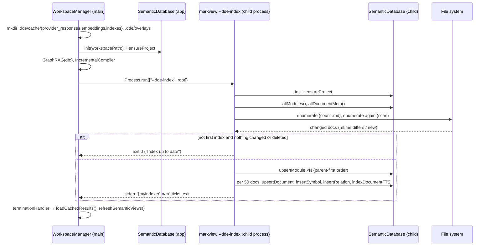
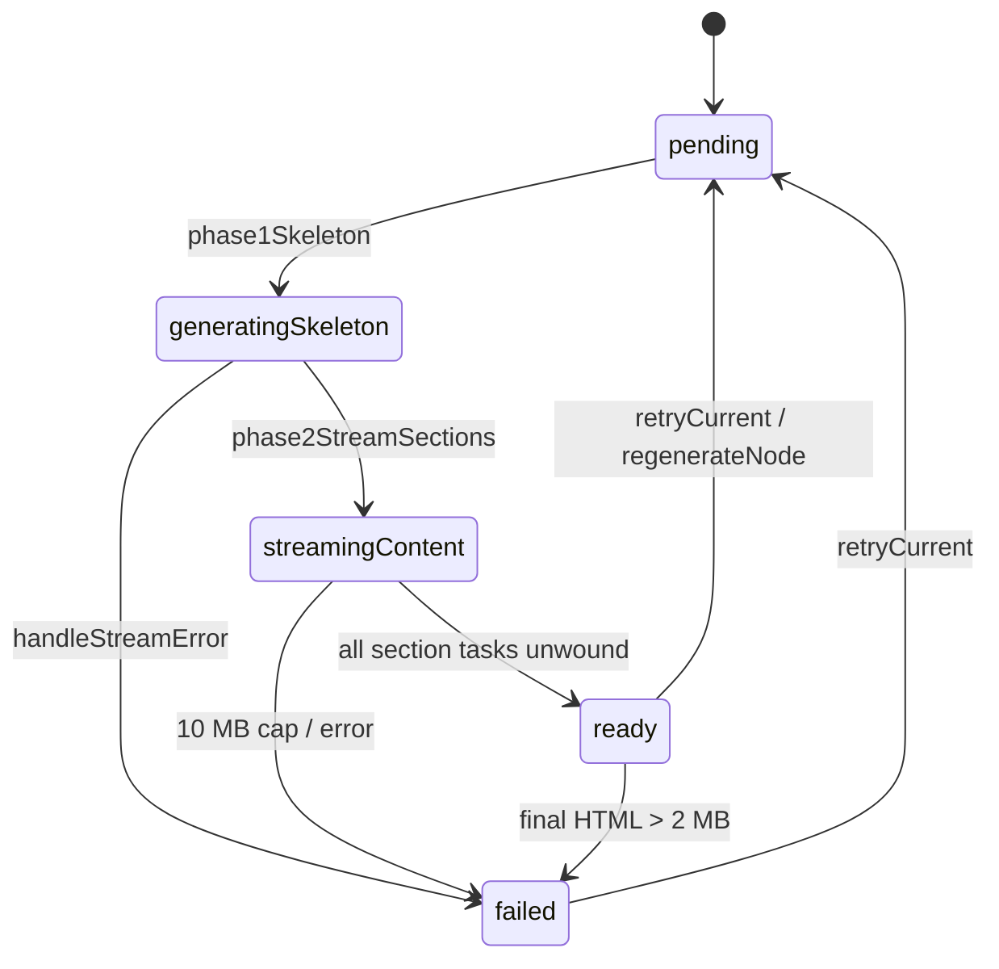

# Semantic Index, GraphRAG and Recursive Insight

Module doc for the workspace SQLite index (`.dde/state.db`), the deterministic
structural indexer, the Recursive Insight prompt builder (`GraphRAG`), the insight
session engine, its disk cache and ZIP export, and the three editor-side JavaScript
files that render insight pages.

Sibling docs: [app-shell-and-workspace](app-shell-and-workspace.md),
[editor-and-bridge](editor-and-bridge.md),
[ai-assistants-and-dictation](ai-assistants-and-dictation.md),
[feature-workflow](feature-workflow.md),
[architecture-and-xray](architecture-and-xray.md),
[git-github-terminal-lifecycle-usage](git-github-terminal-lifecycle-usage.md),
[build-release-testing](build-release-testing.md).

---

## 1. Purpose and responsibilities

What this subsystem owns:

- **Workspace database engine.** `SemanticDatabase` is a thin wrapper over the
  system `SQLite3` C API. It opens `.dde/state.db`, sets pragmas, creates about 35
  tables, and gives typed CRUD helpers to the rest of the app
  (`MarkView/Models/SemanticDatabase.swift:4-60`).
- **Structural (no-LLM) indexing.** `StructuralIndexer` walks the folder once. It
  records directories as `modules`, each `.md` file as a `documents` row, headings,
  links and code fences as `symbols`, Markdown links as `struct_relations`, and the
  full text in the FTS5 table `fts_documents`
  (`MarkView/Models/StructuralIndexer.swift:3-48`). The app runs it in a separate
  child process (`MarkView/App/MarkViewApp.swift:137-166`).
- **Full-text search.** `SemanticDatabase.search(query:limit:)` runs an FTS5 `MATCH`
  query (`SemanticDatabase.swift:1196-1212`). The TOC search UI and FeatureAI's
  "related documents" context use it.
- **Persisted AI usage counter.** A one-row `usage_stats` table that every
  `CLICompletion.Result.record(in:)` call adds to (`SemanticDatabase.swift:1050-1085`,
  `MarkView/Models/CLICompletion.swift:40-44`).
- **Storage for the architecture snapshot and review cache.** These are the
  `arch_*` tables, written and read for `ArchitectureStore`
  (`SemanticDatabase.swift:592-654, 686-852`).
- **Recursive Insight.** This feature turns a folder of Markdown files into a tree
  of interactive HTML "insight" pages:
  - Phase 0: classify the content.
  - Phase 1: build a JSON skeleton.
  - Phase 2: stream up to 5 sections at a time.
  - Deep-dive children.
  - Snapshot and cache on disk, then export as a ZIP.

  Files involved: `GraphRAG.swift`, `InsightSession.swift`, `InsightModels.swift`,
  `InsightCache.swift`, `InsightArchiveExporter.swift`, and the
  `markview-insight-*.js` files.

What it does **not** own:

- Running the AI CLI (process spawning, streaming, tool flags, model choice). That
  is `CLICompletion` / `ACPAssistant`; see
  [ai-assistants-and-dictation](ai-assistants-and-dictation.md). Every LLM call here
  goes through `CLICompletion.run`.
- The Swift-to-JS bridge plumbing (`WebViewBridge`, the `EditorView.Coordinator`
  Combine sinks) and `index.html` itself; see [editor-and-bridge](editor-and-bridge.md).
- Tab lifecycle, folder open and close, and the spawning of the indexer process
  (`WorkspaceManager`); see [app-shell-and-workspace](app-shell-and-workspace.md).
- The meaning of the architecture model stored in `arch_*`; see
  [architecture-and-xray](architecture-and-xray.md).
- **Embeddings and vector retrieval: they do not exist in practice.** The `chunks`
  table and `insertChunk` / `chunksForDocument` are never called from outside the
  file. `EmbeddingClient` (OpenAI `text-embedding-3-small`) is created as
  `WorkspaceManager.embeddingClient` (`MarkView/Models/WorkspaceManager.swift:328`),
  but `embed` / `embedBatch` have no callers. "GraphRAG" is a historical name. The
  class does no graph retrieval. It builds prompts from raw file bodies and uses the
  database only to record usage.

## 2. Files

| Path | Role |
|---|---|
| `MarkView/Models/SemanticDatabase.swift` | SQLite engine: open/reset, pragmas, schema, CRUD, FTS, usage stats, architecture persistence |
| `MarkView/Models/SemanticModels.swift` | Codable value types for blocks, entities, claims, relations, temporal contexts, AI jobs, diagnostics, templates (mostly legacy "semantic compiler" model) |
| `MarkView/Models/SemanticModel.swift` | Two-line stub: "created by mistake and should be deleted". Not in the Xcode project (`grep` finds 0 references in `project.pbxproj`) |
| `MarkView/Models/StructuralIndexer.swift` | Deterministic tree walk + Markdown parse → modules, documents, symbols, relations, FTS |
| `MarkView/Models/GraphRAG.swift` | Insight prompt builder: Phase 0 classifier, Phase 1 skeleton (structured JSON call), Phase 2 per-section prompts, catalog mode, prompt-injection escaping |
| `MarkView/Models/InsightSession.swift` | `@MainActor` session: node tree, pipeline orchestration, caps, retries, snapshot, deterministic HTML rebuild |
| `MarkView/Models/InsightModels.swift` | `InsightSkeleton`, `InsightSection`, `SectionType`, `InsightDeepDiveTopic`, `InsightContentType`, `SectionState` |
| `MarkView/Models/InsightCache.swift` | Disk cache under `<folder>/.markview-insight/`: node HTML, manifest, snapshot, vendored `_assets/` |
| `MarkView/Models/InsightArchiveExporter.swift` | Runs `/usr/bin/zip -r` to bundle an export staging dir |
| `MarkView/Resources/Editor/vendor/js/markview-insight-srcdoc.js` | Escape helpers, lib selection, blob materialization, iframe `srcdoc` builder (with the iframe-side script and CSS) |
| `MarkView/Resources/Editor/vendor/js/markview-insight-helpers.js` | View switching, loading overlay, breadcrumbs, status bar, 10 s iframe load timer |
| `MarkView/Resources/Editor/vendor/js/markview-insight-handlers.js` | `stripCDNTags`, the five Swift→JS setters, the parent `message` listener with the type allowlist |

All three JS files are plain globals loaded by `index.html:1579-1581`. They rely on
`state`, `DOM` and `sendToSwift` defined in `index.html`.

## 3. Key types

| Type | Isolation | Responsibilities / important members |
|---|---|---|
| `SemanticDatabase` (class) | `@MainActor` (`SemanticDatabase.swift:5`) | `init(workspacePath:dbName:)`; `nonisolated static documentId(for:root:)` (`:69-77`); `saveArchitecture` / `loadArchitecture` / `load/saveArchitectureReview`; `ensureProject`, `upsertDocument`, `allDocumentMeta`; `upsertBlock`, `deleteBlock`; `upsertModule`, `insertSymbol`, `insertRelation`, `indexDocumentFTS`, `search`; `getUsageStats`, `addUsage`; `clearSymbols`; private `execute(_:params:)` (`:1346-1378`). Exposes the raw handle as `dbPointer` (`:7`) |
| `SemanticDBError` | – | `openFailed` / `prepareFailed` / `executeFailed` wrapping `sqlite3_errmsg` (`:1381-1393`) |
| `StructuralIndexer` | `@unchecked Sendable` class (`StructuralIndexer.swift:6`) | `indexAll()`; private `scanTree` (utility queue), `writeModules`, `writeChangedDocs` (main-actor hops); `progress` callback |
| `GraphRAG` | `@MainActor`, `ObservableObject` with no `@Published` (`GraphRAG.swift:4-5`) | `classifyContent`, `buildSkeleton`, `buildSectionPrompt`, `static catalog(of:relativeTo:)`, `contentTypeAddendum`, private `escapeXMLEnvelopeBreakout` |
| `InsightSession` | `@MainActor final class`, `ObservableObject` (`InsightSession.swift:177-178`) | Published: `rootNodeId`, `currentNodeId`, `nodes`, `lastError`, `lastErrorRetryable`, `currentNodeSections`, `skeleton`, `skeletonReady`, `allSectionsReady`, `statusMessage`, `contentType`, `cachedNodeHTML`, plus v1 shims `streamingBuffer` / `isStreaming` (`:194-261`). API: `generateRoot`, `expand`, `expandCustom`, `expandAllTopicsOnCurrentNode`, `navigateTo`, `up`, `retryCurrent`, `retrySection`, `regenerateRoot`, `cancel`, `snapshot`, `breadcrumbs`, `static buildHTMLTemplate`, `static escapeForHTML`, `nonisolated static sanitizeForLog` |
| `InsightNode` | reference type, mutated on main actor (`:103-152`) | `id`, `parentId`, `level`, `title`, `scope: NodeScope`, `skeleton`, `sectionStates`, `children`, `status` (pending → generatingSkeleton → streamingContent → ready/failed), `generatedAt`, `model` (default `"claude-sonnet-4-6"`, never read) |
| `NodeScope` | Codable enum (`:28-78`) | `.folderRoot` or `.topic(label, hint, files:[URL])`; files encoded as absolute path strings |
| `InsightSkeleton` / `InsightSection` / `InsightDeepDiveTopic` | Codable structs (`InsightModels.swift:11-77`) | Phase 1 output. `metadata` reuses `AnyCodable` from `WebViewBridge.swift` |
| `SectionType` | enum, 9 cases (`InsightModels.swift:45-59`) | hero, prose, mermaidDiagram, chartJsChart, comparisonTable, timeline, cardsGrid, callout, collapsibleDetails |
| `InsightContentType` | enum, 13 cases (`InsightModels.swift:85-118`) | Phase 0 classes; `displayLabel` |
| `SectionState` | struct (`InsightModels.swift:123-135`) | `buffer` (accumulated HTML), `status` pending/streaming/ready/failed |
| `InsightCache` | value-type struct, not actor-isolated (`InsightCache.swift:68`) | `writeNode`, `readNode`, `deleteNode`, `updateManifest`, `loadManifest`, `write/read/deleteSnapshot`, `hasSnapshot`, `cleanup`, `archiveStagingDirectory`, `vendoredLibURL`, `static deterministicRootUUID(forFolderPath:)` |
| `InsightManifest` | Codable (`InsightCache.swift:52-65`) | `sessionId`, `folderName`, `createdAt`, `nodes[]` |
| `InsightArchiveExporter` | stateless struct (`InsightArchiveExporter.swift:49`) | `bundle(stagingURL:to:) async throws` |

Legacy model types in `SemanticModels.swift`: `SemanticBlock` (built from bridge
dictionaries, `:57-102`), `BlocksDelta`, `SemanticEntity`, `SemanticClaim`,
`SemanticRelation`, `TemporalContext`, `Transition`, `EvidenceLink`, `AIJob` and its
enums, `Diagnostic`, `DocumentTemplate`, `CompletenessEvaluation`. Only
`SemanticBlock` / `BlocksDelta` are used at runtime (editor block deltas).
`AnyCodableValue` (`:5-34`) supports the claim/entity decoding.

## 4. Internal interfaces

### Who calls in

| Caller | Entry point |
|---|---|
| `WorkspaceManager.initDDEWorkspaceAsync` (`WorkspaceManager.swift:492-548`) | `SemanticDatabase(workspacePath:)`, `ensureProject`, `GraphRAG(db:)`, `IncrementalCompiler(...)`, then `runStructuralIndex(at:)` |
| `WorkspaceManager.initSingleFileWorkspace` (`:1458-1491`) | `SemanticDatabase(workspacePath: parentDir, dbName: "file_<name>.db")`, then `indexSingleFile` (`:1494-1529`), which writes one module, one FTS row, one document and the heading symbols inline |
| `DDEIndexerRunner.run` (`MarkViewApp.swift:141-166`), child process `--dde-index <folder>` | `SemanticDatabase`, `ensureProject`, `StructuralIndexer.indexAll()`; progress goes to stderr as `[mvindexer] N/M` |
| `WorkspaceManager.runStructuralIndex` (`WorkspaceManager.swift:2987-3044`) | Spawns the child. It drains stderr through `readabilityHandler`, and on exit calls `loadCachedResults()` and `refreshSemanticViews()` |
| `WorkspaceManager.handleBlocksDelta` (`:2931-2966`) and `IncrementalCompiler.compileDelta` (`IncrementalCompiler.swift:21-57`) | `upsertBlock`, `deleteBlock`, `upsertDocument`, `delete{Claims,Relations,Diagnostics}ForBlock` |
| `WorkspaceManager.excludeFolder` (`:633-652`) | `clearSymbols` ×3 kinds, and `indexDocumentFTS(title:"", content:"")` to blank the FTS row |
| `TOCView.performSearch` (`MarkView/Views/TOCView.swift:161-164`) | `db.search(query:)` with the raw user text |
| `FeatureAI.relatedDocuments` (`MarkView/Models/FeatureAI.swift:216-226`) | `db.search` with up to 6 terms joined by `OR` |
| `ModuleExplorerView` (`MarkView/Views/ModuleExplorerView.swift:18-24`) | `getUsageStats()` for the `$x.xx` badge |
| `ArchitectureStore` (`ArchitectureStore.swift:262, 355, 2876, 2902`) | `loadArchitecture`, `saveArchitecture`, `saveArchitectureReview` |
| `CLICompletion.Result.record(in:)` | `addUsage` |
| `WorkspaceManager.startRecursiveInsight` (`WorkspaceManager.swift:2102-2184`) | `scanMarkdownFiles(in:)`, `InsightCache(workspaceURL: folderURL, ...)`, `InsightSession(...)`, `generateRoot()` |
| `WorkspaceManager.didRequestInsight*` forwarders (`:2212-2365`) | `expand`, `navigateTo`, `regenerateRoot`, `expandCustom`, `expandAllTopicsOnCurrentNode`, `retrySection`; `exportInsightArchive` (`:2391-2485`) |
| `WorkspaceManager.closeTab` (`:1566-1597`) | `session.cancel()` (the cache is intentionally **not** cleaned up) |
| `EditorView.Coordinator.routeInsight` (`MarkView/Views/EditorView.swift:437-611`) | Subscribes to `$skeleton`, `$currentNodeSections`, `$lastError`, `$statusMessage` and forwards to `WebViewBridge.loadInsightSkeleton / updateInsightSection / setInsightError / setInsightStatus` |

### What it calls out to

- `CLICompletion.run(_:onDelta:)` for every LLM call:
  - classifier: no schema, default 180 s timeout;
  - skeleton: `jsonSchema`, 600 s, or 1800 s in catalog mode;
  - sections: streamed through `onDelta`.

  `readableFolder` is set only when a payload is over budget, which turns on the
  CLI's read-only `Read,Grep,Glob` tools for Claude (`CLICompletion.swift:111-114`).
- `WebViewBridge.logInsightDiag` from `phase1Skeleton` (`InsightSession.swift:1107`).
- `ImportanceRater.isTemporary` inside `saveArchitecture` (`SemanticDatabase.swift:715`).
- `Bundle.main` (`Editor/vendor/{js,css}`) in `InsightCache.copyVendoredLibs`.
- `/usr/bin/zip` via `Process` (`InsightArchiveExporter.swift:76-83`).

### Bridge messages (JS ↔ Swift)

Swift → JS setters (`markview-insight-handlers.js`):

- `loadInsightSkeleton(skeleton, sessionId, nodeId, breadcrumbs)`
- `updateInsightSection(sessionId, sectionId, htmlChunk)`
- `setInsightError(sessionId, message, retryable)`
- `setInsightStatus(sessionId, message, phase)`
- `releaseInsightBlobs()`

Iframe → parent `postMessage` allowlist (`markview-insight-handlers.js:306-317`, ten
types, even though comments say "5"):

- `insightIframeReady`
- `insightDeepDiveClicked {sectionId, topicIndex}`
- `insightBreadcrumbClicked {nodeId}`
- `insightRequestSave`
- `insightRequestUp`
- `insightRequestRegenerate`
- `insightRequestCustomDeepDive {topic}`
- `insightRequestExploreAll {depth 1-3}`
- `insightRequestRetrySection {sectionId}`
- `insightDebug` (forwarded to Swift as `jsError`)

Parent → iframe messages: `updateInsightSection`, `initSectionLib`,
`updateInsightProgress` (`markview-insight-srcdoc.js:372-407`).

Swift handlers live in `WebViewBridge.swift:113-243` and `EditorView.swift:904-963`.

## 5. Runtime flows

### 5.1 Open workspace and structural index



Steps, grounded in the code:

1. `SemanticDatabase.init` tries `<root>/.dde/`. If it cannot be created, it falls
   back to `~/Library/Application Support/MarkView/<lastPathComponent with spaces→_>/`
   (`SemanticDatabase.swift:15-28`).
2. Legacy reset. If `PRAGMA user_version < 1` and a `documents` table exists, the
   file (with `-wal`/`-shm`) is deleted and reopened empty (`:44-55`). Then pragmas,
   `CREATE TABLE IF NOT EXISTS …`, and `PRAGMA user_version = 1` (`:57-59`).
3. `documentId(for:root:)` is the workspace-relative POSIX path. It falls back to the
   file name outside the root (`:69-77`).
4. `scanTree` runs on `DispatchQueue.global(qos: .utility)` (`StructuralIndexer.swift:103-104`):
   - The first enumeration counts `.md` files (not under `/.dde/`) for `N/M` progress
     (`:113-119`).
   - The second enumeration registers every ancestor directory as a module
     (`:136-143`).
   - It skips a file when the stored and current mtimes are equal (`:152-156`).
     Otherwise it reads UTF-8 and computes a 32-bit FNV-1a hex `contentHash`
     (`:165-168`).
5. Per-line parse (`:176-222`):
   - ATX headings (`^(#{1,6})\s+(.+)`) become `heading` symbols, with `context` set
     to the heading path joined by `" > "`.
   - `[text](target)` links that are not `http*` / `#` / `mailto:` become `link`
     symbols plus `links_to` relations to the resolved target docId.
   - Fence lines with a language tag become `code_block` symbols.
   - IDs are FNV-1a of `docId:line:text`, prefixed `sym_h_`, `sym_l_`, `sym_c_`,
     `rel_`, `mod_`.
6. Modules are sorted by level so parents are inserted first, because of the
   `modules.parent_module_id` FK (`:248-250`).
7. Writes run in chunks of 50 docs per `MainActor.run`, with `Task.yield()` between
   chunks (`:273-307`). In the child the main actor is serviced by `dispatchMain()`
   (`MarkViewApp.swift:164`).

### 5.2 Editor block deltas

The JS block extractor sends deltas. `WorkspaceManager.handleBlocksDelta` then calls
`upsertBlock` for added and changed blocks (docId = workspace-relative path) and
`deleteBlock` for removed ones (`WorkspaceManager.swift:2955-2963`).
`IncrementalCompiler.compileDelta` then upserts a document whose id is **the file
name only**, with `contentHash: ""` (`IncrementalCompiler.swift:22-33`). It also
cascades dirtiness in the in-memory `DependencyGraphScheduler`. No AI extraction runs
(`IncrementalCompiler.swift:3-4`).

### 5.3 Search (retrieval)

`search(query:limit:50)`:

```sql
SELECT document_id, title, snippet(fts_documents, 2, '>>>', '<<<', '...', 40), rank
FROM fts_documents WHERE fts_documents MATCH ? ORDER BY rank LIMIT ?
```

(`SemanticDatabase.swift:1196-1212`)

The query string is bound as-is, so FTS5 syntax is live. A malformed query fails in
`sqlite3_step` and returns an empty list. There is no vector or hybrid retrieval,
and no retrieval step feeds Insight prompts.

### 5.4 Recursive Insight session lifecycle

```mermaid
sequenceDiagram
    participant UI as Menu / iframe
    participant WM as WorkspaceManager
    participant S as InsightSession (@MainActor)
    participant G as GraphRAG (@MainActor)
    participant CLI as CLICompletion
    participant C as InsightCache
    participant EV as EditorView.Coordinator
    participant JS as index.html + iframe
    UI->>WM: startRecursiveInsight()
    WM->>WM: check CLI resolvable, graphRAG != nil, scanMarkdownFiles(root)
    WM->>C: InsightCache(workspaceURL: root) — copies vendor/js+css to _assets
    WM->>S: InsightSession(...); new .insight tab; Task{generateRoot()}
    S->>S: root id = deterministicRootUUID(folder path)
    S->>C: readSnapshotData()
    alt snapshot decodes and rootId matches
        S-->>EV: publish skeleton + all sectionStates (ready)
    else
        S->>G: classifyContent (Phase 0)
        G->>CLI: run(sample ≤12 KB)
        S->>G: buildSkeleton (Phase 1)
        G->>CLI: run(jsonSchema, 600 s / 1800 s)
        S-->>EV: $skeleton
        EV->>JS: loadInsightSkeleton → iframe srcdoc
        loop ≤5 concurrent sections (Phase 2)
            S->>G: buildSectionPrompt
            S->>CLI: run(onDelta)
            CLI-->>S: delta → Task{@MainActor appendSectionDelta}
            S-->>EV: $currentNodeSections
            EV->>JS: updateInsightSection(delta)
        end
        S->>S: writeFinalHTMLToCache (≤2 MB)
        S->>C: writeNode, updateManifest
        S->>C: writeSnapshotData (async Task)
    end
```

Phase details:

- **Phase 0 classify** (`GraphRAG.swift:147-201`):
  - Takes the first 1500 characters from each of up to 8 files, capped at about
    12 KB in total.
  - The system prompt asks for a single category word. The answer is lowercased,
    stripped of quotes, and matched by first word and then by substring.
  - Any error returns `.general`.
- **Phase 1 skeleton** (`GraphRAG.swift:203-454`):
  - **Catalog mode.** If the summed file size (each file capped at 50 KB) is over
    `inlinePayloadBudget = 600 KB` (`:25, :211`), the prompt carries a catalog
    instead of file bodies. The catalog is one line per file (path, size in KB,
    first `#` heading from the first 2 KB). It rolls up to one line per folder when
    it is over 120 KB (`:32-71`). The CLI also gets `readableFolder`.
  - **Inline mode.** Each file is validated:
    - symlink-resolved containment with a trailing `/` (`:224-248`);
    - truncated above 50 KB with `[truncated at 50KB]` (`:257-265`);
    - envelope-escaped (`:271`);
    - wrapped as `<file path="%-encoded">` (`:276-280`).

    Files are then grouped into `<community name="files (chunk i/N)">` blocks of
    200 KB or less (`:292-317`).
  - The JSON schema (`:349-419`) requires `title` and `sections`: 8-12 sections,
    each with `id`, `type`, `metadata`, and optional `deepDiveTopics`.
  - CLI and transport errors are thrown. A decode failure or zero sections returns
    `fallbackSkeleton` (one prose section) (`:437-453, 635-650`).
  - `InsightSession.phase1Skeleton` (`InsightSession.swift:1081-1182`):
    - for topic nodes, narrows files to paths that exist, else uses all files;
    - drops duplicate section ids and logs duplicate topic ids;
    - publishes the skeleton;
    - creates one `SectionState()` per section.
- **Phase 2 sections** (`InsightSession.swift:1196-1319`):
  - All prompts are pre-built on the main actor with `buildSectionPrompt`
    (`GraphRAG.swift:472-614`). File selection:
    - `scopeHint == nil` means all files;
    - `[]` means "No source files for this section.";
    - otherwise paths are matched by relative path, and traversal (`..`, `\`) is
      rejected;
    - over `sectionPayloadBudget = 200 KB`, the section gets a catalog plus
      `needsFolderAccess`.
  - `withTaskGroup`, gated to 5 in flight (`:1245-1301`).
  - Each task catches its own errors. `CancellationError` is silent. Other errors
    call `markSectionFailed`.
  - Deltas hop to the main actor through `Task { @MainActor … appendSectionDelta }`
    (`:1268-1277`). `appendSectionDelta` (`:1330-1366`) appends only while the node
    is `.streamingContent` and enforces the 10 MB per-node cap and the 50 MB
    per-session cap.
  - At the end the node becomes `.ready` regardless of how many sections failed
    (`:1309-1318`).
- **Deterministic HTML rebuild** (`InsightSession.swift:1432-1502, 1524-1834`):
  - `buildHTMLTemplate` escapes every skeleton string. It inserts section buffers
    **verbatim** and emits deep-dive `<button class="deep-dive">` elements.
  - `_assets` references are resolved by prefix through `vendoredLibURL` (`.exportRelative`).
  - It adds a CSP meta, inline CSS, and a bootstrap script (Mermaid, Chart.js and
    lightbox).
  - Output over 2 MB fails the node without retry. The result goes to
    `cache.writeNode` and the manifest is upserted.
- **Snapshot** (`InsightSession.swift:788-830`):
  - A `nonisolated` method schedules a main-actor Task. It encodes every node that
    has a skeleton and non-empty buffers into `RootSnapshot { rootId, folderPath,
    createdAt, nodes[NodeSnapshotEntry] }` with ISO-8601 dates.
  - `tryRestoreRootFromSnapshot` (`:712-780`) accepts the full tree, or the legacy
    root-only `skeleton` / `sectionBuffers`. Restored nodes are all `.ready`, and
    sections with empty buffers are `.pending`.

Node state machine:



User actions:

- **Deep dive** — `expand(sectionId:topicIndex:)`, `:839-931`:
  - bounds-checked again after the checks in `WorkspaceManager` (`:2230-2262`) and
    in the parent JS;
  - reuses an existing child with the same label and hint;
  - otherwise validates `scopeHint` (`validateScopeHint`, `:1966-2005`: containment,
    `.md`, exists), cancels the active task, creates the child, and runs Phase 1 → 2
    → cache.
- **Custom deep dive** — `expandCustom(topic:)`, `:520-579`: the child has
  `scope.topic(label: t, hint: t, files: [])`, where empty files means all files.
  Text selected in the iframe triggers it as well (`markview-insight-srcdoc.js:566-609`).
- **Explore all** — `expandAllTopicsOnCurrentNode(depth:)`, `:464-514`: expands
  topics one after another, depth clamped to 1-3. It navigates back to the parent
  before each expand and awaits `activeTask.value`.
- **Navigate / Up** — `:936-965`: cancels any in-flight generation, publishes the
  node's state, and reads the cached HTML.
- **Retry the node** — `retryCurrent`, `:982-1031`: limited to 3 per 60 s per node
  (sliding window), then non-retryable.
- **Retry one section** — `retrySection`, `:408-457`: one `CLICompletion.run`
  outside `activeTask`.
- **Regenerate** — `regenerateRoot`, `:591-678`:
  - at the root: cancel, delete the snapshot and every node HTML, clear state, run
    `generateRoot`;
  - at a child: drop its descendants and their HTML, reset the node, and rerun it.
- **Close tab** (`WorkspaceManager.swift:1566-1597`):
  1. release blobs;
  2. `await session.cancel()`;
  3. **keep** `.markview-insight/`;
  4. remove the tab by session id.

### 5.5 Iframe rendering (web side)

1. `loadInsightSkeleton` (`markview-insight-handlers.js:39-144`):
   1. Synchronously resets `state.insightSessionId`, `insightCurrentNodeId`,
      `insightSkeleton`, `insightIframeReady=false`, and `insightPendingChunks`.
   2. Computes the required libs: Prism always, Mermaid and Chart.js by section type,
      KaTeX when `metadata.hasMath` (`markview-insight-srcdoc.js:69-85`).
   3. Materializes the libs as blob URLs, and KaTeX CSS with base64 fonts
      (`:93-158`).
   4. Builds the srcdoc (`:165-798`).
   5. Sets `sandbox="allow-scripts allow-same-origin"` (`handlers.js:132`) and
      assigns `srcdoc`.
   6. Starts a 10 s ready timer (`helpers.js:169-195`).
2. The srcdoc loads libs by relative `vendor/js/...` paths, **not** the blob URLs
   (`srcdoc.js:188-203`). It renders placeholders with skeleton loaders and
   `dd-btn` buttons, a footer (Up, a language select, Explore-all depth, custom topic,
   Export ZIP), and an inline IIFE.
3. `updateInsightSection` applies `stripCDNTags` to each chunk (`handlers.js:1-30`):
   - removes code fences, `<script>`, `on*=` attributes and `javascript:` URLs;
   - removes prefetch, preconnect and dns-prefetch links.

   Before the iframe is ready, chunks are buffered. After that they are posted to the
   iframe, and a debounced (100 ms) `initSectionLib` follows (`:149-216`).
4. Inside the iframe, chunks are appended to `sectionBuffers[sid]`. On
   `initSectionLib` the whole buffer replaces the placeholder via `innerHTML`, and
   then:
   - Mermaid runs, after converting `pre code.language-mermaid`, `pre.mermaid` and
     keyword-sniffed `<pre>` blocks, with `securityLevel: 'loose'`;
   - Chart.js runs on `canvas[data-chart]` after a regex strips function-string
     callbacks;
   - KaTeX auto-render and Prism run last.

   See `srcdoc.js:257-386`.
5. Failed sections with an empty buffer get a retry placeholder
   (`data-retry-section`) from Swift (`EditorView.swift:527-545`).

### 5.6 Archive export

`WorkspaceManager.exportInsightArchive` (`:2391-2485`):

1. Runs an `NSSavePanel` with the default name `<folder>_insight_<ISO8601 with - for :>.zip`
   and forces a `.zip` extension.
2. Snapshots the child map (matched by `child.title == topic.label`).
3. Rewrites **every** in-memory node HTML into the cache with the current template.
4. `archiveStagingDirectory()` checks that the resolved root is a directory
   (`InsightCache.swift:300-314`).
5. Copies the non-hidden cache contents to `NSTemporaryDirectory()/insight-export-<UUID>`
   (`WorkspaceManager.swift:2528-2548`).
6. `rewriteForStandaloneExport`:
   - promotes the root to `index.html`;
   - rewrites `../_assets/` and breadcrumb hrefs;
   - turns expanded deep-dive buttons into `<a href="<child>.html">`.
7. `InsightArchiveExporter.bundle`:
   - runs `/usr/bin/zip -r <dest>.tmp .` with `currentDirectoryURL = staging`,
     passing arguments as an array with no shell (`InsightArchiveExporter.swift:76-83`);
   - waits via `terminationHandler`;
   - on non-zero exit reads stderr and throws a sanitized `zipFailed`;
   - moves or replaces `.tmp` onto the destination (`:145-157`).
8. `defer` removes the temp copy.

## 6. Data model and persistence

### 6.1 Database files and pragmas

- Path: `<workspace>/.dde/state.db`. Single-file mode uses
  `<parentDir>/.dde/file_<basename>.db` (`WorkspaceManager.swift:1463-1468`). The
  sandbox fallback is `~/Library/Application Support/MarkView/<folderName>/`.
- Pragmas (`SemanticDatabase.swift:106-116`):
  - `foreign_keys=ON`
  - `journal_mode=WAL`
  - `synchronous=NORMAL`
  - `busy_timeout=5000`
  - `temp_store=MEMORY`
  - `cache_size=-20000` (about 20 MB)
- Versioning:
  - `PRAGMA user_version` (currently `1`) gates a full file reset for the old docId
    scheme (`:40-55, 80`).
  - `applied_migrations(migration_id PK, applied_at)` is created but nothing writes
    to it (`:657-662`).
  - The only in-place migration is `addMissingColumns("arch_nodes", signature,
    summary_signature, component, tags_json)` (`:614-617, 677-682`).

### 6.2 Tables

Timestamps are Unix seconds (`INTEGER`). "Used" means some code outside
`SemanticDatabase.swift` reads or writes the table at runtime.

| Table | Columns (PK first) | Indexes / FKs | Used? |
|---|---|---|---|
| `projects` | `project_id` TEXT PK, `project_name` NN, `root_path` NN UNIQUE, `created_at` NN, `updated_at` NN, `dde_version`, `schema_version` NN, `config_json` | – | yes (`ensureProject`, schema_version `'1.0'`) |
| `documents` | `document_id` PK, `project_id` NN, `file_path` NN, `file_name` NN, `file_ext` NN, `file_mtime`, `file_size_bytes`, `content_hash` NN, `frontmatter_json`, `language`, `status` DEFAULT 'active', `created_at`, `updated_at`; UNIQUE(project_id, file_path) | `idx_documents_project`; FK project_id→projects CASCADE | yes |
| `blocks` | `block_id` PK, `document_id` NN, `parent_block_id`, `block_kind` NN, `heading_path_json` NN, `anchor`, `order_index` NN, `line_start`, `line_end`, `raw_markdown` NN, `plain_text`, `text_hash` NN, `semantic_hash`, `compile_status` DEFAULT 'stale', `last_compiled_at`, `created_at`, `updated_at` | `idx_blocks_document`, `idx_blocks_doc_order`, `idx_blocks_text_hash`; FK document→documents CASCADE, parent→blocks CASCADE | yes (editor deltas) |
| `block_compilation_cache` | `block_id` PK, `text_hash` NN, `semantic_hash`, `extracted_{entities,claims,relations}_json`, `cache_created_at`, `cache_updated_at` | FK block→blocks CASCADE | no |
| `entities` | `entity_id` PK, `name`, `type`, `canonical_name` (NN), `aliases_json`, `attributes_json`, `description`, `status` DEFAULT 'active', `source_file`, `source_block_id`, `created_at`, `updated_at` | `idx_entities_canonical`, `idx_entities_type` | no (CRUD exists, unused) |
| `claims` | `claim_id` PK, `type` NN, `subject_entity_id`, `predicate`, `object`, `object_entity_id`, `source_file` NN, `source_block_id` NN, `raw_text`, `status` DEFAULT 'proposed', `confidence` REAL 0.5, `authority_level`, `superseded_by`, `scope_kind` DEFAULT 'global', `scope_value`, `temporal_context_id`, `effective_from`, `effective_to`, `evidence_block_ids_json`, `created_at`, `updated_at` | `idx_claims_block`, `idx_claims_entity`; FK subject→entities SET NULL, source_block→blocks CASCADE, temporal→temporal_contexts SET NULL | delete-only (`deleteClaimsForBlock`) |
| `entity_relations` | `relation_id` PK, `source_id` NN, `target_id` NN, `type` NN, `source_file`, `source_block_id`, `confidence` 0.5, `created_at` | `idx_relations_source`, `idx_relations_target` | delete-only |
| `temporal_contexts` | `temporal_context_id` PK, `label` NN, `kind` NN, `order_index` 0, `start_time`, `end_time`, `parent_temporal_context_id` | self-FK SET NULL | no |
| `transitions` | `transition_id` PK, `entity_id` NN, `from_state`, `to_state` NN, `from/to_temporal_context_id`, `preconditions_json`, `postconditions_json`, `rollback_strategy`, `trigger`, `evidence_block_ids_json` | FK entity→entities CASCADE | no |
| `diagnostics` | `diagnostic_id` PK, `type`, `severity`, `message` NN, `explanation`, `document_id` NN, `block_id`, `claim_ids_json`, `entity_ids_json`, `suggested_fix`, `is_suppressed` 0, `created_at` | `idx_diagnostics_doc`; FK document CASCADE | delete-only |
| `ai_jobs` | `job_id` PK, `job_type`, `priority`, `status` DEFAULT 'pending', `document_id`, `block_ids_json`, `input_hash` NN, `model_policy`, `privacy_mode` NN, `result_ref`, `error_state`, `created_at`, `started_at`, `completed_at`, `retry_count` 0, `cost_tokens` | `idx_ai_jobs_hash`, `idx_ai_jobs_status` | no (`findCachedJob` unused) |
| `compile_profiles` | `profile_id` PK, `name`, `description`, `audience`, `required_claim_types_json`, `required_entity_types_json`, `section_order_json`, `strictness` 'moderate', `language` 'en' | – | no |
| `compile_jobs` | `compile_job_id` PK, `profile_id` NN, `status`, `created_at`, `completed_at` | FK profile CASCADE | no |
| `compile_artifacts` | `artifact_id` PK, `compile_job_id` NN, `artifact_kind`, `section_key`, `content` NN, `content_hash`, `source_block_ids_json`, `source_claim_ids_json`, `created_at` | FK job CASCADE | no |
| `document_templates` | `template_id` PK, `name`, `description`, `sections_json`, `required_claim_types_json`, `required_entity_types_json` | – | no |
| `completeness_evaluations` | `evaluation_id` PK, `document_id` NN, `template_id`, `structural_score`, `semantic_score`, `overall_score`, `missing_parts_json`, `evaluated_at` | FK document CASCADE | no |
| `recompute_nodes` / `recompute_edges` | node: `node_id` PK, `node_type`, `is_dirty`, `last_computed_at`; edge: `edge_id` PK, `source_node_id`, `target_node_id`, `edge_type` | edge FKs → nodes CASCADE | no (`DependencyGraphScheduler` is in-memory) |
| `usage_stats` | `id` INTEGER PK CHECK(id=1), `total_input_tokens`, `total_output_tokens`, `total_jobs`, `total_cost_cents` REAL | seeded row id=1 (`:445`) | yes |
| `modules` | `module_id` PK, `name` NN, `path` NN UNIQUE (absolute), `parent_module_id`, `level` 0, `description`, `file_count` 0 | self-FK CASCADE | yes |
| `symbols` | `symbol_id` PK, `module_id`, `document_id`, `name` NN, `kind` NN (`heading`/`link`/`code_block`), `line_start`, `line_end`, `context` | `idx_symbols_doc`, `idx_symbols_module`, `idx_symbols_kind`; FKs module, document CASCADE | yes |
| `struct_relations` | `relation_id` PK, `source_id`, `target_id`, `type` (`links_to`), `source_doc`, `evidence` (link text) | `idx_srel_source/target/type` | write-only |
| `artifacts` | `artifact_id` PK, `module_id`, `kind`, `content` NN, `created_at`, `model_used` | `idx_artifacts_module` | no |
| `fts_documents` | FTS5 virtual: `document_id`, `title`, `content`, `tokenize='porter unicode61'` | – | yes |
| `chunks` | `chunk_id` PK, `document_id` NN, `text` NN, `char_start`, `char_end`, `embedding_file` | `idx_chunks_doc`; FK document CASCADE | no |
| `quality_tags` | `tag_id` PK, `module_id`, `attribute` NN, `value` 'unknown', `source_artifact_id` | FK module CASCADE | no |
| `citations` | `citation_id` PK, `artifact_id`, `document_id`, `line_start`, `line_end`, `quote_text` | `idx_citations_artifact` | no |
| `change_plans` | `plan_id` PK, `module_id`, `description` NN, `steps_json`, `status` 'draft', `created_at` | – | no |
| `communities` | `community_id` PK, `name`, `module_ids_json`, `summary`, `level` 0 | – | no |
| `arch_nodes` | PK(`view`, `id`), `parent_id`, `kind`, `name`, `path`, `language`, `loc` 0, `files` 0, `summary`, `role`, `tech`, `signature`, `summary_signature`, `component`, `tags_json` | – | yes (ArchitectureStore) |
| `arch_edges` | PK(`view`, `source`, `target`, `kind`), `weight` 1, `label` | – | yes |
| `arch_coverage` | `node_id` PK, `status`, `docs_json` '[]' | – | yes |
| `arch_metrics` | `node_id` PK, `json` (`FileMetrics`) | – | yes |
| `arch_reviews` | `diff_hash` PK (SHA-256 of diff), `json`, `created_at` | – | yes |
| `arch_meta` | `key` PK, `value`. Keys: systemName, systemPurpose, components, assignments, overrides, logicalSignature, language, logicalDraft, ratings, coverageReport, deploymentSignature, scannedAt, enrichedAt, gitHead, deploymentHints (`:705-722`) | – | yes |
| `applied_migrations` | `migration_id` PK, `applied_at` | – | no |

`saveArchitecture` wipes and rewrites all `arch_*` tables except `arch_reviews` in one
`BEGIN IMMEDIATE … COMMIT` (`:687-732`). It is the only explicit transaction in the
file.

### 6.3 Other files written

| Path | Format | Writer |
|---|---|---|
| `<ws>/.dde/cache/{provider_responses,embeddings,indexes}/`, `<ws>/.dde/overlays/` | empty dirs | `initDDEWorkspaceAsync` (`WorkspaceManager.swift:501-504`). `provider_responses` is emptied by the unused `clearAll` (`SemanticDatabase.swift:1031-1040`) |
| `<ws>/.markview-insight/_assets/**` | copies of every file under bundle `Editor/vendor/js` and `Editor/vendor/css` (recursive) | `InsightCache.init` (`InsightCache.swift:94-114, 336-393`) |
| `<ws>/.markview-insight/nodes/<NODE-UUID>.html` | full standalone HTML from `buildHTMLTemplate` | `writeNode` (atomic temp + `replaceItemAt`) |
| `<ws>/.markview-insight/manifest.json` | `InsightManifest`, pretty-printed, sorted keys, ISO-8601 | `updateManifest` |
| `<ws>/.markview-insight/snapshot.json` | `RootSnapshot` JSON (ISO-8601); contains absolute `folderPath`, absolute topic file paths, all section HTML | `writeSnapshotData` |
| `<ws>/.markview-insight/*.tmp`, `nodes/*.tmp` | staging for atomic writes | removed on failure |
| `$TMPDIR/insight-v1-compat/.markview-insight/` | same layout | only the unused convenience init (`InsightSession.swift:303-321`) |
| `$TMPDIR/insight-export-<UUID>/` | export staging copy | removed by `defer` |
| user-chosen `*.zip` (+ `*.zip.tmp`) | ZIP: `index.html`, `nodes/`, `_assets/`, `manifest.json`, `snapshot.json` | `InsightArchiveExporter` |
| `/tmp/markview-insight-diag.log` | append-only text | `WebViewBridge.logInsightDiag` (`WebViewBridge.swift:460-475`), also written to stderr |
| `~/markview_debug.log` | indexer exit line | indexer `terminationHandler` (`WorkspaceManager.swift:3016-3020`) |

The deterministic root id is `SHA-256(folder path)[0..<16]` with RFC-4122 v4 and
variant bits set (`InsightCache.swift:235-248`). Moving or renaming the folder
orphans the snapshot.

## 7. Concurrency and threading

- **Every SQL call runs on the main actor.** `SemanticDatabase` is `@MainActor`, and
  there is no background connection. In the app this covers: TOC search, the
  architecture save (a full delete and reinsert), per-keystroke `upsertBlock`, and
  `addUsage`.
- **Cross-process writes.** The child indexer process writes to the same file through
  WAL. `busy_timeout = 5000` (`SemanticDatabase.swift:113`) means that a main-thread
  write in the app can block up to 5 s while the child holds the write lock. The
  indexer does not batch its writes in transactions: every `execute` autocommits.
  That keeps each lock short, but a large first index costs one commit per row.
- **StructuralIndexer.** File I/O runs on a global utility queue inside
  `withCheckedContinuation` (`StructuralIndexer.swift:103-256`). `progress` is called
  from that queue. In the child it writes to stderr. `@unchecked Sendable` hides the
  fact that `db` (main-actor) is captured, but the code only touches it through
  `MainActor.run`.
- **GraphRAG is `@MainActor` and reads files synchronously.** These calls run on the
  main thread:
  - `String(contentsOf:)` in `classifyContent` (`GraphRAG.swift:160`),
    `buildSkeleton` (`:251`) and `buildSectionPrompt` (`:588`);
  - the `FileHandle` head reads in `catalog` (`:45-50`);
  - `resourceValues` in `inlineBytes` (`:80-84`).

  `phase2StreamSections` builds every section prompt up front on the main actor
  (`InsightSession.swift:1223-1234`). On a large folder this can cost several
  seconds of main-thread file I/O, up to 50 KB × files × sections.
- **InsightSession.**
  - All state changes happen on the main actor.
  - `activeTask` is the single owner of the pipeline task
    (`InsightSession.swift:268`). `cancel()` awaits it (`:970-977`).
  - Section tasks run in a `withTaskGroup` child context and hop back through
    `Task { @MainActor }` for each delta (`:1268-1277`). Deltas are therefore
    delivered as separate unstructured tasks.
  - `writeSnapshotForRoot` is `nonisolated` and fire-and-forget (`:788-789`).
  - `retrySection`'s CLI call is not attached to `activeTask`, so `cancel()` and
    `closeTab` do not stop it (`:430-440`).
- **InsightCache** is a value type used from the main actor. It does synchronous file
  I/O, including copying the whole vendor tree on every session start
  (`InsightCache.swift:112-113`).
- **Archive export.**
  - The export `Task` in `WorkspaceManager` is not stored, so nothing can cancel it.
    The `withTaskCancellationHandler` path in the exporter is unreachable in practice.
  - `process.terminationHandler` is assigned after `process.run()`
    (`InsightArchiveExporter.swift:99-105, 165-171`).
  - stdout goes to an undrained `Pipe()` (`:89`) and stderr is read only after exit
    (`:133`).

  See §10 for why these matter.
- **The child indexer process** is re-executed with `--dde-index`. It runs
  `dispatchMain()` so `MainActor.run` hops work (`MarkViewApp.swift:147-165`). The
  app drains its stderr with `readabilityHandler`, and stdout goes to `nullDevice`
  (`WorkspaceManager.swift:2996-3012`).

## 8. Error handling and edge cases

- **DB open failure** throws `SemanticDBError.openFailed`. `initDDEWorkspaceAsync`
  logs it, and the workspace continues without `semanticDatabase` or `graphRAG`, so
  Insight shows "Workspace not ready" (`WorkspaceManager.swift:2122-2128`).
- **Most CRUD helpers swallow errors** with `try?`: `upsertModule`, `insertSymbol`,
  `insertRelation`, `indexDocumentFTS`, `addUsage`, `saveArchitectureReview`, and
  the indexer's `upsertDocument`. Read helpers return `[]`, `nil` or zero on prepare
  failure.
- **Read helpers force-unwrap text columns.** `String(cString: sqlite3_column_text(...))`
  on columns that can be NULL would crash, for example `search` title (`:1206`) and
  `allModules` (`:1233-1236`). The schema declares these columns `NOT NULL`, except
  for FTS columns.
- **Insight error mapping** (`handleStreamError`, `InsightSession.swift:1870-1919`):
  - `CancellationError` or a cancelled task is silent;
  - `CLICompletion.Failure.toolNotFound` is not retryable;
  - `failed`, `timedOut` and `invalidOutput` are retryable;
  - `InsightSessionError.cacheWriteFailed` is not retryable;
  - `.pipeline` is retryable.

  Errors mark the node `.failed` and keep partial buffers. UI state changes only if
  the erroring node is still current.
- **Caps and limits:**
  - per file 50 KB (truncated);
  - per community chunk 200 KB;
  - inline over 600 KB switches to catalog mode;
  - per section over 200 KB switches to catalog mode;
  - catalog 120 KB, then folder rollup;
  - per node raw buffers 10 MB (cancel, non-retryable);
  - per session 50 MB (evict the oldest nodes that are not on the current breadcrumb
    path, `:1932-1958`);
  - final HTML 2 MB;
  - 5 concurrent sections;
  - 3 retries per 60 s.
- **Model output problems:**
  - Hallucinated `scopeHint` paths are dropped. A topic with none left falls back to
    all files (`:1102-1105`).
  - An empty explicit `scopeHint` produces a "No source files" section.
  - Skeleton decode failure produces a one-section fallback.
  - A schema violation is logged truncated to 160 characters; the dictionary itself
    is never logged (`GraphRAG.swift:449-452`).
- **Restore:** a snapshot decode failure or a `rootId` mismatch regenerates from
  scratch (`InsightSession.swift:716-723`).
- **JS side:**
  - an unknown section id or a stale session id drops the chunk;
  - a 10 s iframe timeout clears `srcdoc` and shows an error (`helpers.js:169-178`);
  - a Chart.js config parse error is posted as `insightDebug`.
- **Export failures** (`zipFailed`, `moveFailed`, `launchFailed`) show a sanitized
  `NSAlert`. Cancellation is logged only.

## 9. Extension points and recipes

- **Add a DB column.**
  - Add it to the `CREATE TABLE`.
  - For tables that already exist in user files, add it to an `addMissingColumns`
    call (`SemanticDatabase.swift:614-617`), because `CREATE TABLE IF NOT EXISTS`
    never alters.
  - Bump `docIdSchemeVersion` only when the id scheme changes. The bump **deletes
    the whole DB**, including `arch_*` and `usage_stats` (`:44-55`), and per the
    versioning rules in `CLAUDE.md` that is a `major` change.
- **Add a table.** Append another `try execute("CREATE TABLE IF NOT EXISTS …")` to
  `createTables`, and add typed helpers that use `execute(_:params:)` with
  `SQLValue`, never string interpolation of values.
- **Index a new symbol kind.**
  - Extend the per-line loop in `StructuralIndexer.scanTree` (`:176-222`) and pick an
    id prefix.
  - Keep `indexSingleFile` (`WorkspaceManager.swift:1494-1529`) aligned. It
    duplicates the heading parse but uses `mod_single_file` and no `context`.
  - Update `excludeFolder`'s `clearSymbols` list.
- **Add a section type.**
  - Add the enum case in `SectionType` (`InsightModels.swift:45`). The schema enum
    picks it up through `allCaseStrings`.
  - Add a hint in `GraphRAG.sectionTypeHints` (`:108-133`).
  - Add CSS in both `InsightSession.buildHTMLTemplate` (`:1639-1695`) and
    `markview-insight-srcdoc.js` (`:622-769`), because the two stylesheets are
    duplicated.
  - Add any lib initialization to `initSectionLib` (`srcdoc.js:257-346`), to the
    export bootstrap (`InsightSession.swift:1698-1812`), and to `computeRequiredLibs`.
- **Add a content type.** Add the enum case and `displayLabel`
  (`InsightModels.swift:85-117`) and a `contentTypeAddendum` case (`GraphRAG.swift:658-798`).
- **Add an iframe action.** You need all of the following:
  - an iframe `postParent` call (`srcdoc.js:410-440`);
  - an entry in the parent allowlist and a `switch` case (`handlers.js:306-503`);
  - a `WebViewBridge.userContentController` case (`WebViewBridge.swift:113-162`);
  - a delegate method in `EditorView` (`:904-963`);
  - a `WorkspaceManager.didRequestInsight*` forwarder;
  - a session method.
- **Change caps.** They are `private static let` in `InsightSession.swift:275-279`
  and `GraphRAG.swift:16-28`. Nothing reads them from settings.

## 10. Risks, tech debt, oddities

Correctness:

1. **The index goes stale in several ways.**
   - Deleted files are never removed from `documents`, `symbols` or `fts_documents`.
     The deleted set is computed only to decide the fast path
     (`StructuralIndexer.swift:34-41`).
   - For a changed file, old symbols and relations are not cleared. IDs include the
     line number, and `INSERT OR IGNORE` only adds rows (`:185, 206, 217`,
     `SemanticDatabase.swift:1167, 1175`), so moved or edited headings pile up.
   - Excluded folders are not honoured by the indexer, and are re-indexed on the next
     run (`scanTree` has no exclusion check; compare `WorkspaceManager.swift:633-652`).
2. **Two document-id schemes write to the same table.** `IncrementalCompiler`
   upserts `document_id = file name` with `content_hash ""` and a NULL mtime
   (`IncrementalCompiler.swift:22-33`). For a root-level file this is the same id the
   indexer uses, so editing it wipes the stored hash and mtime and forces a re-parse.
   For nested files it creates stray rows.
3. **`upsertBlock` does not refresh position fields on conflict.** It updates only
   `raw_markdown`, `plain_text`, `text_hash`, `compile_status` and `updated_at`
   (`SemanticDatabase.swift:910-911`). `order_index`, `line_start`, `line_end` and
   `heading_path_json` stay stale.
4. **`retrySection` cannot put content into the buffer.** It resets the section to
   `.streaming`, but the node stays `.ready`. `appendSectionDelta` returns early
   unless `node.status == .streamingContent` (`InsightSession.swift:1335`), so every
   retried delta is dropped. The call ends in `markSectionReady` with an empty buffer
   (`:414-442`).
5. **Other InsightSession defects.**
   - Line 1333 checks `Task.isCancelled` inside a fresh unstructured task, where it
     is always false. The guard does nothing.
   - Line 1311 marks the node `.ready` even when every section failed. The comment
     says "at least one section".
6. **Navigating away can leave a deep-dive child stuck.** `navigateTo` cancels the
   active generation (`:944`). The child then sits in `generatingSkeleton` or
   `streamingContent` with partial content. A later `expand` on the same topic reuses
   it without regenerating (`:874-883`), and the user must press Retry.
7. **Snapshot restore has no content check.** It happens whenever `rootId` matches
   (`:720`). There is no invalidation by source-file hash or mtime, so edited sources
   show a stale insight until Regenerate.
8. **Session eviction leaves files behind.** `enforceSessionMemoryCap` removes nodes
   from memory (`:1932-1958`), but their `nodes/*.html` files and manifest entries
   stay on disk.

Security:

9. **The iframe sandbox is effectively off.** `index.html:1382` declares
   `sandbox="allow-scripts"`, but `loadInsightSkeleton` replaces it with
   `allow-scripts allow-same-origin` (`handlers.js:132`). A same-origin srcdoc iframe
   can script the parent document, which owns `sendToSwift` and the bridge.
   Several comments still describe a null-origin sandbox (`srcdoc.js:7-12`,
   `InsightSession.swift:1427-1429`). The remaining defences are:
   - **Regex sanitising per chunk** in `stripCDNTags` (`handlers.js:1-30`). The iframe
     joins chunks and assigns the result through `innerHTML` (`srcdoc.js:359-370`).
     An `on*=` attribute or `javascript:` URL split across two deltas passes
     unsanitised.
   - **Mermaid with `securityLevel: 'loose'`** (`srcdoc.js:315`).
   - **A srcdoc CSP** with `script-src 'self' 'unsafe-inline' blob: data:` and
     `connect-src 'self'` (`srcdoc.js:170`). A helper comment claims
     `connect-src 'none'` (`helpers.js:201`).

   The trigger is attacker-controlled Markdown that steers the model's output.
10. **Cached and exported HTML embed raw LLM output.** `buildHTMLTemplate` inserts
    section buffers verbatim, with no stripping on the Swift side
    (`InsightSession.swift:1574`). The CSP allows `'unsafe-inline'` scripts
    (`:1633`). Opening an exported `index.html` in a browser runs any inline script
    the model produced.
11. **The export leaks paths and content.** The ZIP includes `snapshot.json`, which
    holds absolute paths (`NodeScope.encode`, `InsightSession.swift:46`;
    `folderPath`, `:814`) and every section buffer. The manifest is included too,
    because the staging copy only skips hidden files (`WorkspaceManager.swift:2538-2546`).
12. **The diagnostic log is world-readable and large.**
    `/tmp/markview-insight-diag.log` gets the first 300 characters of every JS
    evaluation, which includes every streamed section chunk
    (`WebViewBridge.swift:535`). It also gets a `jsError` diagnostic for every
    buffered or direct chunk and every incoming `postMessage` (`handlers.js:66, 153,
    174, 179, 327`). The file grows without bound and contains document-derived text,
    which conflicts with the `CLAUDE.md` logging rule.
13. **Catalog mode exposes the whole folder.** It passes `readableFolder: folderURL`
    (the workspace root). The CLI's `Read,Grep,Glob` can then read any file there,
    not only `.md` files (`GraphRAG.swift:431`, `InsightSession.swift:1233`,
    `CLICompletion.swift:113`).
14. **An unused OpenAI API key is stored in plain text.** `EmbeddingClient` keeps it
    in `UserDefaults` under `com.markview.dde.openai.apikey`
    (`EmbeddingClient.swift:125-127`), and the key is never used by this subsystem.

Concurrency and resources:

15. **Main-thread I/O in GraphRAG.** The file reads listed in §7 run on the main
    thread. On large folders they can block the UI.
16. **Exporter hang risks.** stdout goes to an unread `Pipe()` (`zip -r` prints one
    line per file) and stderr is read only after exit
    (`InsightArchiveExporter.swift:85-89, 133`). A full pipe buffer blocks `zip`
    forever, in violation of the pipe-draining rule in `CLAUDE.md`. Also,
    `terminationHandler` is assigned after `run()` (`:99-105`). The comment's claim
    that Foundation calls it retroactively is not a documented guarantee.
17. **Unreachable cancellation.** Export cancellation cannot fire (§7), although
    comments claim `closeTab` terminates the zip (`InsightArchiveExporter.swift:20-25`,
    `WorkspaceManager.swift:1549-1552`).
18. **Main-thread SQL can wait on the child indexer.** It may block up to the 5 s
    `busy_timeout` while the child writes (`SemanticDatabase.swift:113`).

Dead code and drift:

19. **Most of the schema is dead.** About 20 of the tables are never populated
    (§6.2). Helpers with no callers: `upsertEntity`, `upsertClaim`, `upsertRelation`,
    `upsertTemporalContext`, `findCachedJob`, `uniqueEntities`, `allClaims`,
    `entityCount`, `claimCount`, `clearAll`, `insertChunk`, `chunksForDocument`,
    `citationsForArtifact`, `insertQualityTag`, `getDocumentHash`,
    `symbolsForModule`, `execute_raw`. `applied_migrations` is never written.
20. **Stray and misleading files and fields.**
    - `SemanticModel.swift` is a stub that asks to be deleted.
    - `InsightNode.model = "claude-sonnet-4-6"` is never read (`InsightSession.swift:132`).
    - The v1 shims `streamingBuffer` / `isStreaming` and the convenience init
      (`:257-261, 303-321`) are unused.
    - `NodeScope` handles `skeleton: nil` legacy fields.
21. **The `InsightCache` header is wrong.** It says the layout is
    `<workspace>/.insight-cache/<sessionUUID>/` and that the cache is removed on close
    (`InsightCache.swift:6, 13-18`, `WorkspaceManager.swift:2143-2147`). In fact the
    path is `<workspace>/.markview-insight/`, `sessionId` is ignored (`:94-97`), and
    `cleanup()` has no callers.
22. **`_assets` never refreshes after an app update.** Existing files are skipped
    (`InsightCache.swift:384-389`), so assets stay at the version from the first run,
    and new versioned filenames pile up next to old ones. The folder also copies every
    `vendor/js` file (CodeMirror, Cytoscape and ELK bundles, `markview-*.js`) into the
    user's folder and into every export.
23. **Blob URLs are materialised but unused.** Lib blob URLs are still fetched and
    created (`srcdoc.js:93-118`, `handlers.js:74-88`), while the srcdoc loads
    `vendor/js/...` by relative path (`srcdoc.js:188-203`).
24. **The language selector does nothing.** It sends `lang`, but the parent handler
    drops it (`srcdoc.js:427, 435`; `handlers.js:477-486`). The language actually
    comes only from the "dominant language of the source" prompt rule.
25. **Mermaid markup instructions disagree.** The section hint says
    `<pre class="mermaid">` (`GraphRAG.swift:112`) and the section system prompt says
    `<pre><code class="language-mermaid">` (`:494`). The iframe accepts both.
26. **UI phase logic depends on status text.** `EditorView.derivePhaseTag`
    (`EditorView.swift:616-627`) and the overlay regex `/\bphase 1\b.*\banalyz/i`
    (`handlers.js:268`) both parse `statusMessage` strings, so rewording a message
    breaks the UI phase logic.
27. **Styles are duplicated.** The CSS and lightbox code exist twice, in the srcdoc
    and in the exported template (`srcdoc.js:447-560, 622-769` and
    `InsightSession.swift:1639-1811`).
28. **The indexer enumerates the tree twice** (count pass plus scan pass), and
    compiles the link `NSRegularExpression` once per line
    (`StructuralIndexer.swift:113-119, 192-193`).
29. **The export maps children to deep-dive buttons by label.** It uses
    `child.title == topic.label` (`WorkspaceManager.swift:2503-2513`), so two topics
    with the same label link to the same child.

## Glossary

- **DDE**: the internal name for the documentation environment. `.dde/` is the
  per-workspace data directory.
- **docId**: a workspace-relative POSIX path used as `documents.document_id`
  (`SemanticDatabase.documentId`).
- **Module (index)**: a directory on the path to at least one `.md` file (`modules`
  row). This is not the same as an architecture module.
- **Symbol**: a heading, link or code fence found by the structural parse.
- **FTS**: the SQLite FTS5 full-text index `fts_documents`.
- **Recursive Insight**: the feature that turns a folder into a tree of generated
  HTML pages.
- **Node / root node**: one insight page. The root covers the folder
  (`NodeScope.folderRoot`) and has a deterministic UUID.
- **Skeleton**: the Phase 1 JSON structure: title, sections, deep-dive topics.
- **Section**: a typed part of a node. Its HTML streams in Phase 2.
- **Deep dive (🤿)**: a child node generated for a topic (`InsightDeepDiveTopic`),
  a custom topic, or selected text.
- **Explore all**: expanding every topic on a page one after another, up to depth 3.
- **Catalog mode**: prompts that list files instead of inlining them, with read-only
  CLI access to the folder.
- **Community**: a `<community>` envelope of at most 200 KB that groups `<file>`
  bodies in the Phase 1 prompt. The name is left over from GraphRAG; nothing is
  clustered.
- **Envelope escaping**: rewriting `<file>` and `<community>` tags inside file bodies
  to defeat prompt-injection breakout.
- **Snapshot**: `.markview-insight/snapshot.json`, the full-tree restore file.
- **Manifest**: `.markview-insight/manifest.json`, the node index.
- **`_assets`**: vendored JS and CSS copied next to the cached HTML for offline and
  export use.
- **srcdoc**: the HTML document assigned to the insight iframe.
