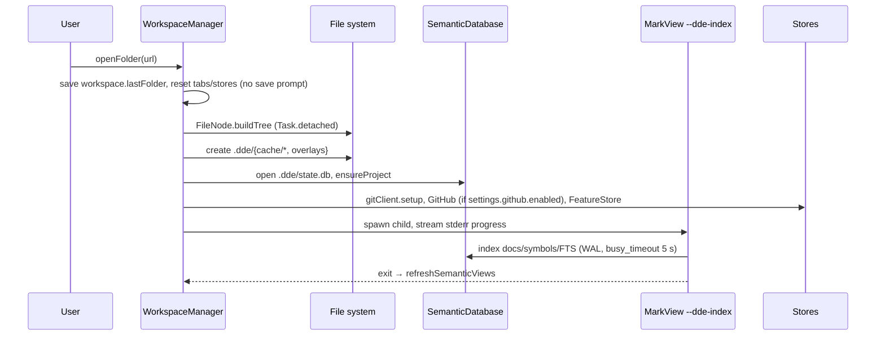

# Runtime Flows

These are the end-to-end paths across subsystems. Each flow gives the short version and links to
the module section with full `path:line` detail.

## 1. Process launch

`DDEAppEntry.main` (`MarkView/App/MarkViewApp.swift:126-135`) chooses between two modes:

| Mode | Trigger | What happens |
|---|---|---|
| GUI | normal launch | `MarkViewApp.main()` → `WindowGroup` → `ContentView` → `@StateObject WorkspaceManager`. On appear: restore `workspace.lastFolder` after 0.6 s, drain Finder "Open With" URLs queued by `MarkViewAppDelegate`, and poll `/tmp/markview_open_path.txt` every 1 s |
| Headless indexer | `--dde-index <folder>` | `DDEIndexerRunner.run`: open `SemanticDatabase`, `StructuralIndexer.indexAll()`, print `[mvindexer] N/M` to stderr, `exit` |

Details: [app-shell §5.1](./modules/app-shell-and-workspace.md#51-launch).

## 2. Open a folder



Details: [app-shell §5.2](./modules/app-shell-and-workspace.md#52-open-folder),
[semantic §5.1](./modules/semantic-index-and-insight.md#51-open-workspace-and-structural-index).

## 3. Open a file and render it

1. `WorkspaceManager.openFile(url)` reads the file as UTF-8, synchronously, and appends an `OpenTab`.
   A `.md` file outside the workspace switches to a single-file workspace (`.dde/file_<name>.db`).
2. `EditorView.Coordinator.loadContentIfNeeded` picks the renderer: `setCodeContent` (code and notes
   view), `setStructuredContent` (JSON/YAML/canvas) or `setContent` (Markdown). Local images are
   inlined as base64 first.
3. JS `renderMarkdown` runs markdown-it, then Mermaid, Prism and KaTeX. It sends
   `headingsUpdated`, `blocksChanged` and `contentChanged` back to Swift.

Details: [editor §6.1–6.2](./modules/editor-and-bridge.md#61-editor-load).

## 4. Edit and save

```
source textarea input ─► renderMarkdown ─► bridge: contentChanged{markdown,html}
   ─► WorkspaceManager.updateActiveTabContent (isModified = content != originalContent)
WYSIWYG edits ─► wysiwygDirty=true ─► on ⌘S: Turndown HTML→Markdown ─► contentChanged ─► saveRequested
   ─► WorkspaceManager.saveActiveFile ─► String.write(atomically:) on the main thread
blocksChanged ─► handleBlocksDelta ─► SQLite upsert ─► IncrementalCompiler.compileDelta
```

Turndown loads from a CDN, so saving a WYSIWYG edit fails silently when offline. See
[risks](./risks-and-tech-debt.md). Details: [editor §6.3](./modules/editor-and-bridge.md#63-edit--save-round-trip).

## 5. Any AI call

Every AI feature (X-Ray, Insight, features/bugs, Explain, translation, filters) goes through
`CLICompletion.run`:

1. Resolve the CLI through `CLIToolLocator`, using the user path override, `settings.cli.extraPATH`
   and `zsh -lc command -v`.
2. Build argv. Claude uses `-p` stream-json, and gets `Read,Grep,Glob` only with a readable folder
   and web tools only with `allowWeb`. Codex runs `exec --sandbox read-only --json` with a schema
   file. Cline and Copilot use ACP JSON-RPC over stdio, with a permission filter.
3. Stream stdout through `readabilityHandler`, and enforce the timeout with SIGTERM.
4. Parse text and structured JSON, and record token usage in the DB.

Details: [ai-assistants §6](./modules/ai-assistants-and-dictation.md#62-one-shot-completion-via-claudecodex).

## 6. X-Ray (architecture map)

1. `ArchitectureScanner` runs off the main thread: `git ls-files`, language heuristics, import edges,
   git metrics and co-change.
2. `ArchitectureStore` commits nodes and edges to the `arch_*` tables.
3. AI analysis runs four passes: grouping, naming, descriptions and edges.
4. The payload is JSON-encoded and sent to `markview-architecture.js` (Cytoscape + ELK).
5. User actions come back as bridge messages: open a file, explain an edge, filters and PR actions.

Details: [architecture-and-xray §5](./modules/architecture-and-xray.md#51-open-the-tab-show-the-stored-map-rescan).

## 7. Recursive Insight

1. `InsightSession` classifies the content, then requests a skeleton with a JSON schema: sections
   and child topics.
2. It streams up to 5 section calls at once into an iframe (`markview-insight-*.js`).
3. Each node is cached in `<ws>/.markview-insight/` (`nodes/<UUID>.html`, `manifest.json`,
   `snapshot.json`).
4. Deep dive (🤿) creates child nodes. Export zips the cache.

Details: [semantic §5.4](./modules/semantic-index-and-insight.md#54-recursive-insight-session-lifecycle).

## 8. Feature and bug intake

1. `IntakeSheet` has three options: New Feature, New Bug and "I Need to Understand". Its text field
   accepts dictation.
2. `FeatureAssistant` runs AI rounds that produce questions, requirements, decisions and findings.
3. `FeatureStore` writes each object as a Markdown file under `docs/features/<slug>/` or
   `docs/bugs/BUG-nnn-<slug>.md`. An optional GitHub issue is created, and lifecycle events are
   appended.

Details: [feature-workflow §5](./modules/feature-workflow.md#51-new-feature-intake).

## 9. Terminal and link activation

1. `TerminalSession` runs `forkpty` with `$SHELL -l` and sets `TERM_PROGRAM=MarkView`.
2. It streams the PTY through the `terminal` bridge handler into `terminal.html` (xterm.js).
3. A Cmd+click on a URL or OSC 8 link sends `{type:'link'}`. Cmd+click is captured before mouse
   reporting, so full-screen TUIs don't receive the click.
4. File paths are checked in Swift through `TerminalLink.resolve`, relative to the live shell cwd.
   Openable files go to a MarkView tab at the line; other files go to `NSWorkspace`.

This flow was the subject of [BUG-001](../bugs/BUG-001-terminal-clicking-an-https-link-does-not-open.md).
Details: [terminal §B.5](./modules/git-github-terminal-lifecycle-usage.md#b5-runtime-flows).

## 10. Close folder / quit

`closeFolder()` prompts for modified tabs, then cancels Insight sessions, stops terminals and the
indexer, resets stores and releases engines. Opening another folder skips the prompt; see
[risks](./risks-and-tech-debt.md). Details: [app-shell §5.7](./modules/app-shell-and-workspace.md#57-close-folder--remove-metadata).
