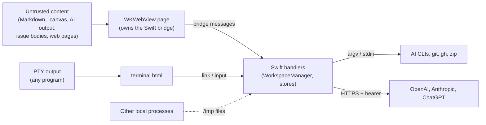

# Security Model

MarkView runs **without the App Sandbox**, with ATS arbitrary loads allowed. It can read any file
the user can read and can launch any binary. Its protections come from validation at each trust
boundary. This page lists those boundaries, what is enforced, and the known gaps. Severity
ordering and fix status are in [risks-and-tech-debt](./risks-and-tech-debt.md).

## 1. Trust boundaries

## 2. What is enforced

| Boundary | Control | Where |
|---|---|---|
| Bridge → file open | Paths must stay under the workspace or X-Ray root; `..` and absolute paths rejected for canvas and wikilinks; symlink escapes blocked | [app-shell](./modules/app-shell-and-workspace.md), [X-Ray](./modules/architecture-and-xray.md) |
| Bridge → URL open | `openURL` opens only `https://github.com…` | `WorkspaceManager.swift:1239` |
| Bridge → PR actions | Operations and merge methods are allowlisted | `ArchitectureStore` |
| Insight messages | Main-frame origin check; UUID and manifest membership checked; logged values sanitized | [semantic](./modules/semantic-index-and-insight.md) |
| Terminal links | Only `http(s)` and existing local files; `javascript:`, `data:`, `ssh:`, remote `file:` rejected | `TerminalLink.swift` |
| AI CLIs | Read-only modes (Claude tool allowlist, Codex `--sandbox read-only`, ACP permission filter); prompt envelopes escape `<file>` tags; model-suggested paths checked for containment and existence | [ai-assistants](./modules/ai-assistants-and-dictation.md) |
| Subprocesses | Argument arrays, not shell strings (git, gh, zip); `gh`/git prompts disabled | module docs |
| Vendor tokens | Read-only, re-read per fetch, ephemeral `URLSession`, redirects refused | [usage](./modules/git-github-terminal-lifecycle-usage.md) |
| Logs | The OpenAI key is logged only as presence and length | app shell |

## 3. Known weaknesses

| # | Weakness | Impact |
|---|---|---|
| S1 | Markdown renders with `html: true` into the page that owns `window.webkit.messageHandlers.bridge`, and the CSP allows inline scripts (`markview-state.js:53`, `index.html:21`) | A crafted document can post any bridge message, for example PR actions or opening a `file://` link through `NSWorkspace` |
| S2 | The Insight iframe is switched to `allow-scripts allow-same-origin` at runtime (`markview-insight-handlers.js:132`). The script stripping is a per-chunk regex, and Mermaid runs with `securityLevel:'loose'` | Model output can script the parent page. Exported HTML runs inline scripts in a browser |
| S3 | `.canvas` text nodes render markdown with HTML enabled and an unescaped `color` style (`markview-canvas.js:163,463`) | HTML injection in the bridge-owning page |
| S4 | The AI terminal runs `claude --dangerously-skip-permissions`, and GitHub issue bodies, CI logs and PR text are pasted into it | Prompt injection from repo or GitHub content gets full agent permissions |
| S5 | OpenAI key in plaintext UserDefaults, not the Keychain | Readable by any process running as the user |
| S6 | `/tmp/markview_open_path.txt` is polled and trusted | Any local process can make the app open a path |
| S7 | "Open in Terminal.app" escapes only `"` in AppleScript; the shell sees an unquoted path | A folder name containing `;`, `$()` or backticks runs a command |
| S8 | `/tmp/markview-insight-diag.log` is world-readable and records content prefixes and JS stacks; `WhisperClient` `NSLog`s transcript prefixes | Document contents leak to logs, against the CLAUDE.md rule |
| S9 | Terminal links pass non-openable existing files to `NSWorkspace.open` | Cmd+clicking a printed `.command` path runs it |
| S10 | ACP permission check: searches allowed whatever paths they name; reads don't resolve symlinks | Reads outside the project through a symlink |
| S11 | Four editor scripts load from jsDelivr without SRI | Supply-chain risk, plus offline breakage |
| S12 | Web Inspector is enabled in Release builds (`EditorView.swift:19`) | Debug surface in shipped builds |
| S13 | Unescaped strings are spliced into `evaluateJavaScript` (`WebViewBridge.swift:614,637`) | JS breaks on an apostrophe in a folder name; possible injection |
| S14 | Content is sent to AI CLIs without redaction (deployment configs up to 40k chars, untracked diffs, whole documents); `newBug` posts the raw description to a GitHub issue | Secrets can leave the machine or be published |

## 4. Rules for contributors

- Validate every bridge payload at the Swift handler (type, containment, allowlist). Never trust JS
  ([editor §9](./modules/editor-and-bridge.md#9-error-handling-edge-cases-payload-validation)).
- Pass subprocess arguments as arrays, drain pipes, and never shell-interpolate user or repo strings.
- Never log credentials, request headers or document contents (CLAUDE.md).
- Keep AI calls read-only unless the user explicitly starts an agent terminal.
- Load no new web dependency from a CDN; vendor it through `tools/web-vendor`.
