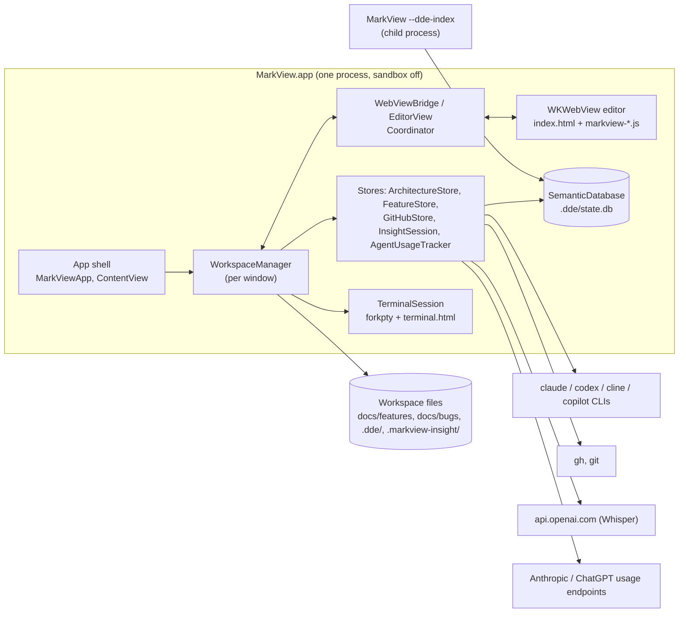

# System Overview

Snapshot of `main` at `85b6f8d` (2.17.0). Details and `path:line` citations live in the
[module docs](./modules/); this page is the map.

## 1. What MarkView is

A native macOS 13+ documentation environment ("DDE") for a folder of Markdown and code:

- Reads, edits and renders Markdown, JSON/YAML, JSON Canvas, images, code, and PDF export.
- Runs a local SQLite index (structure plus FTS5 full-text search) per workspace.
- Uses local AI CLIs (Claude Code, Codex, Cline, GitHub Copilot) for analysis, not a hosted backend:
  the X-Ray architecture map, Recursive Insight documents, Explain notes, feature/bug workflows,
  translation, and AI filters.
- Integrates optionally with `git`, the GitHub `gh` CLI, an embedded PTY terminal (xterm.js),
  OpenAI Whisper dictation, and AI-agent quota tracking.

There is no server component. Everything runs inside one app process, plus child processes (CLIs, a
headless indexer, shells).

## 2. Technology stack

| Layer | Technology |
|---|---|
| Language / UI | Swift 5.9, SwiftUI with AppKit bridges (`NSViewRepresentable`, `NSOpenPanel`, `NSWorkspace`) |
| Rendering | `WKWebView` hosting `MarkView/Resources/Editor/index.html` + `vendor/js/markview-*.js` (plain script files, shared globals) |
| Web libraries | markdown-it (+ plugins), Mermaid, KaTeX, Prism, CodeMirror 6, Cytoscape + ELK, Chart.js, js-yaml, xterm.js. They are bundled, except d3, dagre and turndown, which load from jsDelivr (see [risks](./risks-and-tech-debt.md)) |
| Storage | SQLite3 C API (WAL, FTS5) at `<workspace>/.dde/state.db`; JSON caches; Markdown files with YAML front matter; UserDefaults; one JSONL log |
| AI | CLI subprocesses: `claude -p` stream-json, `codex exec --json`, ACP JSON-RPC over stdio for Cline/Copilot; OpenAI HTTP for Whisper (embeddings client exists but is unused) |
| Build | Xcode project generated from `project.yml` (XcodeGen), no Swift packages, esbuild for vendored JS |

## 3. Container view

## 4. Subsystems

| Subsystem | Core types | Responsibility | Doc |
|---|---|---|---|
| App shell & workspace | `DDEAppEntry`, `MarkViewApp`, `ContentView`, `WorkspaceManager`, `OpenTab`, `FileTreeView` | Launch, windows, menus, tabs, file tree, open/save, settings, and dispatch for most bridge actions | [app-shell-and-workspace](./modules/app-shell-and-workspace.md) |
| Editor & bridge | `EditorView`, `WebViewBridge`, `PDFExporter`, `markview-*.js` | Rendering, editing, find, diagrams, code viewer, Swift↔JS message protocol, PDF | [editor-and-bridge](./modules/editor-and-bridge.md) |
| AI assistants & dictation | `CLICompletion`, `ACPAssistant`, `AIAssistantPreferences`, `CLIToolLocator`, `CodeExplainer`, `WhisperClient`, `DictationController` | One abstraction over the CLIs, prompt building, Explain notes, code navigation, voice input | [ai-assistants-and-dictation](./modules/ai-assistants-and-dictation.md) |
| Feature workflow | `FeatureStore`, `FeatureAssistant`, `IntakeSheet`, `FeatureIngest` | Feature and bug specs on disk (`docs/features`, `docs/bugs`), AI question rounds, plans, GitHub issues | [feature-workflow](./modules/feature-workflow.md) |
| Architecture & X-Ray | `ArchitectureScanner`, `ArchitectureStore`, `XRay*`, `markview-architecture.js` | Repo scan → component graph → AI grouping and descriptions → Cytoscape map; PR X-Ray reviews | [architecture-and-xray](./modules/architecture-and-xray.md) |
| Semantic index & Insight | `SemanticDatabase`, `StructuralIndexer`, `GraphRAG`, `InsightSession`, `InsightCache` | SQLite schema, structural and FTS indexing, prompt assembly, Recursive Insight documents | [semantic-index-and-insight](./modules/semantic-index-and-insight.md) |
| Git, GitHub, terminal, lifecycle, usage | `GitClient`, `GitHubClient`, `GitHubStore`, `TerminalSession`, `TerminalLink`, `LifecycleLog`, `AgentUsageTracker` | VCS panel, PR/issue/CI integration, PTY terminals, cycle-time events, quota tracking | [git-github-terminal-lifecycle-usage](./modules/git-github-terminal-lifecycle-usage.md) |
| Build, release, testing | `project.yml`, `bump-version.sh`, `release.sh`, `tools/tests/*` | Toolchain, signing, versioning, standalone swiftc tests | [build-release-testing](./modules/build-release-testing.md) |

## 5. Architectural principles (observed)

1. **One window = one `WorkspaceManager`.** It owns the workspace root, tabs, the `SemanticDatabase`
   and the per-workspace stores. Menus reach it through `FocusedValue`.
2. **The web view is a renderer, not the source of truth.** Swift owns file contents and tabs. JS
   renders and sends edits back through `window.webkit.messageHandlers.bridge` (see the
   [message catalog](./modules/editor-and-bridge.md#5-bridge-message-catalog)).
3. **AI through local CLIs.** MarkView never holds Anthropic/OpenAI chat credentials. It shells out to
   the user's signed-in CLIs, mostly read-only, and parses JSON or JSON-schema answers.
4. **Files are the database for human artifacts.** Features, bugs, research answers and decisions are
   Markdown with YAML front matter inside the repo, so they are reviewable and committable. Machine
   state goes to `.dde/` (SQLite and JSON caches), which is regenerable.
5. **Integrations are opt-in and silent when off.** GitHub is off by default
   (`settings.github.enabled`). Exceptions: agent-usage polling, and the terminal PR picker (see
   [risks](./risks-and-tech-debt.md)).
6. **Heavy indexing runs out of process.** The app re-launches itself with `--dde-index <folder>` and
   streams progress from stderr.

## 6. Code size (2.17.0)

| Area | Lines |
|---|---|
| Swift (`MarkView/**/*.swift`, 75 files) | ~37.4k |
| of which `WorkspaceManager.swift` / `ArchitectureStore.swift` / `InsightSession.swift` | 3766 / 3136 / 2024 |
| Editor (`index.html` + `markview-*.js`) | ~9.8k |
| `EditorWeb/` (future editor, not shipped) | 10 files |

## 7. Where to start reading

1. `MarkView/App/MarkViewApp.swift`: entry point and menus.
2. `MarkView/Views/ContentView.swift`: window layout.
3. `MarkView/Models/WorkspaceManager.swift`: `openFolder`, `openFile`, `saveActiveFile`, and the bridge action switch.
4. `MarkView/Views/EditorView.swift` + `MarkView/Bridge/WebViewBridge.swift`: the Swift side of the editor.
5. `MarkView/Resources/Editor/index.html`: script load order, then `markview-render.js`.
6. `MarkView/Models/AIAssistants.swift`: how every AI call is made.
