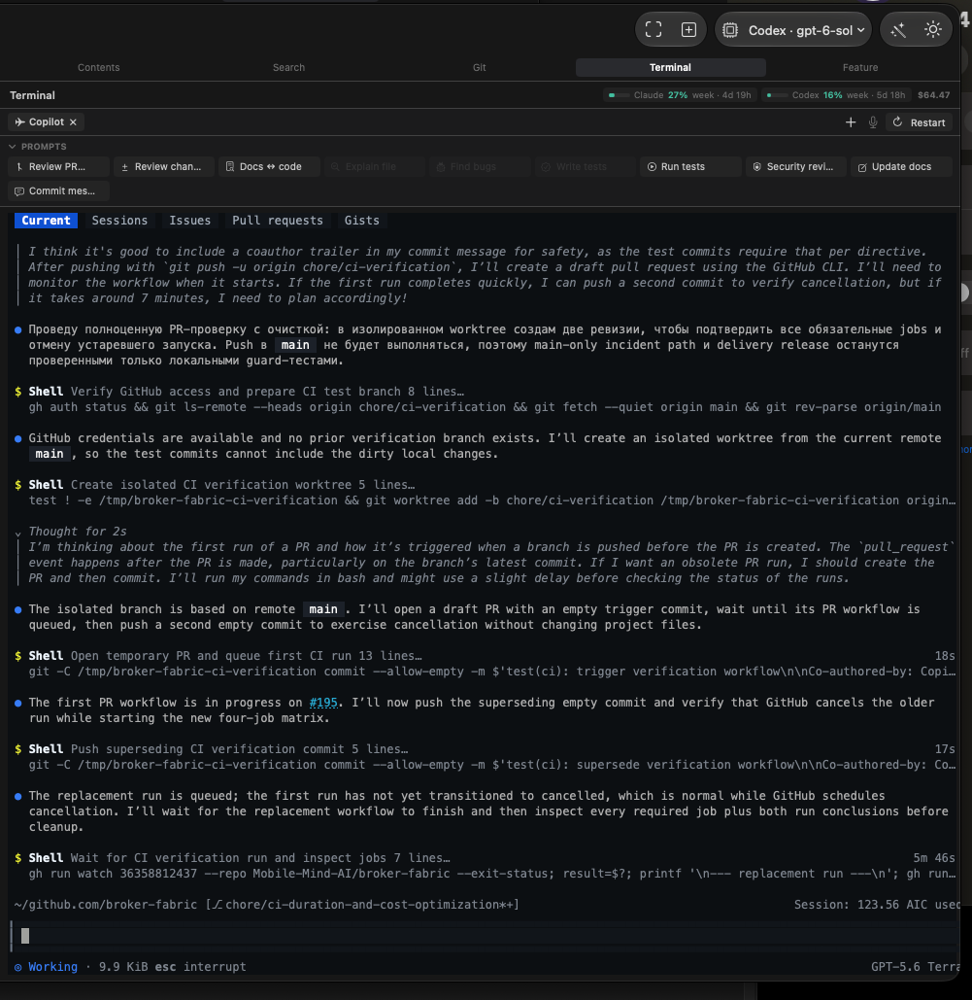

# Terminal panel clips text at the right and bottom edges

## Summary

The screenshot shows terminal output cut at the right edge and apparent clipping of the bottom status line in the right-side Terminal panel. Resizing clears it. The confirmed cause is a startup fit race, distinct from the BUG-007 glyph-paint issue.

## Steps to reproduce

1. Open MarkView and show the right-side Terminal panel.
2. Start or select a Copilot terminal session.
3. Let the session produce long output reaching the panel's right edge and inspect the bottom status line.
4. Compare the visible text with the panel boundaries, as shown in the attached screenshot.

## Expected

All terminal text, including rightmost characters and the bottom status line, remains fully visible within the panel.

## Actual

In the attached screenshot, text is cut off at the right edge of the Terminal panel. The bottom status line also appears clipped against the panel boundary. The screenshot shows a Copilot session; the exact window size and display settings are unknown.

## Environment

MarkView on macOS; Terminal tab in the right panel with a Copilot session. App version, macOS version, display configuration, and panel dimensions are unknown.

## Suspected code

- `MarkView/Resources/Editor/terminal.html` — Defines the terminal's edge insets, xterm row padding, FitAddon sizing, and ResizeObserver. It also contains the fix recorded for the earlier right-edge clipping bug.
- `MarkView/Views/TerminalView.swift` — TerminalHostView attaches the WKWebView to a resizable native container; its bounds determine the visible terminal area.
- `MarkView/Models/TerminalSession.swift` — Receives terminal resize messages and updates PTY dimensions, which can affect wrapping and full-screen terminal UI layout.
- `docs/bugs/BUG-007-embedded-terminal-clips-the-rightmost-characters-o.md` — Records the previous right-edge clipping symptom, its reported environment, and its fix; useful for checking whether this is a regression.

## Root cause

- The xterm FitAddon can return without fitting while cell metrics are still unavailable. The page nevertheless sent `ready` with xterm's default 80×24 grid, starting the PTY at the wrong size. When cell metrics later became valid without an element size change, ResizeObserver did not run again. A manual resize caused a fresh fit, matching the reported recovery.

## Missing information

- Whether it also occurs in other terminal sessions or the full editor terminal tab.
- App version and display scaling at the time of the screenshot remain unknown. The startup fit race was reproduced in native WebKit.

## Attachments

## Clarifications

**BQ-1** Меняется ли обрезка, если увеличить или уменьшить окно либо ширину панели Terminal?
→ Исчезает. После изменения размера текст становится виден полностью

## Resolution (2.25.3)

- Reproduced in native WebKit by delaying the first two xterm cell measurements: the old page sent `ready` at 80×24 for an 800×480 host and kept that grid until a resize. The original Copilot screenshot was not reproduced on demand.
- `terminal.html` now waits for a valid FitAddon size, retries unavailable measurements on animation frames, and sends `ready` only after a successful fit.
- The regression fails on the original page and passes all 61 checks on the fix, including rightmost glyphs and bottom rows at seven widths. The Debug build and an isolated app check passed.
- [PR #48](https://github.com/t-boris/MarkView/pull/48) was merged, closing [issue #47](https://github.com/t-boris/MarkView/issues/47). A signed Release 2.25.3 app and DMG were built; the app was installed locally and launched.

## Original description

Посмотри, как обрезаны слова, особенно внизу, в этом окне, и как будто бы, я не знаю, он выходит за пределы окна, что-то в этом роде. Проверь в чем это дело и почини.
