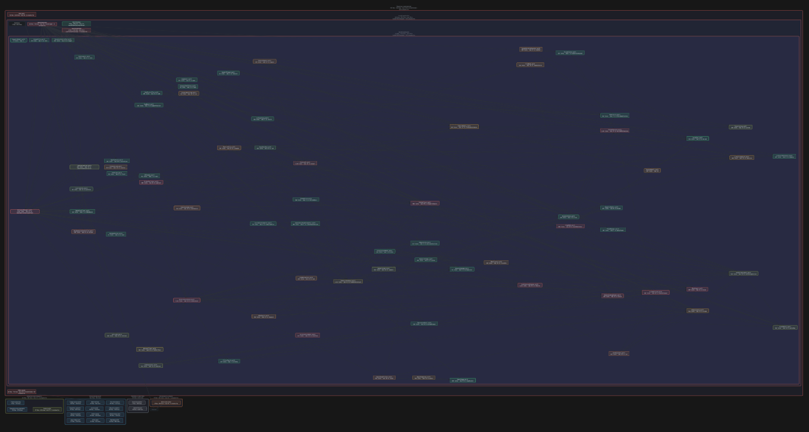

# X-Ray Logical view scatters related components

## Summary

Expanding a component in X-Ray Logical view repeatedly scatters its contents across a large area. The confirmed symptom is spatial layout; incorrect logical assignments remain unverified.

## Steps to reproduce

1. Open the affected code project in MarkView and wait for X-Ray analysis to make Logical view available.
2. Select Logical view and expand the affected component.
3. Observe the positions of its revealed nodes.
4. Collapse and expand that component again; the reported scattering recurs on each expansion. The affected project and component are still needed to reproduce this reliably.

## Expected

Expanding a component should show its contents as a compact, readable group, with related items close enough to recognize and navigate together.

## Actual

After expanding a component in X-Ray Logical view, its nodes sometimes spread across a large area, making the diagram difficult to navigate. For the reported component, the same scattering occurs on every expansion. Incorrect component membership has not been observed or ruled out.

## Environment

MarkView native macOS app (macOS 13+), X-Ray Logical view, bundled Cytoscape/ELK editor. Affected project, component, app version, macOS version, and display size are unknown.

## Suspected code

- `MarkView/Resources/Editor/vendor/js/markview-architecture.js` — The expansion handler updates the expanded set and calls render; render rebuilds nodes and edges and reruns ELK. Per-container link density selects rectangle packing or rightward layered layout, followed by a fit animation around the expanded node.
- `MarkView/Models/ArchitectureStore.swift` — applyLogical assigns files to components, optionally inserts folder parents, and maps module edges into Logical view. This defines the child graph and link density used by the layout.
- `MarkView/Models/XRayCluster.swift` — Cluster construction is a secondary lead only if the affected snapshot shows files assigned to the wrong components; that has not been established.

## Likely causes

- The expansion handler rebuilds the visible Cytoscape graph and reruns ELK layout. The expanded container uses rectangle packing when links among its immediate children are sparse and a rightward layered layout otherwise. This layout choice or its spacing may produce the wide arrangement; the affected snapshot is needed to identify which path applies.
- Logical view groups files under components and, above a file-count threshold, under folders. Those parent relationships and the mapped file edges determine the children and links supplied to layout. Whether any assignment is wrong remains unverified.

## Missing information

- The affected project or X-Ray snapshot and the specific component needed for reliable reproduction are unavailable.
- The particular items expected to be near each other remain unidentified (open BQ-1).
- App and macOS versions and display size are unknown.

## Attachments

## Clarifications

**BQ-2** Когда появляется такой разброс?
→ После раскрытия. Он появляется после раскрытия компонента.

**BQ-3** Если свернуть и снова раскрыть тот же компонент, разброс повторяется?
→ Каждый раз. Повторяется при каждом раскрытии этого компонента.

**BQ-1 / BQ-4** (2026-09-28) Is the screenshot the MarkView project, folder MarkView/Models (73 files), Logical view?
→ Yes, MarkView/Models.

**Fix choice** (2026-09-28) Pack large boxes, or also split a large folder into sub-groups of related files?
→ Pack large boxes: a box with more than 20 children is always packed into a compact rectangle; small ones keep
the flow layout. Grouping by meaning would be a separate feature.

## Original description

Иногда, когда мы диггин в разные компоненты, он в логической разбивке мне раскидывает эти компоненты совершенно, то есть их невозможно потом собрать. Сделай функцию так, чтобы он аккуратно их собирал близко друг к другу, по смыслу одинаковые и так далее.

## Resolution (2.26.2)

- Reproduced headlessly: the stored Logical view (`.dde/state.db`) replayed through the bundled Cytoscape + ELK with
  the shipped layout options. Expanding MarkView/Models (73 files, 295 links between them) laid them out over
  6338×3310 px with 2% of the box covered by file boxes; every dense folder in MarkView, broker-fabric,
  vivaa-platform and grow-garden came out at 2–13%, while packed folders were at 55–67%.
- Root cause: `layout()` in `markview-architecture.js` packs a box's children only when they have fewer links than a
  quarter of their number; otherwise it uses ELK `layered` (direction RIGHT). For dozens of peer files that
  reference one another (Swift types, TS modules) that flow layout makes many layers and stretches nodes along long
  edges, so the expanded folder scatters — the same way on every expansion.
- Alternatives measured on the same data: tuned `layered` (network simplex, wrapping) 3–8% fill; `stress` compact
  but hundreds of overlapping boxes; `force` as scattered as before; rectangle packing 61% fill, no overlaps,
  linked files 3–4× closer (mean distance 24 → 6 node sizes for Models).
- Fix: a box with more than 20 children (`flowLimit`) is always packed; smaller linked boxes keep the flow layout.
  Boxes that were already packed are unchanged.
- Verified: replay of 48 large boxes in 4 projects — lowest fill 2% → 55%, no overlaps, packed boxes identical;
  test copy (own bundle ID) of the fixed build vs 2.26.1 on a copy of the MarkView project: Models expands into a
  readable 11-row grid (~2:1) and again the same after collapse and re-expand; 2.26.1 scatters it over the canvas.
- Not changed: grouping files by meaning inside a large folder (owner: a separate feature); links still draw over a
  box's title when many enter it (both builds).

